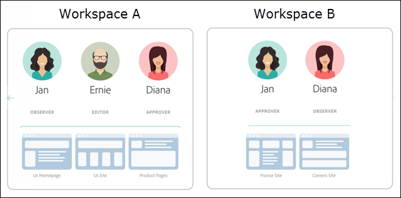

#  PREMIUMEEnterprise{#enterprise-user-permissions}

De gebruikerstoestemmingen van de onderneming zijn een middel om formele toegang van de gebruiker op bedrijfsniveau tot [!DNL Target] te beheren. Voeg gebruikers aan [!DNL Target] toe, wijs toestemmingen toe die op hun rollen worden gebaseerd, en creeer werkruimten voor teams die op verschillende afdelingen, globale plaatsen, kanalen, en andere logische groeperingen worden gebaseerd. U kunt gebruikers de rollen van [!UICONTROL Observer], [!UICONTROL Editor], of [!UICONTROL Approver] toewijzen.

## Bepaal of u toegang hebt tot bedrijfsgebruikersmachtigingen

>[!NOTE]
>
>De eigenschappen en de functionaliteit van Toestemmingen is beschikbaar als deel van de [!DNL Target] Oplossing van de Premie. Ze zijn niet beschikbaar in [!DNL Target] Standard zonder een [!DNL Target] Premium-licentie.
>
>Uw [!DNL Target]-implementatie kan elke versie van at.js of mbox.js gebruiken.

U kunt zien of uw organisatie een Standard- of Premium-licentie heeft door op de koppeling [!UICONTROL Administration] boven aan de interface [!DNL Target] te klikken.

* **[!DNL Target Standard]Klanten**: Als u het  [!UICONTROL Users] tabblad ([!UICONTROL Adminitration > Users]) ziet (en niet het  [!UICONTROL Properties] tabblad), heeft uw organisatie een  [!DNL Target Standard] licentie. [!DNL Target Standard]klanten moeten de instructies in   Gebruikers volgen om gebruikers toe te voegen en machtigingen in de  [!DNL Adobe Admin Console]gebruikerslijst toe te wijzen.

* **[!DNL Target Premium]Klanten**: Als u het  [!UICONTROL Properties] tabblad ([!UICONTROL Administration > Properties]) en het  [!UICONTROL Users] tabblad ziet, heeft uw organisatie een  [!DNL Target Premium] licentie. [!DNL Target Premium] klanten moeten de instructies in dit artikel en in  [Configure ondernemingstoestemmingen](/help/administrating-target/c-user-management/property-channel/properties-overview.md) volgen.

## Voordat u aan de slag gaat met bedrijfsmachtigingen

>[!IMPORTANT]
>
>Zorg ervoor dat u de [Caveats](/help/administrating-target/c-user-management/property-channel/property-channel.md#section_9714311B1CD9497A86F4910F8AE635E2) sectie leest alvorens met ondernemingstoestemmingen te werk te gaan.

## In deze sectie gebruikte termen en definities {#section_F8D229544FEA41C3BC2EFD1F95AA0116}

De volgende termen worden in deze sectie gebruikt en zijn mogelijk nieuw voor gebruikers die de functionaliteit Eigenschappen en Machtigingen in Premium [!DNL Target] willen gebruiken.

### Eigenschap

De eigenschappen zijn gelijkaardig in aard aan die binnen [!DNL Adobe Platform Launch] in zoverre dat zij een uniek codefragment gebruiken om hen te onderscheiden.

Een webeigenschap is een bibliotheek met regels en één insluitcode. Een webeigenschap kan elke groepering van een of meer domeinen en subdomeinen zijn.

Eigenschappen worden toegelaten door een specifiek naam/waardepaar als parameter met om het even welke vraag (de vraag van het Doel, api vraag, enz.) toe te voegen tot [!DNL Target].

Eigenschappen behoren tot specifieke kanalen (Web, Mobiel, E-mail, of API/Overige).

### Werkruimte (productprofiel)

Met een werkruimte kan een organisatie een specifieke set gebruikers toewijzen aan een specifieke set eigenschappen. In veel opzichten is een werkruimte vergelijkbaar met een rapportsuite in [!DNL Adobe Analytics].

Opmerking: De werkruimten worden genoemd als [!UICONTROL Product Profiles] in [!DNL Adobe Admin Console for Enterprise].

Als u deel uitmaakt van een multinationale organisatie, hebt u mogelijk een werkruimte voor uw Europese webpagina&#39;s, eigenschappen of sites en een andere werkruimte voor uw Amerikaanse webpagina&#39;s, eigenschappen of sites. Als u deel uitmaakt van een organisatie met meerdere merken, hebt u mogelijk een aparte werkruimte voor elk van uw merken.

Gebruikers kunnen deel uitmaken van meerdere werkruimten en kunnen zelfs verschillende rollen binnen elke werkruimte hebben.

Gebruikers kunnen verschillende weergaven van [!DNL Adobe Target] hebben door te schakelen tussen werkruimten, vergelijkbaar met de manier waarop [!DNL Analytics]-gebruikers verschillende weergaven van [!DNL Analytics] hebben door te schakelen tussen Rapportsets.

De werkruimten kunnen volledige verschillende soorten publiek, codeaanbiedingen, en activiteiten omvatten.

Alle publiek en activiteiten die vóór de nieuwe modelmigratie van de Toestemmingen van de Onderneming worden gecreeerd zullen samen in &quot;StandaardWerkruimte worden gegroepeerd,&quot;hieronder besproken.

Alle activiteiten die worden gemaakt via [!DNL Adobe Experience Manager] (AEM), [!DNL Adobe Mobile Services] en [!DNL Adobe Target Classic] maken deel uit van de standaardwerkruimte.

### Standaardwerkruimte

Alle bestaande werkruimten (productprofielen) in [!DNL Admin Console] worden samengevoegd in één werkruimte die &#39;Standaardwerkruimte&#39; wordt genoemd tijdens de migratie van uw organisatie naar het nieuwe model voor bedrijfsmachtigingen.

>[!IMPORTANT]
>
>Verwijder de standaardwerkruimte niet.

Alle gebruikersrollen en toegang tot alle functionaliteit [!DNL Target] blijven precies het zelfde als zij voorafgaand aan de migratie aan het nieuwe model van de Toestemmingen van de Onderneming waren.

### Gebruikersgroepen

U kunt gebruikersgroepen maken, zoals Ontwikkelaars, Analysten, Marketers, Executives, enz., en vervolgens rechten toewijzen voor meerdere Adobe-producten en -werkruimten. Het toewijzen van een nieuw teamlid alle aangewezen voorrechten over verschillende producten van de Adobe kan zo gemakkelijk zijn zoals het toevoegen van hen aan een specifieke gebruikersgroep.

### Rollen en machtigingen

De rollen en de toestemmingen bepalen de toegangsniveaus die de gebruikers activiteiten in uw [!DNL Target] implementatie moeten tot stand brengen en beheren. In [!DNL Target], omvatten de rollen het volgende:

| Rol | Beschrijving |
|--- |--- |
| Fiatteur | Kan activiteiten maken, bewerken en activeren of stoppen. |
| Editor | Kan activiteiten maken en bewerken voordat deze live zijn, maar kan het starten van een activiteit niet goedkeuren. |
| Waarnemer | Kan activiteiten weergeven, maar kan deze niet maken of bewerken. |
| Uitgever | Lijkt op de rol van waarnemer (kan activiteiten weergeven, maar kan deze niet maken of bewerken). De rol Publisher heeft echter de extra machtiging om activiteiten te activeren. |

### Kanaal

Het kanaal verwijst naar het inhoudstype van waar uw [!DNL Target] activiteiten worden geleverd: webpagina&#39;s, mobiele apps, e-mailberichten enzovoort.

Wanneer u een nieuwe activiteit creeert, wordt het gecreeerd in de momenteel geselecteerde werkruimte. U ziet de opties voor kanaalselectie in het eerste dialoogvenster waarin u het gewenste kanaal voor de activiteit kunt kiezen: Web, Mobile App, Email of Other/API.

## Overzicht van machtigingen {#section_DC2172520DA84605B218A5E9FB6D187A}

De volgende informatie verklaart de manier de toestemmingen eerder in [!DNL Target] werden afgedwongen en hoe zij gebruikend [!UICONTROL Properties] en [!UICONTROL Permissions] functionaliteit worden afgedwongen.

De nieuwe [!UICONTROL Permissions] functionaliteit laat u verschillende projecten (genoemd &quot;Profielen van het Product&quot;in [!DNL Adobe Admin Console for Enterprise]) tot stand brengen om u toe te staan om verschillende toestemmingen voor één enkele gebruiker toe te wijzen die de toegangsrechten van die gebruiker voor elk project dicteren. Deze verschillende projecten kunnen worden vergeleken met de manier dat de rapportreeksen in [!DNL Adobe Analytics] werken. Elk project kan specifieke gebruikers met specifieke rollen hebben die op een reeks eigenschappen van toepassing zijn. Het resultaat is dat klanten de weergave-, bewerkings- en goedkeuringstoegang kunnen beperken tot hun gebruikers op basis van regio, omgeving (dev/stage/prod), kanaal of andere aangepaste criteria, zoals hieronder wordt weergegeven:

Een specifieke gebruiker kan bijvoorbeeld toegang tot goedkeuring hebben op de Amerikaanse websites, maar alleen toegang tot de Europese mobiele app bekijken. Dezelfde gebruiker heeft mogelijk geen toegang om zelfs maar de activiteiten te bekijken die op het web en mobiele eigenschappen in de APAC-regio worden aangeboden.

Het huidige [!DNL Target] [!UICONTROL Permissions] model heeft drie toestemmingsrollen (Observer, Redacteur, en Approver), zoals aangetoond in de volgende illustratie:

Elke rol heeft verschillende machtigingsniveaus:

| Rol | Beschrijving |
|--- |--- |
| Fiatteur | Kan activiteiten maken, bewerken en activeren of stoppen. |
| Editor | Kan activiteiten maken en bewerken voordat deze live zijn, maar kan het starten van een activiteit niet goedkeuren. |
| Waarnemer | Kan activiteiten weergeven, maar kan deze niet maken of bewerken. |
| Uitgever | Lijkt op de rol van waarnemer (kan activiteiten weergeven, maar kan deze niet maken of bewerken). De rol Publisher heeft echter de extra machtiging om activiteiten te activeren. |

Het is belangrijk om op te merken dat de rol van elke gebruiker op elke pagina, bezit, of plaats in uw rekening van toepassing is die [!DNL Target] markeringen omvat, zoals hieronder getoond:

Het nieuwe [!DNL Target] [!UICONTROL Permissions] model heeft de zelfde drie toestemmingsrollen (Observer, Redacteur, en Approver); nochtans, kunt u de toestemmingenrollen van een gebruiker afzonderlijk voor individuele pagina&#39;s, eigenschappen, of plaatsen toewijzen, zoals hieronder getoond:

In dit voorbeeld heeft Jan de toestemmingen van de fiatteur aan de Homepage van de V.S. en de Plaats en de toestemmingen van de Waarnemer aan de Plaats van Frankrijk.

Bovendien zal Jan pagina&#39;s, eigenschappen, of plaatsen in [!DNL Target] niet kunnen zien die zij geen toestemmingen heeft om te zien, zoals hieronder getoond:

In dit voorbeeld ziet Jan de Productpagina&#39;s, de Russische Site en de Careers Site niet.

## Gebruiksscenario&#39;s {#section_F3CE8576959E4F4CB13BEEED38311DD8}

De volgende gebruiksgevallen kunnen nuttig zijn om te begrijpen hoe eigenschappen, projecten, rollen, en toestemmingen u kunnen helpen uw marketing doelstellingen met [!DNL Target] bereiken:

### Meernationale organisatie

Als u deel uitmaakt van een multinationale organisatie, hebt u mogelijk een werkruimte voor uw Europese webpagina&#39;s, eigenschappen of sites en een andere werkruimte voor uw Amerikaanse webpagina&#39;s, eigenschappen of sites.
Na een reorganisatie, gebruikend de karakters in de illustraties hierboven, zou u opstelling werkruimten en toestemmingen gelijkend op het volgende kunnen:

* **Jan**: Jan is het hoofd van Optimalisatie in het Centrum van Uitmuntendheid voor de Web-pagina&#39;s, de eigenschappen, en de plaatsen van haar organisatie van de Verenigde Staten. Ze heeft waarschijnlijk rechten voor Systeembeheer in de Adobe Experience Cloud.

   In haar rol, heeft zij de toestemmingen van Approver voor de Homepage van de V.S. en de Plaats van de V.S. Met de toestemmingen van de fiatteur, kan zij, activiteiten tot stand brengen uitgeven en activeren of tegenhouden.

   Jan raadpleegt ook het optimalisatieteam in Frankrijk en heeft daarom waarnemersmachtigingen voor de site van Frankrijk die haar alleen-lezen toegang tot activiteiten geven. Jan kan activiteiten weergeven, maar kan deze niet maken of bewerken.

   Omdat Jan geen rol heeft die haar het zien van de Pagina&#39;s van het Product, de Plaats van Rusland, of de Plaats van Careers vereist, kan zij geen activiteiten voor die plaatsen zien.

* **Ernie**: Ernie is een marketingmanager van de organisatie die in de Verenigde Staten verantwoordelijk is voor marketing.

   Omdat Ernie vrij nieuw aan de organisatie en enigszins onervaren met Doel is, heeft hij de toestemmingen van de Redacteur voor de Homepage van de V.S., Plaats, en de Pagina&#39;s van het Product van de V.S. Met de toestemmingen van de Redacteur, kan Ernie activiteiten tot stand brengen en uitgeven alvorens zij levend zijn, maar hij kan niet de lancering van activiteit-iemand met de toestemmingen van de Goedkeuring, zoals Jan goedkeuren, moet de activiteit goedkeuren alvorens het in productie kan worden gezet.

   Omdat Ernie geen rol heeft die hem vereist om de Russische Site, de Plaats van Frankrijk, of de Plaats van Careers te zien, kan hij geen activiteiten voor die plaatsen zien.

* **Diana**: Diana is nu een analist voor de organisatie en heeft waarnemersmachtigingen gekregen voor de US Homepage US Site, Product Pages, Russisch Site en de website van Frankrijk die haar alleen-lezen toegang geven tot activiteiten. Diana kan activiteiten bekijken, maar kan ze niet maken of bewerken.

   Omdat Diana geen rol heeft die haar nodig heeft om de website van Careers te zien, kan ze geen activiteiten voor die sites zien.

### Meermerkorganisatie

Als u deel uitmaakt van een organisatie met meerdere merken, hebt u mogelijk een aparte werkruimte voor de webpagina&#39;s, eigenschappen of sites van elk merk.

Na een reorganisatie, gebruikend de karakters in de illustraties hierboven, zou u opstellingsprojecten en toestemmingen gelijkend op het volgende kunnen:

* **Jan**: Jan is het hoofd van de optimalisatie in het excellentiecentrum voor een organisatie voor gezondheidszorg die actief is in de ruimten voor ziekenhuisproducten en consumentenproducten. Ze heeft waarschijnlijk rechten voor Systeembeheer in de Adobe Experience Cloud.

   In haar rol, heeft zij de toestemmingen van de fiatteur voor de Ziekenhuis. Met de toestemmingen van de fiatteur, kan zij, activiteiten tot stand brengen uitgeven en activeren of tegenhouden.

   Jan raadpleegt ook het optimalisatieteam in de ruimte voor consumentenproducten en beschikt daarom over de machtiging Waarnemer voor die site die haar alleen-lezen toegang geeft tot activiteiten. Jan kan activiteiten weergeven, maar kan deze niet maken of bewerken.

* **Ernie**: Ernie is een marketingmanager voor de organisatie die verantwoordelijk is voor marketing in de ruimte tussen consument en product.

   Omdat Ernie vrij nieuw aan de organisatie en enigszins onervaren met Doel is, heeft hij de toestemmingen van de Redacteur voor de Plaats van de Consumenten. Met de toestemmingen van de Redacteur, kan Ernie activiteiten tot stand brengen en uitgeven alvorens zij levend zijn, maar hij kan niet de lancering van activiteit-iemand met de toestemmingen van de Goedkeuring voor de Plaats van de Consumenten goedkeuren, maar niet Jan in dit scenario, moet de activiteit goedkeuren alvorens het in productie kan worden gezet.

   Omdat Ernie geen rol heeft die hem ertoe noopt de Ziekenhuis te zien, kan hij geen activiteiten voor die plaats zien.

* **Diana**: Diana is nu een analist voor de organisatie en heeft waarnemersmachtigingen gekregen voor de ziekenhuissite en de consumentensite die haar alleen-lezen toegang geven tot activiteiten. Diana kan activiteiten bekijken, maar kan ze niet maken of bewerken.

## Eigenschap voor doel-UI en aanraakpunten voor machtigingen {#section_3414371393BB42999A268628B5456EC9}

De nieuwe functionaliteit van Toestemmingen kan op diverse plaatsen in [!DNL Target] UI worden gezien.

* **Vervolgkeuzelijst Werkruimte (Productprofiel):** De vervolgkeuzelijst Werkruimte wordt boven aan de  [!UICONTROL Activities],  [!UICONTROL Audiences]en  [!UICONTROL Offers] pagina&#39;s weergegeven. Selecteer de gewenste werkruimte om de lijst te filteren zodat alleen de items in de geselecteerde werkruimte worden weergegeven.

   

* **Maken van activiteit:** wanneer u een nieuwe activiteit creeert, wordt het gecreeerd in de momenteel geselecteerde werkruimte. U ziet de opties voor kanaalselectie in het eerste dialoogvenster waarin u het gewenste kanaal voor de activiteit kunt kiezen: Web, Mobile App, Email of Other/API.

   

* **Publiek maken:** wanneer u een nieuw publiek maakt, wordt dit gemaakt in de momenteel geselecteerde werkruimte.
* **Aanbieding maken:** wanneer u een nieuwe aanbieding maakt, wordt deze gemaakt in de momenteel geselecteerde werkruimte.
* **Pagina Eigenschappen (Beheer > Eigenschappen):** u kunt het  [!UICONTROL Search] vak gebruiken om in de  [!UICONTROL Property] lijst te zoeken.

   

## Voorwerpen {#section_9714311B1CD9497A86F4910F8AE635E2}

Overweeg het volgende wanneer het gebruiken van of het vormen eigenschappen en toestemmingen in [!DNL Target] Premium:

* **Belangrijk**: U mag geen werkruimten met activiteiten verwijderen. Als dit gebeurt, werkt u samen met de klantenservice om die activiteiten te herstellen.
* Wanneer het gebruiken van Al Mijn mening van Werkruimten:

   * U kunt activiteiten, publiek, en aanbiedingen voor alle werkruimten zien die u de juiste rollen en toestemmingen hebt om toegang te hebben.
   * Wanneer u Al Mijn mening van Werkruimten selecteert, wordt een nieuwe kolom toegevoegd aan de Activiteiten, Soorten publiek, en pagina van Aanbiedingen die van de werkruimte van het punt en uw gebruikerstoestemming verbonden aan dat punt (Waarnemer, Redacteur, of Approver) een lijst maken,
   * Wanneer u een activiteit, publiek of aanbieding maakt in de weergave Al mijn werkruimten, moet u de werkruimte selecteren waar het item moet worden gemaakt. Alleen die werkruimten kunnen worden geselecteerd waarvoor u de machtiging Editor of fiatteur hebt.
   * Wanneer u een activiteit, een publiek of een aanbieding kopieert in de weergave Al mijn werkruimten, moet u de werkruimte selecteren waar het item moet worden gekopieerd. Alleen die werkruimten kunnen worden geselecteerd waarvoor u de machtiging Editor of fiatteur hebt.

* Om het even welk plaatsen op de volgende pagina&#39;s van het Beleid kan door om het even welke Approver in om het even welke werkruimte worden gecontroleerd:

   * Visual Experience Composer
   * Rapportage
   * Scene7-configuratie
   * Implementatie
   * Eigenschappen
   * Gastheren
   * Omgevingen
   * Reactiepunten
   * Gebruikers

* Gebruikers kunnen bronnen niet van de ene werkruimte (productprofiel) naar de andere verplaatsen. Kopiëren wordt echter ondersteund.
* Wanneer het bekijken van publiek van de [!DNL Audiences] pagina, laadt de pagina langzamer dan verwacht. Als u op een of andere manier met de zoekbalk werkt, worden de doelgroepen sneller weergegeven. Dit is een bekend probleem en wordt in een volgende update opgelost. Dit probleem heeft geen invloed op het selecteren van doelgroepen tijdens de workflow voor het maken van activiteiten.
* De volgende middelen maken deel uit van het nieuwe model van de Toestemmingen van de Onderneming:

   * Activiteiten, publiek en codeaanbiedingen die binnen Standaard/Premium van het Doel worden gecreeerd nadat de klant voor toestemmingen wordt toegelaten. (Opmerking: klanten moeten recht hebben op Target Premium.)
   * Eigenschappen kunnen worden toegevoegd aan bestaande activiteiten in de standaardwerkruimte. dit kan echter veranderen .
   * Alleen nieuwe bronnen (zoals activiteiten, codeaanbiedingen en publiek) die zijn gemaakt in Target Premium (nadat Enterprise-machtigingen zijn ingeschakeld) zijn beschikbaar om te worden beperkt door machtigingen.
   * Externe bronnen zijn alleen beschikbaar voor gebruikers in de standaardwerkruimte. De rol van een gebruiker in de Standaardwerkruimte wordt globaal toegepast (op alle doelverzoeken en alle doelbronnen).

* De volgende bronnen maken *geen* deel uit van het nieuwe model voor Enterprise-machtigingen:

   * Afbeeldingsaanbiedingen
   * Alle Recommendations-bronnen, inclusief Criteria Library, Design Library, Catalog en Recommendations Setup.
   * Bestaande bronnen (zoals activiteiten, codeaanbiedingen en publiek) die zijn gemaakt in Target Premium voordat bedrijfsmachtigingen worden ingeschakeld, kunnen worden gekopieerd, maar kunnen niet naar andere werkruimten worden verplaatst.
   * De activiteiten, het publiek, de codeaanbiedingen, beeldaanbiedingen, of om het even welke andere die middelen worden gecreeerd gebruikend de volgende oplossingen of de methodes kunnen niet door het model van de Toestemmingen van de Onderneming worden gecontroleerd, maar zullen deel van de StandaardWerkruimte uitmaken: Doel: Klassiek, Adobe Experience Manager (AEM), Mobiele Adobe-services en bronnen die via API zijn gemaakt. De middelen die via API worden gecreeerd omvatten activiteiten, publiek, codeaanbiedingen, en beeldaanbiedingen).
   * Aanbiedingen voor images (middelen die zijn opgeslagen onder `https://[tenantName].marketing.adobe.com/content/mac/[tenantName]/target/offers.html#image-library` kunnen op dit moment niet worden beheerd door het model voor machtigingen voor ondernemingen.
   * clickTracking en redirects zullen slechts werken wanneer de bestemmingsverbinding of bestemmingspagina deel van een bezit uitmaken dat in de activiteit inbegrepen is. Daarnaast werkt clickTracking mogelijk niet wanneer de functie `targetPageParams()` wordt gebruikt. De functie `targetPageParamsAll()` wordt aanbevolen.

   [!DNL Target] vereist momenteel dat er een  `at_property` token aanwezig is op elke pagina waar tekstspatiëring plaatsvindt. Als het token (1) niet aanwezig is, (2) niet wordt gedetecteerd op het moment dat de activiteit wordt ingesteld (binnen de VEC) of (3) niet wordt doorgegeven aan de clickTracking Target-aanroep via de functie `targetPageParamsAll()`, wordt de metrische waarde niet verhoogd en wordt deze weergegeven als &quot;0.&quot;

   Hetzelfde geldt voor activiteiten die omleidingen gebruiken. De bestemmingspagina moet een `at_property` teken hebben en op het tijdstip van opstelling binnen VEC worden erkend.

   In een toekomstige release werkt Target op pagina&#39;s waar geen `at_property`-token aanwezig is of op pagina&#39;s waar een ander `at_property`-token aanwezig is.

* De functionaliteit voor gebruikersmachtigingen voor ondernemingen wordt niet ondersteund in [Adobe I/O API-aanroepen](https://developers.adobetarget.com).

## Veelgestelde vragen {#faqs}

Veelgestelde vragen over bedrijfsmachtigingen zijn onder andere:

### Kan ik een activiteit van één werkruimte naar een andere verplaatsen?

Helaas kunt u activiteiten niet van de ene werkruimte naar de andere verplaatsen. U kunt een activiteit echter naar elke werkruimte kopiëren in de wetenschap dat de rapportgegevens niet worden overgedragen. Voor meer informatie, zie &quot;het Kopiëren/het uitgeven van een Activiteit wanneer het Gebruiken van Werkruimten&quot;in [het kopiëren van/het uitgeven van een Activiteit wanneer het Gebruiken van Werkruimten](/help/c-activities/edit-activity.md#section_45A92E1DD3934523B07E71EF90C4F8B6).

Activiteiten die vóór de migratie zijn gemaakt, worden in de standaardwerkruimte op dezelfde manier uitgevoerd, tenzij ze worden bewerkt en toegewezen eigenschappen. Activiteiten in een specifieke werkruimte zullen de eigenschappen respecteren die aan die werkruimte zijn toegewezen, zodat het gedrag mogelijk niet hetzelfde blijft als vóór de migratie.

### Waarom krijg ik een foutenmelding erop wijst die dat geen bezit aan deze activiteit wordt geassocieerd, alhoewel er een toegewezen bezit is?

Als u [!DNL Target] met [!DNL Adobe Launch] hebt uitgevoerd en een foutenmelding krijgt erop wijzend dat er geen bezit verbonden aan de activiteit is, ga de `at_property` parameter met de `targetPageParams` functie over.

### Zijn klikspooromzettingen geregistreerd als een omleidingspagina en activiteit URL tot verschillende eigenschappen behoren?

Klik op Tekstspatiëring wordt niet opgenomen op pagina&#39;s waarvan de pagina en activiteit-URL tot verschillende eigenschappen behoren.

Overweeg het volgende scenario (van toepassing op zowel at.js als mbox.js):

* Pagina1 behoort tot Eigenschap1.
* Pagina2 behoort tot Eigenschap2.
* In de activiteit, richt Pagina1 zich aan Pagina2, die kliksporen bevat.

Wanneer een bezoeker Pagina1 in browser opent, wordt hij of zij opnieuw gericht aan Pagina2. Omdat Page2 niet kwalificeert om de activiteit te leveren, bevat zijn vraag van het Doel geen kliksporen in zijn reactie.

Als de omleidingspagina en de activiteit-URL tot dezelfde eigenschap behoren, werkt het klikken op de tracks zoals verwacht. Zie [Click tracking](/help/c-activities/r-success-metrics/click-tracking.md) voor meer informatie.

## Trainingsvideo&#39;s

De volgende video&#39;s bevatten meer informatie over de concepten die in dit artikel worden besproken.

### Trainingsvideo: Trainingsvideo voor Enterprise-machtigingen 

Leerdoelstellingen:

* De drie rolniveaus die de gebruikers van Adobe Target kunnen houden
* De concepten Eigenschappen en Werkruimten, en hoe deze grenzen en groeperingen werken om voor controle over de toegangsniveaus van gebruikers toe te staan
* Verschillende eigenschappenvoorbeelden voor uw organisatie

>[!VIDEO](https://video.tv.adobe.com/v/19042/)

### Kantooruren: Doeltopwerkruimten

Deze video is een opname van &quot;Office Hours&quot;, een initiatief onder leiding van het Adobe Customer Care-team.

* Een werkruimte maken (productprofiel)
* Eigenschappen maken
* Gebruikers toevoegen
* Implementatie bijwerken

>[!NOTE]
>
>De [!DNL Target] [!UICONTROL Administration] menu-interface (voorheen [!UICONTROL Setup]) is opnieuw ontworpen om betere prestaties te bieden, de vereiste onderhoudstijd bij het vrijgeven van nieuwe functies te verminderen en de gebruikerservaring in het hele product te verbeteren. De informatie in de volgende video is over het algemeen correct. de opties kunnen zich echter op iets andere locaties bevinden . Bijgewerkte video&#39;s worden binnenkort gepost.

>[!VIDEO](https://video.tv.adobe.com/v/23643/)
