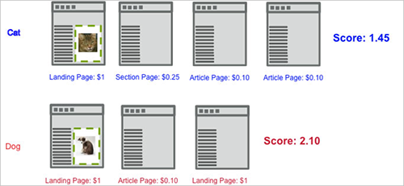

# Muziek vastleggen{#capture-score}

De betrokkenheidsmetrische gegevens voor de opnamescore berekenen een geaggregeerde score op basis van de waarde die is toegewezen aan pagina&#39;s die op de site zijn bezocht, vanaf het punt waarop de bezoeker eerst het eerste weergaveverzoek van de campagne ziet. [!DNL Target]

In het volgende voorbeeld wordt getoond hoe de betrokkenheid van de score wordt berekend in een campagne die twee ervaringen test, één met een kattenbeeld en één met een hondenbeeld.

In dit voorbeeld ervaart de eerste bezoeker de kattenervaring. Stel dat een algemeen [!DNL Target] verzoek in een paginascore doorgaat op basis van de waarde van de pagina. Als de markering de betrokkenheid van het aantal pagina&#39;s heeft vastgelegd op een succesmetrische methode die is gekoppeld aan `**any Target request**`, accumuleert de bezoekscore voor elke aanvraag die wordt gezien na de weergaveaanvraag rond de katafbeelding.

De eerste pagina voegt 1 aan de score toe, de tweede pagina 0.25, de derde 0.10 en de vierde 0.10 voor een totaal van 1.45. Dit kan worden geïnterpreteerd als een valuta of als punten. Tijdens een afzonderlijk bezoek ervaart een bezoeker de honden. Hoewel de bezoeker minder pagina&#39;s bekijkt, is de score 2,10 groter dan het andere bezoek, omdat de bezoeker waardevolle pagina&#39;s heeft bekeken.

U kunt aanschafkosten en partnerverbindingsopbrengsten in aanmerking nemen door adboxes en redirecteuren door te geven, zoals in de volgende paginastroom wordt getoond. Bericht dat, in dit voorbeeld, beide [!DNL Target] verzoeken op de artikelpagina een score overgaan, misschien die een bekende CPM vertegenwoordigen.

**Een paginascore toewijzen**

U kunt een waarde toewijzen aan elke pagina op uw site op basis van wat de pagina voor u waard is. Een kooksite kan bijvoorbeeld advertenties voor meer geld op artikelpagina&#39;s met functies verkopen dan in de sectie over ervaring. De functieartikelen zijn dus waardevoller dan de sectie Experience. Met de paginascore kunt u een algemene &#39;waarde&#39; van een bezoek ontwikkelen, zodat de persoon die meer functieartikelen leest, meer &#39;punten&#39; krijgt dan iemand die gewoon door de ervaringen bladert.

Er zijn twee methoden om een score toe te wijzen aan een pagina:

* Maak in de [!DNL Target] aanvraag een parameter met de naam `mboxPageValue`.

   Voorbeeld: `('global_mbox', 'mboxPageValue=10');`

   Elke keer dat de pagina met die [!DNL Target] aanvraag wordt weergegeven, wordt de opgegeven waarde aan de score toegevoegd. Als meerdere aanvragen op de pagina score bevatten, is de score voor de pagina het totaal van alle aanvraagwaarden. `mboxPageValue` is een gereserveerde parameter die wordt gebruikt voor het doorgeven van waarden in een doelaanvraag om een betrokkenheidsscore vast te leggen. Positieve en negatieve waarden kunnen worden doorgegeven. De som wordt berekend aan het einde van het bezoek van elke bezoeker om de totale score voor het bezoek te berekenen.

* Geef de `?mboxPageValue=n` parameter in de URL voor de pagina door.

   Voorbeeld: `https://www.mydomain.com?mboxPageValue=5`

   Met deze methode wordt de opgegeven waarde toegevoegd aan de score voor elke [!DNL Target] aanvraag op de pagina. Als u bijvoorbeeld de parameter doorgeeft `?mboxPageValue=10`en er drie [!DNL Target] aanvragen op de pagina staan, is de score voor de pagina 30.

>[!NOTE]
>
>Doelverzoeken die zich boven het eerste weergaveverzoek van de activiteit bevinden, worden niet in de score opgenomen. [!DNL Target]

U kunt het beste waarden toewijzen in de [!DNL Target] aanvraag. Hierdoor kunt u nauwkeurig aangeven welke waarden u meet, afhankelijk van de inhoud van elk verzoek.

>[!NOTE]
>
>U kunt de waardetoewijzingen van de paginascore van uw site in het [!DNL at.js] of [!DNL mbox.js] bestand eenvoudig onderhouden met behulp van voorwaardelijke JavaScript-logica. Zo hoeft u niet meer code aan uw pagina&#39;s toe te voegen. Neem contact op met uw accountconsultant voor hulp.

U kunt de twee methoden combineren, maar dit kan resulteren in een hogere score dan u had verwacht. Als u bijvoorbeeld een waarde van 10 toewijst aan elk van drie [!DNL Target] aanvragen en geen score toewijst aan een vierde aanvraag, geeft u de URL-parameter door `?mboxPageValue=5`, dan is de paginascore 50, 30 voor de drie aanvragen met toegewezen waarden en vervolgens 5 voor elk van de vier aanvragen op de pagina.

De teller begint met het eerste vertoningsverzoek, niet het ingangsverzoek. Als u bijvoorbeeld de activiteit op de startpagina invoert die geen weergaveverzoek heeft, en vervolgens een koppeling naar de cataloguspagina met een weergaveverzoek maakt, begint de teller wanneer u naar de cataloguspagina gaat.

U kunt ook negatieve waarden doorgeven op bepaalde pagina&#39;s die u geld kosten of die een bezoeker niet kan zien. De negatieve waarden beïnvloeden ook de algemene score. Deze techniek kan worden gebruikt op een pagina die bezoekers bereiken van een advertentie, zodat u weet hoeveel CPC was. Of u kunt het bijvoorbeeld gebruiken voor een ondersteuningspagina of contactpagina, waar bezoekers op deze pagina om hulp kunnen vragen.
