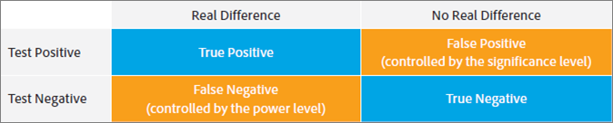
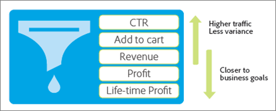

# Tien gemeenschappelijke A/B-testvalkuilen en hoe deze te vermijden{#nine-common-a-b-testing-pitfalls-and-how-to-avoid-them}

A/B-tests vormen de ruggengraat van de meeste optimalisatieprogramma&#39;s voor digitale marketing en helpen marketers hun bezoekers en klanten geoptimaliseerde en gerichte ervaringen te bieden. In dit deel worden tien van de belangrijkste valkuilen beschreven waar bedrijven bij het uitvoeren van A/B-tests op stuiten. Het omvat ook manieren om hen te vermijden, zodat kan uw bedrijf grotere ROI door zijn testende inspanningen bereiken en grotere vertrouwen in zijn gemelde resultaten van de A/B test hebben.

## Pitfall 1: De effecten van het significantieniveau negeren {#section_55F5577A13C6470BA1417C2B735C6B1D}

Hoe waarschijnlijk is het dat uw test een significant verschil in omrekeningskoers tussen twee aanbiedingen meldt, terwijl er in feite geen is? Dat is wat het *significantieniveau* van een test helpt bepalen. Dergelijke misleidende bevindingen worden vaak een fout genoemd, en in de wereld van statistieken, worden genoemd een fout van Type I (als u verkeerd de ongeldige hypothese verwerpt die eigenlijk waar is).

Wanneer u het significantieniveau van een A/B test specificeert, maakt u een compromis tussen uw tolerantie voor het goedkeuren van dat één ervaring beter is dan andere wanneer het echt niet (fout Type I of &quot;vals positief&quot;) versus het zien van geen statistisch verschil tussen de ervaringen wanneer er werkelijk een ware verschil (fout Type II of &quot;vals negatief&quot;is) is. Het *betrouwbaarheidsniveau* wordt bepaald voordat een test wordt uitgevoerd.

Het *betrouwbaarheidsinterval*, dat na een volledige test wordt bepaald, wordt beïnvloed door drie sleutelfactoren: steekproefgrootte van de test, significantieniveau en standaardafwijking van de populatie. Omdat de markeerstift het significantieniveau selecteerde voordat de test werd ontworpen en de standaardafwijking van de populatie niet kan worden beïnvloed, is de enige &quot;controleerbare&quot; factor de steekproefgrootte. De monstergrootte die nodig is voor een betrouwbaarheidsinterval waarmee u vertrouwd bent en de tijd die nodig is om die monstergrootte te bereiken, is een belangrijke beslissing die een markeerteken tijdens het testontwerp moet bepalen.

Een andere rechtstreeks met elkaar verband houdende term, het *betrouwbaarheidsniveau*, neemt meer een glazen halfvolle benadering. In plaats van de waarschijnlijkheid te verklaren dat u vals positief zult worden, zoals het significantieniveau, vertegenwoordigt het betrouwbaarheidsniveau de waarschijnlijkheid dat uw test die fout niet zal maken.

Vertrouwensniveau en significantieniveau houden rechtstreeks verband met:

100% - betrouwbaarheidsniveau = significantieniveau

Bij A/B-tests gebruiken marketers vaak 95% betrouwbaarheidsniveaus. Op basis van bovenstaande vergelijking komt dat duidelijk overeen met een significant niveau van 5%. Testen met een betrouwbaarheid van 95% betekent dat je 5% kans hebt om een statistisch significante lift te detecteren, zelfs als er in werkelijkheid geen verschil is tussen de aanbiedingen.

Hoe meer tests u uitvoert, des te waarschijnlijker is dat ten minste een van deze tests resulteert in een fout-positief. Als u bijvoorbeeld 10 tests uitvoert met een betrouwbaarheidsniveau van 95%, is er ongeveer 40% kans dat u een of meer valse positieven zult detecteren (aangezien er geen echte lift is: Pr(ten minste één fout positief) = 1 - Pr(geen fout positief) = 1 - 0,95^10 = 40%).

In een marketingorganisatie is 95% doorgaans een redelijke verhouding tussen het risico van vals-positieve en fout-negatieve effecten.

Twee situaties verdienen echter de nodige aandacht voor het significantieniveau en de gevolgen ervan voor de testresultaten: segmentatie na de test en het testen van meerdere aanbiedingen.

* **Segmentatie na test:** Marktdeelnemers segmenteren en dokken vaak de resultaten van een test op basis van bezoekerssegmenten nadat de A/B-test is beëindigd. Veelvoorkomende segmenten zijn browsertype, apparaattype, geografische gebieden, tijd van de dag en nieuwe bezoekers of bezoekers die het systeem retourneren. Deze praktijk, die als post-test segmentatie wordt bekend, verstrekt uitstekend inzicht in bezoekerssegmenten. Marktdeelnemers kunnen deze inzichten dan ook gebruiken om doelgerichtere, relevantere en gedifferentieerde inhoud te creëren.

   Als er geen echt verschil is in de omrekeningskoers, telkens als u een segment test, is de waarschijnlijkheid van een vals positief gelijk aan het significantieniveau. En, zoals vermeld, hoe meer tests je uitvoert, hoe groter de kans dat je ten minste één fout-positief ervaart bij deze tests. In wezen vertegenwoordigt elk segment na de test een afzonderlijke test. Met een significant niveau van 5%, gemiddeld zult u ten prooi vallen aan één vals positief telkens als u 20 post-test segmenten kijkt. De bovenstaande grafiek laat zien hoe deze kans groter wordt.

   Zoals hierboven vermeld, hoe meer tests u uitvoert, des te groter de kans dat u bij deze tests ten minste één fout-positief zult ervaren. In wezen vertegenwoordigt elk segment na de test een afzonderlijke test, wat de kans op een vals-positief verhoogt. Deze toename kan nog groter zijn als segmenten gecorreleerd zijn.

   Moet je gewoon geen segmentatie na de test doen? Nee, na de test zijn de segmenten waardevol. In plaats daarvan, om deze cumulatieve vals positieve kwestie met post-test segmentatie te vermijden, nadat u een post-test segment hebt geïdentificeerd, overweeg het testen in een nieuwe test. U kunt ook de Bonferroni-correctie toepassen, die hieronder wordt besproken.

* **Meerdere aanbiedingen testen:** Marktdeelnemers testen vaak meer dan twee aanbiedingen (of ervaringen) tegen elkaar. Daarom zie je soms A/B testoplossingen genaamd A/B/n testen, waarbij n het aantal aanbiedingen is dat je tegelijkertijd test.

   Het is belangrijk om op te merken dat *elke* geteste aanbieding een vals positief tarief gelijk aan het significante niveau heeft, zoals hierboven beschreven. Opnieuw, stelt u effectief veelvoudige tests in werking wanneer verscheidene aanbiedingen tegen elkaar binnen één enkele testmilieu worden goedgekeurd. Als u bijvoorbeeld vijf aanbiedingen in een A/B/C/D/E-test vergelijkt, maakt u in feite vier vergelijkingen: controle op B, controle op C, controle op D, controle op E. Met een betrouwbaarheidsniveau van 95%, in plaats van de 5% waarschijnlijkheid van een vals positief, hebt u eigenlijk 18,5%. 2

   Als u uw totale betrouwbaarheid op 95% wilt houden en dit probleem wilt vermijden, past u de zogenaamde Bonferroni-correctie toe. Met deze correctie verdeelt u gewoon het significantieniveau door het aantal vergelijkingen om het significantieniveau te bereiken dat u nodig hebt om een betrouwbaarheidsniveau van 95% te bereiken.

   Als u de Bonferroni-correctie toepast op het bovenstaande voorbeeld, gebruikt u een 5%/4 = 1,25% significantieniveau, wat hetzelfde is als een 98,75% betrouwbaarheidsniveau voor een individuele test (100% - 1,25% = 98,75%). Deze aanpassing handhaaft het effectieve betrouwbaarheidsniveau bij 95% wanneer u vier tests hebt, zoals in het beschreven voorbeeld.

## Pitfall 2: Opgave van winnaars van meervoudige biedtests zonder statistisch significant verschil {#section_FA83977C71DB4F69B3D438AF850EF3B6}

Bij het testen van meerdere aanbiedingen verklaren marketers vaak het aanbod met de hoogste lift als testwinnaar, hoewel er geen statistisch significant verschil is tussen de winnaar en de runner-up. Deze situatie doet zich voor wanneer het verschil tussen de alternatieven kleiner is dan het verschil tussen de alternatieven en de controle. In de onderstaande afbeelding ziet u dit concept, waarbij de zwarte foutenbalken een betrouwbaarheidsinterval van 95% vertegenwoordigen. De ware lift voor elke aanbieding met betrekking tot de controleaanbieding is 95% waarschijnlijk inbegrepen binnen het betrouwbaarheidsinterval-de waaier die door de foutenbars wordt getoond.

Aanbiedingen A en B hebben de hoogste waargenomen lift tijdens de test, en het zou onwaarschijnlijk zijn dat aanbieding C die aanbiedingen in een toekomstige test zou overtreffen, omdat het betrouwbaarheidsinterval van C niet eens met de betrouwbaarheidsintervallen van A of B overlapt. Hoewel aanbod A tijdens de test de hoogst waargenomen lift heeft, is het echter heel goed mogelijk dat aanbod B in een toekomstige test beter zou kunnen presteren omdat de betrouwbaarheidsintervallen elkaar overlappen.

De afstoting hier is dat zowel A als B als winnaars van de test moeten worden beschouwd.

Doorgaans is het niet haalbaar om de test lang genoeg uit te voeren om de werkelijke relatieve prestaties van de alternatieven te identificeren. Vaak is het verschil in prestaties tussen de alternatieven te klein om de conversiesnelheid aanzienlijk te beïnvloeden. In dergelijke gevallen, kunt u het resultaat als tijd interpreteren en andere overwegingen, zoals strategie of groepering met andere elementen van de pagina gebruiken, om te bepalen welke aanbieding om uit te voeren. Met meerdere tests moet u openstaan voor meerdere winnaars, die in sommige gevallen de mogelijkheden voor de ontwikkeling van uw website aanzienlijk openen.

Houd er rekening mee dat als je het voorstel wilt identificeren met de hoogste omrekeningskoers, je alle aanbiedingen vergelijkt met elk ander aanbod. In het bovenstaande voorbeeld hebt u n = 5 aanbiedingen. U moet n(n-1)/2 vergelijkingen maken of 5*(5-1)/2 = 10 vergelijkingen. In dit geval vereist de Bonferroni-correctie dat het significantieniveau van de test 5%/10 = 0,5% is, wat overeenkomt met een betrouwbaarheidsniveau van 99,5%. Een dergelijk hoog betrouwbaarheidsniveau kan echter vereisen dat u de test gedurende een onredelijk lange periode uitvoert.

## Pitfall 3: De effecten van statistische kracht negeren {#section_0D517079B7D547CCAA75F80981CBE12A}

Statistisch vermogen is de waarschijnlijkheid dat een test een reëel verschil in omrekeningskoers tussen de aanbiedingen detecteert. Vanwege de willekeurige aard van conversiegebeurtenissen, of zoals statistici het graag &quot;stochastic&quot; noemen, geeft een test wellicht geen statistisch significant verschil weer, zelfs niet wanneer er op lange termijn een reëel verschil in conversiekoers tussen twee aanbiedingen bestaat. Noem het geluk of toeval. Het niet detecteren van een echt verschil in conversiekoers wordt een fout in het fout false of een fout in het type II genoemd.

Er zijn twee sleutelfactoren die de macht van een test bepalen. Ten eerste is de steekproefgrootte, dat wil zeggen het aantal bezoekers dat in de test is opgenomen. Ten tweede is de grootte van het verschil in de conversiesnelheid dat de test moet detecteren. Misschien is dit enigszins intuïtief, maar als je alleen geïnteresseerd bent in het detecteren van grote verschillen in de conversiesnelheid, is er een veel hogere kans dat de test zulke grote verschillen detecteert, zoals het ontdekken van een olifant in je woonkamer tegenover een vlieg terwijl je door een papieren handdoekpijp kijkt. Langs die lijnen, kleiner het verschil u wilt ontdekken, groter de steekproefgrootte, en daarom, tijd om die grotere steekproefgrootte te krijgen, vereist u.

De huidige marketeers hebben een opmerkelijk aantal tests onder de macht. Met andere woorden, ze gebruiken een te kleine voorbeeldgrootte. Dat betekent dat ze een kleine kans hebben om echte positieve effecten op te sporen, zelfs als er daadwerkelijk een aanzienlijk verschil in omrekeningskoers bestaat. In feite, als je voortdurend ondergedreven tests uitvoert, kan het aantal valse positieven vergelijkbaar zijn met, of zelfs domineren, het aantal echte positieven. Dit leidt vaak tot het doorvoeren van neutrale veranderingen in een locatie (tijdverspilling) of tot veranderingen die de omrekeningskoersen feitelijk verlagen.

Houd er rekening mee dat een standaardstandaard voor een goed gemotoriseerde test een betrouwbaarheidsniveau van 95% en een statistisch vermogen van 80% bevat om te voorkomen dat de test ondergeschikt wordt gemaakt. Een dergelijke test biedt een waarschijnlijkheid van 95% dat u vals positief en een waarschijnlijkheid zult vermijden 80% dat u vals negatief zult vermijden.

## Stap 4: Eenzijdige tests gebruiken {#section_8BB136D1DD6341FA9772F4C31E9AA37C}

Eenzijdige tests vereisen een kleiner waargenomen verschil in omrekeningskoersen tussen de aanbiedingen om een winnaar op een bepaald significant niveau te bellen. Dit lijkt aantrekkelijk, omdat winnaars eerder en vaker kunnen worden opgeroepen dan wanneer twee-tailed tests worden uitgevoerd. Maar in overeenstemming met het gezegde &quot;Er is geen vrije lunch,&quot; komen eenzijdige tests ten koste van elkaar.

Bij een eenzijdige test test test je of aanbod B beter is dan aanbod A. De richting van de test moet worden bepaald voordat de test begint, of a priori in de vorm van statistieken. Met andere woorden, u moet besluiten of B beter is dan A of A dan B *voordat* u de test start. Als u echter kijkt naar de resultaten van de A/B-test en ziet dat B het beter doet dan A en *vervolgens* besluit om een eenzijdige test te doen om te zien of dat verschil statistisch significant is, dan schaadt u de veronderstellingen achter de statistische test. Als u de aannames van de test overtreedt, zijn de betrouwbaarheidsintervallen onbetrouwbaar en heeft de test een hogere fout-positieve snelheid dan u zou verwachten.

U zou een eenzijdige test kunnen zien als een voorstel voor een proces bij een rechter die zijn of haar mening al heeft bepaald. In een eenzijdige test heb je al besloten wat het winnende aanbod zal zijn en zal zijn om het te bewijzen, in plaats van elke ervaring een gelijke kans te geven om zichzelf als winnaar te bewijzen. Eenzijdige tests mogen alleen worden gebruikt in de zeldzame situaties waarin u alleen maar geïnteresseerd bent in de vraag of een aanbod beter is dan het andere en niet andersom. Om het probleem van de eenzijdige test te vermijden, gebruikt u een A/B-testoplossing die altijd gebruikmaakt van tweetalige tests, zoals [!DNL Adobe Target]proeven.

## Pitfall 5: Monitoringtests {#section_EA42F8D5967B439284D863C46706A1BA}

Marktdeelnemers controleren regelmatig A/B-tests totdat de test een significant resultaat oplevert. Want waarom test je na het bereiken van statistische significantie?

Helaas is het niet zo eenvoudig. Niet om een moersleutel in de werken te gooien, maar het blijkt dat controle van de resultaten een negatief effect heeft op de effectieve statistische betekenis van de test. Het verhoogt in feite de kans op valse positieven aanzienlijk en maakt uw betrouwbaarheidsintervallen onbetrouwbaar.

Dit kan verwarrend lijken. Het klinkt alsof we zeggen dat je, als je naar je resultaten halverwege de test kijkt, ze hun statistische betekenis kan verliezen. Dat is niet precies wat er aan de hand is. In het volgende voorbeeld wordt uitgelegd waarom.

Stel dat u 10.000 conversiegebeurtenissen van twee aanbiedingen simuleert, met beide aanbiedingen een conversiekoers van 10%. Omdat de omrekeningskoersen het zelfde zijn, zou u geen verschil in omzettingslift moeten ontdekken wanneer u twee aanbiedingen tegen elkaar test. Met een betrouwbaarheidsinterval van 95% resulteert de test in de verwachte 5% vals positieve snelheid wanneer deze wordt geëvalueerd na het verzamelen van alle 10.000 waarnemingen. Dus als we 100 van deze tests uitvoeren, krijgen we gemiddeld vijf valse positieven (in feite zijn alle positieven in dit voorbeeld onwaar omdat er geen verschil is in de conversiesnelheid tussen de twee aanbiedingen). Nochtans, als wij de test 10 keer tijdens test-elke 1.000 observaties evalueren-blijkt het dat het vals positieve tarief tot 16% springt. De controle op de test heeft meer dan het risico van valse positieven verdrievoudigd! Hoe kan dat?

Om te begrijpen waarom dit voorkomt, moet u de verschillende acties overwegen die worden ondernomen wanneer een significant resultaat wordt ontdekt en wanneer het niet wordt ontdekt. Wanneer een statistisch significant resultaat wordt gedetecteerd, wordt de test gestopt en wordt een winnaar gedeclareerd. Als het resultaat echter niet statistisch significant is, laten we de test voortzetten. Deze situatie is sterk gunstig voor het positieve resultaat en verstoort dus het effectieve significantieniveau van de test.

Om dit probleem te vermijden, zou u een adequate tijdsduur moeten bepalen de test alvorens de test in werking te stellen zal lopen. Terwijl het fijn is om de testresultaten tijdens de test te bekijken om ervoor te zorgen dat u de test correct uitvoerde, trek geen conclusies of stop de test alvorens het vereiste aantal bezoekers wordt bereikt. Met andere woorden, geen spieken!

## Pitfall 6: Test voortijdig stoppen {#section_DF01A97275E44CA5859D825E0DE2F49F}

Het is verleidelijk om een test stop te zetten als een van de aanbiedingen in de eerste dagen van de test veel beter of slechter functioneert dan de andere. Wanneer het aantal waarnemingen echter laag is, is het zeer waarschijnlijk dat een positieve of negatieve lift slechts bij toeval zal worden waargenomen, omdat de omrekeningskoers gemiddeld is over een laag aantal bezoekers. Aangezien de test meer gegevenspunten verzamelt, komen de omzettingspercentages in de richting van hun ware langetermijnwaarden.

In de onderstaande afbeelding worden vijf aanbiedingen met dezelfde lange conversiekoers weergegeven. Aanbieding B had een slechte conversiekoers voor de eerste 2.000 bezoekers, en het duurt lang voordat de geschatte conversiekoers terugkeert naar de ware langetermijnrente.

Dit fenomeen staat bekend als &quot;regressie tot het gemiddelde&quot; en kan tot teleurstelling leiden wanneer een aanbod dat goed heeft gepresteerd tijdens de eerste dagen van een test, dit prestatieniveau op lange termijn niet op peil houdt. Het kan ook tot inkomstenderving leiden wanneer een goed aanbod niet wordt uitgevoerd omdat het toevallig in de begindagen van een test onderging.

Net als bij het controleren van de test is het de beste manier om deze problemen te voorkomen dat een voldoende aantal bezoekers wordt bepaald voordat de test wordt uitgevoerd en dat de test vervolgens wordt uitgevoerd totdat dit aantal bezoekers aan de aanbiedingen is blootgesteld.

## Pitfall 7: De verkeerstoewijzing tijdens de testperiode wijzigen {#allocation}

Wij adviseren dat u de percentages van de verkeerstoewijzing tijdens de testperiode niet verandert omdat dit uw testresultaten kan scheeftrekken tot de gegevens normaliseren.
Bijvoorbeeld, veronderstel u een activiteit van de Test A/B hebt waarin 80% van het verkeer aan Ervaring A (de controle) wordt toegewezen en 20% van het verkeer aan Ervaring B wordt toegewezen. Tijdens de testperiode wijzigt u de toewijzing in 50% voor elke ervaring. Een paar dagen later, verandert u de verkeerstoewijzing in 100% in Ervaring B.

In dit scenario, hoe worden de gebruikers toegewezen aan ervaringen?

Als u de verdeling handmatig wijzigt in 100% voor Experience B, blijven bezoekers die oorspronkelijk waren toegewezen aan Experience A (het besturingselement) in hun oorspronkelijk toegewezen ervaring (Experience A). De wijziging in de toewijzing van verkeersstromen is alleen van invloed op nieuwkomers.

Als u percentages wilt veranderen of zeer de stroom van bezoekers in elke ervaring wilt beïnvloeden, adviseren wij dat u een nieuwe activiteit creeert of de activiteit kopieert en dan de percentages van de verkeerstoewijzing uitgeeft.

Als u de percentages wijzigt voor verschillende ervaringen tijdens de testperiode, duurt het enkele dagen voordat de gegevens zijn genormaliseerd, vooral als veel kopers bezoekers retourneren.
Als een ander voorbeeld, als uw A/B het verkeerstoewijzing van de Test 50/50 wordt gesplitst, en dan u de splitsing in 80/20 verandert, voor de eerste dagen na die verandering zouden de resultaten schuin kunnen kijken. Als de gemiddelde tijd voor conversie hoog is, wat betekent dat het een aantal uren of zelfs dagen duurt om een aankoop te doen, kunnen deze vertraagde omzettingen van invloed zijn op uw rapporten. Dus in die eerste ervaring, waar het aantal van 50% naar 80% is gestegen, en de gemiddelde tijd naar omschakeling twee dagen is, komen alleen bezoekers van 50% van de bevolking op de eerste dag van de test om, hoewel momenteel 80% van de bevolking in de praktijk komt. Hierdoor lijkt het alsof de omrekeningskoers is ingezakt, maar deze zal zich weer normaliseren nadat deze 80% van de bezoekers twee dagen hebben geduurd om zich om te zetten.

## Pitfall 8: Geen aandacht voor nieuweffecten {#section_90F0D24C40294A8F801B1A6D6DEF9003}

Andere onverwachte dingen kunnen gebeuren als we niet genoeg tijd voor het uitvoeren van een test toestaan. Dit keer is het probleem geen statistisch probleem. het is gewoon een reactie op verandering door de bezoekers . Als u een vast onderdeel van uw website wijzigt, kunnen terugkerende bezoekers zich aanvankelijk minder volledig met het nieuwe aanbod bezighouden vanwege wijzigingen in hun gebruikelijke workflow. Dit kan tijdelijk ertoe leiden dat een superieure nieuwe aanbieding minder optimaal presteert tot terugkerende bezoekers eraan gewend raken - een kleine prijs om te betalen gezien de langetermijnwinsten die de superieure aanbieding zal leveren.

Om te bepalen als de nieuwe aanbieding wegens een nieuwheidseffect onderdoet of omdat het echt inferieur is, kunt u uw bezoekers in nieuwe en terugkerende bezoekers segmenteren en de omzettingspercentages vergelijken. Als het alleen maar een nieuwigheid is, zal het nieuwe aanbod winnen bij nieuwe bezoekers. Uiteindelijk, aangezien de terugkerende bezoekers gewend worden aan de nieuwe veranderingen, zal het aanbod met hen ook winnen.

Het effect van de nieuwheid kan ook omgekeerd werken. Bezoekers reageren vaak positief op een verandering, alleen omdat er iets nieuws in zit. Als de nieuwe inhoud na enige tijd stabiel wordt of minder opwindend voor de bezoeker, neemt de conversiesnelheid af. Dit effect is moeilijker te herkennen, maar een zorgvuldige controle van de veranderingen in de omrekeningskoers is essentieel om dit te detecteren.

## Pitfall 9: Geen rekening houden met verschillen in de beoordelingsperiode {#section_B166731B5BEE4E578816E351ECDEA992}

De bezwaarperiode is de tijdsperiode vanaf wanneer de testoplossing A/B een aanbod aan een bezoeker presenteert tot wanneer de bezoeker zich omzet. Dit kan belangrijk zijn met aanbiedingen die de bezinningsperiode wezenlijk-voor voorbeeld, een aanbieding beïnvloeden die een deadline, zoals &quot;tijd-beperkte aanbieding-aankoop door deze Zondag impliceert.&quot;

Dergelijke aanbiedingen zetten bezoekers ertoe aan zich sneller om te zetten en zullen worden bevoordeeld als de test onmiddellijk na afloop van het aanbod wordt stopgezet, omdat het alternatieve aanbod een langere of geen termijn kan hebben, en dus een langere bedenktijd. Het alternatief zou omzettingen krijgen in de periode na de beëindiging van de test, maar als u de test aan het eind van de deadline tegenhoudt, worden verdere omzettingen niet geteld naar de testomrekeningskoers.

In de onderstaande afbeelding ziet u twee aanbiedingen die twee verschillende bezoekers tegelijkertijd op een zondagmiddag zien. De bezwaarperiode voor aanbieding A is kort, en de bezoeker zet later die dag om. Aanbod B heeft echter een langere bezwaartermijn, en de bezoeker die aanbod B zag, denkt over het aanbod voor een tijdje en eindigt op maandagochtend omschakelt. Als u de test Zondagavond tegenhoudt, wordt de omzetting verbonden aan aanbieding A geteld in aanbod A&#39;s omzettings metrische meting, terwijl de omzetting verbonden aan aanbieding B niet in aanbod B wordt geteld omzettingsmetrisch. Dit brengt een aanzienlijk nadeel met zich mee voor aanbod B.

Om deze valhoogte te voorkomen, moet bezoekers die aan de testaanbiedingen zijn blootgesteld enige tijd de tijd krijgen om zich om te zetten nadat een nieuwe testvermelding is gestopt. Deze stap geeft u een eerlijke vergelijking van de aanbiedingen.

## Pitfall 10: Het gebruiken van metriek die geen bedrijfsdoelstellingen weerspiegelen {#section_F0CD6DC7993B4A6F9BEEBB31CD1D9BEE}

Marketers zouden geneigd kunnen zijn om hoge en lage veranderingsmetriek in de hogere trechter, zoals klik-door tarief (CTR) te gebruiken, om een adequaat aantal testomzettingen sneller te bereiken. Nochtans, denk zorgvuldig na of CTR een adequate volmacht voor het bedrijfsdoel is dat u wilt bereiken. Aanbiedingen met hogere CTR&#39;s kunnen gemakkelijk tot lagere inkomsten leiden. Dit kan gebeuren wanneer aanbiedingen bezoekers aantrekken met een lagere koopneiging, of wanneer het aanbod zelf-bijvoorbeeld, een kortingsaanbod-eenvoudig leidt tot lagere inkomsten.

Bekijk de onderstaande aanbieding voor skiën. Het genereert een veel hogere CTR dan het fietsaanbod, maar omdat bezoekers gemiddeld veel meer geld uitgeven wanneer ze het fietsaanbod volgen, zijn de verwachte inkomsten van het plaatsen van het fietsaanbod voor een bepaalde bezoeker hoger. Daarom zou een A/B test met CTR als metrisch een aanbod kiezen dat opbrengst-de fundamentele bedrijfsdoelstelling niet maximaliseert.

Om deze kwestie te vermijden, controleer uw bedrijfsmetriek zorgvuldig om het bedrijfseffect van de aanbiedingen te identificeren, of beter nog, gebruik metrisch die dichter aan uw bedrijfsdoel is, indien mogelijk.

## Conclusie: Succesvol met A/B-tests door de valkuilen te herkennen en er doorheen te stappen {#section_54D33248163A481EBD4421A786FE2B15}

Na het leren over de gemeenschappelijke testvalkuilen A/B, hopen wij u kunnen identificeren wanneer en waar u ten prooi aan hen zou kunnen zijn gevallen. We hopen ook dat we u een beter inzicht hebben gegeven in enkele statistieken en kansconcepten die betrokken zijn bij A/B-tests en die vaak het domein voelen van mensen met wiskundige graden.

Met de onderstaande stappen kunt u deze valkuilen voorkomen en de nadruk leggen op het behalen van betere resultaten van uw A/B-tests:

* Overweeg zorgvuldig juiste metrisch voor de test die op relevante bedrijfsdoelstellingen wordt gebaseerd.
* Beslissen op een betrouwbaarheidsniveau voordat de test start en houden zich aan deze drempel wanneer de resultaten na afloop van de test worden geëvalueerd.
* Bereken de steekproefgrootte (aantal bezoekers) alvorens de test wordt begonnen.
* Wacht tot de berekende monstergrootte is bereikt voordat de test wordt gestopt.
* Pas het betrouwbaarheidsniveau aan wanneer u segmentatie na de test uitvoert of meer dan één alternatief evalueert, bijvoorbeeld door de Bonferroni-correctie te gebruiken.

