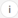

# AEM ervaren fragmenten

Informatie over het gebruiken van ervaringsfragmenten die in [!DNL Adobe Experience Manager] (AEM) in [!DNL Target] activiteiten worden gecreeerd om optimalisering of verpersoonlijking te helpen.

>[!NOTE]
>
>Deze functie vereist dat u een [!DNL Adobe Experience Manager] ([!DNL AEM]) klant bent. Zie [Vereisten](/help/c-experiences/c-manage-content/aem-experience-fragments.md#section_AE6F0971E1574B3AA324003599B96E5A), hieronder, voor meer informatie.

## Overzicht {#section_95A91830530F493B81C5C9CDB9B783EA}

Door ervaringsfragmenten te gebruiken die zijn gemaakt in [!DNL AEM] in [!DNL Target]-activiteiten kunt u het gebruiksgemak en de kracht van [!DNL AEM] combineren met krachtige mogelijkheden voor Automated Intelligence (AI) en Machine Learning (ML) in [!DNL Target] om ervaringen op schaal te testen en aan te passen.

[!DNL AEM] brengt al uw inhoud en middelen op een centrale plaats samen om uw verpersoonlijkingsstrategie te voeden. [!DNL AEM] Hiermee kunt u eenvoudig inhoud voor desktops, tablets en mobiele apparaten op één locatie maken zonder code te schrijven. Het is niet nodig om pagina&#39;s te maken voor elk apparaat. [!DNL AEM] past automatisch elke ervaring aan met uw inhoud.

[!DNL Target] Hiermee kunt u gepersonaliseerde ervaringen op schaal bieden op basis van een combinatie van op regels gebaseerde en door AI aangedreven methoden voor het leren van machines die gedragsvariabelen, contextafhankelijke en offlinevariabelen bevatten. Met [!DNL Target] kunt u eenvoudig [A/B Test](/help/c-activities/t-test-ab/test-ab.md) en [Multivariate](/help/c-activities/c-multivariate-testing/multivariate-testing.md) (MVT) activiteiten opzetten en uitvoeren om de beste aanbiedingen, inhoud, en ervaringen te bepalen.

De fragmenten van de ervaring vertegenwoordigen een enorme stap voorwaarts om de tevreden/ervaringsscheppers en managers aan de optimalisering en verpersoonlijkingsberoeps te verbinden die bedrijfsresultaten drijven gebruikend [!DNL Target].

## Vereisten {#section_AE6F0971E1574B3AA324003599B96E5A}

U moet voorzien zijn van de functionaliteit van ervaringsfragmenten binnen [!DNL Target]. Daarnaast moet u [!DNL AEM] 6.3 gebruiken met het juiste servicepakket of [!DNL AEM] 6.4 (of hoger). Uw accountvertegenwoordiger kan ervoor zorgen dat u voldoet aan de vereisten om deze functie te gebruiken:

* [!DNL Adobe Experience Manager] 6.4 (of hoger).
* [!DNL Adobe Experience Manager] 6.3 SP2 (of hoger).
* [!DNL Adobe Target Standard] of  [!DNL Adobe Target Premium] account.
* Neem contact op met [Adobe Target Customer Care](/help/cmp-resources-and-contact-information.md#reference_ACA3391A00EF467B87930A450050077C) om de integratie in te schakelen en u verificatiegegevens te verstrekken.

## Ervingsfragmenten maken en configureren in [!DNL AEM] {#section_745C8EFE29F547A2958FDBF61A5ADF7B}

Als u [!DNL AEM] wilt gebruiken om fragmenten in [!DNL Target] te ervaren, moet u de volgende stappen uitvoeren:

### Stap 1: [!DNL AEM] integreren met [!DNL Target]

Zie voor meer informatie:

* **[!DNL AEM]6.3**:  [Opent Adobe Analytics en Adobe ](https://docs.adobe.com/docs/en/aem/6-3/administer/integration/marketing-cloud/opt-in.html) richt zich op de  _Adobe Experience Manager 6.3-_ documentatie.
* **[!DNL AEM]6.4**:  [Open Adobe Analytics en Adobe ](https://helpx.adobe.com/experience-manager/6-4/sites/administering/using/opt-in.html) richt zich op de  _Adobe Experience Manager 6.4-_ documentatie.
* **[!DNL AEM]6.5**:  [Open Adobe Analytics en Adobe ](https://helpx.adobe.com/experience-manager/6-5/sites/administering/using/opt-in.html) richt zich op de  *Adobe Experience Manager 6.5-* documentatie.

### Stap 2: Het ervaringsfragment maken

De fragmenten van de ervaring worden gecreeerd in [!DNL AEM]. Zie voor meer informatie:

* **[!DNL AEM]6.3**:  [Ervaar ](https://docs.adobe.com/docs/en/aem/6-3/author/experience-fragments.html) Fragmentaties in de  *Adobe Experience Manager 6.3-* documentatie.
* **[!DNL AEM]6.4**:  [Ervaar ](https://helpx.adobe.com/experience-manager/6-4/sites/authoring/using/experience-fragments.html) Fragmentaties in de  *Adobe Experience Manager 6.4-* documentatie.
* **[!DNL AEM]6.5**:  [Ervaar ](https://helpx.adobe.com/experience-manager/6-5/sites/authoring/using/experience-fragments.html) Fragmentaties in de  *Adobe Experience Manager 6.5-* documentatie.

### Stap 3: [!DNL AEM] configureren om het ervaringsfragment te delen met [!DNL Target]

1. Selecteer in [!DNL AEM] het gewenste ervaringsfragment of de bovenliggende map en klik vervolgens op **[!UICONTROL Properties]**.
2. Klik op de tab **[!UICONTROL Cloud Services]** en selecteer **[!UICONTROL Adobe Target]** in de vervolgkeuzelijst **[!UICONTROL Cloud Service Configuration]**.

   >[!NOTE]
   >
   >De vorige stap veronderstelt dat iemand in uw organisatie de [!DNL Adobe Target] configuratie heeft gecreeerd.

3. Klik op **[!UICONTROL Save & Close]**.

### Stap 4: Het ervaringsfragment publiceren en exporteren naar [!DNL Target]

Afhankelijk van uw [!DNL AEM] versie, zie de volgende verbindingen voor geleidelijke instructies:

* **[!DNL AEM]6.3**:  [Exporteer een Experience Fragment naar ](https://helpx.adobe.com/experience-manager/6-3/sites/administering/using/experience-fragments-target.html) de  *Adobe Experience Manager 6.3-* documentatie.
* **[!DNL AEM]6.4**:  [Exporteer een Experience Fragment naar ](https://experienceleague.adobe.com/docs/experience-manager-64/administering/integration/experience-fragments-target.html) de  *Adobe Experience Manager 6.4-* documentatie.
* **[!DNL AEM]6.5**:  [Exporteer een Experience Fragment naar ](https://helpx.adobe.com/experience-manager/6-5/sites/administering/using/experience-fragments-target.html) de  *Adobe Experience Manager 6.5-* documentatie.

## Werken met ervaringsfragmenten in doelactiviteiten {#section_17CE4BE6B2B74CCEBAE0C68DEB84ABB9}

Na het uitvoeren van de voorafgaande taken, toont het ervaringsfragment op [!UICONTROL Offers] pagina in [!DNL Target].

>[!NOTE]
>
>[!DNL Target] zoekt momenteel naar ervaringsfragmenten die om de tien minuten moeten worden geïmporteerd. Het geïmporteerde ervaringsfragment moet binnen tien minuten beschikbaar zijn in [!DNL Target], maar dit tijdkader moet het vooruit gaan verkorten.

>[!IMPORTANT]
>
>Het ervaringsfragment wordt momenteel geïmporteerd in [!DNL Target] als een HTML-aanbieding. Het ervaringsfragment &#39;primaire&#39; versie blijft in [!DNL AEM] staan. U kunt het ervaringsfragment niet bewerken in [!DNL Target].

U kunt de muisaanwijzer boven een ervaringsfragment in de lijst plaatsen en vervolgens op het [!UICONTROL View]-pictogram  klikken om aanvullende informatie over het ervaringsfragment weer te geven, zoals de URL voor openbare aanbieding en het [!DNL AEM]-pad.

U kunt ervaringsfragmenten in [!DNL Target] activiteiten gebruiken gebruikend [Visual Experience Composer](/help/c-experiences/c-visual-experience-composer/visual-experience-composer.md) (VEC) of [Form-Based Experience Composer](/help/c-experiences/form-experience-composer.md).

>[!NOTE]
>
>Als u de [!DNL Target] AI- en ML-functionaliteit volledig wilt gebruiken, kunt u [Automatisch toewijzen](/help/c-activities/automated-traffic-allocation/automated-traffic-allocation.md#concept_A1407678796B4C569E94CBA8A9F7F5D4) of [Automatisch toewijzen](/help/c-activities/automated-traffic-allocation/automated-traffic-allocation.md) selecteren tijdens het maken van een A/B-test.

**Ervaar fragmenten met de VEC als u deze wilt gebruiken:**

1. In [!DNL Target], terwijl het creëren van of het uitgeven van een ervaring in [Visual Experience Composer](/help/c-experiences/experiences.md#concept_A2E10F6AFB3D4AEAB6951EE14688848D), klik de plaats op de pagina waar u [!DNL AEM] inhoud wilt opnemen, dan selecteer de gewenste optie om [!UICONTROL Choose an Experience Fragment] lijst te tonen.

   * [!UICONTROL Insert Before]
   * [!UICONTROL Insert After]
   * [!UICONTROL Swap with Experience Fragment]

   In de lijst [!UICONTROL Experience Fragment] worden alle inhoud weergegeven die is gemaakt in [!DNL AEM] en die nu in het programma oorspronkelijk beschikbaar is vanuit [!DNL Target].

   >[!NOTE]
   >
   >De optie [!UICONTROL Swap with Experience Fragment] is niet beschikbaar voor afbeeldingen. Als u deze optie bij een afbeelding wilt gebruiken, klikt u op het containerelement dat de gewenste afbeelding bevat.

   

1. Selecteer het gewenste ervaringsfragment en klik op **[!UICONTROL Done]**.
1. Voltooi de configuratie van de activiteit.

   Voor meer informatie over het vormen van de diverse activiteitentypes, zie de volgende onderwerpen:

   * **A/B-test:een A/B-test** [maken](/help/c-activities/t-test-ab/t-test-create-ab/test-create-ab.md)
   * **automatisch toewijzen:** [automatisch toewijzen](/help/c-activities/automated-traffic-allocation/automated-traffic-allocation.md#concept_A1407678796B4C569E94CBA8A9F7F5D4)
   * **automatisch doel:** [automatisch doel](/help/c-activities/auto-target/auto-target-to-optimize.md)
   * **Automated Personalization (AP):een Automated Personalization-activiteit** [maken](/help/c-activities/t-automated-personalization/create-ap-activity.md#task_8AAF837796D74CF893CA2F88BA1491C9)
   * **Experience Targeting (XT):** [Create an Experience Targeting Activity](/help/c-activities/t-experience-target/t-xt-create/xt-create.md#task_D6B3429AC31549E1A70EDF04B3DDC765)
   * **MVT (Multivariate Test):** [Een multivariate Test maken](/help/c-activities/c-multivariate-testing/t-create-multivariate-test/create-multivariate-test.md#task_BF870FA60A8245AB8F0B775BE32EA710)
   * **Recommendations:** [Een Recommendations-activiteit maken](/help/c-recommendations/t-create-recs-activity/create-recs-activity.md#task_6874328773C64C44A73F0A130AD3F96F)

**Ervaar fragmenten op basis van de Form-based Experience Composer:**

1. In [!DNL Target] tijdens het maken of bewerken van een ervaring in de [Form-Based Experience Composer](/help/c-experiences/form-experience-composer.md#task_FAC842A6535045B68B4C1AD3E657E56E) selecteert u de locatie op de pagina waar u [!DNL AEM]-inhoud wilt invoegen en selecteert u **[!UICONTROL Change Experience Fragment]** om de lijst [!UICONTROL Choose an Experience Fragment] weer te geven.

   

   In de lijst [!UICONTROL Experience Fragment] worden alle inhoud weergegeven die is gemaakt in [!DNL AEM] en die nu in het programma oorspronkelijk beschikbaar is vanuit [!DNL Target].

1. Selecteer het gewenste ervaringsfragment en klik op **[!UICONTROL Save]**.
1. Voltooi de configuratie van de activiteit.

## Overwegingen {#considerations}

* [!DNL Target] zoekt momenteel naar ervaringsfragmenten die om de tien minuten moeten worden geïmporteerd. Het geïmporteerde ervaringsfragment moet binnen tien minuten beschikbaar zijn in [!DNL Target], maar dit tijdkader moet het vooruit gaan verkorten.
* Het ervaringsfragment wordt momenteel geïmporteerd in [!DNL Target] als een HTML-aanbieding. Het ervaringsfragment &#39;primaire&#39; versie blijft in [!DNL AEM] staan. U kunt het ervaringsfragment niet bewerken in [!DNL Target].
* U kunt JSON-aanbiedingen als ervaringsfragmenten importeren in [!DNL Target]. Deze aanbiedingen worden echter geïmporteerd als HTML-aanbiedingen. JSON-aanbiedingen (ervaringsfragmenten) worden momenteel niet volledig ondersteund in de gebruikersinterface van [!DNL Target].
* U kunt geen ervaringsfragmenten maken met gebruik van Adobe IO. U moet ervaringsfragmenten maken met behulp van AEM, zoals hierboven beschreven.

## Trainingsvideo: Werken met AEM ervaringsfragmenten met Adobe Target  {#section_C0EDC54063464F41A182492D2045BC64}

In de volgende video ziet u hoe u ervaringsfragmenten instelt en gebruikt:

>[!VIDEO](https://video.tv.adobe.com/v/22383)

>[!NOTE]
>
>De [!DNL AEM]-functie voor deplink die in 4:54 wordt besproken, is verwijderd.

Voor meer informatie, zie [Gebruikend de Fragmenten van de Ervaring met Adobe Target](https://experienceleague.adobe.com/docs/experience-manager-learn/sites/personalization/experience-fragment-target-offer-feature-video-use.html) op *de pagina van de Video&#39;s en van Tutorials van AEM Sites*.
