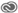

# Aanbiedingenmap maken{#create-offer-folder}

Maak een map voor de items in de bibliotheek met aanbiedingen.

1. Klik **[!UICONTROL Offers]** en selecteer het **[!UICONTROL Code Offers]** of **[!UICONTROL Image Offers]** tabblad.
1. Klik op **[!UICONTROL Create]** > **[!UICONTROL Folder]**.
1. Vul de velden in:

   | Veld | Beschrijving |
   |--- |--- |
   | Titel (alleen van toepassing op aanbiedingen voor afbeeldingen) | Geef een beschrijvende naam voor de map op. U kunt bijvoorbeeld het type inhoud opnemen dat wordt opgeslagen. De naam mag niet de volgende tekens bevatten: Percent-teken `%` Forward-slash `/` Backslash `\` Colon `:` Asterisk `*` Vraagteken `?` Dubbele aanhalingstekens Vierkante haken `"` Vierkante haken `[` `]` Plus-teken: `+` Pijp: `|` Periode: `.` Getalteken: `#` accolade: `{` Curly bracket `}` Caret `^` Semicolon `;` U kunt een koppelteken ( `- `) in plaats van deze tekens gebruiken. |
   | Naam (van toepassing op zowel code- als afbeeldingsaanbiedingen) | Bewerk desgewenst de naam. |
   | Privé (alleen van toepassing op afbeeldingsaanbiedingen) | Geeft aan dat de map privé is, zodat alleen u deze en de inhoud ervan kunt zien. |
   | Opnieuw ordenen is mogelijk in de lijstweergave (alleen van toepassing op afbeeldingsaanbiedingen) | Hiermee geeft u aan dat u en anderen de positie van de map in de lijstweergave kunnen wijzigen. Als u wilt schakelen tussen de Kaartweergave en de Lijstweergave, klikt u op het pictogram Kaartweergave of het pictogram Lijstweergave in de rechterbovenhoek van de inhoudsbibliotheek. U kunt ook Weergave-instellingen selecteren om kolommen in de lijstweergave op te nemen of uit te sluiten. |

1. Klik op **[!UICONTROL Create]**.

## Opties voor codeaanbiedingen

Wanneer u de [!UICONTROL Code Offers] pagina weergeeft, kunt u de volgende handelingen op de map uitvoeren door de muisaanwijzer boven de map te houden en vervolgens het juiste pictogram te selecteren.

### Informatie 

Geef de mapgegevens weer.

### Bewerken 

Bewerk de map.

### Kopiëren 

Kopieer de map.

### Verplaatsen 

Klik op het pictogram, navigeer naar de locatie waarnaar u de map wilt verplaatsen en klik vervolgens op het pictogram Verplaatsen.

U kunt bijvoorbeeld een of meer mappen naar een andere map verplaatsen om submappen te maken.

Klik op Selectie wissen om de geselecteerde mappen te deselecteren.

### Verwijderen 

Verwijder de map.

## Opties voor afbeeldingsaanbiedingen

Wanneer u de [!UICONTROL Image Offers] pagina weergeeft, kunt u de volgende handelingen op de map uitvoeren door de muisaanwijzer boven de map te houden en vervolgens het juiste pictogram te selecteren:

### Selecteren 

Selecteer een of meer mappen waarop de volgende handelingen moeten worden uitgevoerd:

* Downloaden
* Kopiëren
* Verplaatsen
* Verwijderen

### Downloaden 

Download de map en de inhoud ervan.

### Delen naar Adobe Creative Cloud 

Deel de map en de inhoud ervan met de Adobe Creative Cloud.

### Kopiëren 

Kopieer de map en de inhoud ervan.