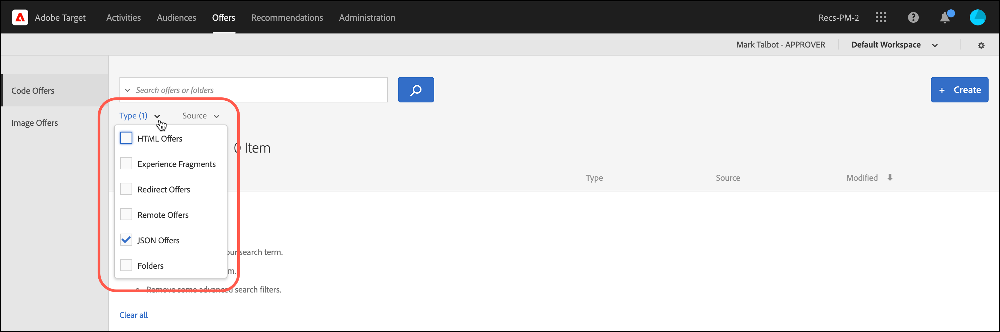

# JSON-aanbiedingen maken{#create-json-offers}

Maak JSON-aanbiedingen in [!UICONTROL Offer Library] in [!DNL Adobe Target] voor gebruik in [!UICONTROL Form-Based Experience Composer].

JSON-aanbiedingen kunnen worden gebruikt in op formulieren gebaseerde activiteiten waarbij het mogelijk is gevallen te gebruiken waarin de beslissing van Target vereist is om een aanbod in JSON-indeling te verzenden voor gebruik in SPA framework of serverintegratie.

Houd rekening met de volgende informatie terwijl u met JSON werkt:

* JSON-aanbiedingen zijn momenteel alleen beschikbaar voor AB- en XT-activiteiten.
* JSON-aanbiedingen kunnen alleen worden gebruikt in formuliergebaseerde activiteiten.
* De JSON-aanbieding kan rechtstreeks worden opgehaald wanneer u de Server Side API, Mobile SDK of NodeJS SDK gebruikt.
* In browser, kunnen de aanbiedingen JSON UITSLUITEND via at.js 1.2.3 (of recenter) worden teruggewonnen en gebruikend [getOffer ()](/help/c-implementing-target/c-implementing-target-for-client-side-web/adobe-target-getoffer.md) door acties te filtreren gebruikend `setJson` actie.
* JSON-aanbiedingen worden geleverd als native JSON-objecten in plaats van als tekenreeksen. Consumenten van deze objecten hoeven objecten niet langer als tekenreeksen te verwerken en deze in JSON-objecten om te zetten.
* JSON-aanbiedingen worden niet automatisch toegepast in tegenstelling tot andere aanbiedingen (zoals HTML-aanbiedingen) omdat JSON-aanbiedingen niet-visuele aanbiedingen zijn. Ontwikkelaars moeten code schrijven om de aanbieding expliciet op te halen met [getOffer()](/help/c-implementing-target/c-implementing-target-for-client-side-web/adobe-target-getoffer.md).
* JSON-aanbiedingen worden niet ondersteund als u mbox.js gebruikt.

## Een JSON-aanbieding {#section_BB9C72D59DEA4EFB97A906AE7569AD7A} maken

1. Klik op **[!UICONTROL Offers]** en selecteer vervolgens het tabblad **[!UICONTROL Code Offers]**.
1. Klik op **[!UICONTROL Create]** > **[!UICONTROL JSON Offer]**.

   

1. Typ een naam voor het voorstel.
1. Typ of plak uw JSON-code in het tekstvak **[!UICONTROL Code]**.
1. Klik op **[!UICONTROL Save]**.

## Voorbeeld {#section_A54F7BB2B55D4B7ABCD5002E0C72D8C9}

JSON-aanbiedingen worden alleen ondersteund in activiteiten die zijn gemaakt met de Form-based Experience Composer. De enige manier om JSON-aanbiedingen te kunnen gebruiken is momenteel via directe API-aanroepen.

Hier volgt een voorbeeld:

```json
adobe.target.getOffer({ 
  mbox: "some-mbox", 
  success: function(actions) { 
    console.log('Success', actions); 
  }, 
  error: function(status, error) { 
    console.log('Error', status, error); 
  } 
});
```

De acties die aan succesvolle callback worden overgegaan zijn een serie van voorwerp. Ervan uitgaande dat we één enkel JSON-aanbod hebben, dat de volgende inhoud heeft:

```json
{ 
  "demo": {"a": 1, "b": 2} 
}
```

De array actions heeft deze structuur:

```json
[ 
 { 
   action: "setJson", 
   content: [{ 
     "demo": {"a": 1, "b": 2} 
   }] 
 }  
]
```

Als u de JSON-aanbieding wilt extraheren, doorloopt u handelingen en zoekt u de handeling met de handeling `setJson` en doorloopt u vervolgens de inhoudarray.

## Hoofdlettergebruik {#section_85B07907B51A43239C8E3498EF58B1E5}

Stel dat de volgende JSON-aanbieding op uw webpagina wordt afgeleverd:

```json
{ 
    "_id": "5a65d24d8fafc966921e9169", 
    "index": 0, 
    "guid": "7c006504-c6f7-468d-a46f-f72531ea454c", 
    "isActive": true, 
    "balance": "$2,075.06", 
    "picture": "https://placehold.it/32x32", 
    "tags": [ 
      "esse", 
      "commodo", 
      "excepteur", 
    ], 
    "friends": [ 
      { 
        "id": 0, 
        "name": "Carla Lyons" 
      }, 
      { 
        "id": 1, 
        "name": "Ollie Mooney" 
      }, 
    ], 
    "greeting": "Hello, Stephenson Fernandez! You have 4 unread messages.", 
    "favoriteFruit": "strawberry" 
} 
  
```

De volgende code toont hoe te om tot het &quot;groet&quot;attribuut toegang te hebben:

```json
adobe.target.getOffer({   
  "mbox": "name_of_mbox", 
  "params": {}, 
  "success": function(offer) {           
        console.log(offer[0].content[0].greeting); 
  },   
  "error": function(status, error) {           
      console.log('Error', status, error); 
  } 
});
```

## Aanbiedingen filteren op basis van het JSON-type aanbieding {#section_52533555BCE6420C8A95EB4EB8907BDE}

U kunt de bibliotheek van Aanbiedingen door het aanbiedingstype van JSON filtreren door **[!UICONTROL Type]** drop-down lijst te klikken, dan door &lt;a1 te selecteren/> checkbox.**[!UICONTROL JSON]**



