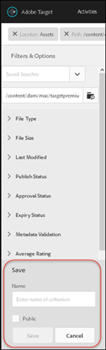

# Inhoud zoeken en slimme verzamelingen maken{#search-content-and-create-smart-collections}

Zoek naar activa door sleutelwoorden en sla onderzoeksomslagen, genoemd slimme inzamelingen op, die automatisch met onderzoeksresultaten worden bijgewerkt.

Deze sectie bevat de volgende informatie:

* [Middelen zoeken op trefwoord](/help/c-experiences/c-manage-content/filter-and-search-content.md#section_2465A71BC95942588F586B1EC8B9E5DB)
* [Slimme verzameling opslaan](/help/c-experiences/c-manage-content/filter-and-search-content.md#section_5C95159543B5405EB8C8E47B518DF4AB)

## Middelen zoeken op trefwoord {#section_2465A71BC95942588F586B1EC8B9E5DB}

1. Klik op **[!UICONTROL Offers]** > **[!UICONTROL Image Offers]** om het dialoogvenster te openen [!UICONTROL Asset Library].

   U kunt op het [!UICONTROL Card View] pictogram in de rechterbovenhoek klikken om elementen weer te geven in de vorm van de kaartweergave.

   of

   U kunt op het [!UICONTROL List View] pictogram in de rechterbovenhoek klikken om elementen weer te geven in de indeling voor de lijstweergave.

1. Klik op het **[!UICONTROL Content Only]** pictogram in de linkerbovenhoek om het zoekvak weer te geven.

   

1. Typ in het zoekvak een trefwoord voor de elementen die u wilt zoeken en druk op Enter.

## Slimme verzameling opslaan {#section_5C95159543B5405EB8C8E47B518DF4AB}

U kunt opgeslagen zoekopdrachten maken, slimme verzamelingen genoemd, zodat u tijd bespaart wanneer u vergelijkbare zoekopdrachten uitvoert. Een opgeslagen zoekopdracht maakt een slimme verzameling die automatisch wordt bijgewerkt met zoekresultaten.

1. Klik op **[!UICONTROL Offers]** > **[!UICONTROL Image Offers]** om het dialoogvenster te openen [!UICONTROL Assets Library].

   

1. Klik op het **[!UICONTROL Content Only]** pictogram in de linkerbovenhoek om het [!UICONTROL Filter & Options] deelvenster weer te geven in de linkerspoorstaaf.
1. Klik op het **[!UICONTROL Browse]** pictogram om het [!UICONTROL Select Path] dialoogvenster weer te geven.

   

1. Blader naar de gewenste map waarop u de slimme verzameling wilt baseren en selecteer deze. Klik vervolgens op het **[!UICONTROL Confirm]** pictogram.

   

1. (Optioneel) Maak een keuze uit de verschillende opties om het filter te beperken, bijvoorbeeld bestandstype en -grootte.
1. Klik onder **[!UICONTROL Save Smart Collection]** in het [!UICONTROL Filter & Options] deelvenster om de opties voor Opslaan weer te geven.

   

1. Geef een naam voor de slimme verzameling op en schakel het **[!UICONTROL Public]** selectievakje in als u wilt dat alle gebruikers in uw [!DNL Target] account toegang hebben tot deze slimme verzameling. Klik vervolgens op **[!UICONTROL Save]**.

   De slimme verzameling wordt toegevoegd aan de lijst met opgeslagen zoekopdrachten voor toekomstig gebruik:

   

U kunt een opgeslagen slimme verzameling bewerken door deze in de [!UICONTROL Saved Searches] vervolgkeuzelijst te selecteren om deze te openen en vervolgens te klikken [!UICONTROL Edit Smart Collection].
