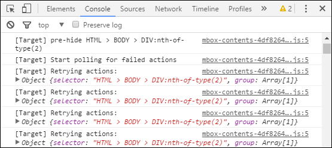

# Migreren naar at.js vanuit mbox.js{#how-to-migrate-to-at-js-from-mbox-js}

Het migreren van mbox.js naar at.js in [!DNL Adobe Target] is een eenvoudig proces.

Ga als volgt te werk om te migreren van [!DNL mbox.js] naar [!DNL at.js] en uw migratie te controleren:

1. Bepaal de de [browser van uw organisatie steunvereisten](../../../../c-implementing-target/c-considerations-before-you-implement-target/supported-browsers.md#reference_01B4BF99E7D545A7998773202A2F6100) .
1. Controleer de huidige [!DNL mbox.js] implementatie van uw website op mogelijkheden die niet worden ondersteund door [!DNL at.js].

   Wanneer het controleren van uw implementatie, zoek het volgende:

   **Welke typen vakken gebruikt u momenteel?**

   | Type | Details |
   |--- |--- |
   | Automatisch gemaakte globale mbox | Het automatisch gemaakte globale mbox wordt gemaakt wanneer de enige regel doelcode op uw site het bestand mbox.js is. Dat dossier produceert automatisch een mbox vraag. |
   | Globale, lege mboxCreate | U wordt aangeraden over te schakelen naar het automatisch gemaakte globale mbox. |
   | MboxCreate | De migratie zou eenvoudig moeten zijn, zolang uw `mboxCreate()` wordt voorafgegaan door `<div class="mboxDefault"></div>`. |
   | mboxUpdate | Migratie moet eenvoudig zijn wanneer `mboxUpdate()` deze samen met `mboxDefine()` of `mboxCreate()`wordt gebruikt. `mboxUpdate()` werkt automatisch gemaakte globale mbox of een mbox niet bij oorspronkelijk gecreeerd door `getOffer()`. In deze omstandigheden moet een combinatie van `getOffer()` en `applyOffer()` worden gebruikt om te vervangen `mboxUpdate()` bij het migreren naar at.js. |
   | Aangepaste klikvolgvakjes, met inbegrip van mboxTrack | We raden u aan uw code bij te werken om deze te gebruiken `trackEvent()`. |

   >[!NOTE]
   >
   >Zie [at.js voor meer informatie over de verschillende functies die in de voorgaande tabel worden genoemd](/help/c-implementing-target/c-implementing-target-for-client-side-web/cmp-atjs-functions.md).

   **Hebt u aanpassingen aan uw[!DNL mbox.js]bestand?**

   * mboxParameters()
   * mboxSupported()
   * mboxCookieDomain()
   * Extra JavaScript
   * Overige locaties

   De meeste [objecten en methoden](../../../../c-target/c-visitor-profile/variables-profiles-parameters-methods.md#section_8C78059D15D9452F95636A5640188537) mbox.js (zoals `mbox`, `mboxCurrent`, `mboxFactoryDefault`, `mboxFactories`en andere) worden niet ondersteund. Alternatieve benaderingen kunnen mogelijk zijn om te bereiken wat u probeert te doen.

   **Hebt u[!DNL mbox.js]op een van uw webpagina&#39;s?**

   U kunt niet zowel [!DNL at.js] als [!DNL mbox.js] op dezelfde webpagina gebruiken. U kunt de twee JavaScript-bibliotheken echter op twee verschillende pagina&#39;s van dezelfde website gebruiken.

   Het cookie van de box is de belangrijkste manier waarop Adobe de bezoeker van pagina tot pagina verbindt. Als onderdeel van uw kwaliteitscontrole moet u bevestigen dat het cookie wordt behouden en correct wordt gelezen terwijl de bezoeker heen en weer gaat tussen pagina&#39;s met [!DNL at.js] en pagina&#39;s met [!DNL mbox.js]. Zorg ervoor dat dezelfde `mboxPC` en `mboxSession` waarden worden doorgegeven in de mbox-aanroepen, ongeacht welk gedeelte van de site ( [!DNL at.js] of [!DNL mbox.js]) de bezoeker eerst landt en in welk gedeelte de cookie oorspronkelijk is ingesteld. Als u cookies van derden gebruikt in uw implementatie, moet u ervoor zorgen dat deze waarden gelijk blijven wanneer u door de site bladert.

   **Integreert u[!DNL Target]met andere Adobe oplossingen?**

   * Analyse (A4T)
   * Analytics (legacy integration)
   * AAM (backend)
   * AAM (verouderde voorzijde)
   * AEM
   * Data Workbench

   Sommige verouderde integraties worden niet ondersteund door [!DNL at.js]. Zie de pagina [Integraties](../../../../c-implementing-target/c-implementing-target-for-client-side-web/c-how-atjs-works/target-atjs-integrations.md#concept_C100BC4F073C4B57A608B309D0157B39) voor meer informatie.

   **Integreert u[!DNL Target]met andere hulpprogramma&#39;s van derden?**

   * Andere analysefuncties
   * Overige DMP&#39;s
   * Demandbase
   * Klikverhaal
   * Overige

   Deze integratie moet mogelijk worden aangepast om te kunnen werken met [!DNL at.js]. Zie de pagina [Integraties](../../../../c-implementing-target/c-implementing-target-for-client-side-web/c-how-atjs-works/target-atjs-integrations.md#concept_C100BC4F073C4B57A608B309D0157B39) voor meer informatie.

   **Gebruikt u een tagbeheer?**

   * Dynamisch tagbeheer
   * Vergroten
   * Tealium
   * Signal/BrightTag

   Zie [at.js Integrations](../../../../c-implementing-target/c-implementing-target-for-client-side-web/c-how-atjs-works/target-atjs-integrations.md#concept_C100BC4F073C4B57A608B309D0157B39)voor meer informatie.

   >[!NOTE]
   >
   >Als u momenteel geen tagbeheer gebruikt om te implementeren [!DNL Target], is het wellicht een goed moment om dit te overwegen. Dynamic Tag Management [is gratis voor](https://dtm.adobe.com) klanten en is de aanbevolen methode om te implementeren [!DNL Target] [!DNL Target]. Zie [Aanbevolen procedures voor het implementeren van Adobe Target met Dynamisch tagbeheer](https://docs.adobe.com/content/help/en/dtm/implementing/overview.html)voor meer informatie.

1. Controleer of alle huidige activiteiten en integraties naar verwachting werken.

   Hier volgen enkele voorbeelden van wat u kunt doen tijdens het testen om te controleren of [!DNL at.js] het programma naar behoren functioneert:

   * Zorg ervoor dat al uw huidige activiteiten werken met de nieuwe JavaScript-bibliotheek.
   * Controleer of alle [integratie](../../../../c-implementing-target/c-implementing-target-for-client-side-web/c-how-atjs-works/target-atjs-integrations.md#concept_C100BC4F073C4B57A608B309D0157B39) - en [insteekmodules](../../../../c-implementing-target/c-implementing-target-for-client-side-web/t-mbox-download/c-target-atjs-implementation/target-atjs-plugins.md#concept_F5D4C0A4DACF41409CC42FDD93B13FAF) naar behoren werken.
   * Zorg ervoor u comfortabel [het zuiveren](../../../../c-implementing-target/c-implementing-target-for-client-side-web/c-target-debugging-atjs/target-debugging-atjs.md#concept_CAE591DA8C404C22917584ECD4F7494F) met de benaderingen beschikbaar bij [!DNL at.js].

**Mogelijke problemen bij het migreren naar at.js** Sommige klanten hebben na het uitvoeren van de migratie naar at.js de volgende problemen gemeld:

* Sommige activiteiten VEC die op een pagina met [!DNL mbox.js] zouden worden gebouwd om met [!DNL at.js]kunnen moeten worden bijgewerkt.

   Deze kwestie komt het vaakst op websites voor die vele identiteitskaart of klassenattributen in de elementen van HTML niet gebruiken. U kunt bevestigen of u dit probleem ervaart door de pagina te laden en te bepalen of de ervaring zoals verwacht wordt geleverd door de pagina met `?mboxDebug=true` en het herzien van de consoleverklaringen te laden.

   
In deze gevallen kunnen elementkiezers beginnen met iets als

   ```
   HTML > BODY > DIV:nth-of-type(2)
   ```

   en zijn gemaakt met de verwachting die een extra [!DNL mbox.js] element aan de bovenkant van de pagina `<div>` toevoegde. Omdat [!DNL at.js] geen `<div>` element aan de bovenkant van de pagina wordt toegevoegd, werkt deze kiezer niet meer met [!DNL at.js].

   Dit probleem kan worden verholpen door de activiteit in VEC op de URL opnieuw te maken met behulp van [!DNL at.js] of door de kiezer handmatig bij te werken met de optie **[!UICONTROL </> Code]** **[!UICONTROL Modifications]** > in VEC.

   U verhelpt dit probleem door 1 te verwijderen uit het nde-van-type getal in het eerste DIV-element na BODY. In het bovenstaande voorbeeld zou de bewerkte code als volgt zijn:

   ```
   HTML > BODY > DIV:nth-of-type(1)
   ```

   Voor meer informatie over hoe te om de coderedacteur te gebruiken om dit te doen, zie de Redacteur [van de](../../../../c-experiences/c-visual-experience-composer/c-vec-code-editor/vec-code-editor.md#concept_B3A6E9EE3A60406DB640E205EA1745B5)Code.

* Omdat alle vakken nu asynchroon zijn, blokkeren ze het weergeven van pagina&#39;s of retourneren ze niet in de volgorde waarin ze zijn gestart. Voor meer informatie, zie &quot;Asynchrone Overwegingen&quot;in [at.js Beperkingen](../../../../c-implementing-target/c-implementing-target-for-client-side-web/t-mbox-download/c-target-atjs-implementation/target-atjs-limitations.md#concept_FA99E4D6EC274552BF45E01AFB76CCAE).
