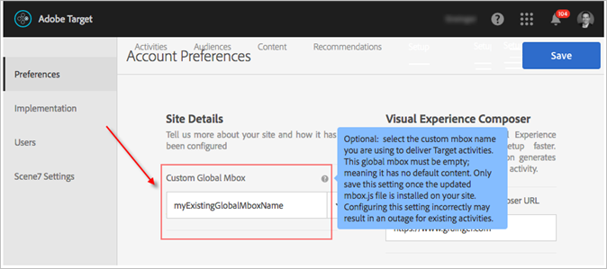

# Een globale box aanpassen{#customize-a-global-mbox}

Informatie om u te helpen een globale mbox voor zowel at.js als mbox.js aanpassen.

1. Bewerk mbox.js.

   Ga naar **[!UICONTROL Target]** > **[!UICONTROL Administration]** > **[!UICONTROL Implementation]**.

   * Klik voor mbox.js **[!UICONTROL Edit mbox.js Settings]**.
   * Selecteer [!DNL at.js]bijvoorbeeld **[!UICONTROL at.js]** onder Implementatiemethode en klik op **[!UICONTROL Edit mbox.js Settings]**.

   

1. Bewerken [!DNL mbox.js] of [!DNL at.js].

   Schakel deze optie uit **[!UICONTROL Auto create global mbox]** en voeg vervolgens de naam toe van de aangepaste globale box die u wilt gebruiken om activiteiten van [!DNL Target Standard/Premium]te leveren. Dit aangepaste globale vakje wordt ook gebruikt voor klik het volgen.

   

   Klik **[!UICONTROL Save]** wanneer u klaar bent.
1. Implementeer de [!DNL mbox.js] of [!DNL at.js] bibliotheek op uw site.

* Voor mbox.js, zie Implementatie [Mbox.js](../../../../c-implementing-target/c-implementing-target-for-client-side-web/t-mbox-download/mbox-download.md#task_4EAE26BB84FD4E1D858F411AEDF4B420).
* Zie [at.js Implementation](../../../../c-implementing-target/c-implementing-target-for-client-side-web/t-mbox-download/c-target-atjs-implementation/target-atjs-implementation.md#concept_8AC8D169E02944B1A547A0CAD97EAC17).

1. Tijd de overgang met uw versie.

   Zodra u klaar bent om uw globale mbox voor alle activiteiten [!DNL Target Standard/Premium] te beginnen te gebruiken die zich voortbewegen, kunt u met deze stap verdergaan.

   Werk de naam van de aangepaste globale box bij zodat deze overeenkomt met de naam die in Stap 2, hierboven, wordt gebruikt.

   

   >[!IMPORTANT]
   >
   >Wanneer u het bestand opslaat, worden alle activiteiten in uw account gesynchroniseerd met dit selectievakje. Als deze box niet op uw site staat, werken alle activiteiten niet meer.

   Klik op **[!UICONTROL Save]**.
