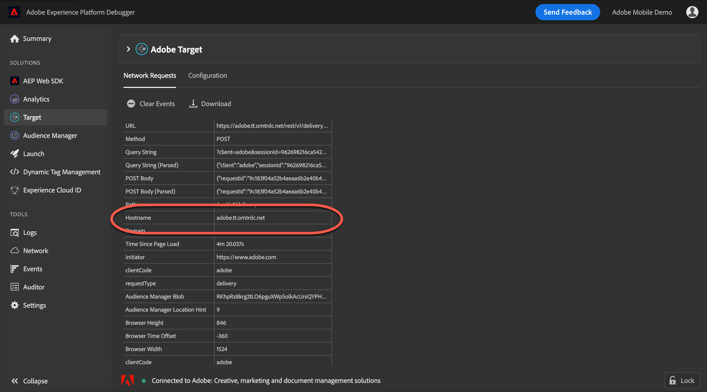

# Een Analytics-trackingserver gebruiken{#use-an-analytics-tracking-server}

Als u een oudere versie van at.js of mbox.js gebruikt, moet u een analysetrackingserver voor activiteiten specificeren die [!DNL Analytics] voor [!DNL Target] (A4T) gebruiken.

>[!NOTE]
>
>Als u [!DNL Analytics] als rapporteringsbron van uw activiteit gebruikt, te hoeven u niet om een het volgen server tijdens activiteitenverwezenlijking te specificeren als u mbox.js versie 61 (of recenter) of versie 0.9.1 van .js (of later) gebruikt. De bibliotheek mbox.js of at.js verzendt automatisch het volgen serverwaarden naar [!DNL Target]. Tijdens het maken van activiteiten kunt u het [!UICONTROL Tracking Server] veld leeg laten op de [!UICONTROL Goals & Settings] pagina.
>
>Het [!DNL Target] team steunt allebei at.js 1.*x* en at.js 2.*x*. Voer een upgrade uit naar de meest recente update van een van de belangrijkste versies van at.js om ervoor te zorgen dat u een ondersteunde versie uitvoert. Zie [de versiedetails](/help/c-implementing-target/c-implementing-target-for-client-side-web/target-atjs-versions.md)at.js voor meer informatie.

Om ervoor te zorgen dat de gegevens van [!DNL Target] naar de correcte plaats binnen gaan [!DNL Analytics], vereist A4T een analytische het volgen server om in alle vraag naar Modstats van [!DNL Target]. worden verzonden. Voor implementaties die veelvoudige het volgen servers gebruiken kunt u de Hulpmiddelen van de Ontwikkelaar van uw browser gebruiken [!DNL Adobe Experience Platform Debugger] of om de correcte volgende server voor uw activiteit te bepalen.

## De analytische trackingserver ophalen met de Adobe Experience Platform Debugger

Foutopsporing zou op een pagina moeten worden bekeken waar de activiteit zal worden geleverd om u te verzekeren de correcte volgende server selecteert. U kunt ook een standaard traceringsserver opgeven voor elk account. Neem contact op met de klantenservice om de standaardinstelling op te geven of te wijzigen.

1. Open de [!DNL Adobe Experience Platform Debugger]pagina op de pagina waarop u uw activiteit maakt.

   Als u debugger niet hebt geïnstalleerd, zie [Inleiding aan de Debugger](https://docs.adobe.com/content/help/en/platform-learn/tutorials/data-ingestion/web-sdk/introduction-to-the-experience-platform-debugger.html)van Adobe Experience Platform.

   

1. Click **[!UICONTROL Analytics]** in the left navigation menu.

   De analytische traceringsserver vindt u in de [!UICONTROL Hostname] sectie van het foutopsporingsprogramma.

   * **First-party tracking-server**: Als de hostnaam van de aanvraag overeenkomt met het domein waarop u zich bevindt, is het een eerstelijnsspatiëringsserver. Als u bijvoorbeeld op bent `adobe.com`, `adobe.com` is dit de server voor het volgen van de eerste partij.
   * **De volgende server** van derden: Een server van derden is doorgaans de server `[company].sc.omtrdc.net` waar het bedrijf de naam van het bedrijf heeft, maar eindigt altijd in `sc.omtrdc.net`.
   * **CNAME-implementaties**: `sstats.adobe.com` Dit is een voorbeeld van een CNAME-server voor het bijhouden van een aanvraag voor https (secure). `stats.adobe.com` Dit is een voorbeeld van een CNAME-aanvraag van de eerste partij voor een http-pagina (niet-beveiligd).

1. Kopieer de volledige inhoud van het veld.

1. Plak in het **[!UICONTROL Reporting Settings]** gedeelte van het **[!UICONTROL Goal & Settings]** scherm van uw activiteit de trackingserverinformatie in het **[!UICONTROL Tracking Server]** veld.

   >[!NOTE]
   >
   >U moet uw activiteit selecteren [!UICONTROL Analytics as the Reporting Source] om het [!UICONTROL Tracking Server] gebied beschikbaar te maken.

## Haal de analysetrackingserver op met de Developer Tools van uw browser

De Developer Tools moet worden weergegeven op een pagina waarop de activiteit wordt geleverd, zodat u de juiste trackingserver selecteert. U kunt ook een standaard traceringsserver opgeven voor elk account. Neem contact op met de klantenservice om de standaardinstelling op te geven of te wijzigen.

1. Open de Developer Tools van de browser op de pagina waarop u uw activiteit maakt (klik in Google Chrome op de drie verticale ellipsen in de rechterbovenhoek > Meer gereedschappen > Gereedschappen voor ontwikkelaars).

   

1. Klik op het **[!UICONTROL Network]** tabblad.

1. Filter voor `/ss,` het weergeven van de analyseverzoeken.

   

   De volgende server is hostname van het verzoek.

   * **First-party tracking-server**: Als de hostnaam van de aanvraag overeenkomt met het domein waarop u zich bevindt, is het een eerstelijnsspatiëringsserver. Als u bijvoorbeeld op bent `adobe.com`, `adobe.com` is dit de server voor het volgen van de eerste partij.
   * **De volgende server** van derden: Een server van derden is doorgaans de server `[company].sc.omtrdc.net` waar het bedrijf de naam van het bedrijf heeft, maar eindigt altijd in `sc.omtrdc.net`.
   * **CNAME-implementaties**: `sstats.adobe.com` Dit is een voorbeeld van een CNAME-server voor het bijhouden van een aanvraag voor https (secure). `stats.adobe.com` Dit is een voorbeeld van een CNAME-aanvraag van de eerste partij voor een http-pagina (niet-beveiligd).

1. Kopieer de volledige inhoud van het veld.

1. Plak in het **[!UICONTROL Reporting Settings]** gedeelte van het **[!UICONTROL Goal & Settings]** scherm van uw activiteit de trackingserverinformatie in het **[!UICONTROL Tracking Server]** veld.

   >[!NOTE]
   >
   >U moet uw activiteit selecteren [!UICONTROL Analytics as the Reporting Source] om het [!UICONTROL Tracking Server] gebied beschikbaar te maken.

