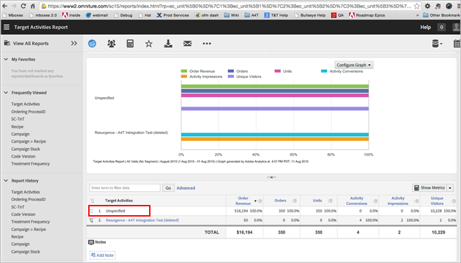

# Rapporten weergeven - Veelgestelde vragen voor A4T{#view-reports-a-t-faq}

Dit onderwerp bevat antwoorden op vragen die vaak over het bekijken van rapporten wanneer het gebruiken van Analytics als rapporteringsbron voor Doel (A4T) worden gevraagd.

## Wat is de telmethode en hoe gebruik ik deze? {#section_E9C21C47B5BE4E54BABF0CD7F03D3945}

In de telmethode wordt aangegeven welk doel als noemer voor de omrekeningskoersen wordt gebruikt. De volgende opties zijn mogelijk:

* indrukken
* bezoekers
* bezoeken

## Kan ik standaard metrisch voor de rapporten van het Doel plaatsen? {#section_50C20D286AA042CCA958184C9C0767DD}

Voor het rapport van Activiteiten, kunnen Admins standaard metrisch veranderen zodat telkens als zij het rapport in werking stellen het de zelfde metriek toont. Anders, blijft het rapport aan laatste metrisch in gebreke u op uw laatste rapport toepaste.

Voor meer informatie, zie [Uitgezochte standaardrapportmetriek](https://docs.adobe.com/content/help/en/analytics/analyze/reports-analytics/metrics.html) in de *Analysegids* van Analytics.

## Wanneer pas ik een segment op metrisch (met berekende metrisch) tegenover het toepassen van het segment op het rapport toe? {#section_BC29DEE6D2734911A5CD6FBF1189EB89}

De segmenten die op de rapporten worden toegepast zijn als het toepassen van segmenten in het klassieke Doel. Deze techniek is het meest nuttig om te zien hoe een test een subset van mensen beïnvloedt (bijvoorbeeld hoe heeft deze test voor mensen in het Verenigd Koninkrijk gepresteerd?).

Het is mogelijk om segmenten op metriek met berekende metrisch toe te passen. Dit gebeurt gewoonlijk wanneer u een nieuw type succesgebeurtenis wilt maken. Als u bijvoorbeeld wilt zien hoeveel bezoekers uw activiteit retourneren, of hoeveel bezoekers deze naar een bepaalde pagina hebben gemaakt die uw test ziet. Houd er rekening mee dat er momenteel geen lift en betrouwbaarheid kunnen worden gegenereerd voor berekende meetwaarden.

## Moet ik bezoekers, activiteitenindrukken, of bezoeken gebruiken wanneer het bekijken van rapporten? {#metrics}

Er zijn verschillende opties, elk met zijn eigen voordelen:

* ***Unieke bezoekers*** nemen eenmaal toe wanneer een gebruiker voor het eerst in aanmerking komt voor een activiteit.
* ***Bezoekt*** de verhoging voor elke zitting zodra een gebruiker (Unieke Bezoeker) een activiteit ingaat, zelfs als de activiteit niet in verdere bezoeken wordt bekeken.
* ***Activiteitenindrukkingen*** nemen toe telkens wanneer de inhoud van de activiteit wordt weergegeven. (Gemeten door doel)
* ***Instanties*** nemen eenmaal per pagina toe wanneer de activiteiteninhoud wordt weergegeven. (Gemeten door Analytics)

Wanneer een bezoeker een pagina weergeeft die een activiteit bevat, wordt een variabele ingesteld voor die bezoeker die de naam van die activiteit bevat. Zie de gedetailleerde scenario&#39;s hieronder voor hoe elke telmethode vergelijkt.

Overweeg het volgende:

* Alle bovenstaande metrische trigger wanneer een gebruiker in aanmerking komt voor een activiteit en inhoud wordt geretourneerd van [!DNL Target]. Dit betekent niet noodzakelijk dat de gebruiker het aanbod zag. Als een activiteitenervaring onder de vouw is en de gebruiker niet onderaan de pagina scrolt, dan werd de aanbieding gediend door [!DNL Target] maar niet gezien door de gebruiker.
* [!UICONTROL Activity Impressions] (gemeten door [!DNL Target]) en [!UICONTROL Instances] (gemeten door [!DNL Analytics]) zijn gelijk, tenzij er meerdere mbox-aanroepen op dezelfde pagina in dezelfde activiteit plaatsvinden. Hierdoor worden meerdere geteld, maar slechts één [!UICONTROL Activity Impressions] [!UICONTROL Instance].
* Wanneer het gebruiken [!UICONTROL Activity Impressions] en [!UICONTROL Activity Conversions] metriek in [!DNL Analysis Workspace], zorg ervoor dat beide metriek toegepaste [!UICONTROL Same Touch] attributiemodellen hebben. U kunt modellen toepassen door op het tandwieltje voor kolominstellingen te klikken, [!UICONTROL Non-default attribution models]en vervolgens [!UICONTROL Same Touch]te selecteren. Meer informatie over kenmerk in IQ-overzicht [van](https://docs.adobe.com/content/help/en/analytics/analyze/analysis-workspace/panels/attribution.html) kenmerken in de *handleiding* Analytics Tools.

## Wat betekent de &quot;activiteitomzettingen&quot;als de teller een metrische Analyse tijdens activiteitenopstelling plukt? {#section_F3EBACF85AF846E9B366A549AAB64356}

De &quot;omzettingen van de Activiteit&quot;zal leeg zijn als Metrisch Analytics als omzettingsmetrisch voor de activiteit werd geselecteerd.

## Waarom zie ik &quot;niet gespecificeerd&quot; in de analytische rapporten? Wat betekent het? {#unspecified}

In andere rapporten betekent &quot;niet gespecificeerd&quot; dat gegevens niet aan een classificatieregel voldeden, maar in A4T zou dit nooit mogen gebeuren. Als je &#39;unspecified&#39; ziet, dan is de classificatieservice nog niet gestart. Over het algemeen duurt het 24 tot 72 uur voordat gegevens over de activiteit in de rapporten worden weergegeven. Hoewel de activiteiten pas op dat moment in dit verslag worden vermeld, worden alle bezoekersgegevens die met deze activiteiten verband houden, vastgelegd en weergegeven wanneer de classificatie is voltooid.

Na de rubriceringsperiode worden in deze rapporten ongeveer een uur na de verzameling gegevens van de website weergegeven. Alle metriek, segmenten, en waarden in de rapporten komen uit de rapportreeks u selecteerde toen u opstelling de activiteit.

## Waarom worden de metriek van het Doel verzonden naar Analytics zelfs nadat de activiteit is gedeactiveerd? {#section_38AA8380A4D54A18972F1EF3E73E22EF}

De [!DNL Target] naar [!DNL Analytics] verzonden variabele heeft een standaardvervalperiode van 90 dagen. Deze vervalperiode kan indien nodig worden aangepast door de klantenservice. Deze instelling is echter algemeen voor alle activiteiten, zodat ze niet voor één geval hoeft te worden aangepast.

U zou de variabelen van het Doel kunnen zien die naar Analytics na de vervalperiode worden verzonden omdat de vervaldatum 90 dagen is, maar slechts als die gebruiker geen andere A4T-Toegelaten activiteit van het Doel ziet. Als een gebruiker op dag 45 terugkomt naar de site en een andere activiteit ziet, wordt de teller van de hele A4T Var opnieuw ingesteld op 90 dagen. Dat betekent dat de eerste campagne vanaf dag 1 nu tot 45 + 90 = 135 dagen zou kunnen duren. Als de gebruiker blijft terugkomen, zou u aan het punt kunnen komen waar u metriek die naar Analytics in uw rapportering van veel oudere activiteiten wordt verzonden. Wanneer gebruikers cookies verwijderen en niet terugkeren naar de site, gaan de nummers in die activiteit verloren, maar blijven deze zichtbaar.

Dit betekent dat de activiteiten nog steeds paginaweergaven krijgen, bezoeken, enzovoort, tot 90 dagen nadat de activiteit eindigt voor bezoekers die deel uitmaakten van de activiteit terwijl deze actief was. Nochtans, als u [!UICONTROL Activity Impressions] metrisch kijkt, zou u geen beelden moeten zien nadat de activiteit beëindigde.

Dit is normaal en verwacht gedrag. De variabele A4T werkt net als elke andere eVar. De waarde wordt aan de gebruiker gekoppeld totdat deze de verlooptijdperiode (90 dagen) bereikt. Als een activiteit slechts twee weken actief is, wordt de waarde dus nog steeds geassocieerd met de gebruiker gedurende ten minste de volgende 90 dagen.

De beste praktijken zijn meningsrapporten voor die activiteit slechts voor de periode dat de activiteit levend was. Als u de activiteit in Analytics bekijkt, moeten de datums standaard correct worden ingesteld. Tenzij u de datum handmatig hebt verlengd, moet dit dus geen kwestie vanuit rapportoogpunt zijn.

Laten we er bijvoorbeeld van uitgaan dat de variabele A4T na 90 dagen vervalt en dat onze test van 1 januari tot en met 15 januari actief is.

Op 1 januari komt de gebruiker naar de site en ziet activiteit XYZ eenmaal en heeft daarna vijf paginaweergaven. In de komende twee weken keert de gebruiker nooit terug naar de site. De gegevens zien er voor deze gebruiker als volgt uit:

| Naam activiteit | Instanties (impressies) | Paginaweergaven | Bezoeken | Unieke bezoekers |
|--- |--- |--- |--- |--- |
| XYZ | 1 | 5 | 1 | 1 |

De gebruiker keert op 1 Februari terug, bekijkt vijf meer pagina&#39;s, en ontmoet geen meer activiteiten van het Doel en de originele activiteit is niet meer actief. Hoewel de activiteit niet meer actief is, volgt deze nog steeds de gebruiker via eVar persistentie. De gegevens zien er nu als volgt uit:

| Naam activiteit | Instanties (impressies) | Paginaweergaven | Bezoeken | Unieke bezoekers |
|--- |--- |--- |--- |--- |
| XYZ | 1 | 10 | 2 | 1 |

De gebruiker komt terug op 1 maart en ziet een nieuwe activiteit, ABC. De gebruiker geeft ook vijf pagina&#39;s weer. Omdat activiteit XYZ de gebruiker door persistentie nog volgt, en deze gebruiker dan ABC heeft geplaatst, zullen wij twee lijnpunten in het melden zien:

| Naam activiteit | Instanties (impressies) | Paginaweergaven | Bezoeken | Unieke bezoekers |
|--- |--- |--- |--- |--- |
| XYZ | 1 | 15 | 3 | 1 |
| ABC | 1 | 5 | 1 | 1 |

De gebruiker komt dan terug op 1 april, bekijkt nog vijf pagina&#39;s en koopt. De vervaldatum van 90 dagen van die eerste eVar waarde wordt opnieuw ingesteld op 1 april, dus dat zullen we in de rapportage zien. En alle activiteiten van het Doel de gebruiker ziet ontvangen het krediet voor de omzetting, maar het totale aantal omzettingen wordt gededupliceerd:

| Naam activiteit | Instanties (impressies) | Paginaweergaven | Bezoeken | Unieke bezoekers | Orders |
|--- |--- |--- |--- |--- |--- |
| XYZ | 1 | 20 | 4 | 1 | 1 |
| ABC | 1 | 10 | 2 | 1 | 1 |
| Totaal | 2 | 20 | 3 | 1 | 1 |

Omdat beide ervaringen werden gezien vóór de conversie, krijgen ze allebei &#39;krediet&#39; voor de bestelling. Maar er vond slechts één orde plaats in het systeem en het totaal weerspiegelt dat. Voor doelrapportage, omdat u de doelactiviteit niet afstemt op activiteit om te zien welke meer succes heeft, maakt het niet uit dat alle activiteiten die de gebruiker zag, krediet hebben gekregen. U vergelijkt de resultaten van twee items in één activiteit en het is voor een gebruiker niet mogelijk om verschillende ervaringen in dezelfde activiteit te zien, zodat u zich geen zorgen hoeft te maken over kruisbesmetting van orderkredieten.

Zie [Conversievariabelen (eVar](https://docs.adobe.com/content/help/en/analytics/admin/admin-tools/conversion-variables/conversion-var-admin.html)) in de *Beheerdershandleiding* Analytics voor meer informatie.

## Waarom berekenen Analytics en Analytics voor Doel (A4T) aantallen voor de Unieke metrische bezoekers verschillend? {#section_0C3B648AB54041F9A2AA839D51791883}

Wanneer u een test A/B in werking stelt, die de Studenten t-test (betrouwbaarheidsmetrisch) gebruikt om een winnaar van een test te kiezen, één van de veronderstellingen is dat er een vaste tijdhorizon is. De test is alleen statistisch geldig als u naar die vaste steekproefgrootte kijkt.

De meting van de Unieke Bezoekers is verschillend in Analytics en Doel slechts wanneer u een periode bekijkt die korter is dan de daadwerkelijke test. Als u de grootte van het monster niet hebt bereikt, is de test minder betrouwbaar. Zie [Hoe een A/B-test](https://www.evanmiller.org/how-not-to-run-an-ab-test.html) niet uitvoeren op de website [van](https://www.evanmiller.org/index.html) Evan Miller voor meer informatie.

De meting Unieke bezoekers geeft het aantal personen aan dat tijdens de opgegeven periode aan de test is blootgesteld en dat de site heeft bezocht. Deze mensen maken nog steeds deel uit van de test en moeten worden geteld. Als u slechts het aantal mensen wilt zien die tijdens één enkele week werden blootgesteld, kunt u een segment van bezoekers tot stand brengen die een activiteitenindruk hadden en het toepassen op het rapport.

U kunt de hoeveelheid tijd verkorten de variabele van het Doel tot een zitting voortduurt; Dit is echter meestal problematisch voor tests waarbij de conversiegebeurtenis minder waarschijnlijk binnen dezelfde sessie plaatsvindt.

## Waarom wordt dezelfde bezoeker soms geteld in meerdere ervaringen in Analytics? {#section_1397E972D31C4207A142E4D2D6D794A2}

In de volgende lijst worden de redenen beschreven waarom dezelfde bezoeker kan worden meegerekend in meerdere ervaringen in Analytics:

* Het doelprofiel is verlopen, maar het Analytics-cookie is er nog steeds. In deze situatie herevalueert Target de gebruiker, maar Analytics beschouwt de bezoeker als dezelfde persoon.
* Als de bezoeker de site gebruikt `mbox3rdPartyId`, kan Target de bezoeker in een andere ervaring plaatsen om overeen te komen met de id van derden wanneer de anonieme bezoeker is samengevoegd met zijn of haar profiel voor een externe id. Voor meer informatie, zie de Synchronisatie van het Profiel in [real time voor mbox3rdPartyID](../../../c-target/c-visitor-profile/3rd-party-id.md#concept_BF4113593F614987B1D3E359AE1C5732).
* Analytics kan verschillende apparaten bijhouden zoals dezelfde bezoeker op een andere manier dan Target deze apparaten bijhoudt. De instelling voor id&#39;s van derden in Doel is anders dan in Analytics.

## Steunt A4T virtuele rapportseries?

Virtuele rapportsuites worden *niet* opgenomen in de lijst van de Reeks van het Rapport en de publiek van virtuele rapportreeksen worden niet gesteund in A4T rapportering.

## Kan ik het percentage van verkeerstoewijzing in een activiteit veranderen die A4T gebruikt nadat de activiteit is geactiveerd?

Het wijzigen van het percentage verkeerstoewijzing in een activiteit na activering kan leiden tot inconsistente rapportage in Analytics, omdat de wijziging alleen van invloed is op nieuwe bezoekers. Terugkerende bezoekers worden niet beïnvloed.

Als beste praktijken, zou u de bestaande activiteit moeten tegenhouden en dan een nieuwe activiteit creëren in plaats van het percentage te veranderen na activering. De rapportage voor de nieuwe activiteit begint met nieuwe bezoekers en de gegevens van terugkerende bezoekers zullen geen inconsistente rapportage veroorzaken.

## Kan ik mijn doelactiviteitengegevens weergeven in de Adobe Analyse Workspace?

U kunt de gegevens dieper graven en [!DNL Adobe Analysis Workspace] de verborgen inzichten onder het oppervlak zichtbaar maken.

Voor gedetailleerde informatie en voorbeelden opent u de opties [Analytics &amp; Target: Best Practices for Analysis tutorial](https://spark.adobe.com/page/Lo3Spm4oBOvwF/), geleverd door Adobe Experience League.