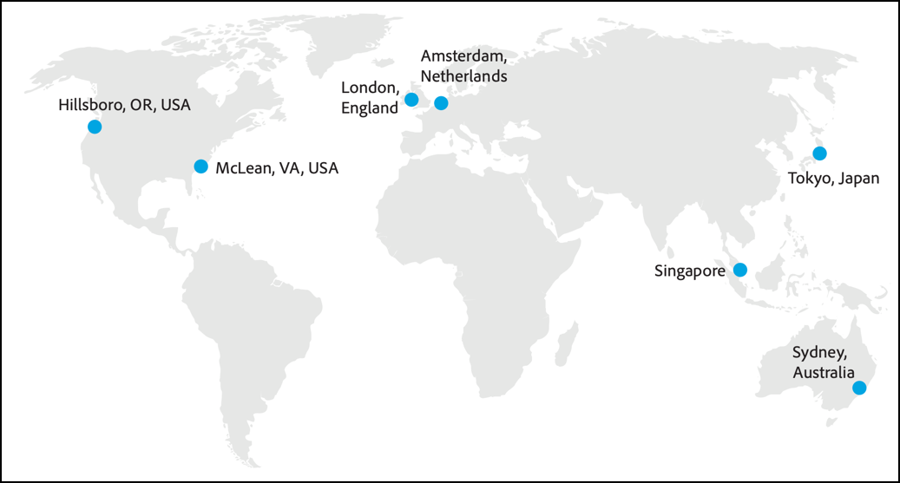

# Hoe Adobe Target werkt{#how-adobe-target-works}

Informatie over hoe Adobe Target werkt, inclusief informatie over de JavaScript-doelbibliotheken (at.js en mbox.js) en de verschillende activiteitstypen die in Target zijn opgenomen.

## JavaScript-doelbibliotheken {#libraries}

Adobe Target integreert met websites via een van de volgende twee JavaScript-bibliotheken: at.js of mbox.js

* **at.js:** De bibliotheek [at.js](../c-implementing-target/c-implementing-target-for-client-side-web/t-mbox-download/c-target-atjs-implementation/target-atjs-implementation.md#concept_8AC8D169E02944B1A547A0CAD97EAC17) is de nieuwe implementatiebibliotheek voor Doel. De bibliotheek at.js verbetert de laadtijden voor webimplementaties en biedt betere implementatieopties voor toepassingen van één pagina. at.js is de aanbevolen implementatiebibliotheek en wordt regelmatig bijgewerkt met nieuwe mogelijkheden. Wij adviseren dat alle klanten uitvoeren of aan de [recentste versie van at.js](../c-implementing-target/c-implementing-target-for-client-side-web/target-atjs-versions.md#reference_DBB5EDB79EC44E558F9E08D4774A0F7A)migreren.
* **mbox.js:** De bibliotheek mbox.js is de oudere uitvoeringsbibliotheek voor Doel. De bibliotheek mbox.js wordt nog steeds ondersteund, maar er zijn geen functie-updates.

>[!IMPORTANT]
>
>Alle klanten moeten naar om.js migreren. Zie [Migreren naar at.js vanuit mbox.js voor meer informatie](../c-implementing-target/c-implementing-target-for-client-side-web/t-mbox-download/c-target-atjs-implementation/target-migrate-atjs.md#task_DE55DCE9AC2F49728395665DE1B1E6EA)

U moet op elke pagina op uw site verwijzen naar het JavaScript-bibliotheekbestand Doel. U kunt het bijvoorbeeld toevoegen aan de algemene koptekst. U kunt ook [Adobe Launch-tagbeheer gebruiken](/help/c-implementing-target/c-implementing-target-for-client-side-web/how-to-deployatjs/cmp-implementing-target-using-adobe-launch.md)

Telkens wanneer een bezoeker een pagina aanvraagt die voor Doel is geoptimaliseerd, wordt een verzoek verzonden naar het doelsysteem om te bepalen welke inhoud aan een bezoeker moet dienen. Dit proces vindt in real time plaats — telkens wanneer een pagina wordt geladen, wordt een verzoek om de inhoud gemaakt en vervuld door het systeem. De inhoud wordt bepaald door de regels van door de markt gecontroleerde activiteiten en ervaringen en is gericht op de individuele bezoeker van de site. De inhoud wordt gediend dat elke bezoeker van de plaats zeer waarschijnlijk zal antwoorden aan, met, en uiteindelijk kopen, om reactiesnelheden, aanschaftarieven, en opbrengst te maximaliseren.

In Doel maakt elk element op de pagina deel uit van één ervaring voor de gehele pagina. Elke ervaring kan meerdere elementen op de pagina bevatten.

De inhoud die aan bezoekers wordt weergegeven, is afhankelijk van het type activiteit dat u maakt:

### A/B-test

Zie [Een A/B-test](../c-activities/t-test-ab/t-test-create-ab/test-create-ab.md#task_68C8079BF9FF4625A3BD6680D554BB72) maken voor meer informatie.

De inhoud die wordt weergegeven in een standaard A/B-test, wordt willekeurig gekozen uit de elementen die u toewijst aan de activiteit, volgens de percentages die u voor elke ervaring kiest. Als resultaat van deze willekeurige splitsing van verkeer, kan het veel eerste verkeer vóór de percentages uit nemen. Als u bijvoorbeeld twee ervaringen creëert, wordt de startervaring willekeurig gekozen. Als er weinig verkeer is, is het mogelijk dat het percentage bezoekers naar één ervaring kan worden scheefgetrokken. Naarmate het verkeer toeneemt, zouden de percentages gelijker moeten worden.

U kunt percentagedoelstellingen voor elke ervaring specificeren. In dit geval wordt een willekeurig getal gegenereerd en wordt dat nummer gebruikt om de ervaring te kiezen die moet worden weergegeven. De resulterende percentages zouden niet precies de gespecificeerde doelstellingen kunnen aanpassen, maar meer verkeer betekent dat de ervaringen dichter aan de doeldoelstellingen zouden moeten worden verdeeld.

1. Een klant vraagt om een pagina van uw server en het toont in browser.
2. In de browser van de klant wordt een cookie van de eerste partij ingesteld om het gedrag van de klant op te slaan.
3. De pagina roept het doelsysteem aan.
4. De inhoud wordt weergegeven op basis van de regels van uw activiteit.

### Automatisch toewijzen

Zie [Automatisch toewijzen](../c-activities/automated-traffic-allocation/automated-traffic-allocation.md#concept_A1407678796B4C569E94CBA8A9F7F5D4) voor meer informatie.

Met Automatisch toewijzen wordt een winnaar geïdentificeerd op basis van twee of meer ervaringen en wordt automatisch meer verkeer toegewezen aan de winnende ervaring, zodat de conversies toenemen terwijl de test nog steeds wordt uitgevoerd en opgedaan.

### Auto-Target (AT)

Zie [Auto-Target](../c-activities/auto-target-to-optimize.md#concept_67779E5B7F67427A97D7EA2A6FB919B3) voor meer informatie.

Auto-Target maakt gebruik van geavanceerd computerleren om uit meerdere, presterende, door de markator gedefinieerde ervaringen te kiezen en biedt elke bezoeker de meest op maat gemaakte ervaring op basis van zijn individuele klantprofiel en het gedrag van eerdere bezoekers met vergelijkbare profielen, zodat inhoud en stationsomzettingen kunnen worden aangepast.

### Automated Personalization (AP)

Zie [Automated Personalization](../c-activities/t-automated-personalization/automated-personalization.md#task_8AAF837796D74CF893CA2F88BA1491C9) voor meer informatie.

Automated Personalization (AP) combineert aanbiedingen of berichten en maakt gebruik van geavanceerd computergebruik om verschillende aanbiedingsvariaties voor elke bezoeker af te stemmen op basis van hun individuele klantprofiel, om de inhoud en het optillen van de drive aan te passen.

### Gericht op ervaring (XT)

[Gericht op ervaring](../c-activities/t-experience-target/experience-target.md#task_A53DF336CB9F4D7BB87EF2106099EFC4)

Experience Targeting (XT) levert inhoud aan een specifiek publiek die op een reeks van tellers-bepaalde regels en criteria wordt gebaseerd.

Gerichte ervaring, met inbegrip van geotargeting, is nuttig voor het bepalen van regels die een specifieke ervaring of een inhoud aan een bepaald publiek richten. Verschillende regels kunnen in een activiteit worden gedefinieerd om verschillende inhoudvariaties aan verschillende doelgroepen te bieden. Wanneer bezoekers uw site bekijken, evalueert Experience Targeting (XT) ze om te bepalen of ze voldoen aan de criteria die u instelt. Als ze aan de criteria voldoen, voeren ze de activiteit in en wordt de ervaring die is ontworpen voor gekwalificeerd publiek weergegeven. U kunt ervaringen maken voor meerdere soorten publiek binnen één activiteit.

### MVT (Multivariate Test)

Zie [Multivariate Test](../c-activities/c-multivariate-testing/multivariate-testing.md#concept_628695CDC71B449B8DCC2F5654C11499) voor meer informatie.

MVT (Multivariate Testing) vergelijkt combinaties van aanbiedingen in elementen op een pagina om te bepalen welke combinatie het beste voor een specifieke doelgroep presteert, en identificeert welk element de meeste invloed op het succes van de activiteit heeft.

### Recommendations

Zie [Recommendations](../c-recommendations/recommendations.md#concept_7556C8A4543942F2A77B13A29339C0C0) voor meer informatie.

Bij Recommendations-activiteiten worden automatisch producten of inhoud weergegeven die uw klanten interessant kunnen maken op basis van eerdere gebruikersactiviteiten of andere algoritmen. Recommendations helpt klanten om relevante objecten te sturen waarvan ze anders wellicht niet op de hoogte zijn.

## Het Edge-netwerk {#concept_0AE2ED8E9DE64288A8B30FCBF1040934}

&quot;Edge&quot; is een geografisch gedistribueerde serverarchitectuur die zorgt voor optimale responstijden voor eindgebruikers die inhoud aanvragen, ongeacht waar ze zich wereldwijd bevinden.

Om de responstijden te verbeteren, host Edge-omgevingen alleen de logica van de activiteit en het profiel in de cache en bieden ze informatie. De gegevensbestanden van de activiteit en van de inhoud, [!DNL Analytics] gegevens, APIs, en de gebruikersinterfaces van de tellergebruiker worden gehuisvest in de centrale gegevensmilieu&#39;s van Adobe. Updates worden vervolgens naar de Edge-knooppunten verzonden. De centrale omgevingen en Edge-knooppunten worden automatisch gesynchroniseerd om gegevens over activiteiten in de cache voortdurend bij te werken. 1:1 modellering wordt ook opgeslagen op elke rand, zodat die complexere verzoeken ook op de Rand kunnen worden verwerkt.

Elk Edge-knooppunt heeft alle informatie die nodig is om te reageren op de aanvraag van de inhoud van de gebruiker en houdt analysegegevens bij over die aanvraag. De verzoeken van de gebruiker worden verpletterd aan de dichtstbijzijnde knoop van de Rand.

De bron voor deze afbeelding is het white paper [Adobe Target Security Overview](https://www.adobe.com/content/dam/acom/en/security/pdfs/AdobeTargetSecurityOverview.pdf) .

De Adobe Target-oplossing wordt gehost op datacenters die eigendom zijn van Adobe en door Adobe worden gehuurd over de hele wereld. Admin-servers worden volledig gehost in datacenters die eigendom zijn van Adobe in Londen, Singapore en meerdere locaties in de VS, waaronder Oregon en Virginia. Edge-servers worden gehost op servers die eigendom zijn van Adobe en Adobe-leased in Amazon AWS-datacenters in Londen, Hongkong SAR of China, Singapore, Tokio en Sydney.

De plaatsen van de Server van Admin bevatten zowel een centrum van de gegevensinzameling als een centrum van de gegevensverwerking. De plaatsplaatsen van de rand bevatten slechts een centrum van de gegevensinzameling. Elke rapportsuite wordt toegewezen aan een specifiek gegevensverwerkingscentrum.

In plaats van op alle gerichte verzoeken van één enkele plaats te antwoorden, worden de verzoeken verwerkt door het milieu van de Rand dichtst bij de bezoeker, zo verzachtend de gevolgen van netwerk/Internet reistijd.

>[!IMPORTANT]
>
>[!DNL Adobe Target] heeft momenteel geen Edge-netwerk in China en de prestaties van de eindgebruiker blijven beperkt voor [!DNL Target] klanten in China. Wegens de firewall en het gebrek aan knopen van de Rand binnen het land, zullen de ervaringen van plaatsen met [!DNL Target] opgesteld langzaam teruggeven zijn en paginaladingen zullen worden beïnvloed. Ook, zouden de marketers latentie kunnen ervaren wanneer het gebruiken van [!DNL Target] auteursUI.

U kunt indien gewenst opmerkingen over de doelrand lijsten van gewenste personen. Zie [lijst van gewenste personen Target edge nodes](/help/c-implementing-target/c-considerations-before-you-implement-target/allowlist-edges.md)voor meer informatie.

## Ervaring met beveiligde gebruikers {#concept_40A5E781D90A41E4955F80EA9E5F8F96}

Adobe zorgt ervoor dat de beschikbaarheid en prestaties van de doelinfrastructuur zo betrouwbaar mogelijk zijn. Een communicatieafbraak tussen de browser van de eindgebruiker en de servers van de Adobe kan echter een onderbreking in de levering van de inhoud veroorzaken.

Om tegen de dienstonderbrekingen en connectiviteitskwesties te beschermen, zijn alle plaatsen opstelling om standaardinhoud (die door de cliënt wordt bepaald) te omvatten, die wordt getoond als browser van de gebruiker niet met kan verbinden [!DNL Target].

Er worden geen wijzigingen aangebracht in de pagina als de browser van de gebruiker geen verbinding kan maken binnen een gedefinieerde time-outperiode (standaard: 15 seconden). Als deze time-outdrempel is bereikt, wordt standaardlocatie-inhoud weergegeven.

Adobe beschermt de gebruikerservaring door de prestaties te optimaliseren en te beveiligen.

* Adobe zorgt voor prestatiebenchmarks op basis van industriestandaarden, die worden gegarandeerd door de Adobe Service Level Agreement.
* Het Edge-netwerk zorgt voor tijdige gegevenslevering.
* Adobe gebruikt een multi-tiered benadering om zijn toepassingen te beveiligen om het hoogste niveau van beschikbaarheid en betrouwbaarheid voor klanten te verstrekken.
* [!DNL Target] Consulting biedt implementatieondersteuning en doorlopende productondersteuning.

## SEO (Search Engine Optimization, optimalisatie van zoekprogramma&#39;s) - vriendelijk testen {#concept_C0C865663CAB4251B66A1F250FD25E6A}

[!DNL Adobe Target] wordt uitgelijnd op de richtlijnen voor zoekprogramma&#39;s voor testen.

Google moedigt gebruikerstests aan en heeft in zijn documentatie verklaard dat A/B en multivariate tests geen nadelige invloed zullen hebben op de classificatie van organische zoekmachines zolang een aantal eenvoudige richtlijnen worden gevolgd.

Zie de volgende Google-bronnen voor meer informatie:

* [Testen van websites en Google Search](https://webmasters.googleblog.com/2012/08/website-testing-google-search.html)
* [Experimenten en kleding](https://support.google.com/analytics/answer/2576845?hl=en&amp;ref_topic=1745207)

Richtlijnen werden gepresenteerd in een [Google Webmaster Central Blog](https://webmasters.googleblog.com/2012/08/website-testing-google-search.html) -bericht. Hoewel de post dateert van 2012, blijft de meest recente verklaring van Google over deze kwestie en blijven de richtsnoeren relevant.

* **Geen camouflage** - camouflage geeft uw gebruikers één set inhoud en een andere set inhoud weer om te zoeken in machinepunten door deze specifiek te identificeren en ze bewust verschillende inhoud te geven.

   Het doel, als platform, is gevormd om onderzoeksmotor bots te behandelen het zelfde als om het even welke gebruiker. Dit houdt in dat de beren kunnen worden opgenomen in tests die u uitvoert, als ze willekeurig worden geselecteerd en de testvariaties &quot;zien&quot;.

* **Gebruik rel=&quot;canonical&quot;** - Soms moet een A/B-test worden ingesteld met verschillende URL&#39;s voor de variaties. In deze gevallen moeten alle variaties een `rel="canonical"` tag bevatten die verwijst naar de oorspronkelijke (controle)URL. Als Adobe bijvoorbeeld de startpagina test met verschillende URL&#39;s voor elke variatie, wordt de volgende canonieke tag voor de startpagina in de `<head>` tag voor elk van de variaties geplaatst:

   `<link rel="canonical" href="https://www.adobe.com" />`

* **Gebruik 302 (tijdelijk) omleidingen** - In de gevallen waarin afzonderlijke URL&#39;s worden gebruikt voor de variatiepagina&#39;s in een test, raadt Google aan om 302 omleidingen te gebruiken om het verkeer naar de testvariaties te leiden. Dit vertelt de zoekmachines dat de omleiding tijdelijk is en alleen actief zal zijn zolang de test loopt.

   Een omleiding van 302 is een omleiding aan de serverzijde, en het Doel, samen met de meeste optimalisatieproviders, gebruikt cliënt-zijmogelijkheden. Daarom is dit een gebied waarop Target niet volledig voldoet aan de aanbevelingen van Google. Dit is echter slechts van invloed op een klein deel van de tests. De standaardbenadering voor het runnen van tests door Doel roept om inhoud binnen één enkele URL te veranderen, zodat zijn geen omleidingen noodzakelijk. Er zijn gevallen waarin clients meerdere URL&#39;s moeten gebruiken om hun testvariaties weer te geven. In deze gevallen gebruikt Target de JavaScript- `window.location` opdracht om gebruikers de opdracht te geven variaties te testen. Dit geeft niet expliciet aan of omleiding een 301- of 302-waarde is.

   Hoewel we blijven zoeken naar haalbare oplossingen die volledig in overeenstemming zijn met de richtlijnen voor zoekprogramma&#39;s, zijn we ervan overtuigd dat een correcte implementatie van de bovenstaande canonieke tags het risico dat aan deze aanpak is verbonden, beperkt.

* **Pas als dat nodig** is experimenten uit - wij zijn van mening dat &quot;zo lang als nodig&quot; is om statistische significantie te bereiken. Doel [biedt tips en trucs](https://docs.adobe.com/content/target-microsite/testcalculator.html) om te bepalen wanneer de test dit punt heeft bereikt. Wij adviseren dat u de hard-gecodeerde implementatie van het winnen van tests in uw testwerkschema opneemt en de aangewezen middelen toewijst.

   Het gebruik van het doelplatform voor het &quot;publiceren&quot; van winnende tests wordt niet aanbevolen als een permanente oplossing, maar zolang de winnende test voor 100% van de gebruikers 100% van de tijd wordt gepubliceerd, kan deze aanpak worden gebruikt terwijl het proces van het hardcoderen van de winnende test wordt voltooid.

   Het is belangrijk om te overwegen wat uw test ook is veranderd. Als u de kleur van knoppen of andere kleine, niet-tekstuele items op de pagina bijwerkt, heeft dit geen invloed op de organische waarderingen. Wijzigingen in tekst moeten echter wel worden gecodeerd.

   Het is ook belangrijk om de toegankelijkheid van de pagina te overwegen u test. Als de pagina niet toegankelijk is voor zoekprogramma&#39;s en nooit is ontworpen om in de eerste plaats een plaats te krijgen in de zoekfunctie, zoals een speciale bestemmingspagina voor een e-mailcampagne, zijn geen van de bovenstaande overwegingen van toepassing.

Google stelt dat het volgen van deze richtlijnen &quot;ertoe zou moeten leiden dat uw tests weinig of geen invloed hebben op uw site in zoekresultaten.&quot;

Naast deze richtlijnen geeft Google in de documentatie bij het programma Content Experiments ook een extra richtlijn:

* &quot;Uw variatiepagina&#39;s moeten de geest van de inhoud op de oorspronkelijke pagina&#39;s behouden. Deze variaties mogen de betekenis van of de algemene perceptie van de gebruiker van die originele inhoud niet veranderen.&quot;

Google geeft als voorbeeld dat &quot;als de originele pagina van een site wordt geladen met trefwoorden die geen betrekking hebben op de combinaties die worden weergegeven aan gebruikers, we die site mogelijk uit onze index kunnen verwijderen.&quot;

Wij denken dat het moeilijk zou zijn om de betekenis van de originele inhoud onbedoeld te veranderen binnen testvariaties, maar wij adviseren ons bewust te zijn van de sleutelwoordthema&#39;s op een pagina en die thema&#39;s te handhaven. Wijzigingen in de pagina-inhoud, met name het toevoegen of verwijderen van relevante trefwoorden, kunnen ertoe leiden dat wijzigingen in de positie van de URL in de organische zoekopdracht worden gewijzigd. Wij adviseren dat u met uw partner SEO als deel van uw het testen protocol in dienst neemt.

## Bots {#bots}

Adobe Target gebruikt [DeviceAtlas](https://deviceatlas.com/) om bekende bots te detecteren. Verkeer dat wordt geïdentificeerd als gegenereerd door een bot wordt nog steeds aangeboden als inhoud, net als een gewone gebruiker, om ervoor te zorgen dat dit in overeenstemming is met SEO-richtlijnen. Door beide verkeer te gebruiken, kunnen A/B-tests of verpersoonlijkingsalgoritmen scheeftrekken als ze worden behandeld als normale gebruikers. Daarom als een bekende bot in uw activiteit van het Doel wordt ontdekt, wordt het verkeer lichtjes verschillend behandeld. Het verwijderen van beide verkeer zorgt voor een nauwkeurigere meting van de gebruikersactiviteit.

Specifiek, voor bekende bot verkeer richt niet:

* Een bezoekersprofiel maken of ophalen
* Profielkenmerken vastleggen of profielscripts uitvoeren
* Adobe Audience Manager-segmenten (AAM) opzoeken (indien van toepassing)
* Gebruik zowel het verkeer in modellering en het dienen van gepersonaliseerde inhoud voor Recommendations, AutoDoel, Automated Personalization, of AutoToewijzing activiteiten
* Een activiteitenbezoek aanmelden voor rapportage
* Loggegevens die naar het Adobe Experience Cloud-platform moeten worden verzonden
