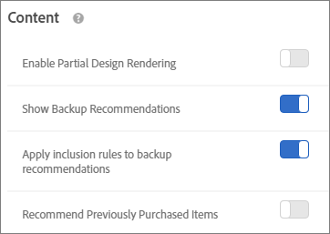

#  : criteria maken{#create-criteria}

Criteria bepalen de inhoud van uw [!UICONTROL Recommendations] activiteiten. Maak criteria om de aanbevelingen weer te geven die het meest geschikt zijn voor uw activiteit.

## Nieuwe criteria maken

In de volgende secties wordt uitgelegd hoe u nieuwe criteria kunt maken.

### Het scherm Nieuwe criteria maken openen

Er zijn meerdere manieren om het [!UICONTROL Create New Criteria] scherm te bereiken. Sommige schermopties variëren afhankelijk van de manier waarop u het scherm bereikt.

* Klik in het scherm **[!UICONTROL Recommendations]** > **[!UICONTROL Criteria]** Bibliotheek op **[!UICONTROL Create Criteria]** > **[!UICONTROL Create Criteria]**. De criteria die u hier maakt, worden automatisch beschikbaar gesteld voor alle [!DNL Recommendations] activiteiten.
* Wanneer u een [!DNL Recommendations] activiteit creeert, klik **[!UICONTROL Create Criteria]** op het [!UICONTROL Select Criteria] scherm. U kunt de nieuwe criteria opslaan voor gebruik met andere [!DNL Recommendations] activiteiten.
* Als u een [!DNL Recommendations] activiteit bewerkt, klikt u in een [!UICONTROL Recommendations Location] vak op de pagina en selecteert u **[!UICONTROL Change Criteria]**. Klik op het [!UICONTROL Select Criteria] scherm **[!UICONTROL Create Criteria]**. U kunt de nieuwe criteria opslaan voor gebruik met andere [!DNL Recommendations] activiteiten.

In de volgende stappen wordt ervan uitgegaan dat u het [!UICONTROL Create New Criteria] scherm opent met de eerste methode: het scherm **[!UICONTROL Recommendations]** > **[!UICONTROL Criteria]** Bibliotheek.

1. Klik op **[!UICONTROL Recommendations]** > **[!UICONTROL Criteria]**.

1. Klik op **[!UICONTROL Create Criteria]** > **[!UICONTROL Create Criteria]**.

   

### De sectie Basisinformatie invullen

1. Typ een **[!UICONTROL Criteria Name]**.

   Dit is de &quot;interne&quot;naam die wordt gebruikt om de criteria te beschrijven. U kunt bijvoorbeeld uw criteria &quot;Hoogste margeproducten&quot; noemen, maar u wilt niet dat die titel openbaar wordt weergegeven. Zie de volgende stap om de naar buiten gerichte titel in te stellen.

   

1. Typ een openbare verwijzing die op de pagina wordt weergegeven voor alle aanbevelingen die gebruikmaken van deze criteria. **[!UICONTROL Display Title]**

   U kunt bijvoorbeeld &quot;Personen die dit hebben bekeken, hebben dit weergegeven&quot; of &quot;Gelijksoortige producten&quot; weergeven wanneer u deze criteria gebruikt om aanbevelingen weer te geven.

1. Typ een korte **[!UICONTROL Description]** van de criteria.

   Aan de hand van deze beschrijving kunt u de criteria vaststellen en informatie over het doel van de criteria toevoegen.

1. Selecteer een **[!UICONTROL Industry Vertical]**:

   * [!UICONTROL Retail/Ecommerce]
   * [!UICONTROL Lead Generation/B2B/Financial Services]
   * [!UICONTROL Media/Publishing]

   Andere criteria worden gewijzigd op basis van de verticale industriestandaard die u selecteert.

1. Selecteer een **[!UICONTROL Page Type]**.

   U kunt meerdere paginatypen selecteren.

   Samen, worden de industrie verticale en paginatypes gebruikt om uw bewaarde criteria te categoriseren, die het gemakkelijker maken om criteria voor andere [!DNL Recommendations] activiteiten opnieuw te gebruiken.

1. Selecteer een **[!UICONTROL Recommendation Key]**.

   Voor meer informatie over het baseren van criteria op een sleutel, zie de aanbeveling [baseren op een aanbeveling sleutel](../../c-recommendations/c-algorithms/create-new-algorithm.md#task_2B0ED54AFBF64C56916B6E1F4DC0DC3B).

1. Selecteer de **[!UICONTROL Recommendation Logic]**.

   Zie [Criteria](../../c-recommendations/c-algorithms/algorithms.md#concept_4BD01DC437F543C0A13621C93A302750)voor meer informatie over de opties van de aanbevolen logica.

   >[!NOTE]
   >
   >Als u **[!UICONTROL Items]**/ **[!UICONTROL Media with Similar Attributes]** selecteert, kunt u regels [voor gelijkenis van de](../../c-recommendations/c-algorithms/create-new-algorithm.md#concept_5402DAFA279C4E46A9A449526889A0CB)inhoud instellen.

### Opties voor gegevensbronnen opgeven

1. Plaats **[!UICONTROL Data Range]** om de tijdwaaier van beschikbare historische gegevens van het gebruikersgedrag te bepalen wanneer het bepalen van welke te tonen aanbevelingen.

   

   Als uw site veel verkeer heeft en het gedrag vaak verandert, kiest u een korter gegevensvenster. Een korter venster laat toe om ontvankelijker aan veranderingen in de markt en in uw zaken [!DNL Recommendations] te zijn. Een korter venster betekent bijvoorbeeld dat wijzigingen in het gedrag van de bezoeker [!DNL Recommendations] zullen worden gedetecteerd wanneer uw bezoekers seizoensgebonden winkelen beginnen, zoals &#39;back-to-school&#39;-winkelen of &#39;Kerstmis&#39;, en dat ze artikelen zullen aanbevelen die geschikt zijn voor die winkelseizoenen.

   Als u niet veel gegevens hebt of als het gedrag van de bezoeker niet vaak verandert, kunt u een langer venster selecteren. Nochtans, voor vele plaatsen, resulteert een korter venster in betere aanbevelingen.

   De beschikbare gegevensbereiken zijn:

   * Twee dagen
   * Eén week
   * Twee weken
   * Eén maand
   * Twee maanden

1. (Voorwaardelijk) Selecteer het gewenste **[!UICONTROL Behavioral Data Source]**: [!UICONTROL mboxes] of [!UICONTROL Analytics].

   

   Als u kiest, selecteert u [!UICONTROL Analytics]de gewenste rapportsuite.

   Zie [Adobe Analytics](#analytics) hieronder en [Adobe Analytics gebruiken met Target Recommendations](/help/c-recommendations/c-algorithms/use-adobe-analytics-with-recommendations.md)voor meer informatie.

### Inhoud-instellingen opgeven

Stel uw [!UICONTROL Content] regels in.

De regels van de inhoud bepalen wat gebeurt als het aantal geadviseerde punten uw ontwerp niet vult. Als uw ontwerp bijvoorbeeld ruimte voor vijf items bevat, maar uw criteria slechts drie items aanbevolen, kunt u de resterende ruimte leeg laten of back-upaanbevelingen gebruiken om de extra ruimte te vullen.

1. (Optioneel) Sleep de **[!UICONTROL Partial Design Rendering]** schakeloptie naar de positie &quot;aan&quot;.

   Er worden zoveel mogelijk sleuven ingevuld, maar in de ontwerpsjabloon kan lege ruimte voor de resterende sleuven zijn opgenomen.

1. (Optioneel) Sleep de **[!UICONTROL Show Backup Recommendations]** schakeloptie naar de positie &quot;aan&quot;.

   Vul eventueel resterende lege sleuven in het ontwerp met een willekeurige selectie van de meest bekeken producten van de hele site.

   Zie [Een back-upaanbeveling](/help/c-recommendations/c-algorithms/backup-recs.md)gebruiken voor meer informatie.

1. (Voorwaardelijk) Als u **[!UICONTROL Show Backup Recommendations]** in de vorige stap selecteerde, kunt u toelaten **[!UICONTROL Apply inclusion rules to backup recommendations]**.

   In de insluitingsregels wordt bepaald welke items in uw aanbevelingen worden opgenomen. Welke opties beschikbaar zijn, is afhankelijk van de verticale situatie in uw branche.

   Zie [Inclusieregels](../../c-recommendations/c-algorithms/create-new-algorithm.md#task_28DB20F968B1451481D8E51BAF947079)voor meer informatie.

1. (Optioneel) Sleep de **[!UICONTROL Recommend Previously Purchased Items]** schakeloptie naar de positie &quot;aan&quot;.

   Deze instelling is gebaseerd op de `productPurchasedId`sjabloon. Het is handig om objecten te verkopen die mensen doorgaans slechts eenmaal kopen, zoals kajaks. Als u objecten verkoopt die mensen weer kunnen kopen, zoals shampoo of andere persoonlijke objecten, moet u deze optie uitschakelen.

### Opnameregels opgeven

Zie [Dynamische en statische inclusieregels](/help/c-recommendations/c-algorithms/use-dynamic-and-static-inclusion-rules.md)gebruiken voor meer informatie.

### Kenmerkweging opgeven

U kunt meerdere regels toevoegen om het algoritme te verschuiven op basis van een belangrijke beschrijving of metagegevens over de inhoudscatalogus. U kunt bijvoorbeeld een hogere wegingsfactor toepassen op onverkochte objecten, zodat deze vaker in de aanbeveling voorkomen.

Zie [weging](../../c-recommendations/c-algorithms/create-new-algorithm.md#task_2AEDA0DB15B74770B76F6982B24C2E42)van kenmerken.

Klik wanneer u klaar bent op **[!UICONTROL Save]**.

Als u een nieuwe [!UICONTROL Recommendations] activiteit creeert of een bestaande uitgeeft, wordt de **[!UICONTROL Save criteria for later]** controledoos door gebrek geselecteerd. Als u de criteria niet wilt gebruiken in andere activiteiten, schakelt u het selectievakje uit voordat u het bestand opslaat.

### Adobe Analytics {#analytics}

Als de criteria als gedragsgegevensbron gebruiken, zodra gecreeerd, hangt de tijd voor criteria beschikbaarheid van af of de geselecteerde rapportreeks en het raadplegingsvenster voor een andere criteria is gebruikt. [!DNL Adobe Analytics]

* **Eenmalige installatie** van rapportsuite: De eerste keer dat een rapportsuite wordt gebruikt met een bepaald terugzoekvenster voor gegevensbereik, [!DNL Target Recommendations] kan het twee tot zeven dagen duren voordat de gedragsgegevens voor de geselecteerde rapportsuite volledig zijn gedownload van [!DNL Analytics]. Dit tijdframe is afhankelijk van de [!DNL Analytics] systeembelasting.
* **Nieuwe of bewerkte criteria met behulp van een reeds beschikbare rapportsuite**: Als bij het maken van nieuwe criteria of het bewerken van bestaande criteria de geselecteerde rapportsuite al is gebruikt met [!DNL Target Recommendations], met een gegevensbereik dat gelijk is aan of kleiner is dan het geselecteerde gegevensbereik, zijn de gegevens direct beschikbaar en is een eenmalige installatie niet vereist. In dit geval, of als de montages van een algoritme terwijl het wijzigen van de geselecteerde rapportreeks of gegevenswaaier worden uitgegeven, loopt het algoritme of herstelt binnen 12 uren.
* **Doorlopende algoritme wordt uitgevoerd**: Gegevensstromen van [!DNL Analytics] naar [!DNL Target Recommendations] dagelijks. Bijvoorbeeld, voor de [!UICONTROL Viewed Affinity] aanbeveling, wanneer een gebruiker een product bekijkt, wordt een product-mening het volgen vraag overgegaan in dicht [!DNL Analytics] bij real time. De [!DNL Analytics] gegevens worden [!DNL Target] vroeg de volgende dag geduwd en het algoritme in minder dan 12 uren in werking [!DNL Target] gesteld.

## De aanbeveling baseren op een aanbevelingen {#task_2B0ED54AFBF64C56916B6E1F4DC0DC3B}

Recommendations op basis van sleutels gebruikt de context van het bezoekersgedrag om relevante resultaten weer te geven.

Er zijn twee typen Recommendations:

* **Populariteit:** Hiermee geeft u items weer op basis van de opties Meest bekeken, Boven verkocht en Metrisch bovenaan. De sleutel is leeg voor populiteitscriteria.
* **Op sleutel gebaseerd:** Omvat de rest van de criteria. Recommendations biedt verschillende keuzemogelijkheden met betrekking tot het sleuteltype. De opties variëren van &quot;huidig punt&quot;tot &quot;profielparameters,&quot;die u toestaan om de sleutel van de waarden programmatically te plaatsen aan te bevelen. U kunt meerdere criteria op elkaar testen door de criteria op een andere toets te baseren.

Elk criterium wordt gedefinieerd in een eigen tabblad. Het verkeer wordt gelijkmatig verdeeld over uw verschillende criteria testen. Met andere woorden, als je twee criteria hebt, is het verkeer in gelijke mate verdeeld. Als u twee criteria en twee ontwerpen hebt, wordt het verkeer gelijkmatig verdeeld tussen de vier combinaties. U kunt ook een percentage bezoekers van de site opgeven die de standaardinhoud ter vergelijking zien. In dat geval ziet het opgegeven percentage bezoekers de standaardinhoud en worden de rest opgedeeld tussen uw criteria en ontwerpcombinaties.

1. Maak een nieuwe aanbeveling of selecteer een bestaande aanbeveling en klik **[!UICONTROL Edit]**.
1. Als u de aanbevolen toets wilt wijzigen, selecteert u de nieuwe toets in de [!UICONTROL Recommendation Key] vervolgkeuzelijst en klikt u op **[!UICONTROL Save]**.

   Omdat verschillende logica aan verschillende aanbevelingen sleutels in kaart brengt, lenen de verschillende aanbevelingen zich aan plaatsing op verschillende types van pagina&#39;s. Raadpleeg de volgende secties voor meer informatie over elke toets.

### Huidig item

De aanbeveling wordt bepaald door het item dat de bezoeker momenteel bekijkt.

Recommendations geeft andere objecten weer die bezoekers interesseren voor het opgegeven object.

Als deze optie is geselecteerd, moet de `entity.id` waarde als een parameter in het weergavevak worden doorgegeven.

**Logica (criteria)**

* [!UICONTROL Items with similar attributes]
* [!UICONTROL People Who Viewed This, Viewed That]
* [!UICONTROL People Who Viewed This, Bought That]
* [!UICONTROL People Who Bought This, Bought That]
* [!UICONTROL Site Affinity]

**Waar op uw site gebruiken**

Pagina&#39;s met één item, zoals productpagina&#39;s.

Niet gebruiken op pagina&#39;s met zoekresultaten die null zijn.

### Huidige rubriek

De aanbeveling wordt bepaald door de productcategorie die de bezoeker momenteel bekijkt.

Recommendations geeft objecten weer in de opgegeven productcategorie.

Als deze optie is geselecteerd, moet de `entity.categoryId` waarde als parameter worden doorgegeven aan het weergavevak.

**Logica (criteria)**

* Topverkopers
* Meest bekeken

**Waar op uw site gebruiken**

Pagina&#39;s van één categorie.

Niet gebruiken op pagina&#39;s met zoekresultaten die null zijn.

### Aangepast kenmerk {#custom}

De aanbeveling wordt bepaald door een punt dat in het profiel van een bezoeker, gebruikend één van beide gebruiker wordt opgeslagen.*x* of profiel.*x* -kenmerken.

Als deze optie is geselecteerd, moet de `entity.id` waarde aanwezig zijn in het profielkenmerk.

**Logica (criteria)**

* [!UICONTROL People Who Viewed This, Viewed That]
* [!UICONTROL People Who Viewed This, Bought That]
* [!UICONTROL People Who Bought This, Bought That]
* [!UICONTROL Overall behavior]
* [!UICONTROL Most Viewed]
* [!UICONTROL Top Sellers]

Als de sleutel een attribuut van het douaneprofiel is en het algoritmetype Meest bekeken of Hoogste Verkopers is, een nieuwe drop-down lijst die &quot;Groep door Unieke Waarde van&quot;toont die een lijst van bekende entiteitattributen (behalve identiteitskaart, categorie, marge, waarde, inventaris, en milieu) heeft. Dit veld is verplicht.

**Waar op uw site gebruiken**

Kan op elke pagina worden gebruikt.

**Een toets voor aangepaste aanbevelingen gebruiken**

U kunt aanbevelingen op de waarde van een attribuut van het douaneprofiel baseren. Stel dat u aanbevolen films wilt weergeven op basis van de film die een bezoeker het laatst aan zijn of haar wachtrij heeft toegevoegd.

1. Selecteer het kenmerk Aangepast profiel in de **[!UICONTROL Recommendation Key]** vervolgkeuzelijst (bijvoorbeeld Laatste weergave Toegevoegd aan lijst met gecontroleerde items).
1. Selecteer vervolgens uw **[!UICONTROL Recommendation Logic]** (bijvoorbeeld &quot;Personen die dit hebben bekeken, hebben dat weergegeven&quot;).

   

Als uw attribuut van het douaneprofiel niet direct met één enkele entiteitidentiteitskaart aanpast, is het noodzakelijk om aan te verklaren [!DNL Recommendations] hoe u de gelijke aan een entiteit wilt voorkomen. Stel dat u bijvoorbeeld de meest verkochte objecten van het favoriete merk van een bezoeker wilt weergeven.

1. Selecteer het aangepaste profielkenmerk in de **[!UICONTROL Recommendation Key]** vervolgkeuzelijst (bijvoorbeeld Favoriete merk).

1. Selecteer vervolgens de **[!UICONTROL Recommendation Logic]** code die u met deze sleutel wilt gebruiken (bijvoorbeeld Topverkopers).

   De [!UICONTROL Group By Unique Value Of] optie wordt weergegeven.

1. Selecteer het entiteitskenmerk dat overeenkomt met de gekozen sleutel. In dit geval komt &quot;Favoriete merk&quot; overeen met `entity.brand`.

   [!DNL Recommendations] produceert nu een lijst met topverkopers voor elk merk en geeft de bezoeker de juiste lijst met topverkopers weer op basis van de waarde die is opgeslagen in het kenmerk Favoriete merk van de bezoeker.

   

### Laatst gekocht object

De aanbeveling wordt bepaald door het laatste item dat door elke unieke bezoeker is aangeschaft. Dit wordt automatisch vastgelegd, zodat er geen waarden op de pagina hoeven te worden doorgegeven.

**Logica (criteria)**

* [!UICONTROL Items with similar attributes]
* [!UICONTROL People Who Viewed This, Viewed That]
* [!UICONTROL People Who Viewed This, Bought That]
* [!UICONTROL People Who Bought This, Bought That]
* [!UICONTROL Site Affinity]

**Waar op uw site gebruiken**

Homepage, pagina Mijn account, offsite advertenties.

Niet gebruiken op productpagina&#39;s of pagina&#39;s die relevant zijn voor aankopen.

### Laatst weergegeven item

De aanbeveling wordt bepaald door het laatste item dat door elke unieke bezoeker is bekeken. Dit wordt automatisch vastgelegd, zodat er geen waarden op de pagina hoeven te worden doorgegeven.

**Logica (criteria)**

* [!UICONTROL Items with similar attributes]
* [!UICONTROL People Who Viewed This, Viewed That]
* [!UICONTROL People Who Viewed This, Bought That]
* [!UICONTROL People Who Bought This, Bought That]
* [!UICONTROL Site Affinity]

**Waar op uw site gebruiken**

Homepage, pagina Mijn account, offsite advertenties.

Niet gebruiken op productpagina&#39;s of pagina&#39;s die relevant zijn voor aankopen.

### Meest bekeken item

De aanbeveling wordt bepaald door het punt dat het vaakst is bekeken, gebruikend de zelfde methode die voor favoriete categorie wordt gebruikt.

Dit wordt bepaald aan de hand van de recenentie-/frequentiecriteria die als volgt werken:

* 10 punten voor de eerste productweergave
* 5 punten voor elke volgende weergave
* Aan het einde van de sessie worden alle waarden door 2 gedeeld

Als u bijvoorbeeld surfboardA en surfboardB in één sessie weergeeft, resulteert dit in A: 10, B: 5. Wanneer de sessie wordt beëindigd, hebt u een A: 5, B: 2.5 Als u dezelfde items in de volgende sessie bekijkt, veranderen de waarden in A: 15 B: 7.5

**Logica (criteria)**

* [!UICONTROL Items with similar attributes]
* [!UICONTROL People Who Viewed This, Viewed That]
* [!UICONTROL People Who Viewed This, Bought That]
* [!UICONTROL People Who Bought This, Bought That]
* [!UICONTROL Site Affinity]

**Waar op uw site gebruiken**

Algemene pagina&#39;s, zoals startpagina&#39;s of bestemmingspagina&#39;s en offsite advertenties.

### Favoriete rubriek

De aanbeveling wordt bepaald door de categorie die de meeste activiteit heeft ontvangen, gebruikend de zelfde methode die voor &quot;het meest bekeken punt&quot;wordt gebruikt behalve dat de categorieën in plaats van producten worden gescoord.

Dit wordt bepaald aan de hand van de recenentie-/frequentiecriteria die als volgt werken:

* 10 punten voor de weergave van de eerste categorie
* 5 punten voor elke volgende weergave

De categorieën die voor het eerst worden bezocht, krijgen 10 punten. 5 punten voor latere bezoeken aan dezelfde categorie. Bij elk bezoek worden niet-huidige categorieën die eerder zijn bekeken, verlaagd met 1.

Als u bijvoorbeeld CategorieA en daarna CategorieB in één sessie weergeeft, resulteert dit in A: 9, B: 10 Als u dezelfde items in de volgende sessie bekijkt, veranderen de waarden in A: 20 B: 9.

**Logica (criteria)**

* [!UICONTROL Top Sellers]
* [!UICONTROL Most Viewed]

**Waar op uw site gebruiken**

Algemene pagina&#39;s, zoals startpagina&#39;s of bestemmingspagina&#39;s en offsite advertenties.

### Populariteit

De aanbeveling wordt bepaald door de populariteit van objecten op uw site. De populariteit omvat topverkopers en hoogste bekeken door mbox gegevens en, als u Adobe Analytics gebruikt, alle metriek beschikbaar in het productrapport. De items worden gerangschikt op basis van de door u geselecteerde logica voor aanbevelingen.

**Logica (criteria)**

* [!UICONTROL Top Sellers]
* [!UICONTROL Most Viewed]
* Metrische gegevens van productrapporten (als u Adobe Analytics gebruikt)

**Waar op uw site gebruiken**

Algemene pagina&#39;s, zoals startpagina&#39;s of bestemmingspagina&#39;s en offsite advertenties.

### Onlangs bekeken objecten {#recently-viewed}

Gebruikt de geschiedenis van de bezoeker (overspannende zittingen) om de laatste *x* punten voor te stellen de bezoeker heeft bekeken, die op het aantal groeven in het ontwerp worden gebaseerd.

De criteria voor onlangs bekeken items geven nu resultaten die specifiek zijn voor een bepaalde [omgeving](/help/administrating-target/hosts.md). Als twee sites tot verschillende omgevingen behoren en een bezoeker tussen de twee sites schakelt, worden op elke site alleen recent bekeken items van de desbetreffende site weergegeven. Als twee sites zich in dezelfde omgeving bevinden en een bezoeker schakelt tussen de twee sites, ziet de bezoeker dezelfde onlangs weergegeven items voor beide sites.

**Waar op uw site gebruiken**

Algemene pagina&#39;s, zoals startpagina&#39;s of bestemmingspagina&#39;s en offsite advertenties.

>[!NOTE]
>
>Onlangs bekeken items respecteren zowel de globale instellingen voor Uitsluiting als de geselecteerde instelling voor Verzameling voor de activiteit. Als een item is uitgesloten door een algemene uitsluiting of niet is opgenomen in de geselecteerde verzameling, wordt het item niet weergegeven. Daarom moet bij het gebruik van de criteria voor onlangs bekeken items doorgaans de instelling &quot;Alle verzamelingen&quot; worden gebruikt.

## Opnameregels {#task_28DB20F968B1451481D8E51BAF947079}

Met behulp van verschillende opties kunt u de items beperken die in uw aanbevelingen worden weergegeven. U kunt inclusieregels gebruiken terwijl het creëren van criteria of bevorderingen.

Opnameregels zijn facultatief; nochtans, geeft het plaatsen van deze details u meer controle over de punten die in uw aanbevelingen verschijnen. Elk detail dat u vormt vernauwt verder de vertoningscriteria.

U kunt er bijvoorbeeld voor kiezen alleen vrouwenschoenen weer te geven met een voorraad van meer dan 50 en een prijs tussen \$25 en \$45. U kunt ook elk kenmerk van elkaar voorzien, zodat de items die voor uw bedrijf belangrijker zijn, meestal worden weergegeven.

U kunt er ook voor kiezen om vacatures weer te geven voor bezoekers die uw site alleen vanuit bepaalde steden bezoeken en die de vereiste universitaire graden hebben.

De opties voor de inclusieregel variëren per verticale branche. Standaard worden inclusieregels toegepast op back-upaanbevelingen.

>[!NOTE]
>
>U moet opnemingsregels voorzichtig gebruiken. Ze zijn bijvoorbeeld handig als uw organisatie regels heeft die vereisen dat één merk niet wordt aanbevolen terwijl een ander merk wordt weergegeven. Er zijn echter alternatieve kosten voor deze functie. U kunt mogelijk een percentage aan lift verliezen door bepaalde items te beperken zodat ze niet kunnen worden weergegeven wanneer ze normaal gesproken aan de hand van de activiteitscriteria worden weergegeven.

De inclusieregels worden aangesloten bij EN. Aan alle regels moet worden voldaan om een punt in een aanbeveling te omvatten.

Voer de volgende stappen uit om een eenvoudige regel voor insluiting te maken, zoals eerder vermeld, om alleen vrouwenschoenen weer te geven met een voorraad van meer dan 50 en een prijs tussen 25 en 45 dollar:

1. Stel een prijsbereik in voor de producten die u wilt aanbevelen.
1. Stel het minimale voorraadbedrag in voor de producten die u wilt aanbevelen.
1. Vorm de aanbeveling om punten slechts te tonen wanneer zij aan bepaalde criteria voldoen.

   

   U kunt opgeven dat items alleen worden opgenomen wanneer een van de kenmerken in de lijst voldoet aan een of meer opgegeven voorwaarden of niet overeenkomt.

   De beschikbare beoordelaars zijn afhankelijk van de waarde die u kiest in de eerste vervolgkeuzelijst. U kunt meerdere items weergeven. Deze items worden geëvalueerd met OR.

   De veelvoudige regels worden gecombineerd met EN.

   >[!NOTE]
   >
   >Met deze optie beperkt u de items die in de aanbeveling worden weergegeven. Het heeft geen invloed op de pagina&#39;s waarop de aanbeveling wordt weergegeven. Als u wilt beperken waar de aanbeveling wordt weergegeven, selecteert u de pagina&#39;s in de ervaringscomposer.

## Kenmerkweging {#task_2AEDA0DB15B74770B76F6982B24C2E42}

Gebruik kenmerkweging om het algoritme te verschuiven, zodat bepaalde items eerder worden weergegeven. Marketers kunnen het algoritme beïnvloeden op basis van een belangrijke beschrijving of metagegevens over de inhoudscatalogus.

Pas een hogere weging toe op deze onverkochte artikelen, zodat deze vaker in de aanbeveling worden weergegeven. Niet-verkochte objecten worden niet volledig uitgesloten, maar ze verschijnen minder vaak. Meerdere gewogen kenmerken kunnen op hetzelfde algoritme worden toegepast en de gewogen kenmerken kunnen in de aanbeveling op gesplitst verkeer worden getest.

1. Kies een waarde.

   De waarde bepaalt het type item dat vaker wordt weergegeven, op basis van een van de verschillende beschikbare criteria.

1. Kies een evaluator.
1. Typ het trefwoord om de regelkenmerken te voltooien.

   De volledige regel kan bijvoorbeeld &#39;Categorie bevat schoenen&#39; zijn.

   

1. Selecteer de dikte die u aan de regel wilt toewijzen.

   De opties variëren van 0 tot 100 in stappen van 25.

1. Voeg desgewenst aanvullende regels toe.

## Inhoudsinstellingen {#concept_BC16005C7A1E4F1A87E33D16221F4A96}

De [!UICONTROL Content] instellingen bepalen hoe aanbevelingen in uw ontwerp worden weergegeven.

Het is mogelijk dat [!UICONTROL Recommendations] criteria minder aanbevelingen teruggeven dan uw ontwerp vraagt. Uw ontwerp kan bijvoorbeeld vijf beschikbare &quot;slots&quot; hebben, maar de criteria geven slechts drie aanbevolen items. De [!UICONTROL Content] montages controleren hoe de aanbevelingen worden voorgesteld wanneer dit gebeurt.

De regels van de inhoud bepalen wat gebeurt als het aantal geadviseerde punten uw ontwerp niet vult. Als uw ontwerp bijvoorbeeld ruimte voor vijf items bevat, maar uw criteria slechts drie items aanbevolen, kunt u de resterende ruimte leeg laten of back-upaanbevelingen gebruiken om de extra ruimte te vullen.

Selecteer de juiste schakelopties:

* [!UICONTROL Enable Partial Design Rendering]
* [!UICONTROL Show Backup Recommendations]
* [!UICONTROL Apply Inclusion Rules to Backup Recommendations]
* [!UICONTROL Recommend Previously Purchased Items]

   Deze instelling is gebaseerd op de `productPurchasedId` profielwaarde. Standaard wordt eerder aangeschafte items niet aanbevolen. In de meeste gevallen wilt u geen objecten promoten die een klant onlangs heeft aangeschaft. Als klanten doorgaans bepaalde artikelen herhaaldelijk kopen, kunt u met deze functie eerder aangeschafte artikelen blijven aangeraden.

Als u toelaat **[!UICONTROL Show Backup Recommendations]**, wordt de optie om uw [inclusieregels](../../c-recommendations/c-algorithms/create-new-algorithm.md#task_28DB20F968B1451481D8E51BAF947079) op reserveaanbevelingen toe te passen toegelaten door gebrek.

| Gedeeltelijke rendering van ontwerp | Backup Recommendations | Resultaat |
|--- |--- |--- |
| Uitgeschakeld | Uitgeschakeld | Als er minder aanbevelingen worden geretourneerd dan door het ontwerp wordt gevraagd, wordt het ontwerp van de aanbevelingen vervangen door de standaardinhoud en worden er geen aanbevelingen weergegeven. |
| Ingeschakeld | Uitgeschakeld | Het ontwerp wordt teruggegeven, maar kan lege ruimte omvatten als minder aanbevelingen zijn teruggekeerd dan het ontwerp verzoekt. |
| Ingeschakeld | Ingeschakeld | Back-upaanbevelingen vullen de beschikbare &quot;sleuven&quot; van het ontwerp volledig in. Als het toepassen van inclusieregels op reserveaanbevelingen het aantal kwalificerende reserveaanbevelingen tot het punt beperkt dat het ontwerp niet kan worden gevuld, wordt het ontwerp gedeeltelijk teruggegeven. Als de criteria geen aanbevelingen terugkeren, en de integratieregels reserveaanbevelingen tot nul beperken, wordt het ontwerp vervangen met standaardinhoud. |
| Uitgeschakeld | Ingeschakeld | Back-upaanbevelingen vullen de beschikbare &quot;sleuven&quot; van het ontwerp volledig in. Als het toepassen van inclusieregels op reserveaanbevelingen het aantal kwalificerende reserveaanbevelingen tot het punt beperkt dat het ontwerp niet kan worden gevuld, wordt het ontwerp vervangen door standaardinhoud en geen aanbevelingen worden getoond. |

## Vergelijkbare inhoud {#concept_5402DAFA279C4E46A9A449526889A0CB}

Gebruik [!UICONTROL Content Similarity] regels om aanbevelingen te doen op basis van item- of mediakenmerken.

De gelijkenis van de inhoud vergelijkt de sleutelwoorden van puntattributen en doet aanbevelingen die op hoeveel sleutelwoorden verschillende punten in gemeenschappelijk hebben worden gebaseerd. Recommendations op basis van gelijkenis met inhoud vereist geen gegevens uit het verleden om sterke resultaten te bereiken.

Het gebruik van gelijkenis in de inhoud om aanbevelingen te genereren is vooral effectief voor nieuwe items. Deze worden waarschijnlijk niet weergegeven in aanbevelingen met *Personen die dit hebben bekeken, Bekeken dat* en andere logica die is gebaseerd op gedrag in het verleden. U kunt de gelijkenis van de inhoud ook gebruiken om nuttige aanbevelingen voor nieuwe bezoekers te produceren, die geen vroegere aankopen of andere historische gegevens hebben.

Wanneer u selecteert **[!UICONTROL Items]**/ **[!UICONTROL Media with Similar Attributes]**, hebt u de optie om regels tot stand te brengen om het belang van specifieke puntattributen in het bepalen van aanbevelingen te verhogen of te verminderen. Voor artikelen zoals boeken, zou u het belang van attributen zoals *genre*, *auteur*, *reeksen*, etc. kunnen willen verhogen, om gelijkaardige boeken aan te bevelen.

Omdat bij gelijkenis met inhoud trefwoorden worden gebruikt om items te vergelijken, kunnen sommige kenmerken, zoals *bericht* of *beschrijving*, &#39;ruis&#39; in de vergelijking introduceren. U kunt regels maken om deze kenmerken te negeren.

Standaard zijn alle kenmerken ingesteld op *Basislijn*. U hoeft geen regel te maken, tenzij u deze instelling wilt wijzigen.

>[!NOTE]
>
>Het algoritme voor de gelijkenis van de inhoud kan gebruikmaken van willekeurige sampling bij het berekenen van gelijkenis tussen items. Hierdoor kunnen de overeenkomsten tussen items per algoritme verschillen.

## Trainingsvideo: Criteria maken in Recommendations (12:33) - 

Deze video bevat de volgende informatie:

* Criteria maken
* Criteria-reeksen maken
* Aangepaste criteria uploaden

>[!VIDEO](https://video.tv.adobe.com/v/27694?quality=12)
