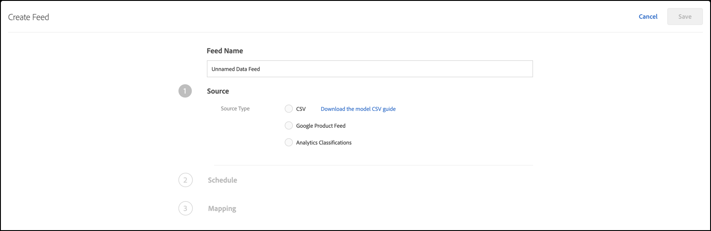
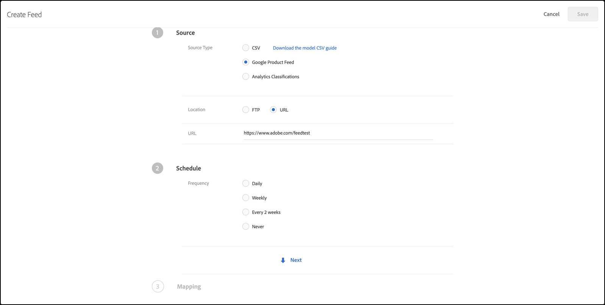
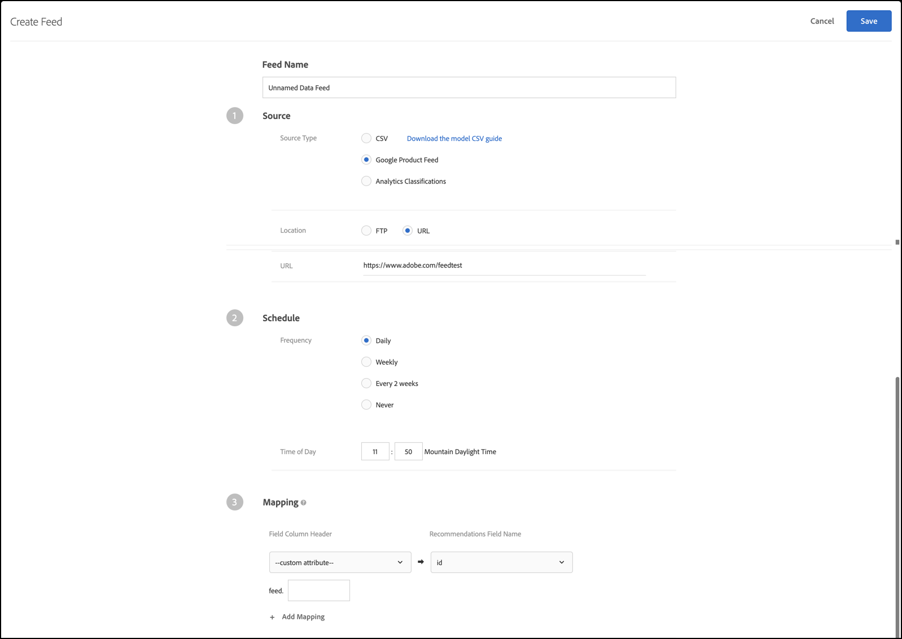

#  -feeds{#feeds}

Met feeds kunt u entiteiten importeren in [!DNL Recommendations]. Entiteiten kunnen worden verzonden met gebruik van CSV-bestanden, de Google Product Search-feed-indeling en Adobe Analytics-productclassificaties.

## Overzicht van feeds {#concept_D1E9C7347C5D4583AA69B02E79607890}

Met feeds kunt u [Entiteiten](/help/c-recommendations/c-products/products.md) doorgeven of de gegevens in uw box uitbreiden met gegevens die niet beschikbaar zijn op de pagina of die niet veilig zijn om rechtstreeks vanaf de pagina te verzenden, zoals marge, COGS enzovoort.

U kunt selecteren welke kolommen uit het bestand met [!DNL Target] productclassificaties of het bestand met Google-productzoekopdrachten u naar de [!DNL Recommendations] server wilt verzenden. Deze gegevens over elk punt kunnen dan in malplaatjevertoning en voor het controleren van aanbevelingen worden gebruikt.

Als gegevens worden verzameld door zowel een entiteitsvoer als een box, wint de meest recente gegevens. Meestal komen de meest recente gegevens uit een box, omdat deze vaker worden weergegeven. In het zeldzame geval dat de entiteit gegevens invoert en tegelijkertijd de gegevens van de doos raken, worden de mbox gegevens gebruikt.

De [!UICONTROL Feeds] lijst ( **[!UICONTROL Recommendations]** > **[!UICONTROL Feeds]**) bevat informatie over alle feeds die u hebt gemaakt.


De pagina feeds bevat de volgende kolommen:

* **Naam**: De naam van de feed die tijdens het maken is opgegeven. Als u de naam van een feed wilt bewerken, moet u de feed zelf bewerken. Wanneer u het bestand onder de nieuwe naam opslaat, wordt de feed vernieuwd.
* **Type**: Tot de typen [CSV](/help/c-recommendations/c-products/feeds.md#section_65CC1148C7DD448FB213FDF499D35FCA), [Google Product Feed](/help/c-recommendations/c-products/feeds.md#section_8EFA98B5BC064140B3F74534AA93AFFF)en [Analytics Classifications](/help/c-recommendations/c-products/feeds.md#section_79E430D2C75443BEBC9AA0916A337E0A)behoren.
* **Status**: De huidige [status](/help/c-recommendations/c-products/feeds.md#concept_E475986720D1400999868B3DFD14A7A0)van de feed.
* **Schema**: Geeft het updateschema voor de feed weer: Dagelijks, wekelijks, elke 2 weken of nooit.
* **Items**: Hiermee geeft u het aantal items in de feed weer.
* **Laatst bijgewerkt**: Geeft de datum en tijd weer waarop de feed voor het laatst is bijgewerkt en de naam van de persoon die de feed heeft bijgewerkt. Als het [!UICONTROL Last Updated] diervoeder &quot;ongedefinieerd&quot; zegt, komt het voer binnen van [!DNL Recommendations Classic] en kan het niet van binnenuit worden veranderd [!DNL Target Premium Recommendations].

>[!IMPORTANT]
>
>Geüploade entiteiten en entiteitskenmerken verlopen na 61 dagen. Dit betekent:
>
>* Uw feed moet ten minste maandelijks worden uitgevoerd om ervoor te zorgen dat de inhoud van de catalogus niet verloopt.
>* Als u een item uit het voederbestand verwijdert, wordt dat item niet uit de catalogus verwijderd. Als u het item uit de catalogus wilt verwijderen, verwijdert u het handmatig via de doelinterface of -API. Of wijzig de itemkenmerken (zoals voorraad) om ervoor te zorgen dat het item niet in aanmerking wordt genomen.


## CSV {#section_65CC1148C7DD448FB213FDF499D35FCA}

U kunt een `.csv` bestand maken met de CSV-uploadindeling van de Adobe. Het bestand bevat weergaveinformatie over de gereserveerde en aangepaste kenmerken voor uw producten. Als u kenmerken wilt uploaden die specifiek zijn voor uw implementatie, vervangt u `CustomN` in de koptekstrij de naam van het kenmerk dat u wilt gebruiken. In het onderstaande voorbeeld `entity.Custom1` is vervangen door: `entity.availability`. U kunt het bestand vervolgens bulksgewijs uploaden naar de [!DNL Recommendations] server.

Het gebruik van de .csv-indeling heeft de volgende voordelen ten opzichte van de Google Feed-indeling:

* Er zijn geen veldtoewijzingen voor nodig.
* Deze ondersteunt kenmerken met meerdere waarden (zie het onderstaande voorbeeld).
* Deze ondersteunt maximaal 100 aangepaste kenmerken. Als u meer dan 100 aangepaste kenmerken nodig hebt, kunt u een tweede feed-bestand maken met een andere set opgegeven aangepaste kenmerken.

Gebruik de methode voor het bulkuploaden om weergavegegevens te verzenden als u geen vakken op uw pagina hebt of als u uw weergavegegevens wilt aanvullen met items die niet op uw site beschikbaar zijn. Stel bijvoorbeeld dat u inventarisgegevens wilt verzenden die mogelijk niet op uw site worden gepubliceerd.

Alle gegevens die zijn geüpload met de indelingsfeed .csv, Google-productfeed of Analytics-product overschrijven de bestaande waarde van het entiteitskenmerk in onze database. Als u prijsinformatie via mbox-aanvragen verzendt en vervolgens andere prijswaarden in het bestand verzendt, overschrijven de waarden in het bestand de waarden die met de mbox-aanvraag zijn ingesteld. Een uitzondering hierop is het kenmerk `categoryId` Entiteit waarbij de categoriewaarden worden toegevoegd in plaats van te worden overschreven tot de limiet van 250 tekens.

>[!IMPORTANT]
>
>Plaats geen waarden tussen dubbele aanhalingstekens ( &quot; ) in het CSV-bestand, tenzij deze opzettelijk zijn. Als u waarden tussen dubbele aanhalingstekens plaatst, moet u deze weglaten door ze in een andere set dubbele aanhalingstekens in te sluiten. Dubbele aanhalingstekens die niet worden genegeerd, verhinderen dat de aanbevolen feed correct wordt geladen.

De volgende syntaxis is bijvoorbeeld onjuist:

```
"Apples "Bananas" Grapes"",
```

De volgende syntaxis is correct:

```
"Apples ""Bananas"" Grapes""",
```

>[!NOTE]
>
>U kunt een bestaande waarde niet overschrijven met een lege waarde. U moet een andere waarde in de plaats ervan doorgeven om deze te overschrijven. In het geval van de verkoopprijs is het een gemeenschappelijke oplossing om een &quot;NULL&quot;-bericht of een ander bericht door te geven. Vervolgens kunt u een sjabloonregel schrijven om items met die waarde uit te sluiten.

Het product is ongeveer twee uur na het uploaden van de entiteit beschikbaar in de beheerinterface.

Hier volgt een voorbeeldcode voor een CSV-bestand:

```
## RECSRecommendations Upload File 
## RECS''## RECS'' indicates a Recommendations pre-process header. Please do not remove these lines. 
## RECS 
## RECSUse this file to upload product display information to Recommendations. Each product has its own row. Each line must contain 19 values and if not all are filled a space should be left. 
## RECSThe last 100 columns (entity.custom1 - entity.custom100) are custom. The name 'customN' can be replaced with a custom name such as 'onSale' or 'brand'. 
## RECSIf the products already exist in Recommendations then changes uploaded here will override the data in Recommendations. Any new attributes entered here will be added to the product''s entry in Recommendations. 
## RECSentity.id,entity.name,entity.categoryId,entity.message,entity.thumbnailUrl,entity.value,entity.pageUrl,entity.inventory,entity.margin,entity.last_updated_by,entity.multi_english,entity.availability,entity.tax_country,entity.tax_region,entity.tax_rate,entity.product_type,entity.item_group_id,entity.color,entity.size,entity.brand,entity.gtin 
na3456,RipCurl Watch with Titanium Dial,Watches & Sport,Cutting edge titanium with round case,https://example.com/s7/na3456_Viewer,425,https://example.com/shop/en-us/na3456_RipCurl,24,0.25,csv,"[""New"",""Web"",""Sales"",""[1,2,34,5]""]",in stock,US,CA,9.25,Shop by Category > Watches,dz1,Titanium,44mm,RipCurl,"075380 01050 5" 
na3457,RipCurl Watch with Black Dial,Watches & Sport,Cutting edge matte black with round case,https://example.com/s7/na3457_Viewer,275,https://example.com/shop/en-us/na3457_RipCurl,24,0.27,csv,"[""New"",""Web"",""Sales"",""[1,2,34,5]""]",in stock,US,CA,9.25,Shop by Category > Watches,dz1,Black,44mm,RipCurl,"075340 01060 7"
```

## Google {#section_8EFA98B5BC064140B3F74534AA93AFFF}

Het de voedertype van het Onderzoek van het Product van Google gebruikt het formaat van Google. Dit is anders dan de CSV-uploadindeling van de Adobe-eigenaar.

Als u een bestaande Google-productfeed hebt, kunt u die gebruiken als uw importbestand.

>[!NOTE]
>
>Het is niet verplicht Google-gegevens te gebruiken. [!DNL Recommendations] gebruikt gewoon dezelfde indeling als Google. U kunt deze methode gebruiken om alle gegevens te uploaden die u hebt en de beschikbare planningsfuncties te gebruiken. U moet echter de vooraf gedefinieerde attribuutnamen van Google behouden wanneer u het bestand instelt.

De meeste detailhandelaren uploaden producten naar Google, dus als een bezoeker Google-productzoekactie gebruikt, worden hun producten weergegeven. [!DNL Recommendations] volgt de specificatie van Google exact voor entiteitsfeeds. Entiteitsfeeds kunnen worden verzonden naar [!DNL Recommendations] via [!DNL .xml], [!DNL .txt]of [!DNL .tsv], en kunnen de [kenmerken gebruiken die door Google](https://support.google.com/merchants/answer/188494?hl=en&amp;topic=2473824&amp;ctx=topic#US)zijn gedefinieerd. De resultaten kunnen worden doorzocht op de [Google-winkelpagina](https://www.google.com/prdhp)&#39;s.

>[!NOTE]
>
>De methode POST moet zijn toegestaan op de server die de inhoud van de Google-feed host.

Omdat [!DNL Recommendations] gebruikers al een product configureren [!DNL .xml] of [!DNL .txt] verzenden naar Google via URL of FTP, accepteert de eenheidfeeds de productgegevens en gebruiken deze om de catalogus met aanbevelingen te maken. Geef op waar die feed bestaat en de aanbevelingen-server de gegevens ophaalt.

Als u Google Product Search gebruikt voor het uploaden van de entiteitsvoer, moet u nog een productpaginamarbox op de pagina hebben als u daar aanbevelingen wilt tonen of productmeningen voor algoritmelevering willen volgen die op meningen wordt gebaseerd.

Google-feeds bieden geen ondersteuning voor meerdere waarden voor een aangepast kenmerk.

De feed wordt uitgevoerd op het moment dat u de feed opslaat en activeert. Het wordt uitgevoerd op het moment dat u de feed opslaat, dan elke dag en elk uur later.

Hier volgt een voorbeeldcode voor het XML-bestand met de zoekfunctie voor Google-producten:

```
<?xml version="1.0" encoding="UTF-8" standalone="yes"?> 
<feed xmlns="https://www.w3.org/2005/Atom" xmlns:ns2="https://base.google.com/ns/1.0" xmlns:ns3="https://base.google.com/cns/1.0"> 
    <title>Product Feed</title> 
    <link href="https://example.com"/> 
    <updated>2017-12-13T08:45:04.918-08:00</updated> 
    <author> 
        <name>Product Feed Author</name> 
    </author> 
    <id>https://example.com</id> 
    <entry> 
        <title>RipCurl Watch with Titanium Dial</title> 
        <description>Cutting edge Titanium with Round case</description> 
        <ns2:id>na3452</ns2:id> 
        <ns2:link>https://example.com/shop/en-us/na3452_RipCurl</ns2:link> 
        <ns2:availability>in stock</ns2:availability> 
        <ns2:condition>NEW</ns2:condition> 
        <ns2:google_product_category>Watches &amp; Sport</ns2:google_product_category> 
        <ns2:gtin>075380 01050 5</ns2:gtin> 
        <ns2:image_link>https://example.com/s7/na3452_Viewer</ns2:image_link> 
        <ns2:mobile_link>https://m.example.com/s7/na3452_Viewer</ns2:mobile_link> 
        <ns2:mpn>71050</ns2:mpn> 
        <ns2:price>425</ns2:price> 
        <ns2:product_review_average>5.0</ns2:product_review_average> 
        <ns2:product_review_count>30</ns2:product_review_count> 
        <ns2:product_type>Shop by Category > Watches </ns2:product_type> 
        <ns2:brand>RipCurl</ns2:brand> 
        <ns2:sale_price>375</ns2:sale_price> 
        <ns2:tax> 
          <ns2:country>US</ns2:country> 
          <ns2:region>CA</ns2:region> 
          <ns2:rate>9.25</ns2:rate> 
          <ns2:tax_ship>y</ns2:tax_ship> 
        </ns2:tax> 
        <ns2:is_bundle>N</ns2:is_bundle> 
    </entry> 
    <entry> 
        <title>RipCurl Watch with Black Dial</title> 
        <description>Cutting edge matte black with Round case</description> 
        <ns2:id>na3453</ns2:id> 
        <ns2:link>https://example.com/shop/en-us/na3453_RipCurl</ns2:link> 
        <ns2:availability>in stock</ns2:availability> 
        <ns2:condition>NEW</ns2:condition> 
        <ns2:google_product_category>Watches &amp; Sport</ns2:google_product_category> 
        <ns2:gtin>075380 013450 5</ns2:gtin> 
        <ns2:image_link>https://example.com/s7/na3453_Viewer</ns2:image_link> 
        <ns2:mobile_link>https://m.example.com/s7/na3453_Viewer</ns2:mobile_link> 
        <ns2:mpn>71050</ns2:mpn> 
        <ns2:price>275</ns2:price> 
        <ns2:product_review_average>4.8</ns2:product_review_average> 
        <ns2:product_review_count>23</ns2:product_review_count> 
        <ns2:product_type>Shop by Category > Watches </ns2:product_type> 
        <ns2:brand>RipCurl</ns2:brand> 
        <ns2:sale_price>249</ns2:sale_price> 
        <ns2:tax> 
          <ns2:country>US</ns2:country> 
          <ns2:region>CA</ns2:region> 
          <ns2:rate>9.25</ns2:rate> 
          <ns2:tax_ship>y</ns2:tax_ship> 
        </ns2:tax> 
        <ns2:is_bundle>N</ns2:is_bundle> 
    </entry> 
</feed> 
```

Hieronder volgt een voorbeeldcode voor een CSV-bestand met zoekopdrachten voor Google-producten:

```
id    title    description    link    price    condition    availability    image_link    tax    shipping_weight    shipping    google_product_category    product_type    item_group_id    color    size    gender    age_group    pattern    brand    gtin    mpn 
na3454    RipCurl Watch with Titanium Dial    Cutting edge titanium with round case    https://example.com/shop/en-us/na3454_RipCurl    425    new    in stock    https://example.com/s7/na3452_Viewer    US:CA:9.25:y    1.5 oz    US:::0.00 USD    Watches & Sport    Shop by Category > Watches    dz1    Black    44mm    male    adult    Solid    RipCurl    075380 01050 5    DZ1437 
na3455    RipCurl Watch with Black Dial    Cutting edge matte black with round case    https://example.com/shop/en-us/na3455_RipCurl    275    new    in stock    https://example.com/s7/na3452_Viewer    US:CA:9.25:y    1.5 oz    US:::0.00 USD    Watches & Sport    Shop by Category > Watches    dz1    Black    44mm    male    adult    Solid    RipCurl    075340 01060 7    DZ1446
```

## Productclassificaties van Analytics {#section_79E430D2C75443BEBC9AA0916A337E0A}

De classificatie van het Product Analytics is de enige classificatie die voor aanbevelingen beschikbaar is. Zie [Informatie over classificaties](https://docs.adobe.com/content/help/en/analytics/components/classifications/c-classifications.html) in de handleiding *Analytics Components* voor meer informatie over dit classificatiebestand. Mogelijk is niet alle informatie die u nodig hebt voor aanbevelingen beschikbaar in uw huidige implementatie. Volg deze gebruikershandleiding als u gegevens wilt toevoegen aan uw classificatiebestand.

>[!IMPORTANT]
>
>Houd er rekening mee dat dit niet de voorkeursmethode is voordat u gegevens van entiteiten in Recommendations importeert met productclassificaties van Analytics.
>
> Let op het volgende:
>* Updates van entiteitskenmerken hebben een extra vertraging van maximaal 24 uur.
>* Het doel ondersteunt alleen productclassificaties. Het product-SKU Analytics moet op hetzelfde niveau worden toegewezen als de Recommendations `entity.id`. Aangepaste analytische classificaties kunnen worden ontwikkeld met behulp van Adobe Consulting Services. Neem contact op met uw accountmanager voor vragen.


## Feed maken {#steps}

Maak een feed om informatie over uw producten of services in te voegen in [!DNL Recommendations].

1. Klik in de doelinterface op **[!UICONTROL Recommendations]** > **[!UICONTROL Feeds]** > **[!UICONTROL Create Feed]**.

   

1. Geef een beschrijvende naam op voor uw feed.
1. Selecteer een **[!UICONTROL Source Type]**.

   * CSV
   * Google Product Feed
   * Analytische classificaties

   Zie Overzicht [van](../../c-recommendations/c-products/feeds.md#concept_D1E9C7347C5D4583AA69B02E79607890)feeds voor informatie over de feed-typen CSV en Google Product Feed. U kunt ook een CSV-handleiding [voor het model](https://recspm2.experiencecloud.adobe.com/content/mac/default/target/files/EntityFileUploadTemplate.csv) downloaden om u te helpen de feed correct op te maken.

1. (Voorwaardelijk) Als u selecteerde **[!UICONTROL CSV]** of **[!UICONTROL Google Product Feed]**, specificeer de plaats waar de voer kan worden betreden.

   * **FTP**: Als u FTP hebt geselecteerd, geeft u de FTP-serverinformatie, de aanmeldingsgegevens, de bestandsnaam en de FTP-map op. U kunt FTP met SSL (FTPS) gebruiken voor veiliger uploads.

      Ondersteunde FTP-serverinstellingen:

      * FTP en FTPS moeten zijn ingesteld op het gebruik van Passieve FTP.
      * Voor FTPS configureert u de server zodanig dat deze expliciete FTPS-verbindingen accepteert.
      * SFTP wordt niet ondersteund.
      * U kunt handmatig een poort opgeven waarop de verbinding moet worden gestart (bijvoorbeeld `ftp://ftp.yoursite.com:2121`). Als u geen poort opgeeft, wordt de standaard-FTP- of FTPS-poort gebruikt.
   * **URL**: Als u URL selecteert, geeft u de URL op.


1. (Voorwaardelijk) als u selecteerde **[!UICONTROL Analytics Classifications]**, kies de rapportreeks van de drop-down lijst.

1. Klik op de **[!UICONTROL Next]** pijl om de [!UICONTROL Schedule] opties weer te geven.

   

1. Selecteer een updateoptie:

   * Dagelijks
   * Wekelijks
   * Elke 2 weken
   * Nooit: Plan geen update. Kies deze optie als u deze feed niet wilt uitvoeren.

1. Geef op hoe lang de feed moet worden uitgevoerd.

   Deze optie is gebaseerd op de tijdzone die in uw browser wordt gebruikt. Als u een tijd in een verschillende tijdzone wilt gebruiken, moet u die tijd volgens uw tijdzone berekenen.

1. Klik op de **[!UICONTROL Next]** pijl om de [!UICONTROL Mapping] opties weer te geven en geef vervolgens op hoe u de gegevens wilt toewijzen aan [!DNL Target] definities.

   

1. (Optioneel) Als u wilt dat de feed tot een omgeving (hostgroep) behoort, selecteert u de hostgroep.

   De feed behoort standaard tot alle hostgroepen. Dit zorgt ervoor dat de punten in dit voer in om het even welke milieu beschikbaar zijn. Zie [Gastheren](../../administrating-target/hosts.md#concept_516BB01EBFBD4449AB03940D31AEB66E)voor meer informatie.

1. Klik op **[!UICONTROL Save]**.

Nadat u een feed hebt gemaakt of bewerkt, wordt deze direct uitgevoerd en wordt de feed bijgewerkt volgens de parameters die u instelt. Het duurt enige tijd voordat alle informatie beschikbaar is. Eerst moet de feed gesynchroniseerd worden, vervolgens moet deze worden verwerkt en geïndexeerd voordat deze kan worden gepubliceerd en beschikbaar gesteld. De huidige status wordt weergegeven onder [Status](/help/c-recommendations/c-products/feeds.md#status) feed in de lijst met feeds. U kunt sluiten [!DNL Target] voordat het proces is voltooid en het proces wordt voortgezet.

Terwijl het indexeren lopend is, verschijnen de producten en de voederkopballen alvorens de individuele waarden zijn geïndexeerd. Dit laat u toe om producten te zoeken en te zien zodat kunt u inzamelingen, uitsluitingen, ontwerpen, en activiteiten tot stand brengen alvorens het indexeren is voltooid.

Wanneer in Status de tekst &#39;&#39;Voltooid&#39;&#39; wordt weergegeven, betekent dit dat het bestand is gevonden en correct is geparseerd. De informatie is niet beschikbaar binnen te gebruiken [!DNL Recommendations] tot het dossier wordt geïndexeerd, dat wat tijd, afhankelijk van de grootte van uw dossier kan vergen. Als het proces mislukt, betekent dit dat het bestand niet is gevonden (u hebt bijvoorbeeld een onjuiste URL gebruikt of de FTP-gegevens zijn onjuist) of dat er een parseringsfout is opgetreden.

## Voederstatussen en indicatoren {#concept_E475986720D1400999868B3DFD14A7A0}

Informatie over de mogelijke voederstatussen en hun indicatoren.

### Voederstatussen {#status}

De volgende statussen zijn mogelijk voor een diervoeder:

| Status | Beschrijving |
|--- |--- |
| Synchroniseren | De instellingsgegevens van de feed worden opgeslagen naar Doel. |
| Synchronisatie is mislukt | Gegevens voor instellingen van feed kunnen niet naar doel worden opgeslagen. Probeer het opnieuw. |
| Geen feed uitvoeren | U hebt een feed gemaakt, maar deze is niet gepland (frequentie is ingesteld op Nooit). |
| Gepland op *datum en tijd* | De feed is niet uitgevoerd, maar moet op de opgegeven datum en tijd worden uitgevoerd. |
| Wachten op downloaden | Doel bereidt zich voor op het downloaden van het Feed-bestand. |
| Feed-bestand downloaden | Doel is het Feed-bestand te downloaden. |
| Items importeren | Doel is het importeren van items uit het voederbestand. |
| Voeding is op *dat moment geïmporteerd* | Doel heeft het feed-bestand geïmporteerd in het systeem voor de levering van inhoud. Wijzigingen in objectkenmerken zijn aangebracht in het systeem voor de levering van inhoud en worden binnenkort weergegeven in de geleverde aanbevelingen. Als u de verwachte wijzigingen niet ziet, probeert u het over enkele ogenblikken opnieuw en vernieuwt u de pagina met aanbevelingen.<br>*Opmerking 1:*Als wijzigingen in de kenmerken van een item ertoe leiden dat een item wordt uitgesloten van aanbevelingen, wordt de uitsluiting onmiddellijk weerspiegeld. Als een item pas wordt toegevoegd of wijzigingen in kenmerken ertoe leiden dat een item* niet langer *van aanbevelingen wordt uitgesloten, wordt het item pas weergegeven als het volgende algoritme wordt bijgewerkt, wat binnen 24 uur zal gebeuren.<br>*Noot 2:* Wanneer deze status wordt weergegeven, worden updates mogelijk nog niet weergegeven in de gebruikersinterface van Catalog Search. Er wordt een aparte status weergegeven bij Cataloguszoekopdracht die aangeeft wanneer de doorzoekbare catalogus voor het laatst is bijgewerkt. |
| Kan niet indexeren | De indexbewerking is mislukt. Probeer het opnieuw. |
| Server niet gevonden | FTP- of URL-locaties zijn ongeldig of anderszins onbereikbaar. |

Als u een feed wilt bijwerken (bijvoorbeeld om wijzigingen aan te brengen in de configuratie of het feed-bestand), opent u de feed, brengt u de gewenste wijzigingen aan en klikt u op **[!UICONTROL Save]**.

>[!IMPORTANT]
>
>Geüploade entiteiten verlopen na 61 dagen. Dit betekent dat uw voederdossier minstens om de 60 dagen moet worden geupload om een verstoring van uw aanbevelingen activiteiten te vermijden. Als een item niet minstens om de 60 dagen in een voederbestand (of een andere methode voor het bijwerken van entiteiten) is opgenomen, geeft Adobe Target aan dat het item niet langer relevant is en wordt het uit de catalogus verwijderd.

### Indicatoren voor de voederstatus {#section_3C8A236C5CB84C769A9E9E36B8BFABA4}

De volgende indicatoren voor de voederstatus worden in de [!UICONTROL Status] kolom weergegeven:

| Status-indicator | Beschrijving |
|--- |--- |
| Groene statusindicator | Wanneer een feed de indexering heeft voltooid, geeft een groene statuspunt aan dat de feed is geslaagd. |
| Gele statusindicator | Als een diervoeder- of voederindex wordt vertraagd met 25% van de voederfrequentie, wordt een gele statuspunt weergegeven. Bijvoorbeeld, toont een gele punt voor een voer dat wordt geplaatst om dagelijks te lopen als de index zes uur na de geplande tijd niet heeft voltooid.   Opmerking:  Zodra de voederstatus &quot;die op de Rij van de Index wacht,&quot;is de onlangs bijgewerkte waarden beschikbaar in levering en criteria verwerking. |
| Wit statussymbool | Als een feed niet is gepland, geeft een witte statuspunt aan dat de feed nog niet is gestart. |
| Indicator voor rode status | Als de feed er niet in slaagt gegevens naar de server te uploaden, wordt een rode statusindicator weergegeven. |
Neem de volgende voorbeelden:

**Voorbeeld 1:**

* Dag één: dagelijkse voederprocessen om 9:00 uur PST
* Dag twee: het is 15:30 uur en de feed is sinds gisteren om 9:00 uur niet meer gestart .

De status moet geel zijn omdat de index ongeveer 6,5 uur geleden had moeten worden uitgevoerd. 6,5 uur +24 is 127% van het voedervenster.

**Voorbeeld 2:**

* 1 januari: maandelijkse voederprocessen om 9:00 uur PST
* 3 februari: het is 10:00 uur en de feed is een maand, een dag en een uur geleden niet gestart

De status moet geel zijn omdat de index ongeveer een dag en een uur geleden had moeten lopen. Hoewel dit slechts is (31+(1/25))/30 = 1,03% van de frequentie-instelling, overschrijdt het het maximum van één dag vertraging.

## Trainingsvideo&#39;s

De volgende video&#39;s bevatten meer informatie over de concepten die in dit artikel worden besproken.

### Werken met feeds in Recommendations (3:01) - badge 

Deze video bevat de volgende informatie:

* Begrijp het doel van voer
* De waarde van feeds begrijpen

>[!VIDEO](https://video.tv.adobe.com/v/27695)

### Een 

Deze video bevat de volgende informatie:

* Een feed instellen
* Weet welk type diervoeder moet worden gebruikt

>[!VIDEO](https://video.tv.adobe.com/v/27696)
