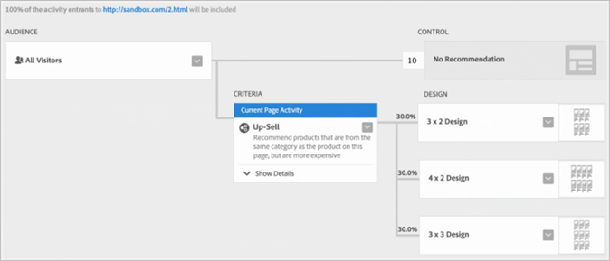

#  Recommendations Classic versus Recommendations activiteiten in Target Premium{#recommendations-classic-versus-recommendations-activities-in-target-premium}

Informatie die u helpt bij het kiezen tussen Recommendations Classic- en Recommendations-activiteiten in Target Premium.

>[!NOTE]
>
>Recommendations-activiteiten zijn beschikbaar als onderdeel van de [!DNL Target Premium] oplossing. Ze zijn niet beschikbaar in [!DNL Target Standard] zonder een [!DNL Target Premium] licentie.

In het klassieke [!DNL Recommendations] product, werden de aanbevelingen getoond door een doos van de gegevensinzameling op een pagina te creëren, toen toevoegend een vertoningsdoos in een specifieke paginalocatie. Met de [!DNL Recommendations] activiteit in [!DNL Target Premium] kunt u bezoekersinformatie verzamelen en uw aanbevelingen overal op de pagina maken zonder dat u een box hoeft te maken voor elke locatie waar u producten of inhoud wilt aanbevelen. Met een eenvoudige JavaScript-verwijzing in de koptekst van de pagina kunt u overal op de pagina aanbevelingen doen. Gebruik deze JavaScript-verwijzing om sleutels door te geven aan het algemene [!DNL Target] vak, zoals de `entity.id` toets en de `entity.categoryId` toets.

[!DNL Recommendations Classic] wordt weergegeven als een eigen kaart in de [!DNL Experience Cloud] gebruikersinterface. Een [!DNL Recommendations] activiteit is beschikbaar van binnen het [!DNL Target Premium] werkschema.

[!DNL Recommendations Classic] gebruikers kunnen hun [!DNL Recommendations] vakken blijven gebruiken in [!DNL Target Recommendations]. Ze kunnen de klassieke en [!DNL Target] benaderingen ook combineren door de vakken ervan bij te houden en de JavaScript-code in de koptekst te gebruiken om de [!DNL Recommendations] functionaliteit voor de andere elementen op de pagina te activeren. Om volledige [!DNL Target] functionaliteit te verkrijgen, echter, zouden de [!DNL Recommendations Classic] gebruikers kunnen verkiezen om hun oude mbox te schrappen en zich slechts op te verlaten [!DNL Target Recommendations].

De [!DNL Recommendations] activiteit op dit gebied [!DNL Target] verbetert op [!DNL Recommendations Classic] de volgende hoofdgebieden:

## Recommendations als voorstel

U kunt aanbevelingen opnemen binnen [!UICONTROL A/B Test] (inclusief [!UICONTROL Auto-Allocate] en [!UICONTROL Auto-Target]) en [!UICONTROL Experience Targeting] (XT) activiteiten.

Deze functionaliteit opent volledig nieuwe mogelijkheden, zoals:

* Test- en doelaanbevelingen en niet-aanbevolen inhoud binnen dezelfde activiteit.
* Experimenteer eenvoudig met het plaatsen van aanbevelingen op de pagina, inclusief de volgorde van meerdere aanbevelingen.
* Duw automatisch verkeer aan de best-presterende aanbevolen ervaring het gebruiken [!UICONTROL Auto-Allocate].
* Wijs bezoekers dynamisch toe aan op maat gemaakte aanbevelingen op basis van hun profiel [!UICONTROL Auto-Target].

Om te beginnen, creeer een [!UICONTROL A/B Test] of [!UICONTROL Experience Targeting] activiteit gebruikend [!UICONTROL Visual Experience Composer] en gebruik [!UICONTROL Insert Before], [!UICONTROL Insert After], of [!UICONTROL Replace With] actie om aanbevelingen aan een ervaring toe te voegen.

Zie [Recommendations als een voorstel](/help/c-recommendations/recommendations-as-an-offer.md)voor meer informatie.

## Criteria {#section_117709846DAA404580EBE879FFCBD9BA}

[!DNL Target Recommendations] bevat een bibliotheek met criteria die voorverpakte sets regels en configuraties bevat. In [!DNL Recommendations Classic], werd elke aanbeveling manueel gebouwd door een vorm in te vullen en van de grote lijst van regels te kiezen. Nu, wanneer het creëren van een [!DNL Recommendations] activiteit, kiest u eenvoudig een pre-gevormde reeks criteria. U kunt nog steeds aangepaste aanbevelingen maken, maar de Criteria Library bevat veel van de meest gebruikte configuraties, vooraf gebouwd om het proces te vereenvoudigen en taal te gebruiken die mensen begrijpen. Deze vooraf verpakte criteria kunnen worden gebruikt zoals is, of zij kunnen worden gekopieerd en worden uitgegeven om uw specifieke behoeften te passen.

De criteria worden pre-gevormd en gesorteerd door de industrie verticals, paginatypen, en implementatie. U kunt bijvoorbeeld zoeken naar de criteria die van toepassing zijn op de verticale handelsversie, voor gebruik op een productpagina, waarbij producten uit een bepaalde categorie (zoals gedefinieerd door de `entity.categoryID` parameter) worden weergegeven.

Zie [Criteria voor meer informatie over het gebruik en het maken van criteria](/help/c-recommendations/c-algorithms/algorithms.md).

## Workflow {#section_76B4A26297BF422382DE2C79A2713D3C}

De [!DNL Recommendations] workflow is vereenvoudigd. In plaats van ingewikkelde formulieren in te vullen, volgt u een visuele workflow om:

1. Selecteer de criteria.
1. Selecteer een vooraf geconfigureerd [ontwerp](/help/c-recommendations/c-design-overview/create-design.md#task_CC5BD28C364742218C1ACAF0D45E0E14).
1. Bekijk de resulterende aanbevelingen.

## Visuele voorvertoning {#section_639B9E38C9EC4093BF9023EE0F2A15AC}

U kunt uw aanbevelingen voorvertonen nadat u ze hebt ingesteld en de benodigde wijzigingen aanbrengen zonder ze op de pagina te hoeven maken en ze vervolgens te testen. Voorvertoningen zijn beschikbaar vanuit [!DNL Target]de browser.

## Doelstelling {#section_93295EA0DBA14210B8518AF4802A459F}

In [!DNL Recommendations Classic]het geval waren er zes opties voor doelgerichte acties. Recommendations-activiteiten maken gebruik van het volledige scala aan doelopties van Target. Definieer een publiek met een [!DNL Target] of ander [!DNL Adobe Experience Cloud] publiek (zoals [!DNL Audience Manager] en [!DNL Analytics]) en selecteer vervolgens het percentage van de deelnemers aan de activiteit die elk ontwerp zien, en de percentages die het besturingselement zien.

## Rapportage {#section_25C2FCCE4BC1488496C517C0470B5CD6}

In [!DNL Target], verstrekt [!DNL Recommendations] betere rapportering die uit de mogelijkheden voordeel haalt die door [!DNL Target] en [!DNL Experience Cloud]worden verstrekt. In plaats van alleen maar de lift te tonen die door wordt geleverd in [!DNL Recommendations] vergelijking met de resultaten zonder deze, kunt u volledige informatie over uw [!DNL Recommendations] activiteit bekijken.

