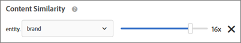

#  Recommendations - Veelgestelde vragen{#recommendations-faq}

Lijst met veelgestelde vragen (FAQ&#39;s) over Adobe Target Recommendations-activiteiten.

## Hoe lang duurt het voordat updates van items in mijn catalogus op mijn site worden weergegeven?

Nadat u een feed-bestand hebt geïmporteerd of nadat u eenheidupdates hebt ontvangen via API of mbox, worden de volgende wijzigingen in minder dan 60 minuten doorgevoerd:

* Itemkenmerken die in de ontwerpsjabloon worden geretourneerd.
* Itemkenmerken die worden gebruikt in algemene uitsluitingsregels die voorkomen dat het item wordt opgenomen in geretourneerde aanbevelingen.
* Itemkenmerken die worden gebruikt in inclusieregels binnen de criteria die van invloed zijn op het feit of het item is opgenomen in of uitgesloten van geretourneerde aanbevelingen.

De volgende wijzigingen worden pas doorgevoerd wanneer het volgende algoritme wordt uitgevoerd (binnen 12-24 uur):

* Itemkenmerken die worden gebruikt in de regels voor verzamelingen die worden gebruikt voor de activiteit.
* Objectkenmerken die worden gebruikt in een speciale actie die is gebaseerd op een kenmerk of verzameling dat aan de activiteit is gekoppeld.
* Objectcategorie waarin het item wordt weergegeven voor &quot;Huidige rubriek&quot; of &quot;Favoriete rubriek&quot; in de hoogste verkopers of het meest bekeken algoritme.
* Het rangschikken van geadviseerde punten wanneer het attribuut veranderde is een douaneattribuut dat als douanetoets voor een algoritme wordt gebruikt.
* Rangschikking van aanbevolen items op basis van de gewijzigde kenmerken wanneer de logica van de aanbeveling &quot;Items met vergelijkbare kenmerken&quot; is, wanneer de wegingsfactoren &quot;Gelijksoortigheid van inhoud&quot; worden gebruikt of wanneer de factoren &quot;Afweging van kenmerken&quot; worden gebruikt.

>[!NOTE]
>
>Een voederdossier wordt beschouwd als ingevoerd wanneer zijn status van &quot;het Importeren van Punten&quot;in &quot;het Voorbereiden van de Updates van de Index van het Onderzoek&quot; verandert. Het kan meer dan 60 minuten duren voordat updates worden weergegeven in de gebruikersinterface van Catalog Search; Zoekopdracht in catalogus is up-to-date wanneer de status van de feed verandert in &quot;Updates voltooid&quot;. Zelfs als Catalog Search nog niet bijgewerkt is, zal uw site updates op de hierboven vermelde tijdframes weerspiegelen. De meest recente update van de index van het Onderzoek van de Catalogus wordt getoond op de pagina van het Onderzoek van de Catalogus.

## Wat moet ik doen als speciale karakters mijn serie breken? {#section_D27214116EE443638A60887C7D1C534E}

Gebruik beschermde waarden in JavaScript. Aanhalingstekens ( &quot; ) kunnen de array afbreken. Het volgende codefragment is een voorbeeld van beschermde waarden:

```
#set($String='') 
#set($escaper=$String.class.forName('org.apache.commons.lang.StringEscapeUtils')) 
<script type="text/javascript"> 
console.log("$escaper.escapeJavaScript($entity1.name)") 
console.log("$escaper.escapeJavaScript($entity2.name)") 
console.log('$escaper.escapeJavaScript($entity3.name)') 
names.push("$escaper.escapeJavaScript($entity4.name)") 
</script>
```

## Waarom zijn niet alle criteria, met inbegrip van douanecriteria, beschikbaar voor selectie wanneer het creëren van een activiteit van Recommendations? {#section_B2265AC8B8A94E0298D495A05C5D817F}

De beschikbare criteria zijn gebaseerd op de huidige categorie. Wanneer u aanbevelingen aanbiedt, geeft de algoritmekiezer criteria weer op basis van categorie ID.

Als de plaats waarop u deze criteria toepast niet de categorie ID bevat, zijn bepaalde criteria niet beschikbaar in de algoritmekiezer.

Als u een locatie gebruikt waar categorie-id aanwezig is in het mbox, bevat de kiezer voor het criterium alle toepasselijke criteria.

Het doel heeft een [filter Incompatibele Criteria](../../c-recommendations/plan-implement.md#concept_C1E1E2351413468692D6C21145EF0B84) die plaatsen om intelligent filtreren van de algoritmeplukker te controleren.

>[!NOTE]
>
>Dit het plaatsen is op activiteiten van toepassing die in Visuele Composer van de Ervaring (VEC) slechts worden gecreeerd. Deze instelling is niet van toepassing op activiteiten die zijn gemaakt in de Form-Based Experience Composer (Target heeft geen locatiecontext).

Klik op [!UICONTROL Filter Incompatible Criteria] > [!UICONTROL Recommendations] [!UICONTROL Settings]:


Als de [!UICONTROL Filter Incompatible Criteria] instelling NIET is ingeschakeld, filtert Doel geen algoritmen in de Algoritmekiezer en worden alle algoritmen weergegeven.

Als het [!UICONTROL Filter Incompatible Criteria] plaatsen, in VEC activiteiten wordt toegelaten, leest Doel entiteitId en categorie ID van de geselecteerde plaats en toont dan algoritmen die op `currentItem|currentCategory` (als respectieve waarden op die plaats aanwezig zijn) worden gebaseerd. Hierdoor worden standaard alleen compatibele algoritmen voor de geselecteerde locatie weergegeven in de algoritmekiezer.

Als de [!UICONTROL Filter Incompatible Criteria] instelling is ingeschakeld, kunt u nog steeds niet-compatibele algoritmen weergeven door het [!UICONTROL Compatible] selectievakje uit te schakelen terwijl u criteria selecteert.


De volgende lijst bevat speciale gevallen waarin het [!UICONTROL Compatible] selectievakje niet wordt weergegeven door Doel:

* Zowel entiteitskaart als categorie ID zijn aanwezig op de plaats, dan niets wordt gefilterd.
* U gebruikt [!DNL mbox.js] versie 55 of lager.
* Geen mbox vraag wordt in brand gestoken van de pagina (!config.isAutoCreateGlobalMbox &amp;&amp; !config.isRegionalMbox)
* Doelparameters zijn niet gedefinieerd.

## Wat moet ik doen als een verzameling in Recommendations naar nul gaat (0)? {#section_E2DB2FE67CF24EEC81412BFF3FA6385D}

Overweeg de volgende informatie als u een inzameling ziet gaan naar nul die eerder niet bij nul was:

* U kunt de verzameling opnieuw opslaan en zien of het nummer wordt bijgewerkt. Merk op dat door het redden, de inzameling alle algoritmen opnieuw in werking zal stellen die die inzameling gebruiken.
* Kijk je naar de juiste omgeving? Ga naar [!DNL /target/products.html#recsSettings] dubbele controle (zoals hieronder getoond).

   

* Is uw index up-to-date? Ga naar [!DNL /target/products.html#productSearch] en controleer hoeveel uren de index is (bijvoorbeeld &quot;Geïndexeerde 3 uur geleden&quot;). U kunt de index naar wens vernieuwen.
* Heeft u iets in de feed of de gegevenslaag gewijzigd waardoor de entiteiten niet meer overeenkomen met de verzamelingsregels? Zorg ervoor dat uw HOOFDLETTERS overeenkomen (hoofdlettergevoelig).
* Is uw feed gelukt? Heeft iemand de FTP-map, het wachtwoord enzovoort gewijzigd?
* Doel doet zijn best om updates aan de levering (op de pagina van de klant/app) te maken gebeuren zo snel mogelijk. Toch moeten wij ook een of andere vertegenwoordiging in UI voor de teller verstrekken. De leveringsupdates hoeven niet automatisch te worden vertraagd, zodat wordt gewacht tot de updates van de gebruikersinterface gesynchroniseerd zijn. U kunt [mboxTrace](/help/c-activities/c-troubleshooting-activities/content-trouble.md) gebruiken om te zien wat in het systeem op het tijdstip is een verzoek binnen komt.

## Wat is het verschil tussen de algemene weging van de Waarden van Attributen en Inhoud gelijksoortig-specifieke attributen? {#section_FCD96598CBB44B16A4C6C084649928FF}

Kenmerkweging bestaat in twee vormen: &quot;standard attribute weight&quot; en &quot;content similarity attribute weight&quot;.

&quot;Standaardkenmerkweging&quot; is van toepassing op de meeste, zo niet alle, typen criteria (niet alleen op basis van inhoudsgelijkenis). Dit type weging geeft meer gewicht aan bepaalde kenmerkwaarden. In het volgende voorbeeld krijgen Nike-producten een reliëf in de aanbevelingen voor uitvoer.


De &quot;weging van de gelijksoortige eigenschappen van de inhoud&quot;is slechts op de criteria van de Gelijksoortigheid van de Inhoud van toepassing.

Dit type weging is dynamischer en is gebaseerd op de huidige &quot;aanbeveling key&quot; (het momenteel bekeken item). In het volgende voorbeeld (merk x 16), als een bezoeker Nike sneakers zou bekijken, zal die bezoeker eerder andere Nike-producten (niet noodzakelijkerwijs alleen sneakers) dan concurrenten-sneakers aanraden. Als een bezoeker Adidas-sneakers zou bekijken, is het waarschijnlijker dat hij of zij Adidas-producten zal aanraden.



## Waarom kan Target soms geen aanbevelingen tonen? {#section_DB3F40673AED42228E407C05437D99E9}

Het doel kan soms geen aanbevelingen tonen wegens het lage aantal beschikbare aanbevelingen.

Het aantal waarden dat per criterium wordt gegenereerd, is drie keer het aantal entiteiten dat in het ontwerp is opgegeven. Het filtreren van runtime (bijvoorbeeld, inventaris, mbox kenmerkenaanpassing) wordt toegepast nadat de 3x waarden worden geproduceerd, zodat is het mogelijk met minder dan 3x waarden bij leveringstijd beëindigen. Om deze situatie te verzachten, vergroot u het aantal entiteiten in het ontwerp door extra entiteiten te verbergen.

Het volgende JavaScript kan aan het begin van het ontwerp worden gebruikt om het aantal gevraagde entiteiten te verhogen. In dit voorbeeld is het aantal aangevraagde entiteiten 30 (3x10).

```
#foreach($entity in $entities) 
 #if( $foreach.count > 10 ) 
  #break 
 #end 
 #set ($foo = $entity.id) 
#end 
```

## Wat is de formaatgrens van een API vraag voor tussenvoegsel/updateproducten? Kan ik 50.000 producten in één vraag bijwerken gebruikend API in plaats van een voer? {#section_434FE1F187B7436AA39B7C14C7895168}

Doel legt een postlimiet van 50 MB op toepassingsniveau op; dat is echter alleen wanneer u de koptekst van het `application/x-www-form-urlencoded` inhoudstype doorgeeft.

Je zou zeker kunnen proberen om 50.000 producten in één enkele vraag te verzenden. Als het ontbreekt, zou u het in partijen moeten verdelen. Meestal raden we klanten aan hun aanroepen te onderbreken in 5.000 of 10.000 productbatches om de kans op een time-out als gevolg van systeembelasting te verkleinen.

## Moet ik de naam van het selectievakje opgeven wanneer ik Recommendations-criteria, -promoties of -testregels voor sjablonen maak? {#section_FFA42ABCC5954B48A46526E32A3A88A2}

Wanneer u een Recommendations-criteria, -promoties of -testregel voor sjablonen maakt op basis van een mbox-parameter, vraagt u `mboxParameter` niet langer om `mboxName`. mbox name is nu optioneel. Met deze wijziging kunt u parameters uit meerdere vakken gebruiken of verwijzen naar een parameter die nog niet op de rand is opgenomen.

De gewenste parameter selecteren:

* Selecteer tijdens het maken van nieuwe criteria, promoties of testregels voor sjablonen een parameternaam in de lijst, typ de eerste tekens van de gewenste parameternaam of typ de volledige naam van de gewenste parameternaam.
* Als u de naam van het selectievakje, maar niet de naam van de parameter, onthoudt, gebruikt u het selectievakje om te filteren op een bekend selectievakje dat de gewenste parameter doorgeeft.

Bij beide methoden is er geen koppeling tussen de mbox en de parameter. De criteria, bevordering, of malplaatje het testen regel zullen op basis van parameter over alle dozen werken die die parameter overgaan.

Als u bestaande criteria, bevordering, of malplaatje het testen regel uitgeeft, tonen de het filtreren criteria met de mbox naam die tijdens verwezenlijking werd verstrekt.

## Waarom kan ik mijn oudere Recommendations-activiteit niet opslaan nadat ik een nieuw publiek heb gedefinieerd? {#section_1E47C40B1FE7479BAC3EE0F50CE7C2C4}

Zorg ervoor dat het publiek een unieke naam heeft. Als u het publiek dezelfde naam hebt gegeven als een bestaand publiek, kunt u uw oudere Recommendations-activiteit (een Recommendations-activiteit die vóór oktober 2016 is gemaakt) niet opslaan.

## Wat is de maximumgrootte van een CSV-bestand voor een feed-upload? {#section_20F1AF4839A447B9889B246D6E873538}

Het aantal rijen of de bestandsgrootte voor het uploaden van een CSV-bestand van een feed is niet hard beperkt. We raden echter aan de CSV-bestandsgrootte te beperken tot 1 GB om fouten tijdens het uploaden van het bestand te voorkomen. Als de grootte van het bestand groter is dan 1 GB, moet het bestand idealiter in meerdere feed-bestanden worden gesplitst. Het maximumaantal kolommen voor aangepaste kenmerken is 100 en de aangepaste kenmerken zijn beperkt tot 4096 tekens. Aanvullende limieten voor de lengte van vereiste kolommen zijn beschikbaar op de pagina [](../../r-troubleshooting-target/target-limits.md#reference_BEFE60C3AAA442FF94D4EBFB9D3CC9B1)Doelbeperkingen.

## Kan ik een entiteit dynamisch uitsluiten?

In het vraagkoord, kunt u entiteit IDs voor entiteiten overgaan die u van uw aanbevelingen wilt uitsluiten. U kunt bijvoorbeeld items uitsluiten die zich al in het winkelwagentje bevinden.

Gebruik de parameter `excludedIds` mbox om de uitsluitingsfunctionaliteit in te schakelen. Deze parameter verwijst naar een lijst met door komma&#39;s gescheiden entiteit-id&#39;s. Bijvoorbeeld, `mboxCreate(..., "excludedIds=1,2,3,4,5")`. De waarde wordt verzonden wanneer het verzoeken van om aanbevelingen.

De uitsluiting wordt uitgevoerd voor de huidige vraag van het Doel slechts; De punten worden niet uitgesloten op verdere vraag van het Doel tenzij de `excludedIds` waarde opnieuw wordt overgegaan. Als u items in het winkelwagentje wilt uitsluiten van aanbevelingen op elke pagina, blijft u de `excludedIds` waarde op elke pagina doorgeven.

>[!NOTE]
>
>Als te veel entiteiten zijn uitgesloten, gedragen de aanbevelingen zich alsof er niet genoeg entiteiten zijn om het advisemalplaatje te vullen.

Als u dit wilt uitsluiten, voegt u het `entityIds``&excludes=${mbox.excludedIds}` token toe aan de URL voor de aanbiedingsinhoud. Wanneer de inhoud-URL wordt geëxtraheerd, worden de vereiste parameters vervangen door de huidige parameters voor mbox-aanvragen.

Deze functie is standaard ingeschakeld voor nieuwe aanbevelingen. Bestaande aanbevelingen moeten worden opgeslagen om dynamisch uitgesloten entiteiten te ondersteunen.

## Wat betekent de reactie van NO_CONTENT soms teruggekeerd in de inhoud van Recommendations spoor?

NO_CONTENT wordt geretourneerd wanneer aanbevelingen niet beschikbaar zijn voor het gevraagde algoritme en de toetsencombinatie. Over het algemeen gebeurt dit wanneer back-ups voor het algoritme zijn uitgeschakeld en een of meer van de volgende zaken ook waar zijn:

* De resultaten zijn nog niet gereed.

   Dit komt typisch voor wanneer eerst het bewaren van een pas gecreëerde activiteit of nadat de configuratieveranderingen in de inzameling, de criteria, of de bevorderingen worden aangebracht die in de activiteit worden gebruikt.

* De resultaten zijn klaar, maar zijn nog niet in het voorgeheugen ondergebracht bij de dichtstbijzijnde randserver, voor de gevraagde algoritme/toetsencombinatie.

   Het zojuist gedane verzoek zal een caching-bewerking starten. Dit probleem moet dus worden opgelost na een paar pagina&#39;s opnieuw te laden en/of na een paar minuten voorbij te zijn.

* De resultaten zijn gereed, maar niet beschikbaar voor de opgegeven sleutelwaarde.

   Dit komt typisch voor wanneer het verzoeken van om aanbevelingen voor een punt dat aan de catalogus na de meest recente looppas van het algoritme werd toegevoegd en zal na de volgende algoritmelooppas oplossen.

* Gedeeltelijke sjabloonrendering is uitgeschakeld en er zijn onvoldoende resultaten beschikbaar om de sjabloon te vullen.

   Dit komt typisch voor wanneer u een dynamische integratieregel hebt, die agressief vele punten van de mogelijke resultaten filtert. Om dit te vermijden, laat steunen toe en pas niet de inclusieregel op steunen toe, of gebruik achtereenvolgens de criteria met minder-agressief gefilterde criteria.
