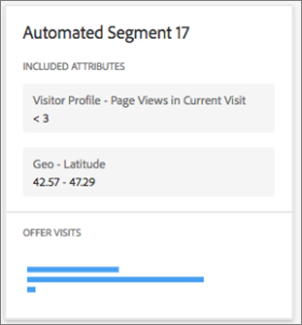

#  Automated Segments report{#automated-segments-report}

Informatie over het Geautomatiseerde rapport van Segmenten, één van de twee gespecialiseerde rapporten beschikbaar aan gebruikers van de activiteiten van Automated Personalization (AP) en Auto-Target (AT).

>[!NOTE]
>
>Houd rekening met het volgende wanneer u rapporten over persoonlijke voorkeuren gebruikt:
>
>* AP en de activiteiten van AT zijn beschikbaar als deel van de [!DNL Target Premium] oplossing. Zij worden niet opgenomen bij [!DNL Target Standard] zonder een [!DNL Target Premium] vergunning.
   >
   >
* [!UICONTROL Personalization Insights] rapporten zijn beschikbaar slechts voor AP en bij activiteiten die een doel van de omzetoptimalisering gebruiken. Activiteiten waarbij de optimalisatiedoelstelling werd gewijzigd in een omrekening van inkomsten nadat de activiteit al actief was, worden ook niet ondersteund.
   >
   >
* [!UICONTROL Personalization Insights] rapporten zijn alleen beschikbaar als de optie [!UICONTROL Primary Goal] is geselecteerd in de [!UICONTROL Report Metric] vervolgkeuzelijst.
   >
   >
* [!UICONTROL Personalization Insights] rapporten worden alleen ondersteund in de [standaardomgeving](/help/administrating-target/hosts.md) .
   >
   >
* [!UICONTROL Personalization Insights] rapporten worden alleen gegenereerd voor activiteiten die zich in de [!UICONTROL Live] status bevinden en die gedurende ten minste 15 dagen zijn geactiveerd en ontvangen.

Verschillende bezoekers reageren anders op de aanbiedingen/ervaringen in uw AP/AT-activiteit. Dit rapport laat zien hoe verschillende geautomatiseerde segmenten die door de personalisatiemodellen van Target worden gedefinieerd, op de aanbiedingen/ervaringen in de activiteit hebben gereageerd.

## Heb toegang tot het Geautomatiseerde rapport van Segmenten {#section_8E8F997AAAF44A1B9EE06EB6FB652801}

1. Klik **[!UICONTROL Activities]** en klik vervolgens in de lijst op de gewenste [Automated Personalization](/help/c-activities/t-automated-personalization/automated-personalization.md#task_8AAF837796D74CF893CA2F88BA1491C9) - of [Auto-Target](/help/c-activities/auto-target/auto-target-to-optimize.md) -activiteit.

   Als u vele activiteiten hebt, kunt u de lijst filtreren door opties van [!UICONTROL Type], [!UICONTROL Status], [!UICONTROL Property], [!UICONTROL Reporting Source], [!UICONTROL Experience Composer], [!UICONTROL Metrics Type], en [!UICONTROL Activity Source] drop-down lijsten te selecteren.

1. Klik op **[!UICONTROL Reports]**.

   Het rapport [Automated Personalization Summary](/help/c-reports/reports-ap.md) of [Auto-Target Summary](/help/c-reports/auto-target-summary-report.md) geeft informatie over de prestaties van uw activiteiten. Dit wordt aangegeven met het pictogram voor het eerste scherm. De twee extra pictogrammen vertegenwoordigen de twee rapporten van de Inzichten van de Personalisatie: Geautomatiseerde segmenten en belangrijke kenmerken. Merk op dat Auto-Doel een extra grafiekpictogram voor de grafische mening van het [!UICONTROL Summary] rapport heeft.

   

   >[!IMPORTANT]
   >
   >Het [!UICONTROL Automated Segments] rapport is pas beschikbaar 15 dagen nadat je je activiteit hebt geactiveerd. Tijdens deze eerste periode hebt u geen toegang tot dit rapport of kunt u op het [!UICONTROL Automated Segments] pictogram klikken. Na 15 dagen zijn overgegaan, veronderstellend is er voldoende gepersonaliseerd verkeer in uw activiteit, zal het [!UICONTROL Automated Segments] rapport beschikbaar zijn.

1. Na 15 dagen vanaf het activeren van de activiteit kunt u op het **[!UICONTROL Automated Segments]** pictogram klikken.

   

1. Selecteer het gewenste datumbereik.

   In tegenstelling tot het [!UICONTROL Summary] rapport (prestatierapportage), [!UICONTROL Personalization Insights]inclusief [!UICONTROL Automated Segments]is het alleen beschikbaar voor vaste datumbereiken: 15 dagen, 30 dagen, 45 dagen, 60 dagen en 90 dagen. Met deze vaste datumbereiken kunt u een groot genoeg gegevensbereik gebruiken om de kans te verkleinen dat u inzichten afleidt van een kortstondig patroon in uw activiteit. [!UICONTROL Personalization Insights] De twee besluiten u voor uw datumwaaier kunt maken zijn de &quot;Datum van het Eind&quot;en &quot;Duur.&quot; U zult merken dat het &quot;Begin&quot;grijs uit is. De begindatum wordt automatisch gewijzigd op basis van uw selecties voor de einddatum en -duur.

   

   U kunt de beschikbare vaste datumbereiken openen vanuit de [!UICONTROL Choose Duration]vervolgkeuzelijst.

   

1. Controleer de [!UICONTROL Automated Segments] rapportgegevens.

   

1. (Optioneel) [Download het rapport in CSV-indeling](/help/c-reports/c-report-settings/report-settings.md#section_77E65C50BAAF4AB79242DB3A8778ADEF) voor analyse in Excel en andere tools.

   >[!NOTE]
   >
   >Het gebruikersinterfacerapport voor persoonlijke gegevens bevat geselecteerde gegevens. De download CSV voor het Geautomatiseerde rapport van Segmenten bevat extra details. De geautomatiseerde het rapportdownload van Segmenten omvat extra Geautomatiseerde Segmenten voorbij de hoogste segmenten inbegrepen in UI, samen met hoe die segmenten tegen uw aanbiedingen of ervaringen uitvoerden.

## Het rapport Geautomatiseerde segmenten interpreteren

De volgende lijst verklaart hoe te om het rapport te interpreteren en beschrijft zijn elementen:

| Element | Details |
|--- |--- |
| Linkerzijpaneel | Het linkerpaneel maakt een lijst van de 20 grootste &quot;geautomatiseerde segmenten&quot;die door de verpersoonlijkingsmodellen van Target voor deze activiteit worden geïdentificeerd. Een &quot;geautomatiseerd segment&quot;is als een publiek, maar het wordt bepaald door de verpersoonlijkingsmodellen van Target in plaats van door de telleraar. Elk geautomatiseerd segment bestaat uit specifieke waarden (of waardebereiken) van specifieke kenmerken. Geautomatiseerde segmenten kunnen elkaar overlappen. Geautomatiseerde segmenten kunnen worden gedefinieerd door één, twee, drie of vier kenmerken. Zie de voorbeelden hieronder voor meer informatie. Meer over de verpersoonlijkingsmodellen van het Doel leren, zie [Willekeurig Bosalgoritme](/help/c-activities/t-automated-personalization/algo-random-forest.md). Om meer over de attributen te leren gebruiken de verpersoonlijkingsmodellen van het Doel om de geautomatiseerde segmenten tot stand te brengen, zie de Inzameling van [Gegevens voor de Algoritmen](/help/c-activities/t-automated-personalization/ap-data.md)van de Aanpassing van het Doel. |
| Grafiek centreren | In de middelste grafieken ziet u hoe de inhoud van uw activiteit wordt uitgevoerd voor het gemarkeerde geautomatiseerde segment. Als u op verschillende segmenten in het linkerdeelvenster klikt, worden de middelste grafieken bijgewerkt. |
| Cirkeldiagrammen | De schijfgrafieken bij de bovenkant van het centrumpaneel tonen de grootte van het geautomatiseerde segment, evenals het totale aantal gepersonaliseerde bezoeken in de activiteit (bijvoorbeeld, verkeer aan deze activiteit die door het verpersoonlijkingsmodel werd gediend. Het omvat geen controleverkeer of verkeer dat door het algemene windenermodel wordt gediend). Merk op dat de grootte van het segment slechts op gepersonaliseerde bezoeken gebaseerd is.  |
| Streepjesgrafiek met twee assen | Het staafdiagram met twee assen bevat informatie over bezoeken en conversie door de aanbieding of ervaring voor dat specifieke geautomatiseerde segment. |
| Roze balk | De roze balk vertegenwoordigt de conversiesnelheid en gebruikt de onderste as van de grafiek. U kunt de muisaanwijzer op de balk plaatsen voor meer informatie |
| Blauwe balk | De blauwe balk geeft het aantal bezoeken aan en gebruikt de bovenste as van de grafiek. U kunt de muisaanwijzer op de balk plaatsen voor meer informatie. |
| Grijze stippellijn | De grijze stippellijn geeft de conversiesnelheid weer voor alle persoonlijke bezoeken in de activiteit, voor alle aanbiedingen/ervaringen en geautomatiseerde segmenten. |

**Voorbeeld 1 van geautomatiseerd segment**

Dit geautomatiseerde segment wordt gedefinieerd op basis van slechts één kenmerk. Bezoekers die in dit geautomatiseerde segment zijn opgenomen, zagen deze AP-activiteit op een weekdag buiten de gebruikelijke werkuren of in een weekend.

**Voorbeeld 2 van geautomatiseerd segment**

Dit geautomatiseerde segment wordt gedefinieerd op basis van twee kenmerken. Bezoekers die in dit geautomatiseerde segment waren opgenomen en die deze AP-activiteit zagen, hadden tijdens hun huidige bezoek minder dan drie pagina&#39;s en waren geografisch gevestigd in de Latitude 42.57 en 47.29 (ongeveer tussen New Hampshire/Oregon en Washington/Maine voor een in de VS gevestigd bedrijf).

## Veelgestelde vragen over geautomatiseerde segmenten {#section_740910A52FA646B4AC9452F98C2F5719}

**Persoonlijke inzichten zijn nog niet beschikbaar voor mijn activiteiten. Waarom is dat?**

Er zijn verschillende redenen waarom de [!UICONTROL Personalization Insights] rapporten nog niet beschikbaar zijn voor uw activiteit:

* Er is geen 15 dagen verstreken sinds u de activiteit hebt geactiveerd. De geautomatiseerde Segmenten en de Belangrijke rapporten van Attributen zullen niet tot minstens 15 dagen beschikbaar zijn nadat u uw activiteit hebt begonnen. Tijdens deze eerste periode kunt u deze rapporten niet openen of op de pictogrammen Geautomatiseerde segmenten en Belangrijke kenmerken klikken.
* Uw activiteit heeft niet voldoende verkeer tijdens het gespecificeerde tijdkader gehad. Na 15 dagen zijn overgegaan, veronderstellend is er voldoende gepersonaliseerd verkeer in uw activiteit om de verpersoonlijkingsmodellen te bouwen, zullen de Geautomatiseerde Segmenten en de Belangrijke rapporten van Attributen beschikbaar zijn.
* Uw activiteit heeft een opbrengstoptimalisatiedoel. Op dit moment [!UICONTROL Personalization Insights] is deze optie alleen beschikbaar voor doelactiviteiten voor conversie. In een toekomstige release zullen we ondersteuning toevoegen voor activiteiten die gericht zijn op het optimaliseren van de inkomsten.

**Wat is een kenmerk?**

Een attribuut is informatie over een bezoeker of zijn of haar specifiek bezoek dat door de verpersoonlijkingsalgoritmen wordt gebruikt om te leren hoe te om verkeer te personaliseren. Een kenmerk kan bijvoorbeeld het browsertype, de locatie, het tijdstip van het bezoek zijn, enzovoort.

Voor meer informatie over welke attributen [!DNL Target] gebruikt in zijn verpersoonlijkingsmodellen, zie de Inzameling van [Gegevens voor de Algoritmen](/help/c-activities/t-automated-personalization/ap-data.md)van de Verpersoonlijking van het Doel. Voor meer informatie over hoe te om nieuwe attributen in Doel te uploaden om in de verpersoonlijkingsmodellen van het Doel te gebruiken, zie [Methoden om Gegevens in Doel](/help/c-implementing-target/c-considerations-before-you-implement-target/c-methods-to-get-data-into-target/methods-to-get-data-into-target.md#concept_0069C0EFB56C4700BB33F2F35C2B9B17)te krijgen.

**Wat is een geautomatiseerd segment?**

Een &quot;geautomatiseerd segment&quot;is als een publiek, maar het wordt bepaald door de verpersoonlijkingsmodellen van Target in plaats van door de telleraar.

Een geautomatiseerd segment bestaat uit specifieke waarden (of waardebereiken) van specifieke kenmerken. Zie Stap 5 hierboven, bijvoorbeeld geautomatiseerde segmenten. Merk op dat de segmenten elkaar kunnen overlappen.

Meer over het willekeurige bosverpersoonlijkingsalgoritme leren, dat de basis voor de verpersoonlijkingsmodellen van het Doel is, zie [Willekeurig Bosalgoritme](/help/c-activities/t-automated-personalization/algo-random-forest.md).

**Wat bepaalt de orde van de geautomatiseerde segmenten? **

Voor elk segment wordt een score berekend op basis van de grootte van het segment en het verschil tussen de score en de inhoud in uw activiteit. De combinatie van deze input bepaalt de orde van de geautomatiseerde segmenten dusdanig dat de grotere segmenten met grotere verschillen in hoe zij op de verschillende inhoud antwoordden dichter aan de bovenkant van de segmentlijst zullen lijken.

**Waarom worden slechts enkele van mijn aanbiedingen/ervaringen weergegeven in het rapport Automated Segments?**

AP- en AT-activiteiten bouwen één model per aanbieding (in het geval van AP) en één model per ervaring (in het geval van AT). Deze activiteiten beginnen gepersonaliseerd verkeer te dienen en uw [!UICONTROL Personalization Insights] met slechts twee gebouwde modellen tot stand te brengen. Als u niet al uw aanbiedingen en ervaringen ziet in [!UICONTROL Personalization Insights]de toepassing, is het waarschijnlijk dat u geen modellen hebt die zijn gebaseerd op deze specifieke aanbiedingen en ervaringen. U kunt het [!UICONTROL Summary] activiteitenrapport van uw activiteit controleren en zien of is er een klokpictogram naast die aanbieding/ervaring. Met dit pictogram wordt aangegeven dat er nog geen modellen voor die aanbieding/ervaring zijn gemaakt.

**Waarom ontvangen sommige aanbiedingen/ervaringen met een lagere omrekeningskoers een grotere hoeveelheid verkeer dan andere aanbiedingen/ervaringen voor een bepaald geautomatiseerd segment?**

Er zijn verscheidene potentiële redenen waarom u meer bezoeken aan een laag-omzettingsaanbieding of ervaring binnen een geautomatiseerd segment zou kunnen zien, die omvatten:

* Een klein aantal meningen voor sommige of alle aanbiedingen/ervaringen voor een bepaald geautomatiseerd segment.
* Ondermaatse activiteiten waarbij bepaalde aanbiedingen/ervaringen geen modellen hebben, of modellen die eerder zijn ontwikkeld voor sommige aanbiedingen/ervaringen dan andere.
* Gerichte regels voor een specifieke aanbieding die de bezoekers de grenzen van hun aanbiedingen/ervaringen beperken.

**Is de informatie in de [!UICONTROL Automated Segments] en [!UICONTROL Important Attributes] rapporten het zelfde als in de download CSV?**

Nr, bevat het UI rapport uitgezochte informatie. De CSV-download bevat aanvullende gegevens. De geautomatiseerde het rapportdownload van de Inzichten van het Segment omvat extra Geautomatiseerde Segmenten voorbij de hoogste segmenten inbegrepen in UI, samen met hoe die segmenten tegen uw aanbiedingen of ervaringen uitvoerden. Het rapport Belangrijke kenmerken bevat de bovenste 100 bezoekerskenmerken en hun relatieve belang, terwijl de gebruikersinterface alleen de bovenste 10 bezoekerskenmerken bevat.

**Kan ik zien [!UICONTROL Personalization Insights] voor een aangepast datumbereik?**

De rapportage van persoonlijke inzichten (zowel [!UICONTROL Automated Segments] als [!UICONTROL Important Attributes]) is alleen beschikbaar voor vaste datumbereiken: 15 dagen, 30 dagen, 45 dagen, 60 dagen en 90 dagen. Met deze vaste datumbereiken kunt u een groot genoeg gegevensbereik gebruiken om de kans te verkleinen dat u inzichten afleidt van een kortstondig patroon in uw activiteit. [!UICONTROL Personalization Insights] U kunt deze tijdsduur voor om het even welke einddatum selecteren (waar deze genoeg gegevens in de activiteit zijn om aan de duur te voldoen).

**Hoe wordt het [!UICONTROL Personalization Insights] gemaakt?**

[!UICONTROL Personalization Insights] wordt gecreeerd gebruikend een Adobe octrooi-hangende techniek genoemd MAGIX (ModelAgnostic globally Interpretable Verklaringen). Meer informatie over MAGIX vindt u in het gepubliceerde artikel van het onderzoeksteam van Adobe op de website [arXiv.org](https://arxiv.org/abs/1706.07160).

**Waarom passen de totale gegevens van het bezoekersverkeer in het [!UICONTROL Automated Segments] rapport niet mijn AP of bij Samenvatting/het rapport van Prestaties aan?**

In de [!UICONTROL Personalization Insights] rapporten zijn alleen bezoekers opgenomen die een stuk inhoud hebben gezien dat door de personalisatiemodellen van Target is geselecteerd (d.w.z. dat er geen rekening wordt gehouden met verkeer of verkeer dat door het algemene winnersmodel wordt bediend). Dit verkeerstype wordt genoemd &quot;gepersonaliseerd&quot;verkeer. Het summiere prestatiesrapport in AP/AT omvat controle tegenover &quot;gericht&quot;verkeer. Het gerichte verkeer omvat gepersonaliseerd verkeer, evenals verkeer dat gebruikend het algemene windenermodel en wat willekeurig bediende verkeer werd gediend dat werd gebruikt om verder te leren.

**Sluit de geautomatiseerde segmenten elkaar uit?**

Nee, er is sprake van overlapping tussen de geautomatiseerde segmenten.

**Is [!UICONTROL Personalization Insights] beschikbaar voor op opbrengst-gebaseerde modelleringsdoelstellingen/primair doel?**

Op dit moment [!UICONTROL Personalization Insights] is deze optie alleen beschikbaar voor doelactiviteiten voor conversie. In een toekomstige release zullen we ondersteuning toevoegen voor activiteiten die gericht zijn op het optimaliseren van de inkomsten.

**Wat zijn verschillende manieren waarop ik de informatie in de Inzichten van de Personalisatie kan gebruiken?**

* Nieuw doelpubliek ontdekken: Als u een bepaald geautomatiseerd segment ziet dat bijzonder goed presteert, zou u kunnen overwegen om een publiek tot stand te brengen zodat kunt u dat segment in andere rapporten opnieuw gebruiken.
* Test uw hypothesen van welk type bezoekers zullen antwoorden op welke van uw ervaringen.
* Afleiden inzicht in welke inhoud werkte voor wat soort bezoekers: Welke aanbiedingen waren verantwoordelijk voor het optillen van de bezoekers.
* Ondermaatse inhoud identificeren.
* Begrijp welke attributen het meest kritiek aan hoe het model leerde.
* Zie welke eigenschappen in de verpersoonlijkingsmodellen worden gebruikt en hoe belangrijk zij zijn.
* Identificeer kansen voor extra gegevenspunten u in Doel kunt overgaan om uw verpersoonlijking verder te informeren.

**Is er logica aan de orde die de attributen in een segmentkaart verschijnen?**

Nee, de volgorde van de kaarten is alleen gebaseerd op een bovenstaande rangorde. De volgorde van de kenmerken binnen een kaart is niet gebaseerd op logica.