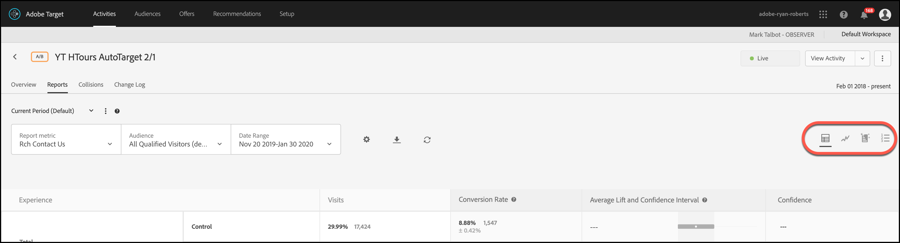
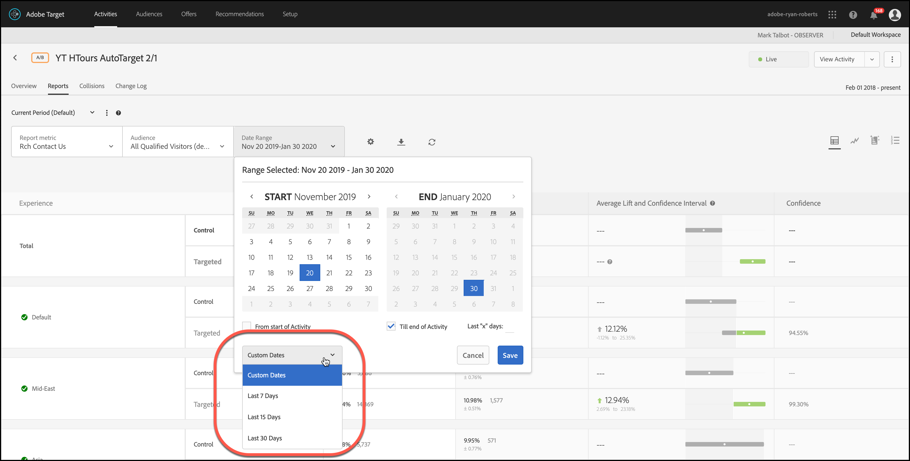
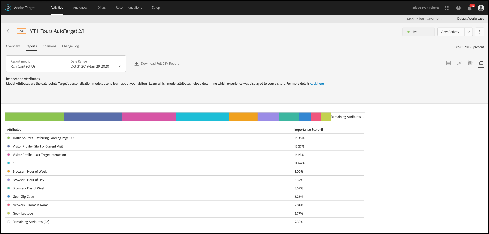

#  - rapport Belangrijke kenmerken{#important-attributes-report}

Informatie over het Belangrijke rapport van Attributen, één van de twee gespecialiseerde rapporten beschikbaar aan gebruikers van de activiteiten van Automated Personalization (AP) en Auto-Target (AT).

>[!NOTE]
>
>Houd rekening met het volgende wanneer u rapporten over persoonlijke voorkeuren gebruikt:
>
>* AP en de activiteiten van AT zijn beschikbaar als deel van de [!DNL Target Premium] oplossing. Zij worden niet opgenomen bij [!DNL Target Standard] zonder een [!DNL Target Premium] vergunning.
   >
   >
* [!UICONTROL Personalization Insights] rapporten zijn beschikbaar slechts voor AP en bij activiteiten die een doel van de omzetoptimalisering gebruiken. Activiteiten waarbij de optimalisatiedoelstelling werd gewijzigd in een omrekening van inkomsten nadat de activiteit al actief was, worden ook niet ondersteund.
   >
   >
* [!UICONTROL Personalization Insights] rapporten zijn alleen beschikbaar als de optie [!UICONTROL Primary Goal] is geselecteerd in de [!UICONTROL Report Metric] vervolgkeuzelijst.
   >
   >
* [!UICONTROL Personalization Insights] rapporten worden alleen ondersteund in de [standaardomgeving](../../administrating-target/hosts.md) .
   >
   >
* [!UICONTROL Personalization Insights] rapporten worden alleen gegenereerd voor activiteiten die zich in de [!UICONTROL Live] status bevinden en die gedurende ten minste 15 dagen zijn geactiveerd en ontvangen.

In verschillende activiteiten zijn verschillende kenmerken meer of minder belangrijk voor de manier waarop het model beslist om zich aan te passen. Dit rapport toont de belangrijkste kenmerken die het model en hun relatieve belang beïnvloedden.

## Open het rapport Belangrijke kenmerken {#section_8E8F997AAAF44A1B9EE06EB6FB652801}

1. Klik **[!UICONTROL Activities]** en klik vervolgens in de lijst op de gewenste [Automated Personalization](../../c-activities/t-automated-personalization/automated-personalization.md#task_8AAF837796D74CF893CA2F88BA1491C9) - of [Auto-Target](../../c-activities/auto-target-to-optimize.md#concept_67779E5B7F67427A97D7EA2A6FB919B3) -activiteit.

   Als u vele activiteiten hebt, kunt u de lijst filtreren door opties van [!UICONTROL Type], [!UICONTROL Status], [!UICONTROL Reporting Source], [!UICONTROL Experience Composer], [!UICONTROL Metrics Type], en [!UICONTROL Activity Source] drop-down lijsten te selecteren.

1. Klik op **[!UICONTROL Reports]**.

   Het rapport [Automated Personalization Summary](/help/c-reports/reports-ap.md) of [Auto-Target Summary](/help/c-reports/auto-target-summary-report.md) geeft informatie over de prestaties van uw activiteiten. Dit wordt aangegeven met het pictogram voor het eerste scherm. De twee extra pictogrammen vertegenwoordigen de twee rapporten van de Inzichten van de Personalisatie: Geautomatiseerde segmenten en belangrijke kenmerken. Merk op dat Auto-Doel een extra grafiekpictogram voor de grafische mening van het [!UICONTROL Summary] rapport heeft.

   

   >[!IMPORTANT]
   >
   >Het [!UICONTROL Important Attributes] rapport is pas beschikbaar 15 dagen nadat je je activiteit hebt geactiveerd. Tijdens deze eerste periode hebt u geen toegang tot dit rapport of kunt u op het [!UICONTROL Important Attributes] pictogram klikken. Na 15 dagen zijn overgegaan, veronderstellend is er voldoende gepersonaliseerd verkeer in uw activiteit, zal het [!UICONTROL Important Attributes] rapport beschikbaar zijn.

1. Na 15 dagen vanaf het activeren van de activiteit kunt u op het **[!UICONTROL Important Attributes]** pictogram klikken.

   

1. Selecteer het gewenste datumbereik.

   In tegenstelling tot het [!UICONTROL Summary] rapport (prestatierapportage), [!UICONTROL Personalization Insights]inclusief [!UICONTROL Important Attributes]is het alleen beschikbaar voor vaste datumbereiken: 15 dagen, 30 dagen, 45 dagen, 60 dagen en 90 dagen. Met deze vaste datumbereiken kunt u een groot genoeg gegevensbereik gebruiken om de kans te verkleinen dat u inzichten afleidt van een kortstondig patroon in uw activiteit. [!UICONTROL Personalization Insights] De twee besluiten u voor uw datumwaaier kunt maken zijn de &quot;Datum van het Eind&quot;en &quot;Duur.&quot; U zult merken dat het &quot;Begin&quot;grijs uit is. De begindatum wordt automatisch gewijzigd op basis van uw selecties voor de einddatum en -duur.

   

   U kunt de beschikbare vaste datumbereiken openen vanuit de [!UICONTROL Choose Duration] vervolgkeuzelijst.

   

1. Controleer de [!UICONTROL Important Attributes] rapportgegevens.

   

1. (Optioneel) [Download het rapport in CSV-indeling](../../c-reports/c-report-settings/report-settings.md#section_77E65C50BAAF4AB79242DB3A8778ADEF) voor analyse in Excel en andere tools.

   >[!NOTE]
   >
   >Het gebruikersinterfacerapport voor persoonlijke gegevens bevat geselecteerde gegevens. De CSV-download voor het rapport Belangrijke kenmerken bevat aanvullende gegevens. De belangrijke download van het Attributenrapport omvat de volledige lijst van top 100 attributen, terwijl het UI rapport top 10 slechts omvat. Als u naar een specifiek attribuut op het rapport zoekt maar het niet daar is, betekent dat niet dat het attribuut niet de activiteit beïnvloedde, het maakte enkel niet de lijst voor top 100 attributen.

## Het rapport Belangrijke kenmerken interpreteren

De volgende lijst verklaart hoe te om het rapport te interpreteren en beschrijft zijn elementen:

| Element | Details |
|--- |--- |
| Staafgrafiek | Met de gekleurde staafgrafiek boven aan het scherm kunt u deze relatieve belangrijkscores visualiseren en kunt u de punten toewijzen aan de kleur van de punt naast elk van de respectieve kenmerken in de tabel. U kunt de muisaanwijzer ook boven een specifieke kleur in het staafdiagram plaatsen om het kenmerk dat het vertegenwoordigt te zien.  De belangrijke scores over de top 100 attributen voegen aan 100% toe. Voor meer informatie over hoe te om meer attributen toe te voegen die de verpersoonlijkingsmodellen van het Doel kunnen gebruiken, zie het [Uploaden van Gegevens voor de Algoritmen](/help/c-activities/t-automated-personalization/uploading-data-for-the-target-personalization-algorithms.md)van de Aanpassing van het Doel. |
| Modelkenmerkdiagram | De rangschikking van modelkenmerken bevat de tien bovenste kenmerken die het belangrijkst waren voor de manier waarop het personalisatiemodel van Target besloot welke inhoud elke bezoeker moet worden weergegeven. De belangrijke score toont, met betrekking tot de hoogste 100 attributen, hoe belangrijk een specifiek attribuut aan de verpersoonlijkingsmodellen van Target in deze activiteit was. |

## Belangrijke veelgestelde vragen over kenmerken {#section_740910A52FA646B4AC9452F98C2F5719}

**Persoonlijke inzichten zijn nog niet beschikbaar voor mijn activiteiten. Waarom is dat?**

Er zijn verschillende redenen waarom de [!UICONTROL Personalization Insights] rapporten nog niet beschikbaar zijn voor uw activiteit:

* Er is geen 15 dagen verstreken sinds u de activiteit hebt geactiveerd. De geautomatiseerde Segmenten en de Belangrijke rapporten van Attributen zullen niet tot minstens 15 dagen beschikbaar zijn nadat u uw activiteit hebt begonnen. Tijdens deze eerste periode kunt u deze rapporten niet openen of op de pictogrammen Geautomatiseerde segmenten en Belangrijke kenmerken klikken.
* Uw activiteit heeft niet voldoende verkeer tijdens het gespecificeerde tijdkader gehad. Na 15 dagen zijn overgegaan, veronderstellend is er [voldoende gepersonaliseerd verkeer](/help/c-activities/auto-target-to-optimize.md#section_BA4D83BE40F14A96BE7CBC7C7CF2A8FB) in uw activiteit om de verpersoonlijkingsmodellen te bouwen, zullen de Geautomatiseerde Segmenten en de Belangrijke rapporten van Attributen beschikbaar zijn.
* Uw activiteit heeft een opbrengstoptimalisatiedoel. Op dit moment [!UICONTROL Personalization Insights] is deze optie alleen beschikbaar voor doelactiviteiten voor conversie. In een toekomstige release zullen we ondersteuning toevoegen voor activiteiten die gericht zijn op het optimaliseren van de inkomsten.

**Wat is een kenmerk?**

Een attribuut is informatie over een bezoeker of zijn of haar specifiek bezoek dat door de verpersoonlijkingsalgoritmen wordt gebruikt om te leren hoe te om verkeer te personaliseren. Een kenmerk kan bijvoorbeeld het browsertype, de locatie, het tijdstip van het bezoek zijn, enzovoort.

Voor meer informatie over welke attributen [!DNL Target] gebruikt in zijn verpersoonlijkingsmodellen, zie de Inzameling van [Gegevens voor de Algoritmen](../../c-activities/t-automated-personalization/ap-data.md#reference_255BD3DE7AD04DC9B766E0BC78961058)van de Verpersoonlijking van het Doel. Voor meer informatie over hoe te om nieuwe attributen in Doel te uploaden om in de verpersoonlijkingsmodellen van het Doel te gebruiken, zie [Methoden om Gegevens in Doel](../../c-implementing-target/c-considerations-before-you-implement-target/c-methods-to-get-data-into-target/methods-to-get-data-into-target.md#concept_0069C0EFB56C4700BB33F2F35C2B9B17)te krijgen.

**Is de informatie in de[!UICONTROL Automated Segments]en[!UICONTROL Important Attributes]rapporten het zelfde als in de download CSV?**

Nr, bevat het UI rapport uitgezochte informatie. De CSV-download bevat aanvullende gegevens. De geautomatiseerde het rapportdownload van de Inzichten van het Segment omvat extra Geautomatiseerde Segmenten voorbij de hoogste segmenten inbegrepen in UI, samen met hoe die segmenten tegen uw aanbiedingen of ervaringen uitvoerden. Het rapport Belangrijke kenmerken bevat de bovenste 100 bezoekerskenmerken en hun relatieve belang, terwijl de gebruikersinterface alleen de bovenste 10 bezoekerskenmerken bevat.

**Kan ik inzichten van de Personalisatie voor een waaier van de douanedatum zien?**

De rapportage van persoonlijke inzichten (zowel [!UICONTROL Automated Segments] als [!UICONTROL Important Attributes]) is alleen beschikbaar voor vaste datumbereiken: 15 dagen, 30 dagen, 45 dagen, 60 dagen en 90 dagen. Met deze vaste datumbereiken kunt u een groot genoeg gegevensbereik gebruiken om de kans te verkleinen dat u inzichten afleidt van een kortstondig patroon in uw activiteit. [!UICONTROL Personalization Insights] U kunt deze tijdsduur voor om het even welke einddatum selecteren (waar deze genoeg gegevens in de activiteit zijn om aan de duur te voldoen).

**Hoe wordt het[!UICONTROL Personalization Insights]gemaakt?**

[!UICONTROL Personalization Insights] wordt gecreeerd gebruikend een Adobe octrooi-hangende techniek genoemd MAGIX (ModelAgnostic globally Interpretable Verklaringen). Meer informatie over MAGIX vindt u in het gepubliceerde artikel van het onderzoeksteam van Adobe op de website [arXiv.org](https://arxiv.org/abs/1706.07160).

**Is[!UICONTROL Personalization Insights]beschikbaar voor op opbrengst-gebaseerde modelleringsdoelstellingen/primair doel?**

Op dit moment [!UICONTROL Personalization Insights] is deze optie alleen beschikbaar voor doelactiviteiten voor conversie. In een toekomstige release zullen we ondersteuning toevoegen voor activiteiten die gericht zijn op het optimaliseren van de inkomsten.

**Wat is de score van het attributenbelang in het Belangrijke rapport van Attributen?**

De belangrijke score in het gedeelte &quot;Belangrijkste eigenschappen van kenmerk&quot; van het rapport geeft input in welke variabelen het algoritme dat werd gebruikt om te leren het belangrijkst was toen het bepaalde hoe te om alle bezoekers in de segmenten te verdelen het identificeerde. Er wordt een percentagescore toegewezen aan de bovenste 100 kenmerken die door het model worden gebruikt.

**Waarom ontvangen sommige aanbiedingen/ervaringen met een lagere omrekeningskoers een grotere hoeveelheid verkeer dan andere aanbiedingen/ervaringen voor een bepaald geautomatiseerd segment?**

Er zijn verscheidene potentiële redenen waarom u meer bezoeken aan een laag-omzetaanbod/ervaring binnen een geautomatiseerd segment zou kunnen zien, die omvatten:

* Een klein aantal meningen voor sommige of alle aanbiedingen/ervaringen voor een bepaald geautomatiseerd segment.
* Ondermaatse activiteiten waarbij bepaalde aanbiedingen of ervaringen geen modellen hebben.
* Minder volume-activiteiten waarin modellen eerder werden gebouwd voor sommige aanbiedingen/ervaringen dan andere. Stel dat op dag 22 een aanvullend model is gemaakt en u kijkt naar gegevens van dag 10-24.
* Gerichte regels voor een specifieke aanbieding die de bezoekers kunnen zien welke aanbiedingen/ervaringen er zijn.
* Er zijn geen betrouwbaarheidsintervallen in de rapportage van inzichten. Als de conversiesnelheden echter dicht genoeg bij elkaar liggen, kan het model het verkeer bedienen, zodat het in de punthoeveelheid hoger ligt, maar het zijn geen &quot;statistisch verschillende&quot; getallen.

Het kan nuttig zijn te weten hoe het model werkt dat verkeer dient. Elke persoon wordt gediend op basis van zijn of haar totale profiel. In de rapporten van Insights wordt dit gedrag echter veralgemeend, zodat het beter door een mens kan worden geïnterpreteerd. Dientengevolge, sluiten de segmenten elkaar niet uit. Dit kan ertoe leiden dat afzonderlijke segmenten dit type gedrag weergeven omdat dezelfde persoon in meerdere segmenten kan worden weergegeven.

**Wat zijn verschillende manieren waarop ik de informatie in de Inzichten van de Personalisatie kan gebruiken?**

* Nieuw doelpubliek ontdekken: Als u een bepaald geautomatiseerd segment ziet dat bijzonder goed presteert, zou u kunnen overwegen om een publiek tot stand te brengen zodat kunt u dat segment in andere rapporten opnieuw gebruiken.
* Test uw hypothesen van welk type bezoekers zullen antwoorden op welke van uw ervaringen.
* Afleiden inzicht in welke inhoud werkte voor wat soort bezoekers: Welke aanbiedingen waren verantwoordelijk voor het optillen van de bezoekers.
* Ondermaatse inhoud identificeren.
* Begrijp welke attributen het meest kritiek aan hoe het model leerde.
* Zie welke eigenschappen in de verpersoonlijkingsmodellen worden gebruikt en hoe belangrijk zij zijn.
* Identificeer kansen voor extra gegevenspunten u in Doel kunt overgaan om uw verpersoonlijking verder te informeren.