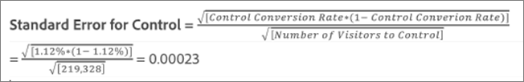
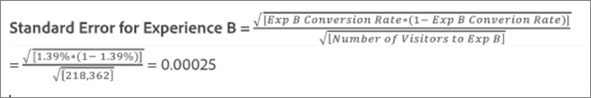

# Gemiddelde optillen, Lift Bounds en het Interval van het Vertrouwen

De rapporten omvatten verscheidene gegevenspunten en visualisatievertegenwoordiging die u helpen de liftgrenzen en het betrouwbaarheidsniveau begrijpen verbonden aan uw [!DNL Adobe Target] activiteit om u te helpen een winnaar nauwkeuriger bepalen.

>[!NOTE]
>
>Deze functie is alleen beschikbaar bij het weergeven van rapporten in de weergave [!UICONTROL Table]. Deze functie is niet beschikbaar voor activiteiten die [Analytics als rapportagebron (A4T)](/help/c-integrating-target-with-mac/a4t/a4t.md#concept_7540C8C04259434AB6EE33B09F47A1DE) gebruiken.

## De gegevens {#section_62C0D7E76F3D49A7B3C371C82AEF27D5} interpreteren

In de volgende afbeelding wordt [!UICONTROL Lift Bounds and Confidence Level]-informatie weergegeven:

De informatie over lift en betrouwbaarheid in de rapportage-UI [!DNL Target] omvat:

### Optillen

Het grote getal en de pijl geven de verwachte waarde van de lift aan. Dit getal is het middelpunt van het bereik van de grenzen van de lift. De verwachte liftpijl wordt grijs weergegeven totdat het vertrouwen 95% bereikt. Na deze drempel wordt de pijl weergegeven als rood of groen op basis van respectievelijk een negatieve of positieve lift.

### Grenzen optillen

Dit is het 95% betrouwbaarheidsinterval van de lift. Het wordt weergegeven als een bereik onder de gemiddelde lift. Zie [Voorbeeldberekening](#example) hieronder voor een voorbeeld van hoe deze liftgrenzen worden berekend.

### Boxplot-grafiek

De bokgrafiek in de [!DNL Target] interface vertegenwoordigt de verwachte waarde en 95% betrouwbaarheidsinterval van succesmetrisch in kwestie. Beschouw het als een grafische manier om de informatie over de lift en de lift grenzen te bekijken.

Er zijn een paar belangrijke manieren [!DNL Target] helpt u de betrouwbaarheidsinformatie interpreteren, één waarvan kleur is. De grafiek toont om het even welke overlapping in het betrouwbaarheidsinterval van een specifieke ervaring met het betrouwbaarheidsinterval van de controle in grijs, en om het even welk waaier van het betrouwbaarheidsinterval van een specifieke ervaring die boven of onder dat van het interval van het controlevertrouwen als groen of rood is.

De lengte van de balk van het boxplot geeft aan hoe groot het betrouwbaarheidsinterval is op een begrijpelijke manier. Terwijl u meer gegevens verzamelt in uw activiteit, verschuift en verandert de balk. Het betrouwbaarheidsinterval wordt afgeleid van de variantie en de steekproefgrootte (aantal bezoekers). Hoe kleiner de variantie en hoe groter het monster, hoe kleiner het betrouwbaarheidsinterval.

### Vertrouwen

Het vertrouwen van een ervaring of aanbod geeft de waarschijnlijkheid weer dat het optillen van de ervaring/het aanbod in verband daarmee boven de ervaring/het aanbod van de controle &quot;reëel&quot; is (niet veroorzaakt door een willekeurige kans). Doorgaans is 95% het aanbevolen betrouwbaarheidsniveau om de lift als significant te beschouwen.

## Hoe worden liftgrenzen berekend? {#section_1D360781D972483693680BE0F07AEAD1}

De grenzen van de lift vertegenwoordigen de 95% betrouwbaarheidsintervallen van de lift die de specifieke ervaring of het specifieke aanbod over de controleervaring of het aanbod heeft. Het betekent dat de eigenlijke lift ongeveer 95 procent kans heeft om tussen deze grenzen te liggen.

De grenzen van de lift worden berekend met behulp van de volgende formule:

Er is een extra berekening om de invoer aan onze liftgrenzen te bereiken:

* **t-value:** De kritische statistiek voor ons 95%-betrouwbaarheidsniveau is 1,96. U kunt hier [ meer over ](https://en.wikipedia.org/wiki/T-statistic)t-waarden leren.
* **Liftvariantie:** De standaardfout van de succesmetrische parameter van N van de Ervaring en de Standaardfout van de succesmetrische metrische methode van de Ervaring van de Controle zijn nodig om de variantie van de lift te bepalen, die met de volgende formule wordt berekend (geïllustreerd in het geval dat de succesmetrische methode conversie is).

   

* **Conversiesnelheid/Metrische standaardfout met succes:** Standaardfout wordt op dezelfde manier berekend voor Experience N en Control, met behulp van de volgende formule (geïllustreerd in het geval dat conversie de succesfactor is). U kunt meer over [standaardfout hier ](https://en.wikipedia.org/wiki/Standard_error) leren.

   

   >[!NOTE]
   >
   >De standaardfout voor de metrische activiteiten van het opbrengstsucces is gebaseerd op de steekproefvariantie van de inkomsten.

## Voorbeeldberekening {#example}

Neem bijvoorbeeld een voorbeeldactiviteit met twee ervaringen en de volgende resultaten:

| Ervaring | Bezoekers | Conversies | Omzetsnelheid |
|--- |--- |--- |--- |
| Ervaring A (controle) | 219 328 | 2 466 | 1,12% |
| Ervaring B | 218 362 | 3 040 | 1,39% |

Op basis van onze formules kunnen we de inputs berekenen die we nodig hebben voor de limieten van de lift.

**Standaardfout voor ervaring A (besturing)**

**Standaardfout voor ervaring B**

**Liftvariatie voor ervaring B**

**Grenzen optillen voor ervaring B**

Verwacht optillen voor ervaring B:

De limieten voor de lift voor ervaring B zouden daarom als volgt zijn:

>[!NOTE]
>
>Verwacht kleine verschillen tussen handmatige berekeningen met behulp van de bovenstaande formules en de getallen die in het rapport worden weergegeven. Het verschil kan worden toegeschreven aan het feit dat de getallen die in handmatige berekeningen worden gebruikt, op de pagina worden afgerond. De lift die in het [!DNL Target]-rapport wordt weergegeven, is gebaseerd op de exacte getallen die zijn verkregen uit de totale betrokkenheid en de telling van de betrokkenheid. De betrokkenheidsnummers kunnen worden verkregen via de prestatierapport-API.

## Wanneer worden de liftgrenzen niet getoond? {#section_C5622E1E94684DAD937249B51A9E42CC}

In bepaalde gevallen geeft [!DNL Target] geen liftgrenzen weer:

* Voor elke activiteit, wanneer het totale aantal bezoeken of bezoekers minder dan 30 bedraagt.
* Voor [!UICONTROL Auto-Allocate] activiteiten, worden geen liftgrenzen getoond tot één ervaring 60% vertrouwen heeft bereikt.
