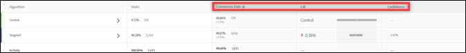

# Omrekeningskoers

De conversiesnelheid, de lift, het vertrouwen (statistische significantie) en het betrouwbaarheidsinterval worden voor elke ervaring gerapporteerd.

In de volgende afbeelding ziet u de diagramkop voor een voorbeeldactiviteit met de gemarkeerde [!UICONTROL Conversion Rate]-, [!UICONTROL Lift]- en [!UICONTROL Confidence]-koppen.

>[!NOTE]
>
>In alle gegevens worden dubbele orders genegeerd als een `orderID` wordt doorgegeven. In het auditrapport worden de genegeerde dubbele orders vermeld.

## Omzetsnelheid {#section_07A36846C4E84D0881906809B9CE5A74}

Hiermee geeft u de mediaan van de conversiesnelheid, het vertrouwen, het interval en het aantal conversies weer.

Kijk bijvoorbeeld naar de volgende rapportkolom Conversiesnelheid:

De eerste regel is de besturingservaring. Het toont een 15% omzettingspercentage, met drie omzettingen. De tweede regel, Experience B, toont een 15% conversiesnelheid, met een betrouwbaarheidsinterval van 15,65% of minder en drie conversies.

>[!NOTE]
>
>Momenteel, wordt het betrouwbaarheidsinterval berekend slechts voor binaire metriek.

## {#section_0F409572C720433D9378092ABC999982} optillen

Vergelijkt de omrekeningskoers voor elke ervaring met controle.

Lift = (Experience CR - Control CR) / Control CR

Als de controle 0 is, is er geen percentagelift.

## Vertrouwen (statistische significantie) {#section_35DB6724813D40C7B0808DE18FE595C1}

Dit aantal vertegenwoordigt de waarschijnlijkheid dat de resultaten zouden worden gedupliceerd als de test opnieuw in werking werd gesteld. Het vertrouwen beloopt tot 100,00% wanneer het vertrouwen 99,995% of meer bedraagt.

Zie [Vertrouwensniveau en Vertrouwensinterval](/help/c-reports/conversion-rate.md#concept_0D0002A1EBDF420E9C50E2A46F36629B).

## Detailgegevens {#section_30A674731BA6440E9BB93C421BE990EE}

AOV-, RPV- en verkoopgegevens worden voor elke ervaring weergegeven als u een vakje [Place Order](/help/c-implementing-target/c-implementing-target-for-client-side-web/t-mbox-download/orderconfirm-create.md) ( `orderConfirmPage`) hebt ingevoegd en dit als het conversiembox hebt geselecteerd.

## Betrouwbaarheidsniveau en betrouwbaarheidsinterval {#concept_0D0002A1EBDF420E9C50E2A46F36629B}

Voor elke ervaring worden het betrouwbaarheidsniveau en het betrouwbaarheidsinterval weergegeven.

Conversies en doorlopende variabelen voor op doelen gebaseerde metriek, zoals omzet- en betrokkenheidsmetriek, worden als volgt berekend:

* **Conversie:** ja of nee
* **Alle andere:** waarden over een bereik

U kunt offlineberekeningen voor Analytics voor Doel (A4T) uitvoeren, maar het vereist een stap met gegevensuitvoer in [!DNL Analytics]. Zie &quot;Offlineberekeningen uitvoeren voor analyse voor doel (A4T)&quot; hieronder voor meer informatie.

### Vertrouwelijkheidsniveau {#section_26FE5E44BDD5478792A65FCFD83DCCDC}

Het *betrouwbaarheidsniveau* wordt vertegenwoordigd door het donkerdere percentage in de kolom van het Tarief van de Omzetting voor elke ervaring.

  

Het betrouwbaarheidsniveau, of statistische significantie, geeft aan hoe waarschijnlijk het is dat het succes van een ervaring niet te wijten was aan toeval. Een hoger betrouwbaarheidsniveau geeft aan:

* De ervaring verschilt aanzienlijk van de controle.
* De ervaringsprestaties zijn niet alleen te wijten aan ruis.
* Als u deze test opnieuw uitvoert, is het waarschijnlijk dat u dezelfde resultaten zult zien.

Als het betrouwbaarheidsniveau boven 90% of 95% ligt, kan het resultaat als statistisch significant worden beschouwd. Alvorens om het even welke bedrijfsbesluiten te nemen, probeer om te wachten tot uw steekproefgrootte groot genoeg is en dat de vier bars van vertrouwen op één of meerdere ervaringen voor een ononderbroken tijdsduur verenigbaar blijven om de resultaten te verzekeren stabiel zijn.

>[!NOTE]
>
>Het vertrouwen beloopt tot 100,00% wanneer het vertrouwen 99,995% of meer bedraagt.

### Vertrouwelijkheidsinterval {#section_F582738DFE1648C78B93D81EBC6CACF7}

>[!NOTE]
>
>Momenteel, wordt het betrouwbaarheidsinterval berekend slechts voor binaire metriek.

Het *betrouwbaarheidsinterval* is een bereik waarbinnen de werkelijke waarde op een bepaald betrouwbaarheidsniveau kan worden gevonden. Het betrouwbaarheidsinterval wordt weergegeven als een lichtgrijs +/- percentage in de kolom Conversiesnelheid. In het onderstaande voorbeeld is het betrouwbaarheidsinterval voor de lift van Experience B plus of min 15,65%.

**Voorbeeld: de RPV van** een ervaring is $10, het betrouwbaarheidsniveau is 95% en de  **** betrouwbaarheidsintervalis $5 tot $15. Als we deze test meerdere keren zouden uitvoeren, zou 95% van de tijd de RPV tussen $5 en $15 liggen.

**Wat beïnvloedt het vertrouwensinterval?** De formule volgt de statistische standaardmethoden voor de berekening van betrouwbaarheidsintervallen.

* **Samplegrootte:** Als het monster groeit, wordt het interval kleiner of kleiner. Dit wordt geprefereerd aangezien het betekent uw rapporten dichter aan de ware waarde van succes metrisch raken.
* **Standaardafwijking kleiner:** meer vergelijkbare resultaten, zoals vergelijkbare AOV&#39;s of vergelijkbare nummers of bezoekers die elke dag converteren, verminderen de standaardafwijking.

## De Berekening van het vertrouwen en hoe te om het off-line {#section_86F7C231943043A5B8B6BFE67B706E3B} uit te voeren

Het [gedownloade CSV-rapport](/help/c-reports/downloading-data-in-csv-file.md#concept_3F276FF2BBB2499388F97451D6DE2E75) bevat alleen onbewerkte gegevens en bevat geen berekende meetgegevens, zoals inkomsten per bezoeker, lift of betrouwbaarheid die worden gebruikt voor A/B-tests.

Als u deze berekende metriek wilt berekenen, downloadt u het Excel-bestand [Complete Trust Calculator](/help/assets/complete_confidence_calculator.xlsx) om de waarde van de activiteit in te voeren of bekijkt u de [statistische berekeningen die door Target](/help/assets/statistical-calculations.pdf) worden gebruikt.

>[!NOTE]
>
>Deze rekenmachine is bedoeld voor op Target gebaseerde rapportage en niet voor A4T-rapportage.

## Offlineberekeningen uitvoeren voor Analytics voor Doel (A4T) {#section_B34BD016C8274C97AC9564F426B9607E}

U kunt offlineberekeningen voor A4T uitvoeren, maar het vereist een stap met gegevens het uitvoeren in [!DNL Analytics].

Voor A4T, gebruiken wij t-test van een Student berekening voor ononderbroken variabelen (eerder dan binaire metriek). In Analytics wordt een bezoeker altijd bijgehouden en wordt elke actie geteld. Daarom als de bezoeker veelvoudige tijden koopt of een succes metrisch veelvoudige tijden bezoekt, worden die extra treffers geteld. Dit maakt metrisch een ononderbroken variabele. Om de t-test berekening van de Student uit te voeren, wordt de &quot;som vierkanten&quot;vereist. Dit kan van [!DNL Analytics] worden teruggewonnen. Om de som gegevens van vierkanten te krijgen, moet u een bezoekersvlakke uitvoer voor metrisch uitvoeren u aan optimaliseert, voor een steekproeftijdspanne.

Als u bijvoorbeeld optimaliseert voor paginaweergaven per bezoeker, exporteert u een voorbeeld van het totale aantal paginaweergaven per bezoeker voor een bepaald tijdsbestek, misschien een paar dagen (een paar duizend gegevenspunten is alles wat u nodig hebt). Vervolgens vigeert u elke waarde en somt u de totalen op (de volgorde van de bewerkingen is hier van essentieel belang). Deze &quot;som van vierkanten&quot;waarde wordt dan gebruikt in de Volledige Berekening van het Vertrouwen. Gebruik de sectie &quot;opbrengst&quot; van dat spreadsheet voor deze waarden.

**Hiervoor gebruikt u de functie voor  [!DNL Analytics] gegevensexport:**

1. Meld u aan bij [!DNL Adobe Analytics].
1. Klik op **[!UICONTROL Tools]** > **[!UICONTROL Data Warehouse]**.
1. Vul op het tabblad **[!UICONTROL Data Warehouse Request]** de velden in.

   Voor meer informatie over elk gebied, zie &quot;Beschrijvingen van de Data Warehouse&quot;in [Data Warehouse](https://experienceleague.adobe.com/docs/analytics/export/data-warehouse/data-warehouse.html).

   | Veld | Instructies |
   |--- |--- |
   | Naam aanvraag | Geef een naam op voor uw aanvraag. |
   | Datum van rapportage | Geef een tijdsperiode en granulariteit op. Als beste praktijken, kies niet meer dan een uur of één dag van gegevens voor uw eerste verzoek.  De dossiers van de Data Warehouse nemen langer om de langere gevraagde tijdspanne te verwerken, zodat is het altijd beste om een kleine tijdspanne eerst om gegevens te verzoeken om ervoor te zorgen uw dossier het verwachte resultaat terugkeert. Ga vervolgens naar de Request Manager, dupliceer uw verzoek en vraag de tweede keer om meer gegevens. Ook, als u granularity aan om het even wat buiten &quot;niets&quot;schakelt, zal de dossiergrootte drastisch stijgen.  |
   | Beschikbare segmenten | Pas indien nodig een segment toe. |
   | Uitsplitsingen | Selecteer de gewenste afmetingen:  Standaard is OOTB (out-of-the-box) en Aangepast bevat Vars en props. U kunt het beste &quot;Bezoeker-id&quot; gebruiken als er gegevens op bezoekersidentiteitsniveau nodig zijn in plaats van &quot;Bezoeker-id Experience Cloud&quot;.<ul><li>Bezoeker-id is de laatste id die wordt gebruikt door Analytics. Het zal of HULP (als de klant erfenis is) of MID (als de klant nieuwe of ontruimde koekjes is sinds de dienst van bezoekersidentiteitskaart van MC werd gelanceerd) zijn.</li><li>De Experience Cloud Bezoeker-id wordt alleen ingesteld voor klanten die nieuwe of verwijderde cookies zijn sinds de service MC bezoeker-id is gestart.</li></ul> |
   | Metrisch | Selecteer de gewenste meetgegevens. Standaard is OOTB, terwijl Aangepast aangepaste gebeurtenissen bevat. |
   | Voorvertoning van rapport | Controleer uw instellingen voordat u het rapport plant.  |
   | Levering plannen | Voer een e-mailadres in waarnaar het bestand moet worden verzonden, geef het bestand een naam en selecteer [!UICONTROL Send Immediately]. Opmerking: Het bestand kan via FTP worden geleverd onder  [!UICONTROL Advanced Delivery Options] . |

1. Klik op **[!UICONTROL Request this Report]**.

   De levering van het dossier kan tot 72 uren, afhankelijk van de gevraagde hoeveelheid gegevens vergen. U kunt de voortgang van uw verzoek op elk ogenblik controleren door [!UICONTROL Tools] > [!UICONTROL Data Warehouse] > [!UICONTROL Request Manager] te klikken.

   Als u gegevens die u in het verleden hebt aangevraagd opnieuw wilt aanvragen, kunt u een oud verzoek van [!UICONTROL Request Manager] naar wens dupliceren.

Raadpleeg de volgende koppelingen in de Help van [!DNL Analytics] voor meer informatie over [!DNL Data Warehouse]:

* [Een Data Warehouse-aanvraag maken](https://experienceleague.adobe.com/docs/analytics/export/data-warehouse/t-dw-create-request.html)
* [Aanbevolen werkwijzen voor Data Warehouse](https://experienceleague.adobe.com/docs/analytics/export/data-warehouse/data-warehouse-bp.html)

## Telmethode {#concept_EC19BC897D66411BABAF2FA27BCE89AA}

U kunt ervoor kiezen om rapporten te bekijken met verschillende telmethoden om te begrijpen hoe uw activiteiten van invloed zijn op uw gebruikers gedurende hun levensduur of tijdens één sessie.

De telmethode wordt ondersteund voor de volgende soorten activiteiten:

* A/B-test

   Bij wijze van uitzondering ondersteunen Auto-Target A/B-activiteiten alleen de standaardmethode voor het tellen van bezoekers.

* Gericht op ervaring (XT)
* MVT (Multivariate Test)

   Voor het MVT Element Contribution Report ondersteunt Target geen Activity Impressions voor de Metrische types van Ontvangsten.

* Recommendations

Momenteel wordt alleen de standaardtelmethode (Visits) ondersteund voor Automated Personalization-activiteiten (AP).

U kunt rapporten weergeven met de volgende telmethoden:

* **Bezoeker:** Een unieke deelnemer aan de activiteit, gedurende de levensduur van de activiteit.

   Een persoon wordt als nieuwe gegadigde beschouwd als hij of zij de site bezoekt vanuit een nieuwe computer of een nieuwe browser; verwijdert het cookie; of converteert en retourneert de activiteit met dezelfde cookie. Een deelnemer wordt geïdentificeerd door de PCID in het cookie van de bezoeker. Als de PCID verandert, wordt de persoon beschouwd als een nieuwe bezoeker.

* **Bezoek:** Een unieke deelnemer aan een ervaring tijdens een enkele browsersessie van 30 minuten.

   Als een conversie is bereikt of een bezoeker na minimaal 30 minuten weer naar de site terugkeert, telt een terugkerende bezoeker als een nieuw bezoek. Een bezoek wordt geïdentificeerd door `sessionID` in het mbox koekje van de bezoeker. Wanneer `sessionID` verandert, wordt het bezoek beschouwd als nieuw.

* **Afdruk/paginaweergave:** Telkens wanneer een bezoeker een pagina van de activiteit laadt, wordt geteld.

   Eén bezoek kan verschillende indrukken van bijvoorbeeld uw homepage bevatten.

>[!NOTE]
>
>Meestal worden tellingen bepaald door cookies en sessieactiviteit. Als u echter het laatste conversiepunt van een activiteit bereikt en vervolgens de activiteit weer betreedt, wordt u beschouwd als een nieuwe deelnemer en een nieuw bezoek aan de activiteit. Dit geldt ook als de PCID- en `sessionID`-waarden niet veranderen.

## Waarom gebruikt Target de t-tests van de Student? {#t-test}

A/B-tests zijn experimenten om de gemiddelde waarde van bepaalde metrische bedrijfswaarden in een besturingsvariant (ook wel een ervaring genoemd) te vergelijken met de gemiddelde waarde van die metrische waarde in een of meer alternatieve ervaringen.

[!DNL Target] Het verdient aanbeveling twee T-tests [ van ](https://en.wikipedia.org/wiki/Student%27s_t-test#:~:text=The%20t%2Dtest%20is%20any,the%20test%20statistic%20were%20known.)studenten te gebruiken, aangezien deze minder veronderstellingen vereisen dan alternatieven zoals z-tests, en de geschikte statistische test zijn voor het uitvoeren van paarsgewijze vergelijkingen van (kwantitatieve) bedrijfsmetriek tussen een controleervaring en alternatieve ervaringen.

### Meer details

Wanneer het runnen van online A/B tests, wordt elke gebruiker/bezoeker willekeurig toegewezen aan één enkele variant. Vervolgens meten we de maatstaven(s) van de betrokken ondernemingen (bijv. omzettingen, orders, inkomsten, enz.) voor bezoekers in elke variant. De statistische test die we vervolgens gebruiken, test de hypothese dat de gemiddelde maatstaf van het bedrijfsleven (bv. omrekeningskoers, orders per gebruiker, inkomsten per gebruiker, enz.) gelijk is voor het bedieningsorgaan en een bepaalde alternatieve variant.

Hoewel de bedrijfsmetrische waarde zelf volgens één of andere willekeurige distributie zou kunnen worden verdeeld, zou de distributie van het gemiddelde van dit metrisch (binnen elke variant) in een normale distributie via [Centrale Limit Theorem](https://en.wikipedia.org/wiki/Central_limit_theorem) moeten samenkomen. Hoewel er geen garantie is voor de snelheid waarmee deze bemonsteringsspreiding van het gemiddelde zal converteren naar normaal, wordt deze voorwaarde doorgaans bereikt gezien de omvang van de bezoekers bij online testen.

Gezien deze normaliteit van het gemiddelde kan worden aangetoond dat de te gebruiken teststatistiek een t-verdeling volgt, omdat het de verhouding is tussen een normaal verdeelde waarde (het verschil in gemiddelden) en een schaaltermijn op basis van een schatting op basis van de gegevens (de standaardfout van het verschil in gemiddelden). De t-test van de **Student** is dan de geschikte hypothesetest, aangezien de teststatistiek een t-verdeling volgt.

### Waarom geen andere tests worden gebruikt

Een **z-test** is niet geschikt omdat in het typische A/B-testscenario de noemer van de teststatistiek niet is afgeleid van een bekende variantie en in plaats daarvan moet worden geschat aan de hand van de gegevens.

**Chi-kwadraat-** tests worden niet gebruikt omdat deze geschikt zijn om te bepalen of er een kwalitatief verband is tussen twee varianten (d.w.z. een nulhypothese dat er geen verschil is tussen varianten). T-tests zijn geschikter voor het scenario _kwantitatief_ dat metriek vergelijkt.

De **Mann-Whitney U test** is een niet-parametrische test, die passend is wanneer de bemonsteringsverdeling van de gemiddelde metrische waarde van het bedrijf (voor elke variant) normaal niet wordt verdeeld. Nochtans zoals eerder besproken, gezien de omvang van verkeer betrokken bij online het testen, typisch de Centrale Grenswaarden van Theorem van toepassing, en zodat kan t-test veilig worden toegepast.

Complexere methoden zoals **ANOVA** (waarbij t-tests tot meer dan twee varianten worden uitgebreid) kunnen worden toegepast wanneer een test meer dan twee ervaringen heeft (&quot;A/Bn-tests&quot;). ANOVA beantwoordt echter de vraag of alle varianten hetzelfde gemiddelde hebben, terwijl we bij de typische A/Bn-test meer geïnteresseerd zijn in _welke specifieke variant_ het beste is. In [!DNL Target] passen we daarom regelmatig t-tests toe waarbij elke variant op een besturingselement wordt vergeleken, met een Bonferroni-correctie voor meerdere vergelijkingen.
