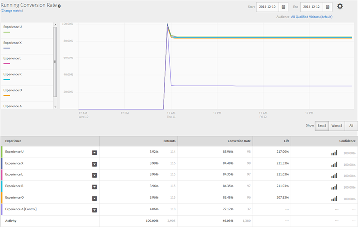

# Experience Performance Report (MVT){#experience-performance-report-mvt}

Het rapport Experience Performance laat zien hoe elke ervaring in de activiteit presteert. Dit verslag bevat informatie over het aantal nieuwkomers, de omrekeningskoers, de lift en het vertrouwen.

U kunt een of meer ervaringen selecteren om ze te vergelijken. Klik op een ervaring en selecteer **[!UICONTROL Preview]** om de ervaring in browser tabel te openen.

Bovenaan het rapport toont metrisch, begin en einddata, en publiek dat in het rapport wordt gebruikt. U kunt al deze factoren wijzigen.

>[!NOTE]
>
>De gebruikers en metrische kiezers zijn alleen beschikbaar als Analytics wordt gebruikt als de rapportbron.

Daarna, verstrekt een lijngrafiek een visuele vergelijking van elke ervaring bij specifieke tijdintervallen. Deze grafiek helpt u zien hoe goed elke ervaring presteert en hoe de tijd van de dag de prestaties beïnvloedt.

U kunt de beste vijf, slechtste vijf of alle ervaringen weergeven. De beste en slechtste vijf worden bepaald door middel van een lift en omvatten een zesde ervaring waaruit de vergelijkingscontrole blijkt. Men stelt voor dat u de beste en slechtste vijf bekijkt om het succes van uw ervaringen te bepalen. Als u alles bekijkt, is het moeilijk om de gewenste informatie op te halen. Niet alle ervaringen kunnen in de grafiek worden weergegeven. Gebruik de optie Alles weergeven als u een specifieke ervaring wilt bekijken die niet de beste of slechtste vijf is.

>[!NOTE]
>
>In multivariate testrapporten worden geen ervaringen uit het onderzoek verwijderd wanneer het filter Beste vijf of Sterkste vijf wordt geselecteerd.

Onder de grafiek, toont een lijst hoeveel ingangen elke ervaring zagen, evenals andere informatie relevant voor uw succes metrisch.

## Trainingsvideo: Een MVT-test maken 

In deze video ziet u hoe u een multivariate test maakt met behulp van de driestapige workflow met instructies voor het doel. Het rapport Experience Performance wordt vanaf 8:20 beschreven.

>[!VIDEO](https://video.tv.adobe.com/v/17395)