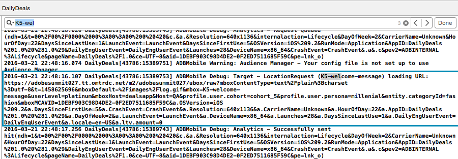

# iOS - aangepaste gebruikersgegevens verzenden{#ios-send-custom-user-data}

U kunt aanvullende informatie over de locatie of de gebruiker als naam-waardeparen naar Target sturen.

Deze informatie kan worden gebruikt om aangepaste soorten publiek (bijvoorbeeld gebruikers met een lengte van meer dan 25000 mijl) en rapportage te maken.

Er zijn twee soorten parameters die u met een vraag van het Doel kunt verzenden:

* mbox-parameters

   Mbox-parameters zijn niet blijvend in sessies.
* Profielparameters

   Profielparameters worden opgeslagen in de opslag van het bezoekersprofiel en zijn tijdens verschillende sessies blijvend. Mbox-parameters blijven niet bestaan. Terwijl sommige toetsen zijn gereserveerd, kunnen zowel profiel- als mbox-parameters aangepaste sleutel-waardeparen zijn.

Hoewel er enkele gereserveerde toetsen zijn, kunnen zowel profiel- als mapoparameters aangepaste sleutel-waardeparen bevatten.

1. Woordenboek maken.

   Maak eerst een woordenboek met de waarden die u naar Doel verzendt. Voor het gemak, voeg dit binnen de `welcomeMessageCampaign` methode toe zodat moet u zich niet over werkingsgebied ongerust maken.

   Hier volgt een voorbeeldwoordenboek. U kunt deze plakken in `(void)welcomeMessageCampaign`. De waarden voor sleutels zoals `userLevel` en `userMiles` zijn hard-gecodeerd in dit voorbeeld. Over het algemeen geeft u de bijbehorende variabelen door.

   ```
   NSDictionary *targetParams = [[NSDictionary alloc] initWithObjectsAndKeys: 
                                 @"platinum",@"userLevel", 
                                 @26500,@"userMiles", 
                                 @"1067007",@"entity.id", 
                                 @"dealsapp.qa", @"host", 
                                 @"fashion",@"entity.categoryId", 
                                 @"millenial", @"profile.persona", 
                                 @"cohort_5", @"profile.cohort", 
                                 nil];
   ```

   * Toetsen met het voorvoegselprofiel (bijvoorbeeld `profile.persona`) worden opgeslagen in het profiel van de gebruiker.

      Deze profielkenmerken kunnen op verschillende activiteiten en kanalen worden gebruikt.

   * Toetsen die geen voorvoegsel hebben (bijvoorbeeld `userMiles`) zijn maboxparameters.

      Deze parameters zijn alleen beschikbaar tijdens de sessie.

   * Toetsen met het voorvoegsel (bijvoorbeeld `entity.category.id`) worden gebruikt voor productaanbevelingen.

1. Controleer de gegevens.
   1. Verwijder in toepassing `didFinishLaunchingWithOptions` de commentaarmarkering of voeg `[ADBMobile setDebugLogging:YES];` toe.

      Hiermee worden gedetailleerde foutopsporingslogbestanden afgedrukt.
   1. Maak de app.
   1. Verifieer dat de parameters in de doelvraag worden overgegaan.

      Zoek naar uw naam van de doelplaats in uw zuivert console. U zult een vraag aan `YOUR-CLIENT-CODE.tt.omtrdc.net`met alle parameters zien die u enkel overging.

      
   U kunt een publiek maken en de weergave van inhoud beperken of als doel instellen met deze parameters in de doelstandaard.
