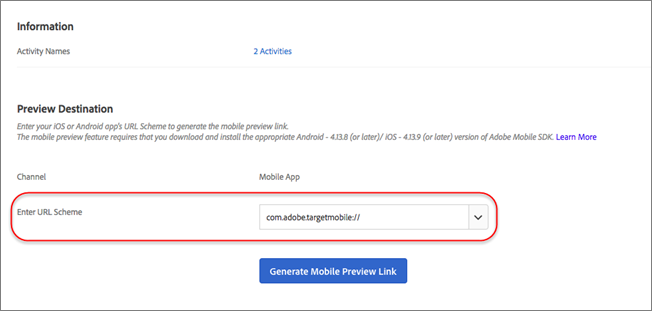
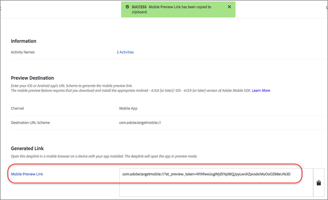

# Doelmobiele voorvertoning{#target-mobile-preview}

Gebruik de koppeling voor mobiele voorvertoningen om eenvoudige end-to-end QA&#39;s voor mobiele app-activiteiten uit te voeren en uzelf in te schrijven voor verschillende ervaringen op uw apparaat zonder speciale testapparaten.

>[!NOTE]
>
>Voor de functie voor mobiele voorvertoningen moet u de juiste 4.14 (of hoger) versie van de Adobe Mobile SDK downloaden en installeren.

## Overzicht {#section_981D6FA4AEE64098809EA606E89E4A5E}

Met de functie voor mobiele voorvertoningen kunt u uw mobiele-toepassingsactiviteiten volledig testen voordat u deze live start.

## Vereisten {#section_A763C564C9E84B0EB448237B5B1E4068}

1. **Gebruik een ondersteunde versie van de SDK:** de functie voor mobiele voorvertoningen vereist dat u de juiste versie 4.14 (of hoger) van de Adobe Mobile SDK in de corresponderende apps downloadt en installeert.

   Voor instructies voor het downloaden van de juiste SDK raadpleegt u:

   * **iOS:** [Voordat u ](https://experienceleague.adobe.com/docs/mobile-services/ios/getting-started-ios/requirements.html) begint met de iOS Help bij  *Mobile Services*.
   * **Android:** [Voordat u ](https://experienceleague.adobe.com/docs/mobile-services/android/getting-started-android/requirements.html) begint met de Android Help *voor* mobiele services.

1. **Een URL-schema instellen:** de voorbeeldkoppeling gebruikt een URL-schema om uw app te openen. U moet een uniek URL-schema opgeven voor de voorvertoning.

   De volgende illustratie is een voorbeeld op iOS:

   

   De volgende afbeelding is een voorbeeld op Android:

   

1. **Track Adobe DeepLink**

   **iOS:** In de toepassingsafgevaardigde, roep  `[ADBMobile trackAdobeDeepLink:url` wanneer de afgevaardigde wordt gevraagd om het middel met het URL-schema te openen dat in de vorige stap werd gespecificeerd.

   Het volgende codefragment is een voorbeeld:

   ```javascript
   - (BOOL) application:(UIApplication *)app openURL:(NSURL *)url 
                options:(NSDictionary<NSString *,id> *)options { 
   
       if ([[url scheme] isEqualToString:@"com.adobe.targetmobile"]) { 
           [ADBMobile trackAdobeDeepLink:url]; 
           return YES; 
       } 
       return NO; 
   } 
   ```

   **Android:** Roep in de app aan  `Config.trackAdobeDeepLink(URL);` wanneer de aanroeper wordt gevraagd de bron te openen met het URL-schema dat in de vorige stap is opgegeven.

   ```javascript
    private Boolean shouldOpenDeeplinkUrl() { 
        Intent appLinkIntent = getIntent(); 
        String appLinkAction = appLinkIntent.getAction(); 
        Uri appLinkData = appLinkIntent.getData; 
        if (appLinkData.toString().startsWith("com.adobe.targetmobile")) { 
            Config.trackAdobeDeepLink(appLinkData); 
            return true; 
        } 
        return false; 
     }
   ```

   Als u Mobiele voorvertoning wilt laten werken voor Android, moet u ook het volgende codefragment toevoegen in [!DNL AndroidManifest.xml] als u versie 5 van de SDK van Adobe Mobile gebruikt:

   ```javascript
   <activity android:name="com.adobe.marketing.mobile.FullscreenMessageActivity" />
   ```

   Gebruik het volgende codefragment als u versie 4 van de Adobe Mobile SDK gebruikt:

   ```javascript
   <activity android:name="com.adobe.mobile.MessageFullScreenActivity" />
   ```

## Een voorbeeldkoppeling {#section_D9D58173FFF34E9BB75EBF357273F128} genereren

1. Klik in de interface Doel op het pictogram **[!UICONTROL More Options]** (drie verticale ellips) en selecteer **[!UICONTROL Create Mobile Preview]**.

   

1. Selecteer de activiteiten die u wilt voorvertonen en klik op **[!UICONTROL Generate Mobile Preview LInk]**.

   >[!NOTE]
   >
   >Alleen op formulieren gebaseerde AB- en XT-activiteiten kunnen worden geselecteerd.

   

1. Geef het URL-schema van uw app op.

   Dit moet hetzelfde zijn als wat er aanwezig is in uw iOS- of Android-app. Herhaal dit proces desgewenst afzonderlijk voor iOS en Android.

   

1. Klik **[!UICONTROL Generate Mobile Preview Link]**, dan kopieer de verbinding.

   

## Voorvertonen op uw apparaat {#section_521F0D46F3DE4A2A98283A1B73FF69F6}

Open de koppeling in een mobiele browser op een apparaat waarop uw app is geïnstalleerd. Deze app kan de productie-app zijn die u hebt gedownload van de Apple App Store of de Google Play Store. Het hoeft geen speciale build te zijn. Als u een actieve voorproefverbinding hebt, zult u de ervaringen op apparaat kunnen bekijken.

1. Open de koppeling in uw mobiele browser.

   Deel de koppeling die u in de vorige stap van de doelgebruikersinterface naar uw mobiele apparaat hebt gekopieerd op een handige manier, bijvoorbeeld met tekst, e-mail of Slack.

   |||

   Uw app wordt geopend en de modus Mobiele voorvertoning voor doelapparaten wordt gestart.

1. Selecteer de combinatie ervaringen die u wilt zien, dan klik **[!UICONTROL Launch Experiences]**.

   ||||
||||

## Beperkingen {#section_4E9BDED0F718485292527EFB508305BD}

* De nieuwe inhoud wordt pas weergegeven nadat op de knop [!UICONTROL Launch Experiences] is geklikt. De weergave moet opnieuw worden geladen. De eenvoudigste manier is om over te schakelen op een ander scherm en vervolgens terug te keren naar het scherm waar de wijziging naar verwachting zal plaatsvinden.
* Mobiele voorvertoning wordt niet ondersteund voor Android-versies ouder dan API-19 (KitKat).