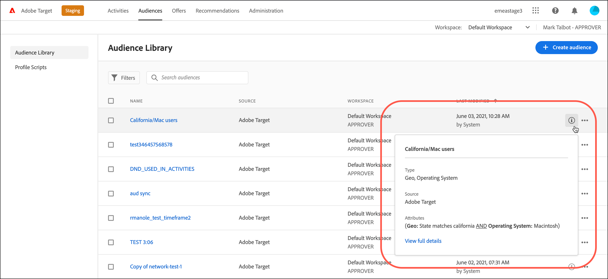
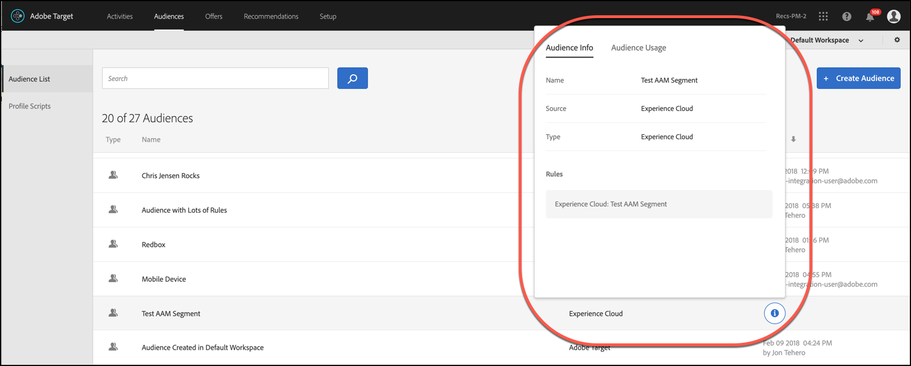

# Soorten publiek maken{#create-audiences}

Het publiek in Adobe Target bepaalt wie de inhoud en ervaringen van een gerichte activiteit zal zien.

Het publiek wordt gebruikt overal waar het richten beschikbaar is. Wanneer u een activiteit als doel instelt, kunt u een herbruikbaar publiek in de [!UICONTROL Audiences] lijst selecteren, een activiteitspecifiek publiek  maken en ernaar streven, of meerdere soorten publiek  combineren om een ad-hocpubliek te maken.

U kunt publieksgegevens ook gebruiken die door [!DNL Analytics] voor het in real time richten en verpersoonlijking in [!DNL Adobe Target] en andere [!DNL Experience Cloud] oplossingen worden verzameld. Zie [Soorten publiek](https://docs.adobe.com/content/help/en/core-services/interface/audiences/audience-library.html) in de Gebruikershandleiding *voor* Core Services.

[!DNL Target] definieert twee soorten publiek:

* **Doelgroepen:** Wordt gebruikt om verschillende inhoud aan verschillende typen bezoekers te leveren.
* **Publiek rapporteren:** Hiermee bepaalt u hoe verschillende typen bezoekers op dezelfde inhoud reageren, zodat u de testresultaten kunt analyseren.

   In [!DNL Target], kunt u rapportpubliek vormen slechts als u [!DNL Target] als uw rapporteringsbron gebruikt. Als u [Adobe Analytics als uw rapporteringsbron](/help/c-integrating-target-with-mac/a4t/a4t.md) (A4T) gebruikt, moet u uw rapporteringspubliek binnen vormen [!DNL Analytics].

## De lijst Soorten publiek gebruiken

Klik op de bovenste menubalk om de [!UICONTROL Audiences] **[!UICONTROL Audiences]** lijst te openen:

De [!UICONTROL Audiences] lijst bevat alle soorten publiek die u in uw activiteiten kunt gebruiken. Met de [!UICONTROL Audiences] lijst kunt u soorten publiek maken, bewerken, verwijderen, kopiëren of combineren. In de lijst wordt ook de bron weergegeven waar het publiek is gemaakt ([!DNL Target], [!DNL Target Classic], [!DNL Adobe Audience Manager (AAM),] [!DNL Experience Cloud]enzovoort). Vooraf gedefinieerde doelgroepen, zoals &quot;Nieuwe bezoekers&quot; en &quot;Terugkerende bezoekers&quot;, kunnen niet worden hernoemd.

Wanneer het werken met publiek dat oorspronkelijk in AAM werd gecreeerd, het alarm van het Doel u als u een publiek in de activiteiten van het Doel van verwijzingen voorziet die later in AAM zijn geschrapt.

* Als een publiek in AAM is verwijderd, wordt een waarschuwingspictogram weergegeven in zowel de [!UICONTROL Audience] lijst als de publiekskiezer. Een hulpmiddel-uiteinde in UI wijst ook erop dat het publiek in AAM werd geschrapt.
* Als u meerdere soorten publiek probeert te combineren met een verwijderd publiek of als u een activiteit probeert op te slaan die verwijst naar een verwijderd publiek, wordt een waarschuwingsbericht weergegeven.

U kunt ook aangepaste profielparameters en `user.` parameters opgeven. Wanneer u een publiek toevoegt, klikt u op **[!UICONTROL Add Rule]** > **[!UICONTROL Visitor Profile]** en kiest u de parameter die u wilt gebruiken om uw activiteit als doel in te stellen. Als de gewenste parameter niet verschijnt, is de parameter niet in brand gestoken door een mbox. Andere aangepaste parameters zijn beschikbaar in de [!UICONTROL Custom Parameters] vervolgkeuzelijst.

Gebruik het zoekvak om in uw [!UICONTROL Audiences] lijst te zoeken. U kunt zoeken naar een willekeurig deel van een publieksnaam of u kunt een specifieke tekenreeks tussen aanhalingstekens plaatsen.

U kunt de [!UICONTROL Audiences] lijst sorteren op publieksnaam of op de datum waarop deze voor het laatst is gewijzigd. Als u op naam of datum wilt sorteren, klikt u op de kolomkop en selecteert u deze om het publiek in oplopende of aflopende volgorde weer te geven.

## Scherptedefinities weergeven {#section_11B9C4A777E14D36BA1E925021945780}

U kunt de details van de publieksdefinitie op een pop-up kaart op diverse plaatsen in het Doel UI bekijken zonder het publiek te openen. Deze functionaliteit is van toepassing op publiek dat is gemaakt in Target Standard/Premium en publiek dat is geïmporteerd uit Target Classic of gemaakt via API.

De volgende publieksdefinitiekaart is bijvoorbeeld toegankelijk door de muisaanwijzer boven een publiek in de lijst met doelgroepen te plaatsen en vervolgens op het pictogram Weergave te klikken:

De volgende publieksdefinitiekaart wordt betreden door het pictogram van de Mening op de pagina van het Overzicht van een activiteit te klikken:

Klik op het [!UICONTROL Audience Usage] tabblad om andere activiteiten weer te geven die naar dat publiek verwijzen, indien van toepassing. Op deze manier kunt u onbedoelde gevolgen voor andere activiteiten tijdens het bewerken van soorten publiek voorkomen. De informatie omvat Live-activiteiten, inactieve activiteiten, gearchiveerde activiteiten en synchronisatieactiviteiten. Deze functie is beschikbaar voor alle doelgroepen (publiek in de bibliotheek en alleen- [actief publiek](/help/c-target/creating-activity-only-audience.md#concept_A6BADCF530ED4AE1852E677FEBE68483)).

Als een publiek met een ander publiek wordt gecombineerd en het gecombineerde publiek wordt gebruikt om een activiteit tot stand te brengen, zal de gebruiksinformatie voor beide publiek die pas gecreëerde activiteit vermelden.

De volgende publieksdefinitiekaart is voor een publiek dat uit Adobe Experience Cloud wordt ingevoerd. In dit geval is het publiek geïmporteerd uit Adobe Audience Manager (AAM).

De volgende details zijn beschikbaar voor deze geïmporteerde publiekstypen:

| Type publiek | Details |
|--- |--- |
| Mobiel publiek | Marketingnaam, leverancier en model. De `matches | does not match` operator wordt weergegeven in plaats van `equals | does not equal` . |
| Bezoekersgedrag publiek | **user.categoryAffinity:** `categoryAffinity` met `FAVORITE` parameter.  **AffinityMonitoring:** De controledienst is waar. **Geen bewakingsservice:** Bewakingsservice is onwaar.  |
| Soorten publiek met de operator NOT | **Eén regel:** Het doel geeft het publiek weer in de indeling `[All Visitor AND [NOT [rule]`. De regel Single NOT wordt weergegeven met EN met `AllVisitor` publiek.  |

Houd bij het werken met geïmporteerde soorten publiek rekening met de volgende punten:

* Doelpubliek van expressie wordt niet meer ondersteund in Target Standard/Premium.
* De Standaard/Premium van het doel steunt sommige verouderde doelgroepen niet of heeft betere exploitanten voor gebruiksgemak. Daarom betekent de definitie van een geïmporteerd publiek, hoewel het volgens definitie werkt, niet dat dit nu beschikbaar is voor ontwerpen in de Standard/Premium-interface. Sociale doelgroepen zijn bijvoorbeeld zichtbaar met hun regels, maar met Target Standard/Premium kunnen geen sociale doelgroepen worden gecreëerd.

## Trainingsvideo: Badge 

Deze video bevat informatie over het gebruik van soorten publiek.

* Verklaar de term &quot;publiek&quot;
* Verklaar de twee manieren waarop het publiek voor optimalisering wordt gebruikt
* Soorten publiek zoeken in de lijst Soorten publiek
* Een activiteit toewijzen aan een publiek
* Gebruik publiek voor passieve rapportage in een activiteit

>[!VIDEO](https://video.tv.adobe.com/v/17398)
