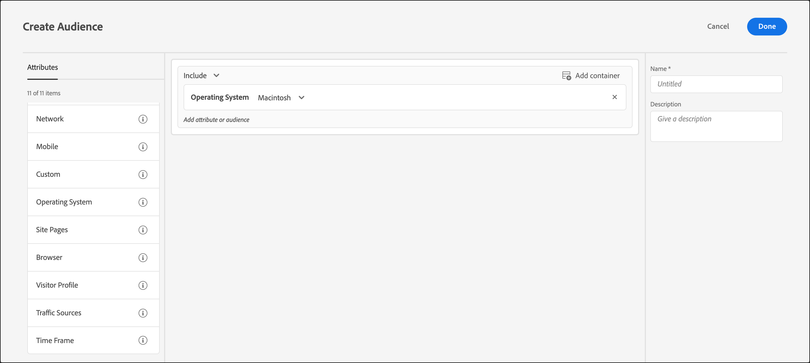

# Besturingssysteem{#operating-system}

U kunt zich richten op bezoekers die een bepaald besturingssysteem gebruiken.

1. Klik in de [!DNL Target] interface op **[!UICONTROL Audiences]** > **[!UICONTROL Create Audience]**.
1. Noem het publiek.
1. Klik op **[!UICONTROL Add Rule]** > **[!UICONTROL Operating System]**.
1. Klik **[!UICONTROL Select]** en selecteer een van de volgende opties:

   * Linux
   * Macintosh
   * Windows

1. (Optioneel) Klik op aanvullende regels voor het publiek **[!UICONTROL Add Rule]** en stel deze in.
1. Klik op **[!UICONTROL Save]**.

In de volgende afbeeldingen ziet u een publiek dat is gericht op bezoekers die een Macintosh-besturingssysteem gebruiken.

## Trainingsvideo: Soorten publiek maken

Deze video bevat informatie over het gebruik van publiekscategorieën.

* Soorten publiek maken
* Doelcategorieën definiëren

>[!VIDEO](https://video.tv.adobe.com/v/17392)
