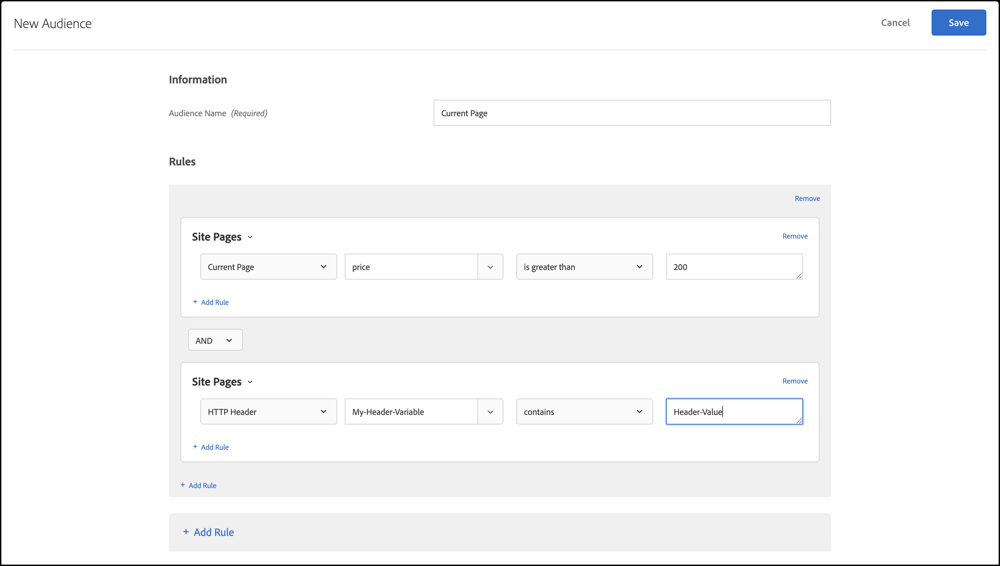

# Sitepagina&#39;s{#site-pages}

U kunt zich richten op bezoekers die zich op een specifieke pagina op uw site bevinden.

1. Klik in de [!DNL Target] interface op **[!UICONTROL Audiences]** > **[!UICONTROL Create Audience]**.
1. Noem het publiek.
1. Klik op **[!UICONTROL Add Rule]** > **[!UICONTROL Site Pages]**.

   

1. Klik de **[!UICONTROL Select]** drop-down lijst, selecteer één van de volgende opties, dan vormen de regel zoals gewenst.

   Welke opties en beoordelaars beschikbaar zijn in vervolgkeuzelijsten in de regel, is afhankelijk van de optie die u kiest. In het volgende voorbeeld worden de beschikbare opties weergegeven als u dit kiest [!UICONTROL Current Page]:

   

   De volgende opties zijn beschikbaar in de eerste vervolgkeuzelijst wanneer u kiest [!UICONTROL Select].

   * **Huidige pagina:** De pagina waarop de gebruiker momenteel staat.

      De tweede vervolgkeuzelijst bevat de volgende opties als u deze optie kiest:

      * URL (Voor meer informatie over hoe het Doel URLs evalueert, zie de Veelgestelde vragen van [Doelen en van het publiek](/help/c-target/c-troubleshooting-targets-and-audiences/troubleshooting-targets-and-audiences.md).)
      * Domein
      * Query
      * Subdomein
      * Domein op hoofdniveau
      * Pad
      * Hash-fragment (#)
   * **Vorige pagina:** De pagina waarop de gebruiker heeft geklikt voordat op de huidige pagina is geklikt. (De gebruiker moet van de vorige pagina tot de huidige pagina klikken voor de pagina om worden gevolgd. De vorige pagina wordt niet bijgehouden als de gebruiker een nieuwe URL in browser typt.) De feitelijke inhoud van deze pagina is afhankelijk van het ontwerp van uw site. Als op de huidige pagina bijvoorbeeld informatie over een specifiek product wordt weergegeven, is de vorige pagina mogelijk een categoriepagina waarop de bezoeker het specifieke item selecteert (bijvoorbeeld een pagina waarop meerdere camera&#39;s van een bepaald type worden weergegeven), of de pagina die naar de laatste pagina leidt.

      De tweede vervolgkeuzelijst bevat de volgende opties als u deze optie kiest:

      * URL (Voor meer informatie over hoe het Doel URLs evalueert, zie de Veelgestelde vragen van [Doelen en van het publiek](/help/c-target/c-troubleshooting-targets-and-audiences/troubleshooting-targets-and-audiences.md).)
      * Domein
      * Query
      * Subdomein
      * Domein op hoofdniveau
      * Pad
   * **Openingspagina:** De openingspagina is de eerste pagina die de bezoeker ziet wanneer hij of zij uw site opent. Als de bezoeker bijvoorbeeld op een koppeling op Google klikt die naar een categoriepagina leidt, is de categoriepagina de bestemmingspagina. Als de koppeling naar uw startpagina leidt, is de startpagina de bestemmingspagina. De landingspagina wordt onthouden voor de sessie van de bezoeker. U kunt de site dieper plaatsen op basis van de bestemmingspagina van de bezoeker in deze sessie.

      De tweede vervolgkeuzelijst bevat de volgende opties als u deze optie kiest:

      * URL (Voor meer informatie over hoe het Doel URLs evalueert, zie de Veelgestelde vragen van [Doelen en van het publiek](/help/c-target/c-troubleshooting-targets-and-audiences/troubleshooting-targets-and-audiences.md).)
      * Domein
      * Query
      * Subdomein
      * Domein op hoofdniveau
      * Pad
      * Hash-fragment (#)

      >[!NOTE]
      >
      >Het `landing.url` object wordt opnieuw ingesteld op een subdomeinwijziging of directe URL-vervanging.

   * **HTTP-koptekst:** Deze optie evalueert de informatie in de kopbal van HTTP van het Verzoek van het Doel. Als de HTTP-header bijvoorbeeld taalinformatie bevat, kunt u een regel maken die de `Accept-Language: es` voorwaarde bevat om bezoekers die de pagina in het Spaans openen, te bereiken.

      De tweede vervolgkeuzelijst bevat de volgende opties als u deze optie kiest:

      * Accepteren
      * Accepteren-tekenset
      * Codering accepteren
      * Accept-Language
      * Toestemming
      * Cachebeheer
      * Verbinding
      * Content-Length
      * Content-MDS
      * Inhoudstype
      * Datum
      * Verwacht
      * Van
      * Host
      * If-Match
      * If-Modified-Since
      * If-None-Match
      * If-Range
      * If-Unmodified-Since
      * Max-Forwards
      * Pragma
      * Proxy-autorisatie
      * Bereik
      * Verwijzing
      * TE
      * Upgrade
      * Gebruikersagent
      * Via
      * Waarschuwing

   Als u kiest [!UICONTROL Current Page], [!UICONTROL Previous Page]of [!UICONTROL Landing Page], zijn de opties [!UICONTROL Domain] en [!UICONTROL Query] beschikbaar. Houd rekening met het volgende wanneer u deze opties kiest:

   * **Domein:** Het volledige domein van de pagina. Als u een domein opgeeft, kunt u het beste &#39;contains&#39; gebruiken. &quot;Domain equals facebook.com&quot; accepteert `m.facebook.com` of `www.facebook.com`. &quot;Het domein bevat facebook.com&quot;zal om het even welke variant van facebook.com goedkeuren.
   * **Query:** De inhoud van de URL na het eerste vraagteken (?).

      `foo.html?e0a72cb2a2c7`

1. (Optioneel) Klik op aanvullende regels voor het publiek **[!UICONTROL Add Rule]** en stel deze in.
1. Klik op **[!UICONTROL Save]**.

U kunt ook doelgroepen voor sitepagina&#39;s maken met behulp van uw eigen queryparameter &quot;door de gebruiker gedefinieerd&quot; of &quot;door de gebruiker gedefinieerde koptekst&quot;.

Gebruik een:

* De parameter van de vraag als de regel die door de gebruiker wordt geselecteerd Huidige Pagina, het Landen Pagina, of Vorige Pagina is.
* Koptekst als de regel die door de gebruiker is geselecteerd, een HTTP-koptekst is.

zoals hieronder wordt geïllustreerd:

## Problemen oplossen {#ts}

* Om ervoor te zorgen dat het publiek van de bestemmingspagina correct kan functioneren, moeten aanvragen de `mboxReferrer` parameter hebben ingesteld (voor de leverings-API de `context.address.referringUrl` parameter) die de JavaScript-bibliotheek at.js van de pagina neemt met behulp van het `document.referrer` kenmerk. Dit `HTMLDocument` kenmerk retourneert de URI van de pagina waarvandaan de gebruiker is genavigeerd. De waarde van dit kenmerk is een lege tekenreeks wanneer de gebruiker rechtstreeks naar de pagina navigeert (niet via een koppeling, maar bijvoorbeeld via een bladwijzer).

   Als dit gedrag niet aan uw vereisten voldoet, kunt u een van de volgende handelingen uitvoeren:

   * Geef [mbox-parameters](/help/c-implementing-target/c-implementing-target-for-client-side-web/t-mbox-download/c-understanding-global-mbox/pass-parameters-to-global-mbox.md) door die voor [!DNL Target] doeldoeleinden moeten worden gebruikt.
   * Gebruik een [A/B-testactiviteit](/help/c-activities/t-test-ab/test-ab.md) in plaats van een landingspagina-activiteit. Bij de A/B-testactiviteiten wordt niet van ervaring gewisseld voor dezelfde bezoeker.
   * Gebruik in plaats hiervan een [bezoekersprofiel](/help/c-target/c-audiences/c-target-rules/visitor-profile.md) .

* Wanneer u evaluatoren &#39;start/end with&#39; gebruikt voor tekenreeksen met komma&#39;s, moet u er rekening mee houden dat deze worden geëvalueerd als een array van waarden, waarin elke waarde die door komma&#39;s wordt gescheiden, wordt geëvalueerd. Als we bijvoorbeeld de waarde voor een header hebben: `Accept-Language: en,zh;q=0.9,en-IN;q=0.8,zh-CN;q=0.7` zij komt in aanmerking voor voorwaarden zoals :
   * begint met zh,
   * begint met en,
   * eindigt met 0,7,
   * eindigt met 0,8.

## Trainingsvideo: Soorten publiek maken

Deze video bevat informatie over het gebruik van publiekscategorieën.

* Soorten publiek maken
* Doelcategorieën definiëren

>[!VIDEO](https://video.tv.adobe.com/v/17392)
