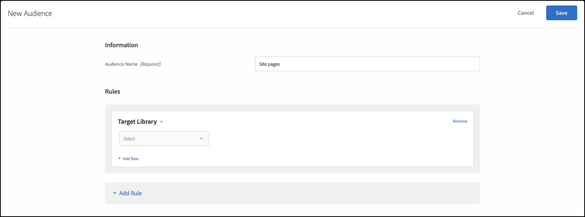

# Doelbibliotheek{#target-library}

De gebruikers van het doel die op pre-gebouwde het richten regels worden gebaseerd.

Het vooraf gebouwde publiek in de categorie Doelbibliotheek is verouderd publiek en bestaat in andere categorieën. Voor meer informatie en beste praktijken, zie [Doelen en het publiek Veelgestelde Vragen](/help/c-target/c-troubleshooting-targets-and-audiences/troubleshooting-targets-and-audiences.md#concept_C4EE4B8F4840430CBD798D579A8F208D).

1. Klik in de [!DNL Target] interface op **[!UICONTROL Audiences]** > **[!UICONTROL Create Audience]**.
1. Noem het publiek.
1. Klik op **[!UICONTROL Add Rule]** > **[!UICONTROL Target Library]**.

   

1. Klik **[!UICONTROL Select]** en selecteer vervolgens een vooraf gebouwde doelregel.

   Vooraf gebouwde het richten regels omvatten, het Werkende Systeem van het Venster, TabletApparaat, Browser Safari, Terugkomende Bezoekers, van Google, en meer.

   Het vooraf gedefinieerde publiek &quot;Tablet Device&quot; komt al in aanmerking wanneer de gebruikersagent een van de volgende tekenreeksen bevat (waarvan sommige modelnummers van apparaten zijn). U hoeft geen aangepaste doelregels voor deze apparaten te maken.

   Kindle, Silk, iPad, Sony Tablet, TF101, GT-P1000, GT-P1000R, GT-P1000M, SGH-T849, SHW-M180S, GT-I900 0T, BNTV250 en tablet-pc.

1. (Optioneel) Klik op aanvullende regels voor het publiek **[!UICONTROL Add Rule]** en stel deze in.
1. Klik op **[!UICONTROL Save]**.

## Trainingsvideo: Soorten publiek maken

Deze video bevat informatie over het gebruik van publiekscategorieën.

* Soorten publiek maken
* Doelcategorieën definiëren

>[!VIDEO](https://video.tv.adobe.com/v/17392)
