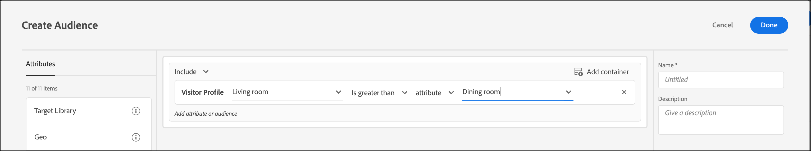

# Een vergelijkingspubliek voor profielkenmerken maken{#create-a-profile-attribute-comparison-audience}

Definieer een publiek om twee profielkenmerken voor uw [Audience-bibliotheek](/help/c-target/c-audiences/audiences.md) of voor een publiek [met alleen](/help/c-target/creating-activity-only-audience.md)activiteit te vergelijken. Met operatoren, zoals groter dan, kleiner dan of gelijk aan, definieert u een publiek om de waarden van twee verschillende profielkenmerken dynamisch te vergelijken.

>[!NOTE]
>
>Deze functionaliteit is alleen beschikbaar voor de categorie [Bezoekersprofiel](/help/c-target/c-audiences/c-target-rules/visitor-profile.md#concept_E972690B9A4C4372A34229FA37EDA38E) .

## Overzicht {#section_303CBC78194D49A2A004945D425441E1}

Het publiek wordt bepaald door regels die bepalen wie van een activiteit van het Doel inbegrepen of uitgesloten is. Een publieksdefinitie kan veelvoudige regels omvatten, en elke regel kan veelvoudige parameters omvatten. Als een van de regels die u opneemt, gebruikmaakt van de categorie Bezoekersprofiel, kunt u een regel definiëren op basis van de specifieke waarde van een kenmerk van een bezoekersprofiel of de waarde van dat kenmerk vergelijken met een ander kenmerk van het bezoekersprofiel.

Stel bijvoorbeeld dat u voor een meubelbedrijf werkt en twee scores voor klantvriendelijkheid naar Doel hebt geüpload:

* Mogelijkheid om in de komende 90 dagen dinerruimmeubilair te kopen
* Mogelijkheid om in de komende 90 dagen huiskamermeubilair te kopen

Je zou een publiek kunnen maken dat gedefinieerd wordt als de neiging om eetkamermeubilair te kopen groter is dan de neiging om meubilair van woonkamertjes te kopen. Doel zou dan dynamisch de restauratieruimte en de nestscores van de woonkamerdichtheid voor een specifieke bezoeker vergelijken om te bepalen of die bezoeker voor dit publiek in aanmerking komt.

Voor meer informatie, zie [Methoden om Gegevens in Doel](/help/c-implementing-target/c-considerations-before-you-implement-target/c-methods-to-get-data-into-target/methods-to-get-data-into-target.md#concept_0069C0EFB56C4700BB33F2F35C2B9B17)te krijgen.

## Een vergelijkingspubliek voor profielkenmerken maken {#section_7A62FD47D5C74C3EBC3417ACDBB85013}

1. Klik op **[!UICONTROL Audiences]** > **[!UICONTROL Create Audience]** > **[!UICONTROL Add Rule]** > **[!UICONTROL Visitor Profile]**.
1. Kies een kenmerk in de **[!UICONTROL Visitor Profile]** vervolgkeuzelijst:

   

1. Kies uw evaluator:

   

1. From the **[!UICONTROL Choose Comparison Type]** drop-down list, choose **[!UICONTROL Attribute]**.

   Met het vergelijkingstype &quot;statische waarde&quot; kunt u het kenmerk &quot;profiel van de bezoeker&quot; vergelijken met een of meer specifieke waarden.

   

   >[!NOTE]
   >
   >Als u een van de standaardcategorieën voor bezoekersprofielen gebruikt in Stap 1 (bijvoorbeeld Nieuwe bezoeker of Bezoeker terugsturen), kunt u alleen de optie voor statische waarden kiezen. De opties voor dynamische vergelijking zijn niet beschikbaar voor standaardcategorieën. Andere voorbeelden waarbij de dynamische vergelijkingsopties niet beschikbaar zijn, zijn &quot;Eerste pagina van sessie&quot;, &quot;Niet in andere tests&quot;, &quot;Niet eerste pagina van sessie&quot; en &quot;Categorie-affiniteit&quot;.

1. Kies het extra kenmerk dat u met het oorspronkelijke kenmerk wilt vergelijken.

   

## Badge  {#section_3BB8DBF3418F4520B3E274B6F40AF8F3}

Bekijk de volgende video voor meer informatie en een scenario waarin u deze functie kunt gebruiken:

>[!VIDEO](https://video.tv.adobe.com/v/23218/)