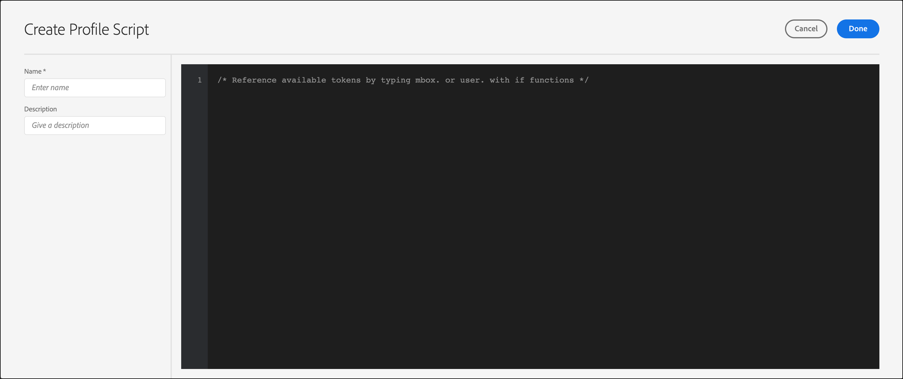

# Profielkenmerken{#profile-attributes}

Profielkenmerken zijn parameters die specifiek zijn voor een bezoeker. Deze kenmerken worden opgeslagen in het profiel van de bezoeker om informatie over de bezoeker te verstrekken die in uw activiteiten kan worden gebruikt.

Een gebruikersprofiel bevat demografische en gedragsinformatie van een bezoeker van een webpagina, zoals leeftijd, geslacht, aangeschafte producten, laatste tijd van het bezoek, enzovoort. Deze informatie wordt door Target gebruikt om de inhoud die deze bezoeker toekomt, aan te passen.

Wanneer een bezoeker door uw website bladert of wanneer de bezoeker voor een andere sessie terugkeert, kunnen de opgeslagen profielkenmerken in het profiel worden gebruikt om inhoud of logboekinformatie voor segmentfiltering als doel in te stellen.

Profielkenmerken instellen:

1. Klik op **[!UICONTROL Audiences]** > **[!UICONTROL Profile Scripts.]**

   

1. Klik op **[!UICONTROL Create Script]**.

   

   De volgende typen profielkenmerken zijn beschikbaar:

   | Type parameter | Beschrijving |
   |--- |--- |
   | mbox | Direct door paginacode doorgegeven tijdens het maken van het mbox. Zie Parameters [doorgeven aan een globale box](/help/c-implementing-target/c-implementing-target-for-client-side-web/t-mbox-download/c-understanding-global-mbox/pass-parameters-to-global-mbox.md).<br>**Opmerking**: Doel heeft een limiet van 50 unieke profielkenmerken per mbox-aanroep. Als u meer dan 50 profielkenmerken aan Doel moet doorgeven, kunt u deze doorgeven met de API-methode voor het bijwerken van profiel. Zie [Profielupdate in de Adobe Target API-documentatie](http://developers.adobetarget.com/api/#updating-profiles)voor meer informatie. |
   | Profiel | Direct gedefinieerd met een JavaScript-codefragment. Deze kunnen lopende totalen opslaan zoals het totale geld dat door de consument wordt uitgegeven en op elke mbox verzoek uitgevoerd. Zie Profielscriptkenmerken hieronder. |

## Profielscriptkenmerken {#concept_8C07AEAB0A144FECA8B4FEB091AED4D2}

Definieer een profielscriptkenmerk met het bijbehorende JavaScript-codefragment.

U kunt profielscripts gebruiken om bezoekerskenmerken voor meerdere bezoeken vast te leggen. Profielscripts zijn codefragmenten die binnen Doel worden gedefinieerd met behulp van een vorm van JavaScript op de server. U kunt bijvoorbeeld een profielscript gebruiken om vast te leggen hoe vaak een bezoeker uw site bezoekt en wanneer hij of zij voor het laatst is bezocht.

Profielscripts zijn niet hetzelfde als profielparameters. Profielparameters leggen informatie over bezoekers vast met behulp van de mbox-code-implementatie van Target.

## Profielscripts maken {#section_CB02F8B97CAF407DA84F7591A7504810}

Profielscripts zijn beschikbaar onder het [!UICONTROL Audiences] tabblad in de [!DNL Target] interface.

Als u een nieuw profielscript wilt toevoegen, klikt u op het **[!UICONTROL Profile Scripts]** tabblad **[!UICONTROL Create Script]** en schrijft u het script.

of

Als u een bestaand profielscript wilt kopiëren, houdt u de muisaanwijzer boven het gewenste script en klikt u op het [!UICONTROL Profile Scripts] **[!UICONTROL Copy]** pictogram: 

Vervolgens kunt u het publiek bewerken om een vergelijkbaar publiek te maken.



Profielscripts voeren profielkenmerk &#39;catchers&#39; uit op elke locatieaanvraag. Wanneer een plaatsverzoek wordt ontvangen, bepaalt het Doel welke activiteit zou moeten in werking stellen en toont inhoud die aan die activiteit en die ervaring aangewezen is, het succes van de activiteit volgt, en om het even welke relevante profielmanuscripten in werking stelt. Op deze manier kunt u informatie over het bezoek bijhouden, zoals de locatie, het tijdstip van de bezoeker, het aantal keren dat de bezoeker naar de site is geweest, als hij of zij eerder heeft gekocht, enzovoort. Deze informatie wordt vervolgens toegevoegd aan het profiel van de bezoeker, zodat u de activiteiten van die bezoeker op uw site beter kunt bijhouden.

Bij profielscriptkenmerken wordt de `user.` tag vóór de kenmerknaam ingevoegd. Bijvoorbeeld:

```
if (mbox.name == 'Track_Interest') { 
    if (profile.get('model') == "A5" &&; profile.get('subcat') == "KS6") { 
        return (user.get('A5KS6') || 0) + 1; 
    } 
}
```

Houd rekening met het volgende:

* Raadpleeg scriptkenmerken voor profielen (ook zichzelf) in de code met `user.get('parameterName')`
* Sla variabelen op die de volgende keer dat het script wordt uitgevoerd (op de volgende mbox-aanvraag) met kunnen worden geopend `user.setLocal('variable_name', 'value')`. Verwijs naar de variabele met `user.getLocal('variable_name')`. Dit is handig voor situaties waarin u naar de datum en het tijdstip van de laatste aanvraag wilt verwijzen.
* Parameters en waarden zijn hoofdlettergevoelig. Komt overeen met het geval van de parameters en waarden die u ontvangt tijdens de activiteit of test.
* Zie de sectie &quot;JavaScript reference for script profile parameters&quot; hieronder voor meer JavaScript-syntaxis.
* De parameter blijft in het profiel nadat het script is uitgeschakeld. Gebruikers waarvan de profielen al een parameter bevatten die in het publiek van een activiteit wordt gebruikt, zullen in die activiteit kwalificeren.
* Profielscripts kunnen niet worden verwijderd terwijl ze in een activiteit worden gebruikt.
* Het wordt niet aanbevolen afhankelijke profielscripts te maken die het resultaat van een profielscript in een ander profielscript gebruiken. De volgorde waarin profielscripts worden uitgevoerd, is niet gegarandeerd.

## Informatiekaarten voor profielscripts weergeven {#section_18EA3B919A8E49BBB09AA9215E1E3F17}

U kunt pop-upkaarten met profielscriptinformatie weergeven, vergelijkbaar met informatiekaarten. Met deze informatiekaarten voor profielscripts kunt u een lijst weergeven met activiteiten die verwijzen naar het geselecteerde profielscript, samen met andere nuttige metagegevens.

De volgende profielscriptinformatiekaart is bijvoorbeeld toegankelijk door de muisaanwijzer boven een profielscript in de lijst Profielscripts (Soorten publiek > Profielscripts) te houden en vervolgens op het pictogram Info te klikken.

Het [!UICONTROL Script Info] tabblad bevat de volgende informatie: Naam, status, Type token, Script-id, Wijzigingslogboek en Beschrijving.


Op het [!UICONTROL Script Usage] tabblad vindt u een overzicht van de activiteiten (en de bijbehorende werkruimten) die naar het geselecteerde profielscript verwijzen.


>[!NOTE]
>
>Op het tabblad Scriptgebruik worden in de volgende situaties geen activiteiten weergegeven die verwijzen naar het geselecteerde profielscript:
>
> * De activiteit is in de staat van het Ontwerp.
> * De inhoud of de aanbieding die in de activiteit wordt gebruikt gebruikt manuscriptvariabelen (of een gealigneerde aanbieding binnen de activiteit of een aanbieding binnen de bibliotheek van de Aanbieding).


## Doel schakelt profielscripts in bepaalde situaties uit {#section_C0FCB702E60D4576AD1174D39FBBE1A7}

[!DNL Target] Hiermee worden profielscripts in bepaalde situaties automatisch uitgeschakeld, bijvoorbeeld wanneer de uitvoering te lang duurt of wanneer er te veel instructies zijn.

Wanneer een profielscript is uitgeschakeld, wordt een geel waarschuwingspictogram weergegeven naast het profielscript in de doelinterface, zoals hieronder wordt geïllustreerd:


Bij aanwijzen worden details op de foutweergave weergegeven, zoals hieronder wordt geïllustreerd:


De meest gangbare redenen voor het uitschakelen van profielscripts zijn:

* Een niet-gedefinieerde variabele waarnaar wordt verwezen.
* Er wordt verwezen naar een ongeldige waarde. Dit wordt vaak veroorzaakt door het verwijzen naar URL-waarden en andere door de gebruiker ingevoerde gegevens zonder juiste validatie.
* Er worden te veel JavaScript-instructies gebruikt. Doel heeft een limiet van 2.000 JavaScript-instructies per script, maar dit kan niet eenvoudig worden berekend door het JavaScript handmatig te lezen. Rhino behandelt bijvoorbeeld alle functieaanroepen en &quot;nieuwe&quot; aanroepen als 100 instructies. Dit betekent dat elke aanroep van een functie 100 instructies gebruikt. Ook, kan de grootte van om het even welke ingangsgegevens, zoals waarden URL, de instructietelling beïnvloeden.
* Geen items volgen die in de onderstaande sectie [aanbevolen procedures](/help/c-target/c-visitor-profile/profile-parameters.md#section_64AFE5D2B0C8408A912FC2A832B3AAE0) zijn gemarkeerd.

## Aanbevolen procedures {#best}

De volgende richtlijnen zijn bedoeld om vereenvoudigde profielmanuscripten te schrijven die fout-falend-vrij zo mogelijk zijn door code te schrijven die zachtjes zakt zodat worden de manuscripten verwerkt zonder een systeem-manuscript-halt te dwingen. Deze richtsnoeren zijn het resultaat van goede praktijken die efficiënt zijn gebleken te werken. Deze richtsnoeren moeten worden toegepast in samenhang met de beginselen en aanbevelingen van de Rijnse ontwikkelingsgemeenschap.

* Stel de huidige scriptwaarde in op een lokale variabele in het gebruikersscript en stel een failover in op een lege tekenreeks.
* Valideer de lokale variabele door ervoor te zorgen dat deze geen lege tekenreeks is.
* Gebruik op tekenreeks gebaseerde manipulatiefuncties vs. Reguliere expressies.
* Gebruik limited for loops vs. open ended for or while loops.
* Gebruik niet meer dan 1.300 tekens of 50 lusherhalingen.
* Gebruik niet meer dan 2.000 JavaScript-instructies. Doel heeft een limiet van 2.000 JavaScript-instructies per script, maar dit kan niet eenvoudig worden berekend door het JavaScript handmatig te lezen. Rhino behandelt bijvoorbeeld alle functieaanroepen en &quot;nieuwe&quot; aanroepen als 100 instructies. Ook, kan de grootte van om het even welke ingangsgegevens, zoals waarden URL, de instructietelling beïnvloeden.
* Houd niet alleen rekening met de scriptprestaties, maar ook met de gecombineerde prestaties van alle scripts. Als beste praktijken, adviseren wij minder dan 5.000 instructies in totaal. Het tellen van het aantal instructies is niet voor de hand liggend, maar het belangrijkste is dat scripts die hoger zijn dan 2000 instructies automatisch worden uitgeschakeld. Het aantal actieve profielscripts mag niet groter zijn dan 300. Elk manuscript wordt uitgevoerd met elke enige brievenbusvraag. Voer zo veel scripts uit als u nodig hebt.
* in een regex, met een puntster aan het begin (bv.: `/.*match/`, `/a|.*b/`) is bijna nooit nodig. De regex-zoekopdracht begint op alle posities in een tekenreeks (tenzij gebonden met `^`). Er wordt dus al een puntster gebruikt. De uitvoering van het script kan worden onderbroken als een dergelijke regex overeenkomt met een lang genoeg aantal invoergegevens (die wel honderden tekens kunnen bevatten).
* Als alles ontbreekt, verpak manuscript in probeer/vangst.
* De volgende aanbevelingen kunnen u helpen de ingewikkeldheid van het profielmanuscript beperken. Profielscripts kunnen een beperkt aantal instructies uitvoeren.

   Als beste praktijken:

   * Houd profielscripts klein en zo eenvoudig mogelijk.
   * Vermijd reguliere expressies of gebruik alleen eenvoudige reguliere expressies. Zelfs eenvoudige expressies kunnen veel instructies gebruiken om te evalueren.
   * Vermijd herhaling.
   * Profielscripts moeten op prestaties worden getest voordat ze aan Target worden toegevoegd. Alle profielscripts worden uitgevoerd op elke mbox-aanvraag. Als profielscripts niet correct worden uitgevoerd, duurt het langer om mbox-aanvragen uit te voeren. Dit zou verkeer en omzetting kunnen beïnvloeden.
   * Als profielscripts te complex worden, kunt u in plaats daarvan [responstokens](/help/administrating-target/response-tokens.md) gebruiken.

* Raadpleeg de documentatie bij de JS Rhino-engine voor meer informatie: [https://www.mozilla.org/rhino/doc.html](https://www.mozilla.org/rhino/doc.html).

## Fouten opsporen in profielscripts {#section_E9F933DE47EC4B4E9AF2463B181CE2DA}

De volgende methoden kunnen worden gebruikt om fouten op te sporen in profielscripts:

>[!NOTE]
>
>Als u [!DNL console.log] binnen een profielscript werkt, wordt de profielwaarde niet uitgevoerd, omdat profielscripts op de server worden uitgevoerd.

* **Profielscripts toevoegen als responstokens om fouten in profielscripts op te sporen:**

   Klik op Doel, klik **[!UICONTROL Administration]** op **[!UICONTROL Response Tokens]** en schakel vervolgens het profielscript in dat u wilt debuggen.

   Elke keer dat u een pagina voor uw site laadt met Target erop, bevat een deel van de reactie van Target uw waarde voor het opgegeven profielscript, zoals hieronder wordt weergegeven:

   

* **Met het gereedschap MboxTrace-foutopsporing kunt u fouten in profielscripts opsporen.**

   Voor deze methode is een machtigingstoken vereist dat u kunt genereren door te klikken op **[!UICONTROL Target]** > **[!UICONTROL Administration]** > **[!UICONTROL Implementation]** > **[!UICONTROL Generate Authorization Token]** in de [!UICONTROL Debugger tools] sectie.

   Vervolgens voegt u deze twee parameters toe aan de URL van de pagina na &quot;?&quot;: `mboxTrace=window&authorization=YOURTOKEN`.

   Dit is een iets informatiefunctie dan de reactietoken omdat u een voor-uitgevoerde momentopname en een na-momentopname van uw profiel krijgt. Ook worden alle beschikbare profielen weergegeven.

   

## Veelgestelde vragen over profielscript {#section_1389497BB6D84FC38958AE43AAA6E712}

**Is het mogelijk om profielmanuscripten te gebruiken om informatie van een pagina te vangen die in een gegevenslaag verblijft?**

Profielscripts kunnen de pagina niet rechtstreeks lezen omdat ze aan de serverzijde worden uitgevoerd. De gegevens moeten binnen door een mbox verzoek of door andere [methodes worden overgegaan om gegevens in Doel](/help/c-implementing-target/c-considerations-before-you-implement-target/c-methods-to-get-data-into-target/methods-to-get-data-into-target.md#concept_0069C0EFB56C4700BB33F2F35C2B9B17)te krijgen. Nadat de gegevens zich in Doel bevinden, kunnen de profielmanuscripten de gegevens als mbox parameter of profielparameter lezen.

## JavaScript-referentie voor scriptprofielparameters

De eenvoudige kennis JavaScript wordt vereist om manuscriptprofielparameters effectief te gebruiken. Deze sectie dient als een snelle referentie om u binnen een paar minuten productief te maken met deze functionaliteit.

Parameters voor scriptprofielen vindt u onder het tabblad boxes/profielen. U kunt Javascript-programma&#39;s schrijven die elk Javascript-type (tekenreeks, geheel getal, array enzovoort) retourneren.

### Voorbeelden van scriptprofielparameters {#examples}

**Naam:** *user.recency*

```
var dayInMillis = 3600 * 24 * 1000;
if (mbox.name == 'orderThankyouPage') {
    user.setLocal('lastPurchaseTime', new Date().getTime());
}
var lastPurchaseTime = user.getLocal('lastPurchaseTime');
if (lastPurchaseTime) {
    return ((new Date()).getTime() - lastPurchaseTime) / dayInMillis;
}
```

Hiermee maakt u een variabele voor de dag, gemeten in milliseconden. Als de naam van het selectievakje `orderThankyouPage``lastPurchaseTime` is, stelt u een lokaal (onzichtbaar) kenmerk van het gebruikersprofiel in dat de waarde van de huidige datum en tijd krijgt. De waarde van de laatste aankooptijd wordt gelezen en als deze is gedefinieerd, retourneren we de tijd die is verstreken sinds de laatste aanschaftijd, gedeeld door het aantal milliseconden in een dag (wat resulteert in het aantal dagen sinds de laatste aankoop).

**Naam:** *user.frequency*

```
var frequency = user.get('frequency') || 0;
if (mbox.name == 'orderThankyouPage') {
    return frequency + 1;
}
```

Maakt een variabele met de naam `frequency`en initialiseert deze naar de vorige waarde of 0 als er geen vorige waarde was. Als de naam van het selectievakje is `orderThankyouPage`, wordt de verhoogde waarde geretourneerd.

**Naam:** *user.monetaryValue*

```
var monetaryValue = user.get('monetaryValue') || 0;
if (mbox.name == 'orderThankyouPage') {
    return monetaryValue + parseInt(mbox.param('orderTotal'));
}
```

Maakt een variabele met de naam `monetaryValue`, waarbij de huidige waarde voor een bepaalde bezoeker wordt opgezocht (of ingesteld op 0 als er geen vorige waarde was). Als de naam van de box `orderThankyouPage``orderTotal` is, wordt de nieuwe monetaire waarde geretourneerd door de vorige waarde en de waarde van de parameter toe te voegen die aan de mbox is doorgegeven.

**Naam:** adobeQA

```
if (page.param("adobeQA"))
     return page.param("adobeQA");
else if (page.param("adobeqa"))
     return page.param("adobeqa");
else if (mbox.param("adobeQA"))
     return mbox.param("adobeQA");
```

Creeert een variabele geroepen `adobeQA` om een gebruiker voor [Activiteit QA](/help/c-activities/c-activity-qa/activity-qa.md)te volgen.

### Objecten en methoden

Naar de volgende eigenschappen en methoden kan worden verwezen door scriptprofielparameters:

| Object of methode | Details |
| --- | --- |
| `page.url` | De huidige URL. |
| `page.protocol` | Het protocol dat wordt gebruikt voor de pagina (http of https). |
| `page.domain` | Het huidige URL-domein (alles vóór de eerste schuine streep). Bijvoorbeeld, `www.acme.com` in `http://www.acme.com/categories/men_jeans?color=blu e&size=small`. |
| `page.query` | De queryreeks voor de huidige pagina. Alles na de &quot;?&quot;. Bijvoorbeeld, `blue&size=small` in `http://www.acme.com/categories/mens_jeans?color=blue&size=small`. |
| `page.param(‘<par_name>’)` | De waarde van de parameter die wordt aangegeven door `<par_name>`. Als uw huidige URL de zoekpagina van Google is en u hebt opgegeven `page.param('hl')`, krijgt u &quot;en&quot; voor de URL `http://www.google.com/search?hl=en& q=what+is+asdf&btnG=Google+Search`. |
| `page.referrer` | Dezelfde operaties als hierboven gelden voor referentie en landing (d.w.z. referentie.url is het URL-adres van de referentie). |
| `landing.url`, `landing.protocol`, `landing.query`en `landing.param` | Gelijkaardig aan dat van pagina, maar voor de landingspagina. |
| `mbox.name` | De naam van de actieve box. |
| `mbox.param(‘<par_name>’)` | Een mbox-parameter op basis van de opgegeven naam in het actieve mbox. |
| `profile.get(‘<par_name>’)` | De door de client gemaakte parameter voor gebruikersprofielen wordt aangeduid met de naam `<par_name>`. Als de gebruiker bijvoorbeeld een profielparameter met de naam &quot;gender&quot; instelt, kan de waarde worden geëxtraheerd met &quot;profile.gender&quot;. Retourneert de waarde van de &quot;`profile.<par_name>`&quot;-set voor de huidige bezoeker; retourneert null als er geen waarde is ingesteld. Merk op dat `profile.get(<par_name>)` als functievraag wordt gekwalificeerd. |
| `user.get(‘<par_name>’)` | Retourneert de waarde van de &quot;`user.<par_name>`&quot;-set voor de huidige bezoeker; retourneert null als er geen waarde is ingesteld. |
| `user.categoryAffinity` | Retourneert de naam van de beste categorie. |
| `user.categoryAffinities` | Retourneert een array met de beste categorieën. |
| `user.isFirstSession` | Retourneert true als het de eerste sessie van de bezoeker is. |
| `user.browser` | Retourneert de user-agent in de HTTP-header. Als voorbeeld kunt u een expressiedoel maken om alleen Safari-gebruikers als doel in te stellen: `if (user.browser != null && user.browser.indexOf('Safari') != -1) { return true; }` |

### Algemene operatoren


Alle standaard JavaScript-operatoren zijn aanwezig en kunnen worden gebruikt. JavaScript-operatoren kunnen worden gebruikt voor tekenreeksen en getallen (en andere gegevenstypen). Een korte briefing:

| Operator | Beschrijving |
| --- | --- |
| `==` | Geeft gelijkheid aan. Houdt waar wanneer de operands aan beide kanten gelijk zijn. |
| `!=` | Geeft ongelijkheid aan. Houdt waar wanneer de operands aan beide kanten niet gelijk zijn. |
| `<` | Geeft aan dat de variabele aan de linkerkant kleiner is dan de variabele aan de rechterkant. Zal evalueren naar false als de variabelen gelijk zijn. |
| `>` | Geeft aan dat de variabele aan de linkerkant groter is dan de variabele aan de rechterkant. Zal evalueren naar false als de variabelen gelijk zijn. |
| `<=` | Hetzelfde als `<` behalve als de variabelen gelijk zijn, wordt het geëvalueerd op true. |
| `>=` | Hetzelfde als `>` behalve als de variabelen gelijk zijn, wordt het geëvalueerd op true. |
| `&&` | Logisch &quot;ENs&quot;de uitdrukkingen aan de linkerzijde en het recht van het - is slechts waar wanneer beide kanten waar (vals anders) zijn. |
| `||` | Logisch &quot;ORs&quot;de uitdrukkingen aan de linkerzijde en het recht van het - is slechts waar als één van de kanten (vals anders) waar is. |
| `//` | Controleert of de bron alle elementen van doel boolean bevat (Array-bron, Array-doel).<br>`//` extraheert substring uit target (overeenkomend met regexp) en decodeert deze `Array/*String*/ decode(String encoding, String regexp, String target)`.<br>De functie ondersteunt ook het gebruik van constante tekenreekswaarden, groepering (`condition1 || condition2) && condition3`en reguliere expressies (`/[^a-z]$/.test(landing.referring.url)`. |

## Trainingsvideo: badge 

Deze video bevat informatie over het gebruik en het maken van profielscripts.

* Uitleggen wat een profielscript is
* Uitleggen hoe een profielscript verschilt van een profielparameter
* Een eenvoudig profielscript maken
* Via het menu Beschikbaar token hebt u toegang tot beschikbare opties
* Profielscripts in- en uitschakelen

>[!VIDEO](https://video.tv.adobe.com/v/17394)
