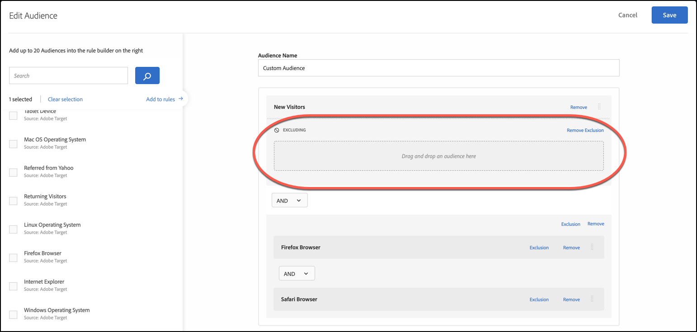

# Meerdere doelgroepen combineren{#combine-multiple-audiences}

Combineer meerdere soorten publiek (inclusief Adobe Experience Cloud-publiek en doelpubliek) en maak een ad-hocpubliek. U kunt ook uitsluitingsregels maken en het publiek uitsluiten van een regel.

Stel dat u een publiek hebt met de doelgroep &quot;Nieuwe bezoekers&quot; en een publiek met de doelgroep &quot;Chrome-gebruikers&quot;. Voor een specifieke activiteit, zou u deze bestaande publiek aan doelnieuwe bezoekers kunnen willen combineren gebruikend browsers van Chrome. In plaats van een derde publiek te maken en dit op te slaan in de [!UICONTROL Audiences] bibliotheek, kunt u deze twee soorten publiek combineren tijdens het maken van activiteiten of tijdens het bewerken van een bestaande activiteit.

Als een ander voorbeeld, kunt u alle loyaliteitklanten richten door een specifiek [!DNL Audience Manager] segment voor loyaliteitsstatus te omvatten en het te combineren met een [!DNL Target] segment dat uit mensen bestaat die zich voor uw loyaliteitsprogramma tijdens de huidige zitting, in plaats van het creëren van een derde, permanent publiek hebben aangemeld.

U kunt maximaal tien soorten publiek combineren met AND en OR.

U kunt gecombineerde doelgroepen op verschillende plaatsen door [!DNL Target] UI tot stand brengen en gebruiken.

## Een gecombineerd publiek maken tijdens het maken van een activiteit {#section_2F1CE9434CC04174B4BA2BFC89B85D77}

U kunt een gecombineerd ad-hocpubliek op de [!UICONTROL Target] pagina van de activiteit tijdens de driestapige geleide werkschema tot stand brengen.

1. Klik tijdens het maken van een [activiteit](../c-activities/activities.md#concept_D317A95A1AB54674BA7AB65C7985BA03)op de **[!UICONTROL Target]** pagina op de drie verticale ellipsen en klik vervolgens op **[!UICONTROL Replace Audience]**.

   

1. Selecteer op de [!UICONTROL Choose Audience] pagina de selectievakjes naast het gewenste publiek dat u als bouwstenen voor uw gecombineerde publiek wilt gebruiken.

   

1. Klik **[!UICONTROL Combine Multiple Audiences]** in de rechterbovenhoek.

   

1. (Voorwaardelijk) Bewerk het nieuwe gecombineerde publiek naar wens.

   In het [!UICONTROL Edit Audience] dialoogvenster kunt u extra elementen voor publieksopbouw van links naar het nieuwe gecombineerde publiek slepen en neerzetten, en uitsluitingsregels toevoegen en het publiek uitsluiten.

   1. U kunt slepen-en-neerzetten functionaliteit gebruiken om publiek binnen een bestaande sectie als niveau 2 bouwsteen toe te voegen. Als u een bouwsteen van niveau 1 wilt toevoegen, schakelt u het selectievakje naast het gewenste publiek in en klikt u op **[!UICONTROL Add to Rules]**.

      Stel dat u in het vorige voorbeeld nu Safari-gebruikers wilt opnemen in het gecombineerde publiek. Zoek naar en sleep het publiek &quot;Safari Browser&quot;in de Browser van Firefox&quot;doos op de rechterkant, zoals in het volgende voorbeeld:

      

      De operator tussen het twee publiek van het browsertype is AND. Selecteer de vervolgkeuzelijst En en wijzig deze in &quot;OR&quot; om een nieuw, gecombineerd publiek te maken voor nieuwe bezoekers met Firefox of Safari. Zorg ervoor dat u geen regels maakt die alle mogelijke publieksleden uitsluiten. Het is bijvoorbeeld niet mogelijk dat iemand een pagina gelijktijdig bezoekt met Firefox en Safari.

      >[!NOTE]
      >
      >De operator (AND of OR) moet hetzelfde blijven als het publiek dat u combineert. U kunt operatoren niet mixen en koppelen.

   1. Als u een uitsluiting aan een regel wilt toevoegen, klikt u op **[!UICONTROL Exclusion]** > **[!UICONTROL Add Exclusion]**.

      

      Sleep een publiek naar het vak:

      

      Als u bijvoorbeeld Amerikaanse bezoekers wilt uitsluiten van nieuwe bezoekers, versleept u de Market: Amerikaanse publiek in de doos, zoals hieronder getoond:

      

      Dit gecombineerde publiek omvat alle nieuwe bezoekers aan uw plaats (met uitzondering van die van San Francisco) gebruikend Safari of Firefox.

   1. Als u een publiek wilt uitsluiten van een regel, klikt u op **[!UICONTROL Exclusion]** > **[!UICONTROL Exclude this Audience.]**.

      U kunt bijvoorbeeld een gecombineerd publiek maken dat alle nieuwe bezoekers van uw site omvat, met uitzondering van bezoekers die Firefox gebruiken. Het uitsluiten van bezoekers die Firefox gebruiken is eenvoudiger en sneller dan het maken van een gecombineerd publiek dat expliciet meerdere browsers bevat (Safari, Chrome en Internet Explorer), maar Firefox is niet inbegrepen.

1. Geef een beschrijvende naam op voor het gecombineerde publiek en klik op **[!UICONTROL Save]**.

## Een gecombineerd publiek maken voor gebruik bij metrische doelen {#section_A42E795AFCBD4575809C5942039910F0}

U kunt een ad hoc gecombineerd publiek op de [!UICONTROL Goals & Settings] pagina van de activiteit tot stand brengen om in metrisch richten te gebruiken. Bijvoorbeeld om het richten tot stand te brengen die op omzetting gebruikend een gecombineerd publiek wordt gebaseerd:

1. Selecteer tijdens het bewerken of maken van een [activiteit](../c-activities/activities.md#concept_D317A95A1AB54674BA7AB65C7985BA03)op de **[!UICONTROL Goals & Settings]** pagina **[!UICONTROL Conversion]** voor de succesmetrische waarde en selecteer vervolgens **[!UICONTROL Viewed an Mbox]** als de actie.
1. Selecteer de gewenste mbox in het **[!UICONTROL Search mbox]** veld.

   

1. Klik op het tandwielpictogram en klik vervolgens op **[!UICONTROL Add Audience Targeting]**.
1. Klik op de **[!UICONTROL Add Audience/Targeting Condition]** koppeling om het [!UICONTROL Choose Audience] dialoogvenster weer te geven.

   

1. Ga met [Stap 2](../c-target/combining-multiple-audiences.md#section_2F1CE9434CC04174B4BA2BFC89B85D77) onder &quot;tot een Gecombineerd Publiek terwijl het Creëren van een Activiteit&quot;te werk om het gecombineerde publiek tot stand te brengen.

## Creeer een Gecombineerde Publiek voor Gebruik in het Melden {#section_4682D342EFBB43C38E54B99B3A1E14CD}

U kunt een gecombineerd publiek ad hoc op de pagina van de activiteit tot stand brengen voor gebruik in het melden. [!UICONTROL Goals & Settings]

1. Klik tijdens het bewerken of maken van een [activiteit](../c-activities/activities.md#concept_D317A95A1AB54674BA7AB65C7985BA03)op de **[!UICONTROL Goals & Settings]** pagina op het **[!UICONTROL Add Audience]** pictogram onder [!UICONTROL Audiences for Reporting] om de [!UICONTROL Choose Audience] pagina weer te geven.

   

1. Ga met [Stap 2](../c-target/combining-multiple-audiences.md#section_2F1CE9434CC04174B4BA2BFC89B85D77) onder &quot;tot een Gecombineerd Publiek terwijl het Creëren van een Activiteit&quot;te werk om het gecombineerde publiek tot stand te brengen.

## Een gecombineerd publiek maken tijdens het bewerken van een activiteit {#section_364A12CE96E04B61B7C18113AA586C2C}

U kunt een gecombineerd ad-hocpubliek maken terwijl u een bestaande activiteit bewerkt.

1. Houd de muisaanwijzer boven de gewenste activiteit op de [!UICONTROL Activities] pagina en klik vervolgens op het **[!UICONTROL Edit]** pictogram.

   of

   Klik op de gewenste activiteit om deze te openen en klik vervolgens op **[!UICONTROL Edit Activity]**.

1. Klik op **[!UICONTROL Configure]** > **[!UICONTROL Audiences]** > **[!UICONTROL Multiple Audiences]**.

   

1. Klik op het pictogram Meer opties (drie verticale ellipsen) naast het huidige publiek van de activiteit en klik vervolgens op **[!UICONTROL Change Audience]**.

   

1. Ga met [Stap 2](../c-target/combining-multiple-audiences.md#section_2F1CE9434CC04174B4BA2BFC89B85D77) onder &quot;tot een Gecombineerd Publiek terwijl het Creëren van een Activiteit&quot;te werk om het gecombineerde publiek tot stand te brengen.