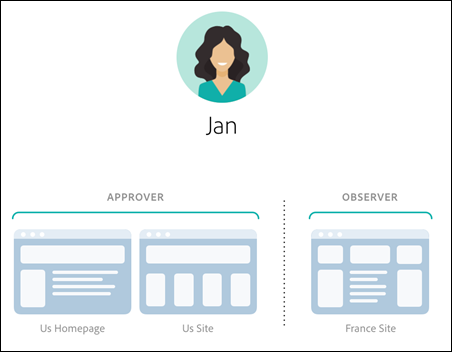

# Machtigingen voor Enterprise-gebruikers

Machtigingen voor zakelijke gebruikers zijn een manier om de toegang tot [!DNL Adobe Target] voor gebruikers in de hele onderneming formeel te beheren. Voeg gebruikers aan [!DNL Target] toe, wijs toestemmingen toe die op hun rollen worden gebaseerd, en creeer werkruimten voor teams die op verschillende afdelingen, globale plaatsen, kanalen, en andere logische groeperingen worden gebaseerd. U kunt aan gebruikers de rollen [!UICONTROL Observer], [!UICONTROL Editor], [!UICONTROL Approver] of [!UICONTROL Publisher] toewijzen.

{{permissions-update}}

## Bepaal of u toegang hebt tot bedrijfsgebruikersmachtigingen

>[!NOTE]
>
>[!UICONTROL Properties and Permissions] is beschikbaar als onderdeel van de [!DNL Target] Premium-oplossing. Deze zijn niet beschikbaar in [!DNL Target] Standard zonder een [!DNL Target] Premium-licentie.
>
>Uw [!DNL Target] -implementatie kan elke versie van at.js of [!DNL Adobe Experience Platform Web SDK] gebruiken.

Als u wilt weten of uw organisatie een Standard- of Premium-licentie heeft, klikt u op de koppeling [!UICONTROL Administration] boven aan de gebruikersinterface van [!DNL Target] .

* **[!DNL Target Standard]Klanten**: Als u het tabblad [!UICONTROL Users] ([!UICONTROL Administration > Users]) ziet (en niet het tabblad [!UICONTROL Properties] ), heeft uw organisatie een [!DNL Target Standard] licentie. [!DNL Target Standard] klanten zouden de instructies in [&#x200B; Gebruikers &#x200B;](/help/main/administrating-target/c-user-management/c-user-management/user-management.md) moeten volgen om gebruikers toe te voegen en toestemmingen in [!DNL Adobe Admin Console] toe te wijzen.

* **[!DNL Target Premium]Klanten**: Als u het tabblad [!UICONTROL Properties] ([!UICONTROL Administration > Properties]) en [!UICONTROL Users] ziet, heeft uw organisatie een [!DNL Target Premium] licentie. [!DNL Target Premium] klanten zouden de instructies in dit artikel en in [&#x200B; moeten volgen vormen ondernemingstoestemmingen &#x200B;](/help/main/administrating-target/c-user-management/property-channel/properties-overview.md).

## Voordat u aan de slag gaat met bedrijfsmachtigingen

>[!IMPORTANT]
>
>Zorg ervoor dat u de [&#x200B; Caveats &#x200B;](/help/main/administrating-target/c-user-management/property-channel/property-channel.md#section_9714311B1CD9497A86F4910F8AE635E2) hieronder sectie alvorens met ondernemingstoestemmingen leest te werk te gaan.

## In deze sectie gebruikte termen en definities {#section_F8D229544FEA41C3BC2EFD1F95AA0116}

De volgende termen worden in deze sectie gebruikt en zijn mogelijk nieuw voor gebruikers die de functies Eigenschappen en Machtigingen in [!DNL Target] Premium willen gebruiken.

### Eigenschap

Eigenschappen lijken in wezen op eigenschappen binnen [!DNL Adobe Experience Platform] omdat ze een uniek codefragment gebruiken om ze te onderscheiden.

Een webeigenschap is een bibliotheek met regels en één insluitcode. Een webeigenschap kan elke groepering van een of meer domeinen en subdomeinen zijn.

Eigenschappen worden toegelaten door een specifiek naam/waardepaar als parameter met om het even welke vraag (de vraag van het Doel, api vraag, etc.) aan [!DNL Target] toe te voegen.

Eigenschappen behoren tot specifieke kanalen (Web, Mobiel, E-mail, of API/Overige).

### Workspace (productprofiel) {#workspace}

Met een werkruimte kan een organisatie een specifieke set gebruikers toewijzen aan een specifieke set eigenschappen. In veel opzichten is een werkruimte vergelijkbaar met een rapportsuite in [!DNL Adobe Analytics] .

Opmerking: werkruimten worden in de [!UICONTROL Product Profiles] [!DNL Adobe Admin Console for Enterprise] genoemd.

Als u deel uitmaakt van een multinationale organisatie, hebt u mogelijk een werkruimte voor uw Europese webpagina&#39;s, eigenschappen of sites en een andere werkruimte voor uw Amerikaanse webpagina&#39;s, eigenschappen of sites. Als u deel uitmaakt van een organisatie met meerdere merken, hebt u mogelijk een aparte werkruimte voor elk van uw merken.

Gebruikers kunnen deel uitmaken van meerdere werkruimten en kunnen zelfs verschillende rollen binnen elke werkruimte hebben.

Gebruikers kunnen verschillende weergaven van [!DNL Adobe Target] gebruiken door te schakelen tussen werkruimten, net als bij [!DNL Analytics] -gebruikers met verschillende weergaven van [!DNL Analytics] door te schakelen tussen Rapportsets.

De werkruimten kunnen volledig verschillend publiek, codeaanbiedingen, en activiteiten omvatten.

Alle soorten publiek en activiteiten die vóór de migratie van het nieuwe model voor Enterprise-machtigingen zijn gemaakt, worden gegroepeerd in &quot;Default Workspace&quot;, zoals hieronder wordt beschreven.

Alle activiteiten die via [!DNL Adobe Experience Manager] (AEM), [!DNL Adobe Mobile Services] en [!DNL Adobe Target Classic] worden gemaakt, maken deel uit van de standaard-Workspace.

### Standaardwerkruimte

Alle bestaande werkruimten (productprofielen) in [!DNL Admin Console] worden samengevoegd in één werkruimte die &#39;Standaard-Workspace&#39; wordt genoemd tijdens de migratie van uw organisatie naar het nieuwe model voor bedrijfsmachtigingen.

>[!IMPORTANT]
>
>Verwijder Standaard Workspace niet.

Alle gebruikersrollen en toegang tot alle [!DNL Target] functionaliteit blijven hetzelfde als vóór de migratie naar het nieuwe model voor Enterprise-machtigingen.

### Gebruikersgroepen

U kunt gebruikersgroepen maken, zoals Ontwikkelaars, Analysten, Marketers en Managers. Vervolgens kunt u rechten toewijzen aan meerdere Adobe-producten en -werkruimten. Het toewijzen van een nieuw teamlid aan alle juiste rechten voor verschillende Adobe-producten kan net zo eenvoudig zijn als het toevoegen van deze rechten aan een specifieke gebruikersgroep.

### Rollen en machtigingen {#roles-permissions}

Rollen en machtigingen bepalen de toegangsniveaus die gebruikers moeten instellen en beheren voor activiteiten in uw [!DNL Target] -implementatie. In [!DNL Target] bevatten rollen het volgende:

| Rol | Beschrijving |
|--- |--- |
| [!UICONTROL Approver] | Kan activiteiten maken, bewerken en activeren of stoppen. |
| [!UICONTROL Editor] | Kan activiteiten maken en bewerken voordat deze live zijn, maar kan het starten van een activiteit niet goedkeuren. |
| [!UICONTROL Observer] | Kan activiteiten weergeven, maar kan deze niet maken of bewerken. |
| [!UICONTROL Publisher] | Lijkt op de rol [!UICONTROL Observer] (kan activiteiten weergeven, maar kan deze niet maken of bewerken). De [!UICONTROL Publisher] -rol heeft echter de extra machtiging om activiteiten te activeren. |

### Kanaal

Kanaal verwijst naar het inhoudstype van waar uw [!DNL Target] -activiteiten worden geleverd: webpagina&#39;s, mobiele apps, e-mailberichten enzovoort.

Wanneer u een activiteit creeert, wordt het gecreeerd in de momenteel geselecteerde werkruimte. U ziet de opties voor kanaalselectie in het eerste dialoogvenster waarin u het gewenste kanaal voor de activiteit kunt kiezen: Web, Mobiele app, E-mail of Overige/API.

## Overzicht van machtigingen {#section_DC2172520DA84605B218A5E9FB6D187A}

In de volgende informatie wordt uitgelegd hoe machtigingen eerder in [!DNL Target] werden afgedwongen en hoe deze worden afgedwongen met de functies [!UICONTROL Properties] en [!UICONTROL Permissions] .

Met de nieuwe functie [!UICONTROL Permissions] kunt u verschillende projecten maken (in het dialoogvenster [!DNL Adobe Admin Console for Enterprise] genaamd &#39;Productprofielen&#39;). De projecten staan u toe om verschillende toestemmingen voor één enkele gebruiker toe te wijzen die de toegangsrechten van die gebruiker voor elk project dicteren. Deze afzonderlijke projecten kunnen worden vergeleken met de manier waarop de rapportsuites werken in [!DNL Adobe Analytics] . Elk project kan specifieke gebruikers met specifieke rollen hebben die op een reeks eigenschappen van toepassing zijn. Het resultaat is dat klanten de weergave, bewerking en goedkeuringstoegang kunnen beperken tot hun gebruikers op basis van regio, omgeving (dvd/stage/prod), kanaal of andere aangepaste criteria, zoals hieronder wordt getoond:

Een specifieke gebruiker kan bijvoorbeeld toegang tot goedkeuring hebben op de Amerikaanse websites, maar alleen toegang tot de Europese mobiele app bekijken. Dezelfde gebruiker heeft mogelijk geen toegang om zelfs maar de activiteiten te bekijken die op het web en mobiele eigenschappen in de APAC-regio worden aangeboden.

Het [!DNL Target] [!UICONTROL Permissions] -model heeft de volgende machtigingsrollen (Observer, Editor, Approver en Observer). De rol van waarnemer wordt niet weergegeven in illustraties in dit artikel.

Elke rol heeft verschillende machtigingsniveaus:

| Rol | Beschrijving |
|--- |--- |
| Fiatteur | Kan activiteiten maken, bewerken en activeren of stoppen. |
| Editor | Kan activiteiten maken en bewerken voordat deze live zijn, maar kan het starten van een activiteit niet goedkeuren. |
| Waarnemer | Kan activiteiten weergeven, maar kan deze niet maken of bewerken. |
| Uitgever | Lijkt op de rol van waarnemer (kan activiteiten weergeven, maar kan deze niet maken of bewerken). De rol Publisher heeft echter de extra machtiging om activiteiten te activeren. |

Het is belangrijk om te weten dat de rol van elke gebruiker van toepassing is op elke pagina, eigenschap of site in uw account die [!DNL Target] -tags bevat, zoals hieronder wordt weergegeven:

Het nieuwe model [!DNL Target] [!UICONTROL Permissions] heeft dezelfde drie machtigingsrollen (Observer, Editor en fiatteur), maar u kunt de machtigingsrollen van een gebruiker afzonderlijk toewijzen voor afzonderlijke pagina&#39;s, eigenschappen of sites, zoals hieronder wordt weergegeven:

In dit voorbeeld heeft Jan de toestemmingen van de fiatteur aan de Homepage van de V.S. en de Plaats en de toestemmingen van de Waarnemer aan de Plaats van Frankrijk.

Bovendien kan Jan geen pagina&#39;s, eigenschappen of sites in [!DNL Target] zien die ze niet mag zien, zoals hieronder wordt getoond:

In dit voorbeeld ziet Jan de Productpagina&#39;s, de Russische Site en de Careers Site niet.

## Gebruiksscenario&#39;s {#section_F3CE8576959E4F4CB13BEEED38311DD8}

De volgende gebruiksgevallen kunnen nuttig zijn om te begrijpen hoe eigenschappen, projecten, rollen en machtigingen u kunnen helpen uw marketingdoelen te bereiken met [!DNL Target] :

### Meernationale organisatie

Als u deel uitmaakt van een multinationale organisatie, hebt u mogelijk een werkruimte voor uw Europese webpagina&#39;s, eigenschappen of sites en een andere werkruimte voor uw Amerikaanse webpagina&#39;s, eigenschappen of sites.
Na een reorganisatie, gebruikend de karakters in de illustraties hierboven, zou u opstelling werkruimten en toestemmingen gelijkend op het volgende kunnen:

* **Jan**: Jan is het Hoofd van Optimalisering in het Centrum van Uitmuntendheid voor Web-pagina&#39;s, eigenschappen, en plaatsen van de Verenigde Staten van haar organisatie. Ze heeft waarschijnlijk rechten voor Systeembeheer in de Adobe Experience Cloud.

  In haar rol, heeft zij de toestemmingen van Approver voor de Homepage van de V.S. en de Plaats van de V.S. Met de machtiging fiatteur kunt u activiteiten maken, bewerken en activeren of stoppen.

  Jan raadpleegt ook het optimalisatieteam in Frankrijk en heeft daarom waarnemersmachtigingen voor de site van Frankrijk die haar alleen-lezen toegang tot activiteiten geven. Jan kan activiteiten weergeven, maar kan deze niet maken of bewerken.

  Omdat Jan geen rol heeft die haar het zien van de Pagina&#39;s van het Product, de Plaats van Rusland, of de Plaats van Careers vereist, kan zij geen activiteiten voor die plaatsen zien.

* **Ernie**: Ernie is een Manager van de Marketing voor de organisatie verantwoordelijk voor marketing in de Verenigde Staten.

  Omdat Ernie vrij nieuw aan de organisatie en onervaren met Doel is, heeft hij de toestemmingen van de Redacteur voor de Homepage van de V.S., Plaats, en de Pagina&#39;s van het Product van de V.S. Met de toestemmingen van de Redacteur, kan Ernie activiteiten tot stand brengen en uitgeven alvorens zij levend zijn. Hij kan niet de lancering van activiteit-iemand met de toestemming van de Goedkeuring, zoals Jan goedkeuren, moet de activiteit goedkeuren alvorens het in productie kan worden gezet.

  Omdat Ernie geen rol heeft die hem vereist om de Russische Site, de Plaats van Frankrijk, of de Plaats van Careers te zien, kan hij geen activiteiten voor die plaatsen zien.

* **Diana**: Diana is nu een analist voor de organisatie en heeft waarnemerstoestemmingen voor de Plaats van de Homepage US van de V.S., de Pagina&#39;s van het Product, Rusland Plaats, en de Plaats van Frankrijk gekregen die haar read-only toegang tot activiteiten verlenen. Diana kan activiteiten bekijken, maar kan ze niet maken of bewerken.

  Omdat Diana geen rol heeft die haar nodig heeft om de website van Careers te zien, kan ze geen activiteiten voor die sites zien.

### Meermerkorganisatie

Als u deel uitmaakt van een organisatie met meerdere merken, hebt u mogelijk een aparte werkruimte voor de webpagina&#39;s, eigenschappen of sites van elk merk.

Na een reorganisatie, gebruikend de karakters in de illustraties hierboven, zou u opstellingsprojecten en toestemmingen gelijkend op het volgende kunnen:

* **Jan**: Jan is het Hoofd van Optimalisering in het Centrum van Uitmuntendheid voor een organisatie van de gezondheidszorg die in de ziekenhuis-product en consument-product ruimten werkt. Ze heeft waarschijnlijk rechten voor Systeembeheer in de Adobe Experience Cloud.

  In haar rol, heeft zij de toestemmingen van de fiatteur voor de Ziekenhuis. Met de machtiging fiatteur kunt u activiteiten maken, bewerken en activeren of stoppen.

  Jan raadpleegt ook het optimalisatieteam in de ruimte voor consumentenproducten en beschikt daarom over de machtiging Waarnemer voor die site die haar alleen-lezen toegang geeft tot activiteiten. Jan kan activiteiten weergeven, maar kan deze niet maken of bewerken.

* **Ernie**: Ernie is een Manager van de Marketing voor de organisatie verantwoordelijk voor marketing in de consument-productruimte.

  Omdat Ernie vrij nieuw aan de organisatie en onervaren met Doel is, heeft hij de toestemming van de Redacteur voor de Plaats van de Consumenten. Met de toestemmingen van de Redacteur, kan Ernie activiteiten tot stand brengen en uitgeven alvorens zij levend zijn. Hij kan niet de lancering van activiteit-iemand met de toestemmingen van de Goedkeuring voor de Plaats van de Consumenten goedkeuren, maar niet Jan in dit scenario, moet de activiteit goedkeuren alvorens het in productie kan worden gezet.

  Omdat Ernie geen rol heeft die hem ertoe noopt de Ziekenhuis te zien, kan hij geen activiteiten voor die plaats zien.

* **Diana**: Diana is nu een analist voor de organisatie en heeft waarnemerstoestemmingen voor de Ziekenhuis en de Plaats van de Consumenten gekregen die haar read-only toegang tot activiteiten geven. Diana kan activiteiten bekijken, maar kan ze niet maken of bewerken.

## Aanraakpunten voor doel-UI en bevoegdheden {#section_3414371393BB42999A268628B5456EC9}

De nieuwe functies voor machtigingen kunnen op verschillende plaatsen in de gebruikersinterface van [!DNL Target] worden weergegeven.

* **Workspace (het Profiel van het Product) drop-down lijst:** de drop-down de lijstvertoningen van Workspace bij de bovenkant van [!UICONTROL Activities], [!UICONTROL Audiences], en [!UICONTROL Offers] pagina&#39;s. Selecteer de gewenste werkruimte om de lijst te filteren zodat alleen de items in de geselecteerde werkruimte worden weergegeven.

* **de Creatie van de Activiteit:** wanneer u een activiteit creeert, wordt het gecreeerd in de momenteel geselecteerde werkruimte. U ziet de opties voor kanaalselectie in het eerste dialoogvenster waarin u het gewenste kanaal voor de activiteit kunt kiezen: Web, Mobiele app, E-mail of Overige/API.

* **Aanmaak van het publiek:** wanneer u een publiek creeert, wordt het gecreeerd in de momenteel geselecteerde werkruimte.
* **lijst van het publiek:** u kunt publiek tussen werkruimten bewegen door [!UICONTROL More Actions] te gebruiken > [!DNL Move] optie op de [!UICONTROL Audiences] pagina.
* **Aanbieding creeert:** wanneer u een aanbieding creeert, wordt het gecreeerd in de momenteel geselecteerde werkruimte.
* **pagina van Eigenschappen (Beleid > Eigenschappen):** u kunt het [!UICONTROL Search] vakje gebruiken om de [!UICONTROL Property] lijst te zoeken.

## Caveats {#section_9714311B1CD9497A86F4910F8AE635E2}

Houd rekening met het volgende wanneer u eigenschappen en machtigingen in [!DNL Target] Premium gebruikt of configureert:

* **Belangrijk**: Schrap geen werkruimten met activiteiten. Als u een werkruimte met activiteiten schrapt, werk met de Zorg van de Cliënt om die activiteiten terug te krijgen.
* Wanneer het gebruiken van Al Mijn mening van Werkruimten:

   * U kunt activiteiten, publiek, en aanbiedingen voor alle werkruimten zien die u de juiste rollen en toestemmingen hebt om toegang te hebben.
   * Wanneer u de weergave [!UICONTROL All My Workspaces] selecteert, wordt een nieuwe kolom toegevoegd aan de pagina Activiteiten, Soorten publiek en Aanbiedingen. Deze kolom maakt een lijst van de werkruimte van het punt en uw gebruikerstoestemming verbonden aan dat punt (Observer, Redacteur, of Approver),
   * Wanneer u een activiteit, publiek of aanbieding maakt in de weergave Al mijn werkruimten, moet u de werkruimte selecteren waar het item moet worden gemaakt. Alleen die werkruimten kunnen worden geselecteerd waarvoor u de machtiging Editor of fiatteur hebt.
   * Wanneer u een activiteit, een publiek of een aanbieding kopieert in de weergave Al mijn werkruimten, moet u de werkruimte selecteren waar het item moet worden gekopieerd. Alleen die werkruimten kunnen worden geselecteerd waarvoor u de machtiging Editor of fiatteur hebt.

* Elke instelling op de volgende [!UICONTROL Administration] -pagina&#39;s kan door elke [!UICONTROL Approver] in elke werkruimte worden beheerd:

   * Visual Experience Composer
   * Rapportage
   * Configuratie Scene7
   * Implementatie
   * Eigenschappen
   * Gastheren
   * Omgevingen
   * Reactiepunten
   * Gebruikers

* Gebruikers kunnen bronnen niet van de ene werkruimte (productprofiel) naar de andere verplaatsen. Kopiëren wordt echter ondersteund.
* Wanneer het publiek van de pagina [!DNL Audiences] wordt weergegeven, wordt de pagina langzamer geladen dan u had verwacht. Als u op een of andere manier met de zoekbalk werkt, worden de doelgroepen sneller weergegeven. Dit probleem is bekend en wordt in een volgende update opgelost. Dit probleem heeft geen invloed op het selecteren van doelgroepen tijdens de workflow voor het maken van activiteiten.
* De volgende middelen maken deel uit van het nieuwe model van de Toestemmingen van de Onderneming:

   * Activiteiten, doelgroepen en codeaanbiedingen die in [!DNL Target Standard/Premium] zijn gemaakt, zijn beschikbaar voor gebruik nadat de klant is ingeschakeld voor machtigingen. (Opmerking: klanten moeten het recht hebben op [!DNL Target Premium] .)
   * Eigenschappen kunnen worden toegevoegd aan bestaande activiteiten in Standaard Workspace, maar deze aanpak kan worden gewijzigd.
   * Alleen nieuwe bronnen (zoals activiteiten, codeaanbiedingen en publiek) die in Target Premium zijn gemaakt (nadat Enterprise-machtigingen zijn ingeschakeld), zijn beschikbaar om te worden beperkt door machtigingen.
   * Externe bronnen zijn alleen beschikbaar voor gebruikers in de standaard-Workspace. De rol van een gebruiker in de Standaard Workspace is globaal van toepassing (op alle verzoeken van het Doel en alle middelen van het Doel).

* De volgende middelen zijn *geen* deel van het nieuwe model van de Toestemmingen van de Onderneming:

   * Afbeeldingsaanbiedingen
   * Alle bronnen voor aanbevelingen, zoals Criteria Library, Design Library, Catalog en Recommendations Setup.
   * Bestaande bronnen (zoals activiteiten, codeaanbiedingen en publiek) die in Target Premium zijn gemaakt voordat u Enterprise-machtigingen inschakelt, kunnen worden gekopieerd, maar kunnen niet naar andere werkruimten worden verplaatst.
   * Activiteiten, publiek, codeaanbiedingen, beeldaanbiedingen, of om het even welke andere die middelen worden gecreeerd gebruikend de volgende oplossingen of de methodes kunnen niet door het model van de Toestemmingen van de Onderneming worden gecontroleerd, maar maken deel uit van StandaardWorkspace: De Klassiek van het doel, Adobe Experience Manager (AEM), de Mobiele Diensten van Adobe, en middelen die via API worden gecreeerd. De middelen die via API worden gecreeerd omvatten activiteiten, publiek, codeaanbiedingen, en beeldaanbiedingen).
   * Aanbiedingen voor afbeeldingen (middelen die zijn opgeslagen onder `https://[tenantName].marketing.adobe.com/content/mac/[tenantName]/target/offers.html#image-library` kunnen momenteel niet worden beheerd door het machtigingenmodel voor ondernemingen.
   * clickTracking en richt werk opnieuw wanneer de bestemmingsverbinding of bestemmingspagina deel van een bezit uitmaken dat in de activiteit inbegrepen is. Het is ook mogelijk dat clickTracking niet werkt wanneer de functie `targetPageParams()` wordt gebruikt. De `targetPageParamsAll()` is de aanbevolen functie.

  [!DNL Target] vereist momenteel dat een `at_property` -token aanwezig is op elke pagina waar tekstspatiëring plaatsvindt. Als het teken (1) niet aanwezig is, (2) niet op het tijdstip van activiteitenopstelling (binnen VEC) wordt ontdekt, of (3) niet overgegaan tot de clickTracking vraag van het Doel via de `targetPageParamsAll()` functie, wordt metrisch niet verhoogd en verschijnt als &quot;0.&quot;

  Hetzelfde geldt voor activiteiten die omleidingen gebruiken. De bestemmingspagina moet een `at_property` teken hebben en op het tijdstip van opstelling binnen VEC worden erkend.

  In een toekomstige versie werkt Target op pagina&#39;s waarop geen `at_property` token aanwezig is of op pagina&#39;s waarop een andere `at_property` token aanwezig is.

* De functionaliteit voor gebruikersmachtigingen voor Enterprise wordt niet ondersteund in Adobe Developer API-aanroepen.

## Veelgestelde vragen {#faqs}

Veelgestelde vragen over bedrijfsmachtigingen zijn onder andere:

### Wat gebeurt er als een gebruiker meerdere rollen en machtigingen heeft? {#multiple-roles}

Als een gebruiker veelvoudige rollen en toestemmingen heeft, wordt de rol met de hogere toestemmingen toegepast. Als een gebruiker bijvoorbeeld [!UICONTROL Observer] - en [!UICONTROL Approver] -rollen heeft, wordt de [!UICONTROL Approver] -rol toegepast.

### Kan ik een activiteit van één werkruimte naar een andere verplaatsen?

Helaas kunt u activiteiten niet van de ene werkruimte naar de andere verplaatsen. U kunt een activiteit echter naar elke werkruimte kopiëren in de wetenschap dat de rapportgegevens niet worden overgedragen. Voor meer informatie, zie &quot;het Kopiëren/het Uitgeven van een Activiteit wanneer het Gebruiken van Werkruimten&quot;in [&#x200B; het Kopiëren/het Uitgeven van een Activiteit wanneer het Gebruiken van Werkruimten &#x200B;](/help/main/c-activities/edit-activity.md#section_45A92E1DD3934523B07E71EF90C4F8B6).

Activiteiten die vóór de migratie zijn gemaakt, worden in de standaard-Workspace op dezelfde manier uitgevoerd, tenzij ze worden bewerkt en toegewezen eigenschappen. Activiteiten die onder een specifieke werkruimte vallen, respecteren de eigenschap die aan die werkruimte is toegewezen. Daarom is het mogelijk dat gedrag niet hetzelfde blijft als vóór de migratie.

### Kan ik een publiek van de ene werkruimte naar de andere verplaatsen? {#move-audience}

Ja, u kunt een publiek tussen werkruimten verplaatsen met de optie [!UICONTROL More Actions] op de pagina van [!UICONTROL Audiences] .

1. Klik op de knop **[!UICONTROL More Actions]** (de drie ovalen) en klik vervolgens op **[!UICONTROL Move]** .

   

1. Selecteer de gewenste werkruimte in de vervolgkeuzelijst **[!UICONTROL Workspace]** en klik op **[!UICONTROL Move]** .

    te bewegen

>[!NOTE]
>
>U moet de juiste rechten hebben om een publiek te bewerken. Bovendien mag het publiek niet bij andere activiteiten worden gebruikt. Als het publiek in andere activiteiten wordt gebruikt en u wilt het publiek naar een andere werkplaats verplaatsen, verwijdert u het publiek uit de andere activiteiten waar zij worden gebruikt.

### Waarom krijg ik een foutenmelding erop wijst die dat geen bezit aan deze activiteit wordt geassocieerd, alhoewel er een toegewezen bezit is?

Als u [!DNL Target] met tags hebt geïmplementeerd in [!DNL Adobe Experience Platform] en een foutbericht krijgt dat er geen eigenschap is gekoppeld aan de activiteit, geeft u de parameter `at_property` door aan de functie `targetPageParams` .

### Zijn klikspooromzettingen geregistreerd als een omgeleide pagina en activiteit URL tot verschillende eigenschappen behoren?

Klik op Tekstspatiëring wordt niet opgenomen op pagina&#39;s waarvan de pagina en activiteit-URL tot verschillende eigenschappen behoren.

Overweeg het volgende scenario:

* Pagina1 behoort tot Eigenschap1.
* Pagina2 behoort tot Eigenschap2.
* In de activiteit, richt Pagina1 zich aan Pagina2, die kliksporen bevat.

Wanneer een bezoeker Pagina1 in browser opent, wordt de bezoeker opnieuw gericht aan Pagina2. Omdat Page2 niet kwalificeert om de activiteit te leveren, bevat zijn vraag van het Doel geen kliksporen in zijn reactie.

Als de omleidingspagina en de activiteit-URL tot dezelfde eigenschap behoren, werkt het klikken op de tracks zoals verwacht. Voor meer informatie, zie [&#x200B; het volgen van de Klik &#x200B;](/help/main/c-activities/r-success-metrics/click-tracking.md).

## Trainingsvideo&#39;s

De volgende video&#39;s bevatten meer informatie over de concepten die in dit artikel worden besproken.

### De video van de opleiding: De Opleiding van de Toestemmingen van de onderneming Video 

Leerdoelstellingen:

* De drie rolniveaus die de gebruikers van Adobe Target kunnen houden
* De concepten Eigenschappen en Werkruimten, en hoe deze grenzen en groeperingen werken om voor controle over de toegangsniveaus van gebruikers toe te staan
* Verschillende eigenschappenvoorbeelden voor uw organisatie

>[!VIDEO](https://video.tv.adobe.com/v/19042/)

### Kantooruren: [!DNL Target] Premium-werkruimten

Deze video is een opname van &quot;Office Hours&quot;, een initiatief onder leiding van het Adobe Customer Care-team.

* Een werkruimte maken (productprofiel)
* Eigenschappen maken
* Gebruikers toevoegen
* Implementatie bijwerken

>[!NOTE]
>
>De gebruikersinterface van het [!DNL Target] [!UICONTROL Administration] menu (voorheen [!UICONTROL Setup] ) is opnieuw ontworpen om betere prestaties te bieden, de vereiste onderhoudstijd bij het vrijgeven van nieuwe functies te verminderen en de gebruikerservaring in het hele product te verbeteren. De informatie in de volgende video is correct, maar de opties kunnen zich op iets verschillende locaties bevinden.

>[!VIDEO](https://video.tv.adobe.com/v/23643/)
