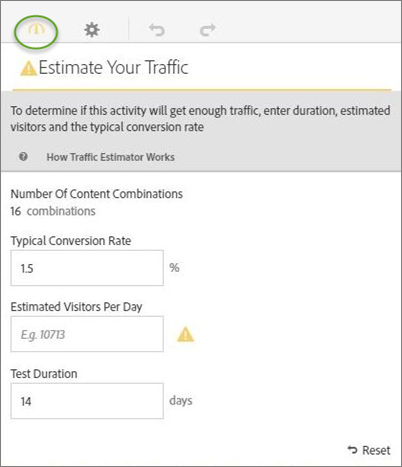

# Schatting van het verkeer dat voor een succesvolle [!UICONTROL Multivariate Test] activiteit

Omdat een multivariate test veelvoudige ervaringen vergelijkt, is het belangrijk om te weten hoeveel verkeer wordt vereist om betekenisvolle resultaten te verstrekken. De schatter van het Verkeer gebruikt statistieken over uw pagina en het aantal ervaringen die worden getest om de hoeveelheid verkeer en de testduur te schatten nodig om de test succesvol te maken.

De schatter van het Verkeer voorspelt de steekproefgrootte nodig om het volgende te verzekeren:

* 95% betrouwbaarheid. Deze statistiek betekent dat de kans op het melden van een fout-positief als er geen echte lift is, 5% is (100% - betrouwbaarheidsniveau).
* 80% statistische kracht. Dit betekent dat de waarschijnlijkheid van de test 80% bedraagt om een ware lift van 25% of meer te detecteren.
* 25% betrouwbaar waarneembare lift. [!DNL Target] berekent de hoeveelheid verkeer die vereist is om een kans van 80% te hebben om een ware lift van 25% of meer te ontdekken.

De test gebruikt de Bonferroni-correctie om meerdere vergelijkingen te corrigeren. Deze methode staat bekend om conservatief te zijn, die wordt uitgebalanceerd door een relatief groot minimum aan betrouwbaar waarneembare lift te handhaven.

De schatter van het Verkeer verstrekt ook terugkoppelt die u laat weten of u voldoende verkeer voor de test hebt u ontworpen om te slagen.

1. Van de [!UICONTROL Visual Experience Composer]klikt u op de knop **[!UICONTROL Traffic]** pictogram.

   De schatter van het Verkeer opent. U kunt op de knop **[!UICONTROL Traffic]** opnieuw om de schatter van het Verkeer te verbergen.

   

1. Geef de gemiddelde conversiesnelheid, de geschatte bezoekers per dag en de testduur op.

   * **[!UICONTROL Number of Content Combinations]**: Wordt automatisch berekend op basis van het aantal ervaringen dat wordt gemaakt als onderdeel van uw activiteit na eventuele uitsluitingen.
   * **[!UICONTROL Typical Conversion Rate]**: De omrekeningskoers wordt uitgedrukt als een percentage, op basis van uw schatting of gegevens uit het verleden van uw analysesysteem.
   * **[!UICONTROL Estimated Visitors Per Day]**: Dit is het aantal bezoekers dat deze pagina waarschijnlijk zal bekijken op basis van de doelcriteria. Dit kan op uw analysegegevens worden gebaseerd.
   * **[!UICONTROL Test Duration]**: Het aantal dagen waarop de activiteit moet worden uitgevoerd.

   De schatter van het Verkeer gebruikt deze statistieken om te bepalen welke aanpassingen nodig zijn om een succesvolle test in werking te stellen.

   Boven aan de Verkeersschatting worden de ingevoerde waarden berekend en worden de resultaten weergegeven.

   

   Terwijl u de getallen wijzigt, verandert de schatting. Bijvoorbeeld, als u vele ervaringen test en uw omzettingspercentage en de beelden te laag zijn, toont de Schatter van het Verkeer hoe lang de test moet lopen om succesvol te zijn. Of, als uw verkeer laag is, zou de schatter van het Verkeer een lager aantal ervaringen kunnen voorstellen zodat kunt u de test het gewenste aantal dagen in werking stellen.

   Als u onvoldoende verkeer hebt, kunt u een van de volgende handelingen uitvoeren of beide handelingen uitvoeren:

   * Verminder het aantal combinaties aanbiedingen en het aantal plaatsen.
   * Verhoog de duur van de test.

   Pas de aantallen aan tot de schatter van het Verkeer zegt u voldoende verkeer hebt, dan ontwerp dienovereenkomstig uw test.

   
