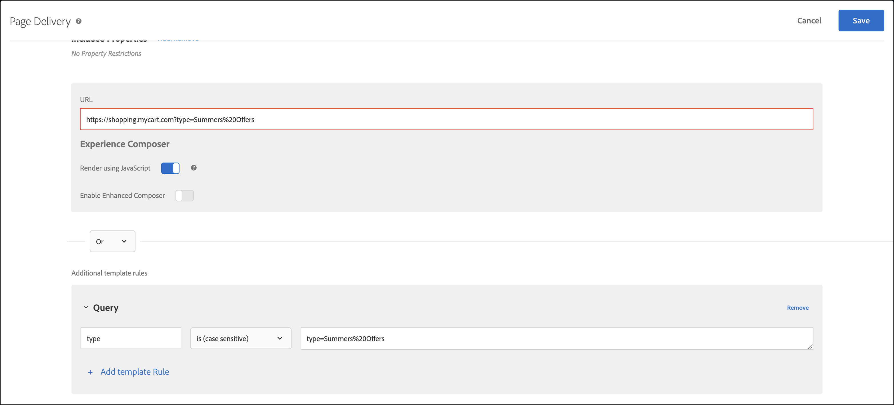

# Problemen met de levering van inhoud oplossen

Als op de pagina de verwachte inhoud niet wordt weergegeven, zijn er een paar stappen die u kunt uitvoeren om de levering van inhoud te debuggen.

* Controleer uw activiteit of campagnecode zorgvuldig. Een typefout of andere fout kan ertoe leiden dat de verwachte inhoud niet wordt weergegeven.
* Gebruik mboxTrace of mboxDebug om problemen op te lossen [!DNL Target] verzoek.
* Gebruik Foutopsporing van Adobe Experience Cloud, een makkelijk te gebruiken hulpmiddel dat veel van de zelfde informatie zoals mboxDebug verstrekt, om problemen op te lossen [!DNL Target] verzoek.

mboxDebug is vooral handig wanneer u het programma instelt [!DNL Target] op uw pagina om ervoor te zorgen dat het doelverzoek wordt geactiveerd en het cookie wordt ingesteld. Nochtans, gaat het niet in het soort detail dat wanneer het zuiveren van inhoudslevering nuttig is. Als uw activiteit niet op uw pagina verschijnt of ongewenste inhoud verschijnt, gebruik mboxTrace om de pagina in detail te onderzoeken en te zuiveren.

## Haal het toestemmingstoken terug om met het zuiveren hulpmiddelen te gebruiken {#section_BED130298E794D1FA229DB7C3358BA54}

Omdat mboxTrace en mboxDebug campagnegegevens en profielgegevens aan externe partijen kunnen blootstellen, wordt een toestemmingstoken vereist. Het toestemmingstoken kan in worden teruggewonnen [!DNL Target] UI. De token is zes uur geldig.

U moet een van de volgende gebruikersmachtigingen hebben om een verificatietoken te genereren:

* Minstens [!UICONTROL Editor] toestemming (of [!UICONTROL Approver])

   Voor meer informatie voor [!DNL Target Standard] klanten, zie [Rollen en machtigingen opgeven](/help/main/administrating-target/c-user-management/c-user-management/user-management.md#roles-permissions) in *Gebruikers*. Voor meer informatie voor [!DNL Target Premium] klanten, zie [Bedrijfsmachtigingen configureren](/help/main/administrating-target/c-user-management/property-channel/properties-overview.md).

* Beheerdersrol op het niveau van de werkruimte/het productprofiel

   Werkruimten zijn beschikbaar voor [!DNL Target Premium] alleen aan klanten. Zie voor meer informatie [Bedrijfsmachtigingen configureren](/help/main/administrating-target/c-user-management/property-channel/properties-overview.md).

* Admin Rights (bevoegdheid Sysadmin) op de [!DNL Adobe Target] productniveau

Om het toestemmingstoken terug te winnen:

1. Klik op **[!UICONTROL Administration]** > **[!UICONTROL Implementation]**.
1. Klik in het gedeelte Foutopsporingsgereedschappen op **[!UICONTROL Generate New Authentication Token]**.

   

1. Voeg het gegenereerde token als parameter toe aan uw URL om een van de geavanceerde foutopsporingsprogramma&#39;s in te schakelen.

   

## mboxTrace {#section_256FCF7C14BB435BA2C68049EF0BA99E}

mboxTrace laat u spoorinformatie in bijlage aan ontvangen [!DNL Target] reacties. Traceerinformatie weerspiegelt het resultaat van een [!DNL Target] een oproep (bijvoorbeeld een conversie of een indruk) en eventuele aanvullende gegevens die kunnen helpen bepalen waarom dit specifieke resultaat heeft plaatsgevonden, zoals een reeks beschikbare vertakkingen waaronder de selectie in een campagne heeft plaatsgevonden. Gebruik deze informatie om de levering van inhoud te zuiveren.

De volgende parameters zijn beschikbaar:

| mboxTrace-opties | Resultaat |
|--- |--- |
| `?mboxTrace=console` | Hiermee wordt het logboek als objecten afgedrukt in het logbestand van de console.<br>Voor at.js, in plaats van een nieuw browser venster of output aan de console zoals was in mbox.js (nu afgekeurd), moet u het verzoek van het Netwerk inspecteren en onder Voorproef (Chrome) of Reactie (Firefox) kijken. |
| `?mboxTrace=json` | Drukt in consolelogboek als letterlijke JSON-tekenreeks af |
| `?mboxTrace=window` | Drukt in een pop-upvenster af als een JSON-tekenreeks |
| `?mboxTrace=disable` | Hiermee schakelt u de overtreksessiemodus uit |

**Voorbeeld van aanroep van mboxTrace**

`https://www.mysite.com/page.html?mboxTrace=window&authorization=f543abf-0111-4061-9619-d41d665c59a6`

In de uitvoer wordt gedetailleerde informatie over de inhoud weergegeven. mboxTrace geeft details over uw campagne of activiteit en profiel. Het biedt ook een momentopname van het profiel vóór de uitvoering en een momentopname van wat na de uitvoering is gewijzigd. Het toont ook welke campagnes of activiteiten voor elke plaats werden geëvalueerd.

Sommige informatie omvat overeenkomende en niet-overeenkomende segment- en doel-id&#39;s:

* **SegmentId**: Identiteitskaart van segmenten, of van de herbruikbare segmentbibliotheek of anonieme die voor de bepaalde campagne worden gecreeerd.
* **TargetId**: Ids van doelstellingen, of van de bibliotheek van de doeluitdrukking of anonieme doelstellingen voor om het even welke segmenten van campagne.
* **Niet-overeenkomend**: Het verzoek kwam in deze oproep niet in aanmerking voor die segmenten of doelstellingen.
* **Gelijkend**: Het verzoek wordt gekwalificeerd voor de gespecificeerde segmenten of de doelstellingen.

**MboxTrace gebruiken op pagina&#39;s met aanbevelingen**: Als u mboxTrace toevoegt als een queryparameter op pagina&#39;s met aanbevelingen, wordt het Recommendations-ontwerp op de pagina vervangen door een venster met mboxTrace-details, dat uitgebreide informatie over uw aanbevelingen bevat, zoals:

* Recommendations heeft vs. aanbevelingen opgevraagd
* De gebruikte sleutel en of het aanbevelingen produceert
* Door criteria gegenereerde aanbevelingen versus aanbevelingen voor back-ups
* Criteria configureren
* Uitgesloten en toegepaste insluitingen
* Verzamelingsregels

U hoeft geen `=console`, `=json`, of `=window` in de queryparameter. Als u klaar bent met de mboxTrace-details, voegt u `=disable` en drukken **[!UICONTROL Enter]** om terug te keren naar de normale weergavemodus.

Het normale functioneren en de vormgeving van uw site worden niet beïnvloed door mboxTrace. Bezoekers zien je reguliere Recommendations-ontwerp.

## mboxDebug {#mboxdebug}

Als u mboxDebug wilt gebruiken, voegt u een parameter mboxDebug toe aan het einde van de URL. De volgende tabel bevat informatie over [!DNL Target] aan reacties gerelateerde URL-parameters.

>[!NOTE]
>
>Sommige parameters mboxDebug zijn beschikbaar met of zonder authentificatie.

| URL-parameters | Doel |
|--- |--- |
| `mboxDebug=1` | Foutopsporing<br>Als u deze parameter toevoegt aan een URL waarvoor Target-aanvragen zijn gedefinieerd, wordt een pop-upvenster geopend met waardevolle foutopsporingsgegevens. De informatie van het cookie, de waarden van PCid en van identiteitskaart van de Zitting worden weggeschreven, en alle URLs zijn zichtbaar. Klik op een aanvraag-URL van het doel om het antwoord voor die URL weer te geven [!DNL Target] verzoek. Meer informatie vindt u in [mbox_debug.pdf](/help/main/assets/mbox_debug.pdf). |
| `mboxDisable=1` | Vakken op de pagina uitschakelen |
| `mboxOverride.browserIp=<Insert IP address>` | Verplaatsing testen<br>Testen met deze URL-parameter. Typ een IP adres als waarde voor dit attribuut, en het groeperen van Test&amp;Target evalueert dat IP adres tegen om het even welke geotargeting of segmentatie die in een campagne wordt geplaatst aan te passen. |

>[!NOTE]
>
>Controleer of het URL-fragment zich na parameters van queryreeksen bevindt. Alles na de eerste `#` is een fragment-id en zorgt dat foutopsporingsparameters niet correct werken.

## Adobe Experience Cloud Debugger {#section_A2798ED3A431409690A4BE08A1BFCF17}

Met de Adobe Experience Cloud Debugger kunt u snel en gemakkelijk uw doelimplementatie begrijpen. U kunt uw bibliotheekconfiguratie snel bekijken, verzoeken onderzoeken om ervoor te zorgen uw douaneparameters correct worden overgegaan, console het registreren inschakelen, en alle verzoeken van het Doel onbruikbaar maken. Verifieer in de Experience Cloud en u kunt het krachtige hulpmiddel MboxTrace gebruiken om uw activiteit en publiekskwalificaties evenals uw bezoekersprofiel te inspecteren.

Zie de volgende trainingsvideo&#39;s voor meer informatie:

Zie voor meer informatie [Foutopsporing in.js met Adobe Experience Cloud Debugger](https://experienceleague.adobe.com/docs/target-dev/developer/client-side/at-js-implementation/functions-overview/target-debugging-atjs.html?lang=nl-NL){target=_blank}.

## Topverkopers worden niet weergegeven in Recommendations {#section_3920C857270A406C80BE6CBAC8221ECD}

De *`SiteCatalyst: purchase`* de vraag kan niet voor de gegevens van het het algoritmeverkeer van de Aankoop worden gebruikt. Gebruik de *`orderConfirmPage`* in plaats daarvan oproepen.

## Prioriteit activiteit controleren {#section_3D0DD07240F0465BAF655D0804100AED}

Formuliergebaseerde activiteiten gemaakt met [!DNL Target Standard/Premium] zou kunnen botsen met activiteiten die in [!DNL Target Classic] UI die de zelfde prioriteit hebben en het zelfde gebruiken [!DNL Target] verzoek.

## De code van de douane veroorzaakt niet de verwachte resultaten in Internet Explorer 8. {#section_FAC3651F19144D12A37A3E4F14C06945}

Doel biedt geen ondersteuning meer voor IE 8.

## Doelcookie wordt niet ingesteld {#section_77AFEB541C0B495EB67E29A4475DF960}

Als uw site een subdomein heeft, zoals [!DNL us.domain.com], maar u hebt de doelcookie ingesteld op [!DNL domain.com] (in plaats van [!DNL us.domain.com]), moet u de `cookieDomain` instellen. Zie voor meer informatie [targetGlobalSettings()](https://experienceleague.adobe.com/docs/target-dev/developer/client-side/at-js-implementation/functions-overview/targetglobalsettings.html?lang=nl-NL){target=_blank}.

## De doelinhoud flikkert of wordt niet weergegeven als een element ook deel uitmaakt van Adobe Experience Manager-personalisatie. {#section_9E1DABEB75AB431FB9F09887E6DD07D3}

Als een DOM-element onderdeel is van Adobe Experience Manager (AEM) personalization targeting en een doelactiviteit, kan de doelinhoud flikkeren of niet worden weergegeven.

U verhelpt deze situatie door AEM personalisatie uit te schakelen op pagina&#39;s waarop Target wordt uitgevoerd.

## Omleiding en aanbiedingen op afstand kunnen niet worden geleverd vanwege een ongeldige URL. {#section_7D09043B687F43B39DAEDF17D00375AC}

Als de omleiding of de aanbieding op afstand een ongeldige URL gebruikt, kan het zijn dat deze niet wordt geleverd.

Voor omleidingsvoorstellen [!DNL Target] reactie kan bevatten `/* invalid redirect offer URL */`

of

Voor externe aanbiedingen wordt de [!DNL Target] reactie kan bevatten `/* invalid remote offer URL */`

U kunt de [!DNL Target] in de browser of met mboxTrace. Zie [https://tools.ietf.org/html/std66](https://tools.ietf.org/html/std66) voor meer informatie over geldige URL&#39;s.

## [!DNL Target] er wordt niet op mijn site gevist .

at.js leidt geen verzoeken van het Doel in brand als u een ongeldig documenttype gebruikt. at.js vereist HTML 5 doctype.

## Zorg ervoor dat [!DNL Target] De activiteiten behandelen URLs met de parameters van het vraagkoord correct. {#query-strings}

De [!UICONTROL Activity URL] bepaalt de pagina die bezoekers voor de activiteit kwalificeert en geeft de activiteitenervaringen aan gebruikers terug. Wanneer u hierom wordt gevraagd tijdens het maken van activiteiten, zorgt het typen van de volledige URL niet altijd ervoor dat de inhoud op die sitepagina wordt geleverd, vooral niet met URL&#39;s die querytekenreeksparameters bevatten.

Standaard worden de [!UICONTROL Visual Experience Composer] (VEC) opent de pagina die in uw [Instellingen voor Visual Experience Composer](/help/main/administrating-target/visual-experience-composer-set-up.md). U kunt ook een andere pagina opgeven tijdens het maken van activiteiten.

Als u een andere pagina wilt weergeven nadat de VEC is geopend, klikt u op de knop **[!UICONTROL Configure gear icon]** > selecteren **[!UICONTROL Page Delivery]** > geeft vervolgens de gewenste URL op in het dialoogvenster [!UICONTROL Activity URL] veld.


Maar wat als URL vraagkoordparameters bevat? Werkt het en toont het gepersonaliseerde inhoud? In dit scenario, ongeacht uw doelpubliek, kunt u malplaatjeregels naast basis URL omvatten om uw vraagparameters te bepalen.

U kunt de volgende opties gebruiken om aanvullende sjabloonregels op te nemen:

### Optie 1: Repliceer de URL en zorg dat deze in de sjabloonregel blijft staan met de optie &quot;contains&quot;.

Deze optie zorgt ervoor dat deze URL in aanmerking komt voor de activiteit, maar houd er rekening mee dat er hoekgevallen aan zijn gekoppeld die uw rapportgegevens kunnen beïnvloeden met extra records aan URL&#39;s die de basis-URL bevatten.

In dit scenario is de URL `https://shopping.mycart.com?type=Summers%20Offers` en aanvullende sjabloonregels &quot;bevatten&quot; dezelfde URL, gescheiden door een OR-operator:


### Optie 2: Beperk de voorwaarde &quot;bevat&quot; van de URL met alleen de queryreeks.

Het geval in hoeken dat in de vorige optie wordt besproken wordt toegepast in deze optie, maar hier is de voorwaardelijke opstelling beperkt tot het vraagkoord slechts.

In dit scenario is de URL `https://shopping.mycart.com?type=Summers%20Offers` en de extra malplaatjeregels &quot;bevatten&quot;slechts het vraagkoord, dat door een exploitant OR wordt gescheiden:


### Optie 3: Gebruik in plaats van de volledige URL een specifiek gedeelte van de URL.

In dit scenario is de URL `https://shopping.mycart.com?type=Summers%20Offers` en aanvullende sjabloonregels specificeren een [!UICONTROL Query] with [!UICONTROL type] > [!UICONTROL is (case sensitive)] > type=Summers%20Aanbiedingen, gescheiden door een OR-operator:



## Dubbele aanhalingstekens schalen in [!DNL Target] de waarde van het profielkenmerk werkt niet zoals verwacht. {#escape}

Wanneer u waarden verzendt die dubbele aanhalingstekens bevatten in een [!DNL Target] profielkenmerk, moet u het opnieuw laten werken zoals hieronder wordt weergegeven.

```
adobe.target.trackEvent({
    "mbox": "data-collection",
    "params":    {
        "profile.tagLine": "Escape \\\"Double Quotes\\\" like this."
    }
});
```

## Trainingsvideo&#39;s

De volgende video&#39;s bevatten meer informatie over de concepten die in dit artikel worden besproken.

### De extensie toevoegen 

>[!VIDEO](https://video.tv.adobe.com/v/23114t2/)

### Standaard Adobe Target-foutopsporing 

>[!VIDEO](https://video.tv.adobe.com/v/23115t2/)

### Mbox Trace 

>[!VIDEO](https://video.tv.adobe.com/v/23113t2/)
