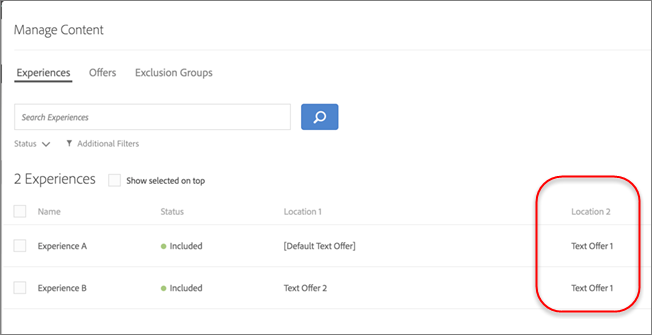

# Uitsluitingen beheren

U kunt uw [!UICONTROL Automated Personalization] (AP)-strategie besturen door uitsluitingen te beheersen. Of u dubbele aanbiedingen, het verfijnen van ervaringscombinaties, of het verwijderen van standaardinhoud verhindert, de uitsluitingen staan u toe om schonere, relevantere ervaringen te leveren die zich aan uw doelstellingen en publieksverwachtingen richten.

## Dubbele voorstellen toestaan of weigeren {#concept_4EF78013F80E48EFA024AE0274C9F037}

Voorkomen dat aanbiedingen uit de aanbiedingsbibliotheek worden gedupliceerd wanneer deze op verschillende locaties in AP-activiteiten worden gebruikt.

U hebt bijvoorbeeld een activiteit met zes locaties op een pagina met 12 aanbiedingen. Er bestaat een kans dat hetzelfde aanbod op een of meer locaties in de activiteit kan worden geplaatst. Met deze functie kunt u voorkomen dat dubbele aanbiedingen tegelijkertijd worden weergegeven op verschillende locaties binnen dezelfde activiteit.

1. Terwijl [ creërend of het uitgeven van een AP activiteit ](/help/main/c-activities/t-automated-personalization/create-ap-activity.md), klik het **[!UICONTROL Configure]** pictogram ( ) > klik **[!UICONTROL Allow Duplicate Offers]** om deze eigenschap aan en weg, afhankelijk van uw behoeften van een knevel te voorzien.

## Specifieke ervaringen uitsluiten {#task_C17D36EF58AF4908B17A3D84CA6DE85A}

Sluit specifieke ervaringen uit als u bepaalde aanbiedingscombinaties van uw AP-activiteit wilt uitsluiten.

Er zouden bepaalde combinaties kunnen zijn die niet samenwerken, of u zou het aantal geteste ervaringen kunnen beperken om verkeersvereisten voor uw activiteit te verminderen.

1. Terwijl [ creërend of het uitgeven van een AP activiteit ](/help/main/c-activities/t-automated-personalization/create-ap-activity.md), klik het **beheren Inhoud** pictogram ( ).

   In de lijst [!UICONTROL Experiences] wordt elke ervaring weergegeven die is gegenereerd op basis van de permutaties van alle opties voor inhoud en locatie.

1. Ervaringen desgewenst uitsluiten.

   U kunt specifieke ervaringen uitsluiten door het [!UICONTROL **Meer pictogram van Acties**] ( ) te klikken, dan klikkend [!UICONTROL **uitsluiten**].

   Of u kunt ervaringen in batch uitsluiten door het selectievakje voor de relevante ervaringen in te schakelen en vervolgens op **[!UICONTROL Exclude]** te klikken. Het pictogram [!UICONTROL Exclude] wordt weergegeven wanneer een of meer ervaringen worden gecontroleerd.

    uit

   De ervaringen zijn nu uitgesloten van de activiteit en de [!UICONTROL Status] show as [!UICONTROL Excluded] .

## Standaardinhoud uitsluiten {#task_DCB4528989DF4C05A3A4729E5891D18F}

Soms wilt u uw standaardinhoud mogelijk niet opnemen in uw AP-activiteit. Met deze methode kunt u slechts één aanbieding (anders dan de standaardinhoud) op een locatie plaatsen als onderdeel van uw activiteit.

Het uitsluiten van standaardinhoud is een goede manier om de vormgeving van de rest van de pagina aan te passen aan de aanbiedingen die u test met uw AP-activiteit. Stel dat u bijvoorbeeld het kleurenpalet wilt aanpassen van de aanbiedingen die u test, u de achtergrondkleur van de pagina kunt wijzigen en de standaardachtergrondkleur wilt uitsluiten.

**om standaardinhoud uit te sluiten gebruikend [!UICONTROL Visual Experience Composer] (VEC):**

1. Terwijl [ creërend of het uitgeven van een AP activiteit ](/help/main/c-activities/t-automated-personalization/create-ap-activity.md), selecteer de inhoud u wilt vervangen en klikken om tot **[!UICONTROL Change Text/HTML]**, **[!UICONTROL Change Image Offer]**, of **[!UICONTROL Change Background Color]** toegang te hebben. Welke opties beschikbaar zijn, is afhankelijk van het type inhoud.

   
1. Maak uw nieuwe inhoud.

1. Klik **[!UICONTROL More Actions]** ( ), dan klik de **Uitsluiten StandaardAanbieding/omvat Gebrek**/ knevel om de standaardaanbieding uit te sluiten of te omvatten.

   <!-- Depending on the content or offer type, the [!UICONTROL Include] checkbox is in a slightly different place. 

   For Text/HTML content: 

   

   For Image/Video content: 

   

   For background color: 

   -->

<!-- 1. Click **[!UICONTROL Save]**.

   You can see the experiences created from the offers you specified under [!UICONTROL Manage Content]. You notice that no experiences are created in [!UICONTROL Manage Content] using the default offer you excluded. 

   

**To exclude default content using the [!UICONTROL Form-Based Experience Composer]:** 

1. While creating or editing an AP activity, click **[!UICONTROL Change Text/HTML]** or **[!UICONTROL Change Image Offer]** under **[!UICONTROL Content]**. 
1. In the dialog box, create your new content and uncheck **[!UICONTROL Include]** to the right of the default content (or uncheck the Default Image/Video in the [!UICONTROL Select Content] screen). 

   Depending on the content or offer type, the [!UICONTROL Include] checkbox is in a slightly different place. 

   For Text/HTML content: 

   

   For Image/Video content: 

   

1. Click **[!UICONTROL Save]**. 

   You can see the experiences created from the offers you specified under [!UICONTROL Manage Content]. You notice that no experiences are created in [!UICONTROL Manage Content] using the default offer you excluded. 

   -->
