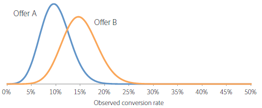

# Hoelang moet u een A/B test in werking stellen?

Voor een geslaagde [!UICONTROL A/B Test] -activiteit in [!DNL Adobe Target] zijn voldoende bezoekers nodig (voorbeeldgrootte) om de conversiesnelheid te verbeteren. Hoe weet u hoe lang om een test A/B in werking te stellen? Dit artikel bevat informatie over [!UICONTROL Auto-Allocate] -activiteiten en de [!UICONTROL Adobe Target] samplegroottecalculator om ervoor te zorgen dat uw activiteit voldoende bezoekers heeft om uw doelstellingen te bereiken.

Het is verleidelijk om een activiteit stop te zetten als een van de aanbiedingen in de eerste dagen van de activiteit beter of slechter presteert dan de andere. Wanneer het aantal waarnemingen echter laag is, is het zeer waarschijnlijk dat een positieve of negatieve lift bij toeval wordt waargenomen omdat de omrekeningskoers gemiddeld is over een laag aantal bezoekers. Aangezien de activiteit meer gegevenspunten verzamelt, komen de omzettingspercentages in de richting van hun ware langetermijnwaarden.

>[!IMPORTANT]
>
>Een vroegtijdig stoppen van een activiteit is een van de tien belangrijke valkuilen waar u bij het uitvoeren van een A/B-test op kunt vertrouwen. Voor meer informatie, zie [&#x200B; gemeenschappelijke A/B testende valkuilen en hoe te om hen te vermijden &#x200B;](/help/main/c-activities/t-test-ab/common-ab-testing-pitfalls.md#concept_578A7947C9554868B30F12DFF9E3F8E3).

[!DNL Adobe Target] biedt hulpprogramma&#39;s waarmee u ervoor kunt zorgen dat uw activiteit groot genoeg is om uw conversiedoelstellingen te bereiken: Automatisch toewijzen.

## Automatisch toewijzen {#auto-allocate}

Een [&#x200B; auto-Wijs &#x200B;](/help/main/c-activities/automated-traffic-allocation/automated-traffic-allocation.md) activiteit toe is een type van test A/B die een winnaar onder twee of meer ervaringen identificeert. Een [!UICONTROL Auto-Allocate] test wijst automatisch meer verkeer aan de winnaar toe om omzettingen te verhogen terwijl de test blijft lopen en leren.

Standaard A/B-tests hebben inherente kosten. U moet verkeer uitgeven om prestaties van elke ervaring te meten en door analyse de het winnen ervaring te berekenen. De verdeling van het verkeer blijft vast zelfs nadat u erkent dat sommige ervaringen anderen overtreffen. Bovendien is het ingewikkeld om de steekproefgrootte te bepalen, en de activiteit moet zijn volledige cursus in werking stellen alvorens u op een winnaar kunt handelen. En er is nog steeds een kans dat de geïdentificeerde winnaar geen echte winnaar is.

De oplossing is [!UICONTROL Auto-Allocate] . [!UICONTROL Auto-Allocate] verlaagt deze kosten en overheadkosten voor het bepalen van een winnende ervaring. [!UICONTROL Auto-Allocate] bewaakt de beoogde metrische prestaties van alle ervaringen en stuurt meer nieuwkomers proportioneel naar de hoogwaardige ervaringen. Voldoende verkeer is gereserveerd om de andere ervaringen te onderzoeken. U kunt de voordelen van de activiteit op uw resultaten zien, zelfs terwijl de activiteit nog loopt: optimalisering komt parallel aan het leren voor.

Met [!UICONTROL Auto-Allocate] krijgen bezoekers geleidelijk de overstap naar het winnen van ervaringen, in plaats van dat u wacht tot een activiteit eindigt om de winnaar te bepalen. U profiteert sneller van een lift omdat deelnemers aan activiteiten die naar minder succesvolle ervaringen zouden zijn gestuurd, potentiële winnende ervaringen kunnen laten zien.

Als u [!UICONTROL Auto-Allocate] gebruikt, geeft [!DNL Target] boven aan de pagina van de activiteit een symbool weer dat &#39;Geen winnaar nog&#39; aangeeft, totdat de activiteit het minimale aantal conversies met voldoende vertrouwen bereikt. [!DNL Target] declareert vervolgens de winnende ervaring door een badge boven aan de pagina van de activiteit weer te geven.

Voor meer informatie, zie [&#x200B; auto-Wijs overzicht &#x200B;](/help/main/c-activities/automated-traffic-allocation/automated-traffic-allocation.md) toe.

## Adobe [!DNL Target] calculator voorbeeldgrootte {#section_6B8725BD704C4AFE939EF2A6B6E834E6}

Als u ervoor kiest om een handmatige [!UICONTROL A/B Test] activiteit in plaats van [!UICONTROL Auto-Allocate] te gebruiken, helpt de [!DNL Target] calculator van de Grootte van de Steekproef u de steekproefgrootte te bepalen nodig voor een succesvolle test. Een handmatige A/B-test is een test met een vaste horizon, zodat de calculator nuttig is. Het gebruik van de rekenmachine voor een [!UICONTROL Auto-Allocate] -activiteit is optioneel omdat [!UICONTROL Auto-Allocate] een winnaar voor u declareert. De calculator geeft u een ruwe schatting van de steekproefgrootte nodig. Lees verder voor meer informatie over het gebruik van de rekenmachine.

Alvorens vestiging uw test A/B, toegang tot de [!DNL Adobe Target] [&#x200B; calculator van de Grootte van de Steekproef &#x200B;](https://experienceleague.adobe.com/tools/calculator/testcalculator.html?lang=nl-NL).

Het is belangrijk om een adequate steekproefgrootte (aantal bezoekers) te bepalen alvorens om het even welke A/B test te doen om de tijd te bepalen dat de activiteit zou moeten lopen alvorens de resultaten te evalueren. Eenvoudig toezicht op de activiteit totdat statistische significantie wordt bereikt, leidt tot een veel te lage schatting van het betrouwbaarheidsinterval, waardoor de test onbetrouwbaar wordt. De intuïtie achter dit resultaat is dat, als een statistisch significant resultaat wordt gedetecteerd, de test wordt stopgezet en een winnaar wordt gedeclareerd. Als het resultaat echter niet statistisch significant is, mag de test worden voortgezet. Deze procedure is sterk gunstig voor het positieve resultaat, waardoor de fout-positieve snelheid toeneemt en het effectieve significantieniveau van de test daardoor wordt verstoord.

Deze procedure kan leiden tot een groot aantal valse positieven, wat leidt tot de uitvoering van aanbiedingen die uiteindelijk niet de voorspelde lift leveren. Een slechte lift zelf is een onbevredigende uitkomst, maar een nog ernstiger gevolg is dat het onvermogen om de lift nauwkeurig te voorspellen, in de loop der tijd het organisatorische vertrouwen in het testen als praktijk ondermijnt.

In dit artikel worden de factoren besproken die in evenwicht moeten zijn wanneer een steekproefgrootte wordt bepaald en wordt een rekenmachine geïntroduceerd voor het schatten van een adequate steekproefgrootte. Als u de steekproefgrootte berekent met behulp van de voorbeeldgroottecalculator (zie de bovenstaande link) voordat een A/B-test begint, weet u zeker dat u altijd A/B-tests van hoge kwaliteit uitvoert die voldoen aan statistische standaarden.

Er zijn vijf user-defined parameters die een test A/B bepalen. Deze parameters zijn met elkaar verbonden, zodat wanneer er vier worden vastgesteld, het vijfde kan worden berekend:

* Statistische significantie
* Statistisch vermogen
* Minimale betrouwbare aantoonbare lift
* Omrekeningskoers basislijn
* Aantal bezoekers

>[!IMPORTANT]
>
>Voor nauwkeurige resultaten moet u de pagina opnieuw laden voordat u parameternummers wijzigt. Herhaal dit proces elke keer dat u parameternummers wijzigt.

Voor een A/B-test worden de statistische significantie, het statistische vermogen, de minimale betrouwbaar detecteerbare lift en de basislijnconversiesnelheid door de analist vastgesteld en vervolgens wordt het vereiste aantal bezoekers berekend op basis van deze getallen. Dit artikel bespreekt deze elementen en geeft richtlijnen voor hoe te om deze metriek voor een specifieke test te bepalen.

In onderstaande afbeelding worden de vier mogelijke resultaten van een A/B-test weergegeven:

Het is wenselijk om geen valse positieve of valse negatieven te krijgen. Een statistische test kan echter nooit garanderen dat geen valse positieven worden verkregen. Het is altijd mogelijk dat waargenomen trends niet representatief zijn voor de onderliggende omrekeningskoersen. In een test om bijvoorbeeld te zien of koppen of staarten op een omdraaiing van een munt waarschijnlijker waren, zelfs met een eerlijke munt, kon je per toeval tien koppen op tien tenen krijgen. De statistische significantie en macht helpen ons de vals-positieve en vals-negatieve cijfers te kwantificeren en ons in staat te stellen deze voor een bepaalde test op een redelijk niveau te houden.

### Statistische significantie {#section_8230FB9C6D1241D8B1786B72B379C3CD}

Het significantieniveau van een test bepaalt hoe waarschijnlijk het is dat de test een significant verschil in omrekeningskoersen tussen twee verschillende aanbiedingen meldt, terwijl er in feite geen echt verschil is. Deze situatie wordt een fout van het type I of een fout van het type I genoemd. Het significantieniveau is een door de gebruiker opgegeven drempel en is een afweging tussen de tolerantie voor valse positieven en het aantal bezoekers dat in de test moet worden opgenomen.

Bij een A/B-test wordt er aanvankelijk van uitgegaan dat beide aanbiedingen dezelfde omrekeningskoers hebben. Vervolgens wordt de waarschijnlijkheid van het waargenomen resultaat berekend op basis van deze veronderstelling. Als deze waarschijnlijkheid (de p-waarde) kleiner is dan een vooraf gedefinieerde drempelwaarde (het significantieniveau), concludeert [!DNL Target] dat de aanvankelijke aanname (dat beide aanbiedingen dezelfde conversiekoers hebben) onjuist is. Daarom zijn de conversiekoersen van A en B statistisch verschillend op het gegeven significantieniveau.

Een algemeen gebruikt significantieniveau bij A/B-tests is 5%, wat overeenkomt met een betrouwbaarheidsniveau van 95% (betrouwbaarheidsniveau = 100% - significantieniveau). Een betrouwbaarheidsniveau van 95% betekent dat er telkens als je een test doet, een kans van 5% is om een statistisch significante lift te detecteren, zelfs als er geen verschil is tussen de aanbiedingen.

De typische interpretaties van het betrouwbaarheidsniveau worden in de onderstaande tabel samengevat:

| Vertrouwensniveau | Interpretatie |
|--- |--- |
| &lt; 90% | Er zijn geen aanwijzingen dat er een verschil is tussen de omrekeningskoersen |
| 90-95% | Zwak bewijs dat er een verschil is tussen de omrekeningskoersen |
| 95-99% | Matig bewijs dat er een verschil is tussen de omrekeningskoersen |
| 99-99,9% | Sterk bewijs dat er een verschil is tussen de omrekeningskoersen |
| +99,9% | Zeer sterk bewijs dat er een verschil is tussen de omrekeningskoersen |

Aanbevolen wordt altijd een betrouwbaarheidsniveau van 95% of meer te gebruiken.

Het is wenselijk het hoogst mogelijke betrouwbaarheidsniveau te gebruiken, zodat de test weinig vals-positieve resultaten oplevert. Voor een hoger betrouwbaarheidsniveau is echter een groter aantal bezoekers nodig, waardoor de test langer duurt. Bovendien leidt een stijging van het betrouwbaarheidsniveau tot een afname van de statistische macht.

### Statistisch vermogen {#section_1169C27F8E4643719D38FB9D6EBEB535}

Het statistische vermogen van een A/B-test is de waarschijnlijkheid dat een reëel verschil in omrekeningskoers van een bepaalde omvang wordt opgespoord. Vanwege de willekeurige (stochastische) aard van conversiegebeurtenissen is het mogelijk dat een statistisch significant verschil niet wordt waargenomen, alleen toevallig, ook al is er een reëel verschil in conversiekoers tussen de twee aanbiedingen. Dit scenario wordt een fout van het vals negatieve of type II genoemd.

De statistische macht wordt vaak genegeerd omdat de bepaling van het statistische vermogen, in tegenstelling tot de statistische significantie, niet vereist is voor een A/B-test. Door het statistische vermogen buiten beschouwing te laten, bestaat er echter een grote kans dat reële verschillen tussen de omrekeningskoersen van de verschillende aanbiedingen niet door de test worden opgespoord omdat de steekproefgrootte te klein is. Deze situatie leidt ertoe dat de tests worden gedomineerd door valse positieven.

Het is wenselijk over een hoge statistische kracht te beschikken, zodat de test een grote kans heeft om een reëel verschil in omrekeningskoersen vast te stellen en minder valse negatieven oplevert. Er is echter een groter aantal bezoekers nodig om de statistische capaciteit voor het detecteren van een bepaalde lift te vergroten, waardoor de tijd die nodig is om de test uit te voeren, toeneemt.

Een algemeen gebruikte waarde voor het statistische vermogen is 80%, wat betekent dat de test een kans van 80% heeft om een verschil te detecteren dat gelijk is aan de minimale betrouwbaar waarneembare lift. De kans dat bij de test kleinere liften worden opgespoord en de kans dat grotere liften worden opgespoord, is kleiner.

### Minimale betrouwbare aantoonbare lift {#section_6101367EE9634C298410BBC2148E33A9}

De meeste organisaties willen het kleinst mogelijke verschil in conversiekoers meten omdat zelfs een kleine lift de implementatie waard is. Als u echter wilt dat de A/B-test een grote kans heeft om een kleine lift te detecteren, is het aantal bezoekers dat in de test moet worden opgenomen, buitensporig groot. De reden hiervoor is dat, als het verschil in omrekeningskoers klein is, beide omrekeningskoersen zeer nauwkeurig moeten worden ingeschat om het verschil te kunnen vaststellen, wat veel bezoekers vereist. Daarom moet de minimale betrouwbare aantoonbare lift worden bepaald aan de hand van de bedrijfsvereisten, rekening houdend met de afwegingen tussen het opsporen van kleine liften en het gedurende langere tijd uitvoeren van de test.

Stel dat twee aanbiedingen (A en B) werkelijke conversiekoersen hebben van respectievelijk 10% en 15%. Als deze aanbiedingen elk aan 100 bezoekers worden getoond, is er een kans van 95% om conversiekoersen in de waaier van 4% tot 16% voor aanbieding A en van 8% tot 22% voor aanbieding B als gevolg van het stochastische karakter van omzettingen in acht te nemen. Deze reeksen zijn bekend als betrouwbaarheidsintervallen in statistieken. Zij vertegenwoordigen het vertrouwen in de nauwkeurigheid van de geraamde omrekeningskoersen. Hoe groter de steekproefgrootte (meer bezoekers), des te betrouwbaarder kunt u zijn dat de ramingen van de omrekeningskoersen nauwkeurig zijn.

In de onderstaande afbeelding ziet u deze kansverdeling.

Wegens de grote overlapping tussen de twee bereiken, kan de test niet bepalen of de omzettingspercentages verschillend zijn. Daarom kan bij deze test met 100 bezoekers geen onderscheid worden gemaakt tussen de twee aanbiedingen. Als [!DNL Target] de aanbiedingen echter aan 5000 bezoekers elk weergeeft, is er een kans van 95% dat de waargenomen conversiekoersen tussen respectievelijk 9% en 11% en 14% en 16% dalen.

In dit geval is het onwaarschijnlijk dat de test tot een verkeerde conclusie leidt, zodat de test met 5000 bezoekers een onderscheid kan maken tussen de twee aanbiedingen. De test met 5.000 bezoekers heeft een betrouwbaarheidsinterval van +/- 1%. Dit betekent dat de test verschillen van ongeveer 1% kan detecteren. Daarom zouden er nog meer bezoekers nodig zijn als de werkelijke omrekeningskoersen van de aanbiedingen bijvoorbeeld 10% en 10,5% waren in plaats van 10% en 15%.

### Omrekeningskoers basislijn {#section_39380C9CA3C649B6BE6E1F8A06178B05}

De basisomrekeningskoers is de omrekeningskoers van de controleaanbieding (aanbod A). Vaak hebt u een goed idee van het conversieniveau voor de aanbieding op basis van ervaring. Als dat niet het geval is, bijvoorbeeld omdat het een nieuw soort aanbod of creatief is, kan de test een dag of zo lopen om een ruwe schatting te krijgen van de basisomrekeningskoers die kan worden gebruikt in de steekproefgrootteberekening.

### Aantal bezoekers {#section_19009F165505429E95291E6976E498DD}

Het kan moeilijk zijn om de opportuniteitskosten van het langdurig uitvoeren van een test in evenwicht te brengen met het risico van valse positieven en valse negatieven. U wilt natuurlijk niet de verkeerde beslissingen nemen, maar verlamming door te strenge of rigide testnormen is ook niet wenselijk.

Als algemeen richtsnoer worden een betrouwbaarheidsniveau van 95% en een statistische macht van 80% aanbevolen.

In de voorbeeldgroottecalculator (zie de bovenstaande link) wordt u gevraagd een besluit te nemen over de statistische significantie (aanbeveling: 95%) en het statistische vermogen (aanbeveling: 80%). Na het ingaan van de basisomrekeningskoers en het dagelijkse verkeer over alle aanbiedingen, output de spreadsheet het aantal bezoekers die voor het ontdekken van een lift van 1%, 2%, 5%, 10%, 15%, en 20% met een waarschijnlijkheid gelijk aan de gespecificeerde macht van de test worden vereist. Met het werkblad kan de gebruiker ook een aangepaste minimum betrouwbare aantoonbare lift invoeren. Bovendien levert de spreadsheet het aantal weken dat nodig is voor de test op basis van het door de gebruiker ingevoerde verkeersniveau. Het vereiste aantal weken wordt naar boven afgerond naar de dichtstbijzijnde hele week om te voorkomen dat effecten op de dag-van-week de resultaten beïnvloeden.

Er is een wisselwerking tussen de minimumlift die door de test betrouwbaar kan worden geïdentificeerd en het vereiste aantal bezoekers. De onderstaande afbeelding, die geldig is voor een basislijn (controle) conversiesnelheid van 5%, geeft een sterk afnemend rendement om het aantal bezoekers te verhogen. De minimale lift die betrouwbaar kan worden gedetecteerd, verbetert enorm wanneer de eerste paar bezoekers aan de test worden toegevoegd, maar het neemt steeds meer bezoekers in beslag om de test te verbeteren. Het cijfer helpt om een passende afweging te vinden tussen de tijd die nodig is om de test uit te voeren (zoals bepaald door het aantal bezoekers dat nodig is en het verkeer op de site) en de minimale lift die door de test betrouwbaar kan worden gedetecteerd.

In dit voorbeeld, zou u kunnen besluiten dat het kunnen ontdekken van een lift van 5% (die aan een omzettingspercentage van de alternatieve aanbieding van (100%+5%) &#42; 5% = 5.25%) in 80 van 100 tests beantwoordt, zodat hebt u een steekproefgrootte van 100.000 bezoekers aan elke aanbieding nodig. Als de plaats 20.000 bezoekers per dag heeft en u twee aanbiedingen test, zou de test voor 2 &#42; moeten worden toegestaan 100.000/20.000 = 10 dagen alvorens het kan worden bepaald of de alternatieve aanbieding statistisch significant boven de controleaanbieding is.

Ook hier wordt aanbevolen de vereiste tijd altijd naar boven af te ronden tot de dichtstbijzijnde hele week, zodat effecten op de dag van de week worden vermeden. In dit voorbeeld zou de test dus twee weken worden uitgevoerd voordat de resultaten worden geëvalueerd.

### Opbrengst per bezoek metrisch {#section_C704C0861C9B4641AB02E911648D2DC2}

Bij gebruik van de waarde van de inkomsten per bezoek (RPV) als maatstaf wordt een extra bron van variantie toegevoegd omdat RPV het product is van de inkomsten per bestelling en de omrekeningskoers (RPV = Inkomsten / #bezoekers = (Inkomsten per bestelling &#42; #orders) / # bezoekers = Inkomsten per bestelling &#42; (#bezoekers &#42; CTR) / #bezoekers = Inkomsten per bestelling &#42; CTR), elk met een eigen variatie. De variantie van de omrekeningskoers kan rechtstreeks worden geschat aan de hand van een wiskundig model, maar de variantie van de inkomsten per opdracht is specifiek voor de activiteit. Gebruik daarom de kennis van deze afwijking van vroegere activiteiten of voer de A/B-test gedurende een paar dagen uit om de variantie in inkomsten te schatten. De variantie wordt berekend op basis van de waarden Som van verkoop, Som van verkoop vierkant en Aantal bezoekers in het CSV-downloadbestand. Nadat dit is vastgesteld, gebruikt u het spreadsheet om de tijd te berekenen die nodig is om de test te voltooien.

De calculator van de steekproefgrootte (de verbinding die hierboven wordt verstrekt) kan u helpen metrisch RPV vormen. Wanneer u de rekenmachine opent, ziet u een tab met het label [!UICONTROL RPV Metric] . U hebt de volgende informatie nodig wanneer u de RPV-versie van de calculator gebruikt:

* Aantal bezoekers van het controleaanbod
* Totale inkomsten uit de controleaanbieding

  Controleer of het filter voor extreme volgorde is geselecteerd.

* De som van de inkomsten uit vierkanten van het controleaanbod

  Controleer of het filter voor extreme volgorde is ingeschakeld.

Over het algemeen duurt het gebruik van RPV als metrische waarde 20-30% langer om hetzelfde niveau van statistisch vertrouwen te bereiken voor hetzelfde niveau van gemeten lift. Dit komt omdat RPV de extra variantie van verschillende ordegrootten per omzetting heeft. Dit zou een overweging moeten zijn wanneer het kiezen tussen recht omzettingspercentage en RPV als metrisch waarop uw definitieve bedrijfsbesluit wordt gebaseerd.

## Correctie voor vergelijking van meerdere aanbiedingen {#section_1474113764224D0B85472D8B023CCA15}

Telkens wanneer u twee vergelijkt, is de kans om een fout-positief te krijgen (het observeren van een statistisch significant verschil zelfs wanneer er geen verschil in omrekeningskoers is) gelijk aan het significantieniveau. Als er bijvoorbeeld vijf aanbiedingen aanwezig zijn, A/B/C/D/E en A het controleaanbod is, worden vier vergelijkingen uitgevoerd (controle op B, controle op C, controle op D en controle op E) en is de waarschijnlijkheid van een vals positief 18,5%, zelfs als het betrouwbaarheidsniveau 95% is, omdat Pr(ten minste één vals positief) = 1 - Pr(geen vals positief) = 1 - 0,95 = 18,5%. Een vals positief is in deze context gedefinieerd als ofwel de controle waarvan melding wordt gemaakt beter is dan het alternatief, ofwel het alternatief waarvan melding wordt gemaakt dat het beter is dan de controle, terwijl er in feite geen verschil tussen de controles is.

## Conclusie {#section_AEA2427B90AE4E9395C7FF4F9C5CA066}

Door een [!UICONTROL Auto-Allocate] -activiteit te gebruiken, identificeert [!DNL Target] een winnaar onder twee of meer ervaringen en wijst het automatisch meer verkeer toe aan de winnaar om de conversie te verhogen terwijl de test blijft lopen en leren. Met [!UICONTROL Auto-Allocate] kunt u eenvoudig uw conversiedoelstellingen bereiken en tegelijkertijd het gokken-werk verwijderen.

Door de voorbeeldgroottecalculator (hierboven beschreven link) te gebruiken die in dit artikel is geïntroduceerd en de test te laten uitvoeren voor de hoeveelheid tijd die door de test wordt voorgesteld, kunt u ervoor zorgen dat u altijd A/B tests van hoge kwaliteit doet die aan vals positieve en vals negatieve tarieven houden u hebt besloten voor de specifieke test adequaat zijn. Dit zorgt ervoor dat uw tests verenigbaar zijn en de lift betrouwbaar kunnen ontdekken u zoekt.
