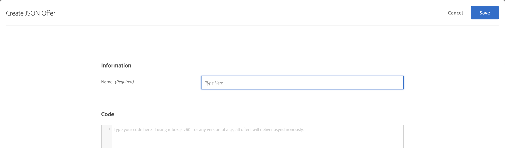

# JSON-aanbiedingen maken

JSON-aanbiedingen maken in het dialoogvenster [!UICONTROL Offer Library] in [!DNL Adobe Target] voor gebruik in de [!UICONTROL Form-Based Experience Composer].

JSON-aanbiedingen kunnen worden gebruikt in op formulieren gebaseerde activiteiten waarbij het mogelijk is gevallen te gebruiken waarin [!DNL Target] Beslissing is vereist om een aanbod in JSON-indeling te verzenden voor gebruik in SPA framework of serverintegratie.

## JSON-overwegingen

Houd rekening met de volgende informatie terwijl u met JSON werkt:

* JSON-voorstellen zijn momenteel alleen beschikbaar voor [!UICONTROL A/B Test], Automated Personalization (AP) en [!UICONTROL Experience Targeting] (XT) activiteiten.
* JSON-aanbiedingen kunnen worden gebruikt in [op formulieren gebaseerde activiteiten](/help/main/c-experiences/form-experience-composer.md) alleen.
* U kunt de JSON-aanbieding rechtstreeks ophalen wanneer u de [Server Side API&#39;s en Mobile Node.js, Java, .NET en Python SDK&#39;s](https://developer.adobe.com/target/implement/server-side/){target=_blank}.
* In de browser kunnen JSON-aanbiedingen ALLEEN worden opgehaald via at.js 1.2.3 (of hoger) en via [getOffer()](https://developer.adobe.com/target/implement/client-side/atjs/atjs-functions/adobe-target-getoffer/){target=_blank} door acties te filteren met de `setJson` handeling.
* JSON-aanbiedingen worden geleverd als native JSON-objecten in plaats van als tekenreeksen. Consumenten van deze objecten hoeven objecten niet langer als tekenreeksen te verwerken en deze in JSON-objecten om te zetten.
* JSON-aanbiedingen worden niet automatisch toegepast in tegenstelling tot andere aanbiedingen (zoals HTML-aanbiedingen), omdat JSON-aanbiedingen niet-visuele aanbiedingen zijn. Ontwikkelaars moeten code schrijven om de aanbieding expliciet op te halen met [getOffer()](https://developer.adobe.com/target/implement/client-side/atjs/atjs-functions/adobe-target-getoffer/){target=_blank}.

## Een JSON-aanbieding maken {#section_BB9C72D59DEA4EFB97A906AE7569AD7A}

1. Klik op **[!UICONTROL Offers]** > **[!UICONTROL Code Offers]**.

   

1. Klik op **[!UICONTROL Create]** > **[!UICONTROL JSON Offer]**.

   

1. Typ een naam voor het voorstel.
1. Typ of plak uw JSON-code in het dialoogvenster **[!UICONTROL Code]** doos.
1. Klik op **[!UICONTROL Save]**.

## JSON-voorbeeld {#section_A54F7BB2B55D4B7ABCD5002E0C72D8C9}

JSON-aanbiedingen worden alleen ondersteund in activiteiten die zijn gemaakt met de [Formuliergebaseerde Experience Composer](/help/main/c-experiences/form-experience-composer.md). De enige manier om JSON-aanbiedingen te kunnen gebruiken is momenteel via directe API/SDK-aanroepen.

Hier volgt een voorbeeld:

```json
adobe.target.getOffer({ 
  mbox: "some-mbox", 
  success: function(actions) { 
    console.log('Success', actions); 
  }, 
  error: function(status, error) { 
    console.log('Error', status, error); 
  } 
});
```

De acties die aan succesvolle callback worden overgegaan zijn een serie van voorwerp. Ervan uitgaande dat we één enkel JSON-aanbod hebben, dat de volgende inhoud heeft:

```json
{ 
  "demo": {"a": 1, "b": 2} 
}
```

De actiesarray heeft deze structuur:

```json
[ 
 { 
   action: "setJson", 
   content: [{ 
     "demo": {"a": 1, "b": 2} 
   }] 
 }  
]
```

Als u het JSON-aanbod wilt extraheren, doorloopt u de handelingen en zoekt u de handeling met de `setJson` en doorloopt vervolgens de inhoudarray.

## Hoofdletters gebruiken {#section_85B07907B51A43239C8E3498EF58B1E5}

Stel dat de volgende JSON-aanbieding op uw webpagina wordt afgeleverd:

```json
{ 
    "_id": "5a65d24d8fafc966921e9169", 
    "index": 0, 
    "guid": "7c006504-c6f7-468d-a46f-f72531ea454c", 
    "isActive": true, 
    "balance": "$2,075.06", 
    "picture": "https://placehold.it/32x32", 
    "tags": [ 
      "esse", 
      "commodo", 
      "excepteur", 
    ], 
    "friends": [ 
      { 
        "id": 0, 
        "name": "Carla Lyons" 
      }, 
      { 
        "id": 1, 
        "name": "Ollie Mooney" 
      }, 
    ], 
    "greeting": "Hello, Stephenson Fernandez! You have 4 unread messages.", 
    "favoriteFruit": "strawberry" 
} 
  
```

De volgende code toont hoe te om tot het &quot;groet&quot;attribuut toegang te hebben:

```json
adobe.target.getOffer({   
  "mbox": "name_of_mbox", 
  "params": {}, 
  "success": function(offer) {           
        console.log(offer[0].content[0].greeting); 
  },   
  "error": function(status, error) {           
      console.log('Error', status, error); 
  } 
});
```

## JSON-aanbiedingsvoorbeeld met CDP-profielkenmerken in realtime

CDP-profielkenmerken in realtime kunnen worden gedeeld met [!DNL Target] voor gebruik in HTML-aanbiedingen en JSON-aanbiedingen. (Merk op dat deze functie momenteel in Bèta is.)

Voorbeeld van gebruik: Als online telleraar, wil Grace het AEP/Verenigde Profiel kenmerkwaarden met delen [!DNL Target] om realtime personalisatie mogelijk te maken. Door de Attributen van het Profiel in real time te gebruiken CDP, kan Grace de waarde van het attribuut AEP in a tonen [!DNL Target] aanbieden met gebruik van token replace. Ze kan bijvoorbeeld personaliseren op basis van de favoriete kleur van een klant `${aep.profile.favoriteColor}`, of hun loyaliteitsrij en loyaliteitspuntwaarde die tokens gebruiken `${aep.loyalty.tier}` en `${aep.loyalty.points}`.


Het toewijzen van standaardwaarden is optioneel.

## Aanbiedingen filteren door het type JSON-aanbieding {#section_52533555BCE6420C8A95EB4EB8907BDE}

U kunt het filter [!UICONTROL Offers] bibliotheek van het aanbiedingstype JSON door op het **[!UICONTROL Type]** vervolgkeuzelijst, selecteert u vervolgens de **[!UICONTROL JSON]** selectievakje.


