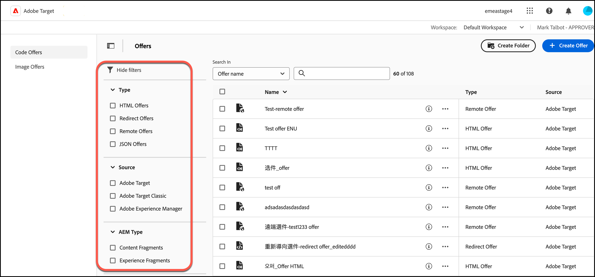

# Aanbiedingen

Gebruik de [!UICONTROL Offers] bibliotheek in [!DNL Adobe Target] om uw code en afbeelding te beheren, biedt u inhoud aan.

>[!NOTE]
>
>Dit artikel bevat informatie over updates van de [!DNL Target] gebruikersinterface die momenteel deel uitmaakt van een bètaprogramma. De [!DNL Adobe Target] team laat vaak nieuwe eigenschappen voor bepaalde klanten voor het testen en terugkoppelen doeleinden toe. Nadat de testperiode is voltooid, worden deze functies in de toekomst voor alle klanten ingeschakeld [!DNL Target Standard/Premium] releases en aankondigingen in de releaseopmerkingen.

Klik op de knop **[!UICONTROL Offers]** tabblad boven aan het dialoogvenster [!DNL Target] UI om de [!UICONTROL Offers] bibliotheek.

De [!UICONTROL Offers] bibliotheek bevat aanbiedingen die zijn ingesteld via [!DNL Target Standard/Premium], [!DNL Target Classic], [!DNL Adobe Experience Manager] (AEM), [!DNL Adobe Mobile Services] (AMS) en API&#39;s. Aanbiedingen gemaakt in [!DNL Target Classic] of andere oplossingen kunnen worden bewerkt in [!DNL Target Standard/Premium].

De bibliotheek van Aanbiedingen verstrekt een overzicht van alle code en beeldaanbiedingen en laat u diverse acties uitvoeren:

| Element | Beschrijving |
|--- |--- |
| Linkernavigatieregel | Schakelen tussen aanbiedingen [!UICONTROL Code Offers] of [!UICONTROL Image Offers]. |
| [!UICONTROL Show filters] pictogram
 | Klik op de knop **[!UICONTROL Show filters]** pictogram om aanbiedingen te filteren op [!UICONTROL Type], [!UICONTROL Source], en [!UICONTROL AEM Type]
Zie voor meer informatie [Filters toepassen op de lijst met aanbiedingen](#filters) hieronder. |
| Zoeken in velden | Gebruik de **[!UICONTROL Search in]** velden om snel een voorstel te vinden of om het aantal aanbiedingen dat wordt weergegeven in het dialoogvenster [!UICONTROL Offers] bibliotheek. U kunt zoeken op [!UICONTROL Offer Name], [!UICONTROL AEM Paths], of [!UICONTROL AEM Tags]. |
| [!UICONTROL Create Folder] | Klik op Map maken om mappen te maken in het dialoogvenster [!UICONTROL Offer] bibliotheek om codeaanbiedingen, beeldaanbiedingen, evenals andere omslagen te houden om een subomslagstructuur tot stand te brengen. Zie voor meer informatie [Aanbiedingsmappen maken](/help/main/c-experiences/c-manage-content/create-content-folder.md). |
| [!UICONTROL [!UICONTROL Create Offer]] | Maak een voorstel. Zie voor meer informatie over het maken van de verschillende soorten aanbiedingen: <ul><li>HTML-aanbod</li><li>[JSON-aanbieding](/help/main/c-experiences/c-manage-content/create-json-offer.md)</li><li>[Omleidingsvoorstel](/help/main/c-experiences/c-manage-content/offer-redirect.md)</li><li>[Externe aanbieding](/help/main/c-experiences/c-manage-content/about-remote-offers.md)</li></ul> |
| Selectievakjes voor bulkbewerkingen | bulktransacties uitvoeren op alle activiteiten of op geselecteerde activiteiten.
Voor een lijst van acties die beschikbaar zijn (afhankelijk van uw toestemmingen en de aanbiedingsstatus), zie [Snelle handelingen uitvoeren](#quick-actions) hieronder. |
| [!UICONTROL Name] | De naam van elke aanbieding.
Klik op de knop **[!UICONTROL Quick Info]** naast elke aanbiedingsnaam om meer informatie over die aanbieding in een pop-upkaart te bekijken, zoals de aanbieding-id, het type, de datum waarop de aanbieding voor het laatst is gewijzigd en door wie en meer.
Klik op de knop **[!UICONTROL More actions]** het pictogram (de horizontale ellips) naast elke aanbiedingsnaam om een menu te openen dat u snelle acties op een activiteit laat uitvoeren. De volgende acties zijn beschikbaar (afhankelijk van uw machtigingen en de status van het aanbod): [!UICONTROL Edit], [!UICONTROL Copy], [!UICONTROL Delete], en [!UICONTROL Move]. Zie voor meer informatie over elke actie [Snelle handelingen uitvoeren](#quick-actions) hieronder.
Klik op de tabelkop om de lijst alfabetisch te sorteren in oplopende of aflopende volgorde op naam. |
| [!UICONTROL Type] | Het type aanbieding: HTML-aanbiedingen, [Omleidingsvoorstellen](/help/main/c-experiences/c-manage-content/offer-redirect.md), [Externe aanbiedingen](/help/main/c-experiences/c-manage-content/about-remote-offers.md), en [JSON-aanbiedingen](/help/main/c-experiences/c-manage-content/create-json-offer.md). |
| [!UICONTROL Source] | Toont waar het voorstel is gemaakt: [!DNL Adobe Target], [!DNL Adobe Target Classic], en [!DNL Adobe Experience Manager]. |

## Filters toepassen op de bibliotheek met aanbiedingen {#filters}

Klik op de knop **[!UICONTROL Show filters]** icon (  ) om aanbiedingen te filteren op [!UICONTROL Type], [!UICONTROL Source], en [!UICONTROL AEM Type].

De **[!UICONTROL Show filters]** Met dit pictogram kunt u aanbiedingen filteren op de volgende categorieën:

* **Type**: HTML-aanbieding, [JSON-aanbieding](/help/main/c-experiences/c-manage-content/create-json-offer.md), [Omleidingsvoorstel](/help/main/c-experiences/c-manage-content/offer-redirect.md), [Externe aanbieding](/help/main/c-experiences/c-manage-content/about-remote-offers.md).

* **Bron**: [!DNL Adobe Target], [!DNL Adobe Target Classic], en [!DNL Adobe Experience Manager].

* **AEM**: [Inhoudsfragmenten](/help/main/c-integrating-target-with-mac/aem/content-fragments-aem.md) en [Ervaar fragmenten](/help/main/c-integrating-target-with-mac/aem/experience-fragments-aem.md). Zie voor meer informatie over de verschillende fragmenttypen [Overzicht van AEM Experience Fragments en Content Fragments](/help/main/c-integrating-target-with-mac/aem/aem-experience-and-content-fragments.md).

## Snelle handelingen uitvoeren {#quick-actions}

U kunt de volgende snelle acties uitvoeren door op het juiste pictogram te klikken:

### Snelle informatie

Klik op de knop **[!UICONTROL Quick Info]** naast elke aanbiedingsnaam om meer informatie over die aanbieding in een pop-upkaart te bekijken, zoals de aanbieding-id, het type, de datum waarop de aanbieding voor het laatst is gewijzigd en door wie en meer. Welke opties beschikbaar zijn, is afhankelijk van het type aanbieding: HTML-aanbieding, [JSON-aanbieding](/help/main/c-experiences/c-manage-content/create-json-offer.md), [Omleidingsvoorstel](/help/main/c-experiences/c-manage-content/offer-redirect.md), [Externe aanbieding](/help/main/c-experiences/c-manage-content/about-remote-offers.md).

### Meer handelingen

Klik op de knop **[!UICONTROL More actions]** het pictogram (de horizontale ellips) naast elke aanbiedingsnaam om een menu te openen dat u snelle acties op een activiteit laat uitvoeren. De volgende acties zijn beschikbaar (afhankelijk van uw machtigingen en de status van het aanbod): [!UICONTROL Edit], [!UICONTROL Copy], [!UICONTROL Delete], en [!UICONTROL Move].

* Bewerken
* Kopiëren
* Verwijderen
* Verplaatsen (als u bijvoorbeeld een of meer items naar een map wilt verplaatsen, klikt u op de knop **[!UICONTROL Move]** pictogram voor het gewenste item, klik op de gewenste map en klik vervolgens op **[!UICONTROL Drop]**.)

Afhankelijk van uw machtigingen worden mogelijk niet alle pictogrammen voor opties weergegeven. Bijvoorbeeld een gebruiker met [!UICONTROL Observer] machtigingen hebben niet de rechten om de [!UICONTROL Copy] -optie.

Voor gedetailleerde informatie over de taken die u kunt uitvoeren op aanbiedingen en omslagen, zie [Werken met inhoud in de elementenbibliotheek](/help/main/c-experiences/c-manage-content/assets-working.md).

Voer aanvullende taken uit door de muisaanwijzer boven de gewenste afbeeldingsaanbieding of map op de [!UICONTROL Image Offers] door op het gewenste pictogram te klikken.

U kunt onder andere de volgende opties kiezen:

* Selecteren
* Downloaden
* Eigenschappen weergeven
* Bewerken
* Annoteren
* Kopiëren

Voor gedetailleerde informatie over de taken die u kunt uitvoeren op aanbiedingen en omslagen, zie [Werken met inhoud in de elementenbibliotheek](/help/main/c-experiences/c-manage-content/assets-working.md).

>[!NOTE]
>
>Aanbiedingen voor afbeeldingen maken geen deel uit van de [Machtigingen voor zakelijke gebruikers](/help/main/administrating-target/c-user-management/property-channel/property-channel.md) model.

<!--

## Viewing offer definitions {#section_6B059DD121434E6292CAB393507D010E}

You can view offer definition details on a pop-up card in the [!UICONTROL Offers] library without opening the offer.

For example, the following offer definition card for an HTML offer is accessed by hovering over an offer on the [!UICONTROL Content] list, then clicking the information icon:

The following information is available:

* Name 
* Source 
* Type 
* Offer ID 
* Offer path 
* Last Modified

Click the [!UICONTROL Offer Usage] tab to view the activities that reference a code offer in each offer's definition pop-up card. This functionality does not apply to image offers. This way you can avoid impact to other activities while editing offers. Information includes [!UICONTROL Live Activities] and [!UICONTROL Inactive Activities].

The following offer definition card for a Redirect offer:

The following information is available:

* Name 
* Source 
* Type 
* Offer ID 
* Offer Path 
* Last Modified 
* Redirect URL 
* Include all URL parameters (On or Off) 
* Pass mbox session ID (On or Off)

The following offer definition card for a Remote offer:

The following information is available:

* Name 
* Source 
* Type 
* Offer ID 
* Offer Path 
* Last Modified 
* Redirect URL Type 
* Absolute or Relative URL

## Training video: The Content Repository 

This video includes information about managing offers.

* Connection between the [Experience Cloud Asset Library](https://experienceleague.adobe.com/docs/core-services/interface/assets/creative-cloud.html) and the Target Content Library 
* Custom HTML Offers 
* Custom HTML Offer in the Visual Experience Composer

>[!VIDEO](https://video.tv.adobe.com/v/17387)

-->
