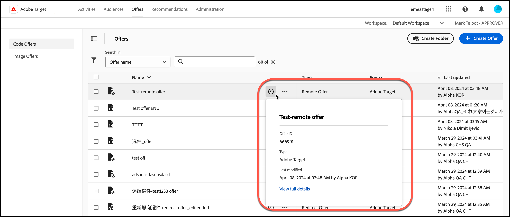

# Aanbiedingen

Gebruik de [!UICONTROL Offers] bibliotheek in [!DNL Adobe Target] om uw codeaanbieding en beeldaanbiedingsinhoud te beheren.

1. Klik op **[!UICONTROL Offers]** om de bibliotheek te openen.

   De bibliotheek bevat de aanbiedingen die zijn ingesteld via [!DNL Target Standard/Premium] , [!DNL Target Classic] , [!DNL Adobe Experience Manager] (AEM), [!DNL Adobe Mobile Services] (AMS) en API&#39;s. Aanbiedingen die zijn gemaakt in [!DNL Target Classic] of andere oplossingen, kunnen worden bewerkt in [!DNL Target Standard/Premium] .

   De pagina [!UICONTROL Offers] heeft twee tabbladen aan de rechterkant: [!UICONTROL Code Offers] en [!UICONTROL Image Offers] waarmee u aanbiedingen per type kunt bekijken.

   

1. (Facultatief) klik de **[!UICONTROL Type]** drop-down lijst aan filteraanbiedingen door type (Aanbieding van HTML, [&#x200B; Fragmenten van de Ervaring &#x200B;](/help/main/c-experiences/c-manage-content/aem-experience-fragments.md), [&#x200B; Redirect Aanbieding &#x200B;](/help/main/c-experiences/c-manage-content/offer-redirect.md), [&#x200B; Verre Aanbieding &#x200B;](/help/main/c-experiences/c-manage-content/about-remote-offers.md), [&#x200B; JSON Aanbiedingen &#x200B;](/help/main/c-experiences/c-manage-content/create-json-offer.md), en [&#x200B; Omslagen &#x200B;](/help/main/c-experiences/c-manage-content/create-content-folder.md)).

   

1. (Optioneel) Klik op de vervolgkeuzelijst **[!UICONTROL Source]** om aanbiedingen te filteren op bron (Adobe Target, Adobe Target Classic en Adobe Experience Manager).

1. (Optioneel) Voer aanvullende taken uit door de muisaanwijzer boven de gewenste aanbieding of map op het tabblad [!UICONTROL Code Offers] te houden en vervolgens op het gewenste pictogram te klikken.

   

   U kunt onder andere de volgende opties kiezen:

   * De mening (voor meer informatie, zie [&#x200B; het Bekijken aanbiedingsdefinities &#x200B;](#section_6B059DD121434E6292CAB393507D010E) hieronder.)
   * Bewerken
   * Kopiëren
   * Verplaats (als u bijvoorbeeld een of meer items naar een map wilt verplaatsen, klikt u op het pictogram **[!UICONTROL Move]** voor het gewenste item, klikt u op de gewenste map en vervolgens op **[!UICONTROL Drop]** .)
   * Verwijderen

   Afhankelijk van uw machtigingen worden mogelijk niet alle pictogrammen voor opties weergegeven. Een gebruiker met [!UICONTROL Observer] -machtigingen heeft bijvoorbeeld niet de rechten om de optie [!UICONTROL Copy] te gebruiken.

   Voor gedetailleerde informatie over de taken kunt u op aanbiedingen en omslagen uitvoeren, zie [&#x200B; Werk met inhoud in de bibliotheek van Activa &#x200B;](/help/main/c-experiences/c-manage-content/assets-working.md).

1. (Optioneel) Voer aanvullende taken uit door de muisaanwijzer boven de gewenste afbeeldingsaanbieding of -map op het tabblad [!UICONTROL Image Offers] te houden en vervolgens op het gewenste pictogram te klikken.

   

   U kunt onder andere de volgende opties kiezen:

   * Selecteren
   * Downloaden
   * Eigenschappen weergeven
   * Bewerken
   * Annoteren
   * Kopiëren

   Voor gedetailleerde informatie over de taken kunt u op aanbiedingen en omslagen uitvoeren, zie [&#x200B; Werk met inhoud in de bibliotheek van Activa &#x200B;](/help/main/c-experiences/c-manage-content/assets-working.md).

   >[!NOTE]
   >
   >De aanbiedingen van het beeld maken geen deel uit van het [&#x200B; model van de Toestemmingen van de Gebruiker van de Onderneming &#x200B;](/help/main/administrating-target/c-user-management/property-channel/property-channel.md).

## Definities van aanbiedingen weergeven {#section_6B059DD121434E6292CAB393507D010E}

U kunt definitiedetails van aanbiedingen op een pop-up kaart in de [!UICONTROL Offers] bibliotheek bekijken zonder de aanbieding te openen.

De volgende aanbiedingsdefinitiekaart voor een HTML-aanbieding is bijvoorbeeld toegankelijk door op het informatiepictogram te klikken:

De volgende informatie is beschikbaar:

* Naam
* Aanbieding-id
* Type
* Laatst gewijzigd

Klik op de koppeling [!UICONTROL View Full Details] om de inhoud van de aanbieding en de activiteiten te bekijken die verwijzen naar een codeaanbieding. Op deze manier voorkomt u dat andere activiteiten worden beïnvloed tijdens het bewerken van aanbiedingen. Deze informatie omvat [!UICONTROL Live Activities] en [!UICONTROL Inactive Activities] .

De beschikbare informatie op elke kaart varieert afhankelijk van het aanbiedingstype: HTML-aanbod, [&#x200B; Fragmenten van de Ervaring &#x200B;](/help/main/c-experiences/c-manage-content/aem-experience-fragments.md), [&#x200B; Redirect Aanbieding &#x200B;](/help/main/c-experiences/c-manage-content/offer-redirect.md), [&#x200B; Verre Aanbieding &#x200B;](/help/main/c-experiences/c-manage-content/about-remote-offers.md), of [&#x200B; JSON Aanbiedingen &#x200B;](/help/main/c-experiences/c-manage-content/create-json-offer.md).

De functionaliteit voor details van de aanbieding is niet van toepassing op afbeeldingsaanbiedingen.

<!--

## Training video: The Content Repository 

This video includes information about managing offers.

* Connection between the [Experience Cloud Asset Library](https://experienceleague.adobe.com/docs/core-services/interface/assets/creative-cloud.html?lang=nl-NL) and the Target Content Library 
* Custom HTML Offers 
* Custom HTML Offer in the [!UICONTROL Visual Experience Composer]

>[!VIDEO](https://video.tv.adobe.com/v/17387)

-->
