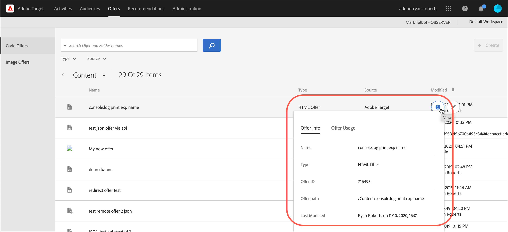

# Aanbiedingen

Gebruik de [!UICONTROL Offers] bibliotheek in [!DNL Adobe Target] om uw codeaanbieding en beeldaanbieding inhoud te beheren.

1. Klikken **[!UICONTROL Offers]** om de bibliotheek te openen.

   De bibliotheek bevat de aanbiedingen die zijn ingesteld via [!DNL Target Standard/Premium], [!DNL Target Classic], [!DNL Adobe Experience Manager] (AEM), [!DNL Adobe Mobile Services] (AMS) en API&#39;s. Aanbiedingen gemaakt in [!DNL Target Classic] of andere oplossingen kunnen worden bewerkt in [!DNL Target Standard/Premium].

   De [!UICONTROL Offers] De pagina heeft twee tabbladen aan de rechterkant: [!UICONTROL Code Offers] en [!UICONTROL Image Offers] Hiermee kunt u voorstellen op type weergeven.

   

1. (Optioneel) Klik op de knop **[!UICONTROL Type]** vervolgkeuzelijst voor het filteren van aanbiedingen op type (HTML-aanbieding, [Ervaar fragmenten](/help/main/c-experiences/c-manage-content/aem-experience-fragments.md), [Omleidingsvoorstel](/help/main/c-experiences/c-manage-content/offer-redirect.md), [Externe aanbieding](/help/main/c-experiences/c-manage-content/about-remote-offers.md), [JSON-aanbiedingen](/help/main/c-experiences/c-manage-content/create-json-offer.md), en [Mappen](/help/main/c-experiences/c-manage-content/create-content-folder.md)).

   

1. (Optioneel) Klik op de knop **[!UICONTROL Source]** vervolgkeuzelijst voor het filteren van aanbiedingen op bron (Adobe Target, Adobe Target Classic en Adobe Experience Manager).

1. (Optioneel) Voer aanvullende taken uit door de muis boven de gewenste aanbieding of map op de [!UICONTROL Code Offers] door op het gewenste pictogram te klikken.

   

   De volgende opties zijn beschikbaar:

   * Weergeven (zie voor meer informatie [Definities van aanbiedingen weergeven](#section_6B059DD121434E6292CAB393507D010E) hieronder.)
   * Bewerken
   * Kopiëren
   * Verplaatsen (als u bijvoorbeeld een of meer items naar een map wilt verplaatsen, klikt u op de knop **[!UICONTROL Move]** klikt u op de gewenste map en vervolgens op **[!UICONTROL Drop]**.)
   * Verwijderen

   Afhankelijk van uw machtigingen worden mogelijk niet alle pictogrammen voor opties weergegeven. Bijvoorbeeld een gebruiker met [!UICONTROL Observer] machtigingen hebben niet de rechten om de [!UICONTROL Copy] optie.

   Voor gedetailleerde informatie over de taken die u kunt uitvoeren op aanbiedingen en omslagen, zie [Werken met inhoud in de elementenbibliotheek](/help/main/c-experiences/c-manage-content/assets-working.md).

1. (Optioneel) Voer aanvullende taken uit door de muis boven de gewenste afbeeldingsaanbieding of map op de [!UICONTROL Image Offers] door op het gewenste pictogram te klikken.

   

   De volgende opties zijn beschikbaar:

   * Selecteren
   * Downloaden
   * Eigenschappen weergeven
   * Bewerken
   * Annoteren
   * Kopiëren

   Voor gedetailleerde informatie over de taken die u kunt uitvoeren op aanbiedingen en omslagen, zie [Werken met inhoud in de elementenbibliotheek](/help/main/c-experiences/c-manage-content/assets-working.md).

## Definities van aanbiedingen weergeven {#section_6B059DD121434E6292CAB393507D010E}

U kunt definitiedetails van voorstellen op een pop-up kaart in bekijken [!UICONTROL Offers] bibliotheek zonder de aanbieding te openen.

De volgende aanbiedingsdefinitiekaart voor een HTML-aanbieding is bijvoorbeeld toegankelijk door de muis boven een aanbieding op de [!UICONTROL Content] en klik vervolgens op het informatiepictogram:

De volgende informatie is beschikbaar:

* Naam
* Bron
* Type
* Aanbieding-id
* Pad aanbod
* Laatst gewijzigd

Klik op de knop [!UICONTROL Offer Usage] om de activiteiten weer te geven die verwijzen naar een codeaanbieding in de definitie-pop-upkaart van elke aanbieding. Deze functionaliteit is niet van toepassing op afbeeldingsaanbiedingen. Op deze manier voorkomt u dat andere activiteiten worden beïnvloed tijdens het bewerken van aanbiedingen. Informatie omvat [!UICONTROL Live Activities] en [!UICONTROL Inactive Activities].

De volgende aanbieding definitiekaart voor een Voorstelling van de Omleiding:

De volgende informatie is beschikbaar:

* Naam
* Bron
* Type
* Aanbieding-id
* Pad aanbod
* Laatst gewijzigd
* URL omleiden
* Alle URL-parameters opnemen (Aan of Uit)
* Identiteitskaart van de vergaderingszitting van de pas (aan of weg)

De volgende kaart van de aanbiedingsdefinitie voor een Verre aanbieding:

De volgende informatie is beschikbaar:

* Naam
* Bron
* Type
* Aanbieding-id
* Pad aanbod
* Laatst gewijzigd
* Type URL omleiden
* Absolute of relatieve URL

## Trainingsvideo: De opslagplaats voor inhoud 

Deze video bevat informatie over het beheer van aanbiedingen.

* Verbinding tussen de [Experience Cloud Asset Library](https://experienceleague.adobe.com/docs/core-services/interface/assets/creative-cloud.html) en de doelinhoudsbibliotheek
* Aangepaste HTML-aanbiedingen
* Aanbod van de HTML van de douane in de Visuele Composer van de Ervaring

>[!VIDEO](https://video.tv.adobe.com/v/17387)
