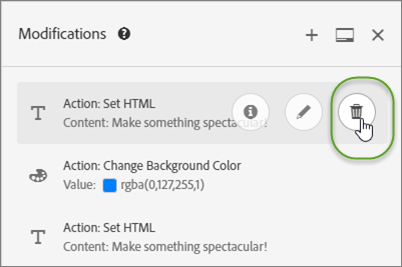

# Wijzigingen

Informatie over de [!UICONTROL Modifications] pagina in [!DNL Adobe Target] waarmee u wijzigingen op de pagina kunt bekijken en aanvullende wijzigingen (CSS-kiezer, Mbox en Aangepaste code) kunt toevoegen.

De [!UICONTROL Modifications] pagina toont alle veranderingen die aan uw pagina in Visuele Composer van de Ervaring (VEC) zijn aangebracht en laat u extra veranderingen aanbrengen door elk element op de pagina te klikken en [&#x200B; een actie &#x200B;](/help/main/c-experiences/c-visual-experience-composer/viztarget-options.md#reference_3BD1BEEAFA584A749ED2D08F14732E81) te selecteren. Elke wijziging die u aanbrengt, wordt weergegeven als een afzonderlijke actie of als een afzonderlijk element in de lijst van [!UICONTROL Modifications] . U kunt ook wijzigingen toevoegen, waaronder de volgende wijzigingstypen: CSS Selector, Mbox. en Aangepaste code.

## Overzicht van wijzigingen {#section_EE27E7572AA74397BBDED563B2B3D509}

Op de pagina [!UICONTROL Modifications] worden alle wijzigingen weergegeven die in de VEC op uw pagina zijn aangebracht. Elke wijziging die u aanbrengt, wordt weergegeven als een afzonderlijke actie of als een afzonderlijk element in de lijst van [!UICONTROL Modifications] .


Gebruik de pagina van Wijzigingen om kleine veranderingen in selecteur aan te brengen die het Doel kiest wanneer u VEC gebruikt om te vormen hoe de inhoud wordt geleverd. U kunt de inhoud of een HTML-kenmerk wijzigen. U kunt de code ook bewerken om het equivalent van een HTML-aanbieding binnen een mbox te maken.

Met de pagina Wijzigingen kunt u:

* Bekijk een handeling die in de visuele composer is uitgevoerd.

  

* Bewerk een bestaande handeling. Houd de cursor boven de gewenste wijziging en klik op het pictogram **[!UICONTROL Edit]** .

  

  Breng de gewenste wijzigingen aan.

  

* Een bestaande handeling verwijderen. Houd de cursor boven de gewenste wijziging en klik op het pictogram **[!UICONTROL Delete]** .

  

* Voeg een nieuwe wijziging toe. Klik op **[!UICONTROL Add Modification]** of het pictogram + en geef de wijzigingen op zoals hieronder beschreven.

  

  Nadat één wijziging is gemaakt, wordt boven in het deelvenster Wijzigingen een pictogram + weergegeven in plaats van de knop Wijziging toevoegen onder in het deelvenster.

* Koppel het deelvenster Wijzigingen verticaal langs de zijkant van de doelinterface of horizontaal onder aan het venster. Klik op het pictogram [!UICONTROL Dock] om te schakelen tussen de twee instellingen.

  

  In het volgende voorbeeld ziet u het deelvenster Wijzigingen dat aan de onderkant van het scherm is gekoppeld:

  

## Wijzigingen toevoegen {#section_C7ABCD5731A048CB8F90EDC31A32EDF9}

1. Als u de pagina [!UICONTROL Modifications] voor een geselecteerde ervaring wilt weergeven, klikt u in de VEC op het pictogram **[!UICONTROL Modifications]** &lt;/>.

   

   >[!NOTE]
   >
   >Als u het deelvenster Wijzigingen wilt openen in de Form-based Experience Composer, maakt of bewerkt u een HTML-aanbieding. Voor meer informatie, zie [&#x200B; Op vorm-Gebaseerde Composer van de Ervaring &#x200B;](/help/main/c-experiences/form-experience-composer.md#task_FAC842A6535045B68B4C1AD3E657E56E).

   De pagina [!UICONTROL Modifications] wordt geopend, waarbij het scherm wordt gesplitst tussen de visuele modus aan de linkerkant en het deelvenster Wijzigingen aan de rechterkant. Klik op het pictogram [!UICONTROL Dock] om het deelvenster Wijzigingen verticaal langs de zijde van de doelinterface of horizontaal onder aan het venster te koppelen. U ziet dat de ervaring A in de volgende afbeelding geen eerdere wijzigingen heeft ondergaan.

   

   De ervaring B toont de vorige wijzigingen in het [!UICONTROL Modifications] paneel op het recht.

   

1. Een wijziging toevoegen:

   * Als er geen vorige wijzigingen in de ervaring zijn aangebracht, klikt u op de knop **[!UICONTROL Add Modification]** onder aan het deelvenster [!UICONTROL Modifications] aan de rechterkant.
   * Als er vorige wijzigingen zijn aangebracht in de ervaring, klikt u op het pictogram + boven aan het deelvenster [!UICONTROL Modifications] aan de rechterkant.

   In het deelvenster Wijzigingen wordt het volgende weergegeven:

   

1. Kies het gewenste type in de vervolgkeuzelijst **[!UICONTROL Modifications Type]** :

   | Type wijzigingen | Details |
   |--- |--- |
   | CSS-kiezer | Geef in het vak CSS-elementkiezer het gewenste CSS-element op dat u wilt wijzigen, selecteer een handelingstype (Inhoud instellen of Kenmerk instellen) en vul vervolgens de vereiste informatie en de gewenste inhoud in. |
   | Mbox | Geef de naam van het selectievakje en de gewenste inhoud op.<p>**Nota**: Mboxes worden niet meer gesteund in VEC in pagina&#39;s die at.js 2 gebruiken.*x*.<p>Als tijdelijke oplossing:<ul><li>Als u at.js 2 gebruikt.*x*, voeg een CSS wijziging van de Selecteur in plaats van een wijziging Mbox toe en voeg de inhoud op de selecteur toe die uw mbox gebruikte. </li><li>Gebruik op formulieren gebaseerde activiteiten (werkt met vakken en at.js 1.*x* en at.js 2.*x*).</li><li>Gebruik at.js 1.*x* in VEC.</li></ul> |
   | Aangepaste code | Geef een optionele naam op, schakel het selectievakje [!UICONTROL Add Code in the `<HEAD>` Sectie &#x200B;] naar wens in of uit en voeg vervolgens uw aangepaste code toe.<p>Als u [!UICONTROL Add Code in the `<HEAD>` Sectie &#x200B;] selecteert, wordt de douanecode toegevoegd aan de `<head>` sectie en zijn uitvoering wacht niet op lichaam of pagina-lading gebeurtenissen. Voeg alleen `<script>` - en `<style>` -elementen toe. Als u `<div>` -tags en andere elementen toevoegt, komen de resterende `<head>` -elementen mogelijk in de `<body>` -lus terecht. Als u at.js gebruikt, zullen alle aanbiedingen asynchroon leveren.<p> Als u de optie [!UICONTROL Add Code in the `<HEAD>` Sectie &#x200B;] uitschakelt, wordt de aangepaste code direct na de tag `<body>` uitgevoerd. Plaats alle code in één `<div>` om de DOM-structuur te behouden. Als u at.js gebruikt, zullen alle aanbiedingen asynchroon leveren.<p>Als HTML for `<BODY>` `<SCRIPT>` and `<DIV>` bevat, wordt `<DIV>` toegevoegd aan `<BODY>` en wordt `<SCRIPT>` uitgevoerd in `<HEAD>` . Ook wordt `<SCRIPT>` dat een extern bestand laadt, toegevoegd aan `<HEAD>` .<p>**Nota**: De manuscripten worden in werking gesteld asynchroon. Dit betekent dat u bijvoorbeeld niet `document.write` of vergelijkbare scriptmethoden kunt gebruiken.<p>De code van de douane verstrekt een niet visuele interface aan mening, geeft uit, en voegt nieuwe acties binnen VEC, op vorm-gebaseerde Composer van de Ervaring toe, en HTML biedt redacteur aan. Het paneel verstrekt een codemening van een ervaring om u te helpen complexere ervaringen bouwen, bestaande ervaringen verfijnen, en kwesties problemen oplossen.<p>Aangepaste code is bedoeld voor geavanceerde gebruikers die vertrouwd zijn met HTML, JavaScript en CSS. De codeweergave kan u helpen wijzigingen aan te passen of te perfectioneren, of selecteurproblemen te verhelpen. Deze kan ook worden gebruikt om nieuwe aangepaste code en handelingen toe te voegen. U kunt meerdere aangepaste code toevoegen en elke aangepaste code optioneel een naam geven.<p>**Nota**: De code van de Douane is momenteel beschikbaar voor A/B en Ervaring die (XT) slechts activiteiten richten. Aangepaste code is uitgeschakeld voor overlay en als een omleidingsvoorstel wordt toegepast.<p>De code van de douane steunt de volgende gebruiksgevallen:<ul><li>Aangepaste JavaScript, HTML of CSS toevoegen die boven aan de pagina moet worden uitgevoerd</li><li>De code weergeven of bewerken die door VEC wordt gegenereerd nadat wijzigingen zijn aangebracht</li><li>HTML-inhoud instellen voor een kiezer (alleen CSS-kiezers)</li><li>Een kenmerk instellen op een HTML-element</li><li>Aanbiedingsinhoud toevoegen die in een regionale box moet worden geleverd</li><li>Omwisselen op DOM-gereed met jQuery</li><li>Wisselen op DOM-klaar, geen jQuery (ondersteunt Internet Explorer 8 niet)</li><li>Wisselen met DOM-polling via &quot;elementOnLoad&quot;-plug-in</li><li>Aangepaste omleiding</li></ul>Aangepaste code biedt:<ul><li>Regelnummers voor betere bruikbaarheid.</li><li>Syntaxis markeren om onjuiste syntaxis voor HTML-aanbiedingen te voorkomen.</li><li>De mogelijkheid om meerdere aangepaste codes te maken en voor elke code een optionele naam op te geven. Door meerdere aangepaste codes te maken, kunt u in de toekomst gemakkelijker fouten opsporen. In plaats van bijvoorbeeld één aangepaste code te maken om verschillende wijzigingen door te voeren, kunt u voor elke wijziging een aparte aangepaste code met een beschrijvende naam maken. Als u afzonderlijke aangepaste codes hebt, kunt u uw wijzigingen modulair en beter beheren. Merk op dat de uitvoering van veelvoudige douanecodes in een activiteit niet gewaarborgd is om in de opeenvolging te gebeuren waarin zij werden gecreeerd.</li></ul>In het deelvenster Wijzigingen wordt het scherm opgesplitst tussen de visuele modus en de codemodus. Beide modi blijven gesynchroniseerd. Elke visueel aangebrachte wijziging heeft een overeenkomstige rij in de codemening. Op dezelfde manier elke verandering die in de codemening wordt begaan toont in de visuele ervaring. Wanneer u op een rij in de codeweergave klikt, wordt het bijbehorende element op de visuele pagina geselecteerd.<p>Aangepaste code ondersteunt HTML, scripts en stijlen. U kunt elke geldige HTML-code of elk geldig script toevoegen of bewerken. |

1. Voeg desgewenst aanvullende wijzigingen toe.

## Aangepaste praktijkgevallen voor code {#section_26CB3360097D400FB02E20AE5FDBA352}

Het deelvenster **[!UICONTROL Custom Code]** bevat code die wordt uitgevoerd aan het begin van de laadpagina.

U kunt de JavaScript-code in de tag `<head>` uitvoeren. De uitvoering van code wacht niet tot de tag `<body>` aanwezig is in de DOM.

Kiezers voor volgende visuele handelingen zijn afhankelijk van de HTML-elementen die op dit tabblad zijn toegevoegd.

Het deelvenster Aangepaste code wordt doorgaans gebruikt om JavaScript of CSS boven aan de pagina toe te voegen.


Gebruik de tab **[!UICONTROL Custom Code]** om:

* JavaScript inline gebruiken of koppelen naar een extern JavaScript-bestand

  Bijvoorbeeld om de kleur van een element te wijzigen:

  ```javascript
  <script type="text/javascript"> 
  document.getElementById("element_id").style.color = "blue"; 
  </script> 
  ```

* Een stijl inline configureren of koppelen naar een externe stijlpagina

  U kunt bijvoorbeeld een klasse definiëren voor een overlay-element:

  ```html
  <style> 
  .overlay 
  { position: absolute; top:0; left: 0; right: 0; bottom: 0; background: red; } 
  </style> 
  ```

* HTML-fragmenten toevoegen om nieuwe elementen te definiëren

  Gebruik bijvoorbeeld het volgende HTML-fragment om een overlay `<div>` te maken met de hierboven gedefinieerde CSS-klasse:

  ```html
  <div class="overlay"></div>
  ```

* Omwisselen op DOM-gereed met jQuery

  In het volgende voorbeeld met JQuery wordt ervan uitgegaan dat op de website van de klant jQuery beschikbaar is op de pagina wanneer [!DNL Target] de aanbiedingen uitvoert.

  ```javascript
  <style>#default_content {visibility:hidden;}</style> 
  <script> 
  jQuery( document ).ready(function() { 
      jQuery("#default_content").html( "<span style='color:red'>Hello <strong>Again</strong></span>" ); 
      jQuery("#default_content").css("visibility","visible"); 
  }); 
  </script> 
  ```

* Wisselen op DOM-gereed, geen jQuery (ondersteunt Internet Explorer 8 niet)

  ```javascript
  <style>#default_content {visibility:hidden;}</style> 
  <script> 
  document.addEventListener("DOMContentLoaded", function(event) {  
      document.getElementById("default_content").innerHTML = "<span style='color:red'>Hello <strong>Again</strong></span>"; 
      document.getElementById("default_content").style.visibility="visible"; 
  }); 
  </script> 
  ```

* Aangepaste omleiding waarbij bestaande params, `s_tnt` param (voor verouderde integratie naar Analytics), verwijzerparam en mbox-sessie worden doorgegeven

  ```javascript
  <style type="text/css">body{display:none!important;}</style> 
  <script type="text/javascript"> 
   var qs='';window.location.search?qs=window.location.search+'&':qs='?'; 
   window.location.replace('//www.mywebsite.com/'+qs+'s_tnt=${campaign.id}:${campaign.recipe.id}:${campaign.recipe.trafficType}&s_tntref='+encodeURIComponent(document.referrer)+'&mboxSession='+mboxFactoryDefault.getSessionId().getId()+''+window.location.hash+''); 
  </script> 
  ```

* Voeg Adobe Target Experience Templates toe voor gebruik in aangepaste code. De Malplaatjes van de Ervaring van het doel zijn vooraf gecodeerde steekproeven met configureerbare input die moeten worden gebruikt om gemeenschappelijke telleruse-cases uit te voeren. Deze ervaringssjablonen worden gratis aan ontwikkelaars en marketers aangeboden als uitgangspunt voor het uitvoeren van veelvoorkomende gebruiksgevallen, hetzij via de VEC of de Form-based Experience Composer. Gebruiksscenario&#39;s zijn onder andere lichtbakken, carrousels, aftellingen en meer.

  Voor meer informatie, zie [&#x200B; Malplaatjes van de Ervaring &#x200B;](/help/main/c-experiences/c-visual-experience-composer/c-vec-code-editor/experience-templates.md#concept_109BBD7EABC04DD39E6B7B1687786652).

## Aangepaste aanbevolen procedures voor code {#section_10DFFD9FB92A43C1BB444A45E0272B28}

**verpakt altijd de douanecode in één element.**

Bijvoorbeeld:

```html
<div id="custom-code"> 
// My Code goes here 
</div>
```

Als er wijzigingen nodig zijn, brengt u wijzigingen aan in deze container.

Als u de aangepaste code niet meer nodig hebt, laat u deze container leeg, maar verwijdert u deze niet. Dit zorgt ervoor dat andere ervaringswijzigingen niet worden beïnvloed.

**gebruik geen elementidentiteitskaart &quot;CDQID&quot;voor wijzigingen aan de pagina die in de Redacteur van de Code wordt gemaakt.**

Het doel past een nieuwe elementidentiteitskaart met de waarde &quot;CDQID&quot;op om het even welk element op de pagina toe die door Doel wordt gewijzigd. Omdat deze id door Doel wordt toegepast, zou het niet voor enige verdere wijzigingen of aanpassingen in de Redacteur van de Code moeten worden gebruikt.

**voert document.write geen acties in de manuscripten van de douanecode uit.**

Scripts worden asynchroon uitgevoerd. Hierdoor worden `document.write` -acties vaak op de verkeerde plaats op de pagina weergegeven. Het gebruik van `document.write` in scripts die in aangepaste code worden gemaakt, wordt afgeraden.

**als u een element creeert en het dan wijzigt, schrapt niet het originele element.**

Bij elke wijziging wordt een nieuw element gemaakt in het deelvenster Wijzigingen. Omdat de tweede actie Element 1 wijzigt, als u Element 1 schrapt, heeft die actie niet meer om het even wat te wijzigen, zodat werkt de verandering niet meer. Zie &quot;Problemen oplossen&quot; hieronder voor meer informatie.

**ben voorzichtig als u de eigenschap van de douanecode voor twee activiteiten gebruikt die zelfde URL richten.**

Als u de aangepaste codefunctie gebruikt voor twee activiteiten die op dezelfde URL zijn gericht, wordt de JavaScript vanuit beide activiteiten in de pagina geïnjecteerd. Doel bepaalt automatisch de volgorde van de geleverde inhoud. Zorg ervoor dat de code niet afhankelijk is van plaatsing. Het is aan u om ervoor te zorgen dat er geen conflicten in de code zijn.

## Problemen met aangepaste code oplossen {#section_6C965CBC31C348D7AA5B57B63DAB9E7F}

**de code van de Douane wordt niet uitgevoerd wanneer het gebruiken van `triggerView`.**

Aanbiedingen voor aangepaste code in de VEC worden niet opnieuw gerenderd wanneer `triggerView()` wordt aangeroepen met `{page: false}` als optie.

**ik ontving een waarschuwing dat een actie niet wegens structurele veranderingen in een pagina kan worden toegepast. Wat betekent dit?**

Dit bericht geeft aan dat de structuur van de pagina is gewijzigd sinds de activiteit voor het laatst is opgeslagen.

De ontbrekende kiezers zijn mogelijk bereikt in de modus Bladeren. We raden u aan elke ervaring te verwijderen en opnieuw te maken om ervoor te zorgen dat de inhoud er zo uitziet als u verwacht, zoals in het waarschuwingsbericht wordt aangegeven.


***wanneer ik een element schrapt, zie ik een waarschuwing me vertelt dat het schrappen van deze actie verdere acties kan beïnvloeden.&quot; Wat betekent dit?***

Als u bijvoorbeeld twee handelingen hebt uitgevoerd:

* Een klasse toegevoegd aan Element 1
* HTML for Element 1 bewerkt

Bij elke wijziging wordt een nieuw element gemaakt in het deelvenster Wijzigingen. Omdat de tweede actie Element 1 wijzigt, als u Element 1 schrapt, heeft de tweede actie niet meer om het even wat te wijzigen, zodat werkt de verandering niet meer.

Met andere woorden, als u een element met tekst toevoegt, dan in een afzonderlijke actie bewerkt u dat element met verschillende tekst, toont het paneel van Wijzigingen beide acties als afzonderlijke elementen. Wanneer u het element hebt bewerkt, hebt u een nieuw element gemaakt dat het oorspronkelijke element wijzigt dat u hebt gemaakt en dat de bewerkte tekst bevat. Als u vervolgens het oorspronkelijke element verwijdert, kan de bewerkte tekst het bewerkte element niet vinden en wordt deze niet weergegeven. Het tweede element blijft in de lijst met elementen, maar heeft geen invloed op de pagina omdat het element dat wordt gewijzigd, niet meer bestaat.

***een element ik creeerde gebruikend `document.write` in een manuscript verschijnt niet waar ik het aan verwacht.***

Scripts worden asynchroon uitgevoerd. Hierdoor worden `document.write` -acties vaak op de verkeerde plaats op de pagina weergegeven. Adobe raadt het gebruik van `document.write` niet aan in scripts die in de aangepaste code worden gemaakt.

***Mijn JavaScript toont fouten in de douanecode.***

Voor inline JavaScript die geen geldige JavaScript is, worden fouten in de aangepaste code weergegeven.

***ik kan geen verandering in mijn douanecode ongedaan maken.***

Ongedaan maken wordt momenteel niet ondersteund voor het bewerken en verwijderen van handelingen vanuit het deelvenster Wijzigingen en in aangepaste code. Als u een van deze bewerkingen ongedaan maakt, kan de ervaring in de VEC inconsistent lijken met de werkelijke acties die zichtbaar zijn in de aangepaste code. De acties in de aangepaste code hebben echter de juiste status en hebben geen invloed op de levering. Dit is een UI-probleem. Als u de ervaring wilt vernieuwen, slaat u deze op en opent u deze opnieuw. U kunt ook naar de volgende stap gaan en terugkeren. Bij een van deze handelingen wordt de ervaring opnieuw geladen en wordt de weergave zoals verwacht weergegeven. Deze handeling is consistent met de handelingen in het deelvenster Wijzigingen.

**de code van de Douane veroorzaakt niet de verwachte resultaten in Internet Explorer 8.**

Doel biedt geen ondersteuning meer voor IE8.
