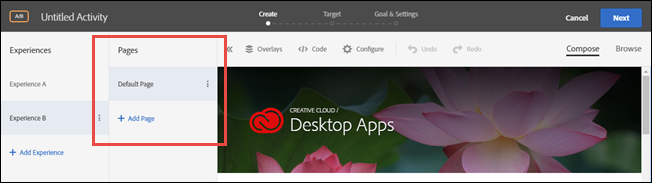

# Meerdere pagina&#39;s

Een activiteit van meerdere pagina&#39;s in [!DNL Adobe Target] Hiermee kunt u een artikel op meerdere pagina&#39;s maken, met een specifiek ontwerp voor elke pagina.

Je kunt bijvoorbeeld een voorstel voor gratis verzending testen met aankopen boven een bepaald bedrag. Mogelijk wilt u dat dit aanbod wordt weergegeven op uw openingspagina, een categoriepagina en bepaalde productpagina&#39;s, maar u wilt dat het een ander formaat en op een andere locatie op elk paginatype wordt weergegeven. Je kunt een opvallend voorstel op je homepage weergeven en dat aanbod vervolgens versterken met kleinere aanbiedingen op andere relevante pagina&#39;s.

U kunt ook een activiteit met meerdere pagina&#39;s gebruiken om verschillende lay-outs voor uw bureaublad en mobiele sites te definiëren die niet reageren. Als de site een aparte mobiele site heeft, zoals [!DNL m.mysite.com] in plaats van [!DNL `www.mysite.com`]moet u in plaats daarvan een [activiteit met meerdere pagina&#39;s](/help/main/c-experiences/c-visual-experience-composer/multipage-activity.md#concept_277E096063E14813AC5D8EDFA1D2ED48), toevoegen [!DNL m.mysite.com] als afzonderlijke pagina&#39;s, en pas dan mobiele het uitgeven toe om aangewezen veranderingen op de Desktopversie en mobiele versie in de zelfde ervaring aan te brengen. Gebruik voor responsieve mobiele sites [mobiele ervaring bewerken](/help/main/c-experiences/c-visual-experience-composer/mobile-viewports.md#concept_8E45527C4ABC41D59AA3553BEDC76FA5).

>[!NOTE]
>
>Activiteiten van meerdere pagina&#39;s zijn bedoeld voor activiteiten waarbij hetzelfde aanbod op meerdere pagina&#39;s anders wordt weergegeven. Als het aanbod op alle pagina&#39;s hetzelfde wordt weergegeven, kunt u [sjabloontest](/help/main/c-experiences/c-visual-experience-composer/temtest.md#task_2539D51A18044F82B0D9895636546781) is efficiënter.

U kunt sjabloonregels opgeven voor elke pagina in de test met meerdere pagina&#39;s. U kunt bijvoorbeeld een test met meerdere pagina&#39;s uitvoeren op de startpagina en op alle categoriepagina&#39;s door sjabloonregels toe te passen op de categoriepagina in de test met meerdere pagina&#39;s. Zie [Dezelfde ervaring opnemen op vergelijkbare pagina&#39;s](/help/main/c-experiences/c-visual-experience-composer/temtest.md#task_2539D51A18044F82B0D9895636546781).

Pagina&#39;s toevoegen aan een test:

1. Klik op de knop **[!UICONTROL Configure]** tandwielpictogram.
1. Klik op **[!UICONTROL Add Additional Pages]**.

   Links van het scherm wordt een navigatiebalk weergegeven.

   

1. Gebruik die navigatiebalk om uw pagina&#39;s op te geven en de standaardpagina in te stellen.

   Klikken **[!UICONTROL Add Page]** om een extra pagina toe te voegen.

   Klik op het pictogram met drie verticale ellipsen om een actiemenu weer te geven:

   

   In dit menu kunt u de naam van de pagina&#39;s wijzigen, een omleidingstest uitvoeren vanuit de activiteit met meerdere pagina&#39;s of de pagina verwijderen.

1. Gebruik de Visuele Composer van de Ervaring om de manier te ontwerpen de aanbieding op elke pagina kijkt.
