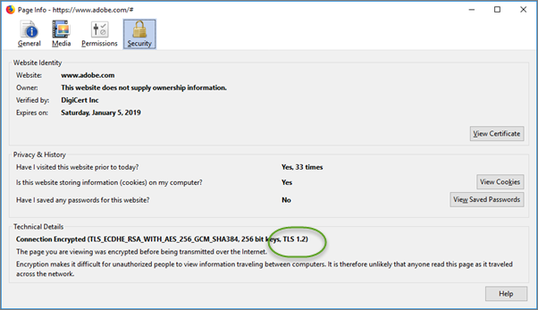

# Problemen met de [!UICONTROL Enhanced Experience Composer] oplossen

Weergaveproblemen treden soms op in [!DNL Adobe Target] [!UICONTROL Enhanced Experience Composer] (EEG) onder bepaalde omstandigheden.

## De EEC laadt geen interne QA URL die niet toegankelijk is op openbare IP. {#section_D29E96911D5C401889B5EACE267F13CF}

+++Details
Dit probleem kan worden opgelost door de volgende IP adressen te voegend op lijst van gewenste personen. Deze IP-adressen zijn bestemd voor de [!DNL Adobe] -server die wordt gebruikt voor de EEG-proxy. Deze IP-adressen zijn alleen vereist voor het bewerken van activiteiten. Bezoekers van uw site hebben deze op de lijst met gewenste personen staan IP-adressen niet nodig.

Vraag uw team van IT om de volgende IP adressen te lijsten van gewenste personen:

### VS (va7)

40.70.154.136/29
52.254.106.240/28
52.254.106.160/28
52.254.107.16/28
20.186.185.181
20.22.83.112
20.186.185.227
52.254.106.192/28
52.254.106.0/28
52.254.107.128/28
52.254.107.80/28
52.254.106.176/28
52.254.107.32/28
52.254.105.192/28
52.254.107.64/28
52.254.106.208/28
52.254.107.0/28
52.254.106.224/28
20.14.241.153
20.186.185.239
4.152.211.251
52.254.107.144/28
52.254.106.144/28

### EMEA (nld2)

51.138.17.16/28
51.138.17.48/28
51.138.16.128/28
51.138.17.32/28
51.138.16.240/28
51.138.17.112/28
51.138.16.160/28
51.138.16.208/28
51.138.17.80/28
51.138.17.0/28
51.138.17.96/28
51.138.16.144/28
20.31.145.248
20.126.189.248
51.138.16.224/28
51.138.16.192/28
51.138.12.94
51.138.12.11
51.138.16.176/28
51.138.12.100
51.138.17.64/28
51.138.12.160/28

### APAC (aus)

20.43.104.160/28
20.227.35.177
20.40.188.227
20.43.104.112/28
20.43.104.128/28
20.43.104.144/28
20.40.188.166
20.53.206.128
20.43.104.80/28
20.43.104.16/28
20.43.105.48/28
20.43.104.96/28
20.43.104.48/28
20.40.188.194
20.43.104.32/28
20.40.191.224/28
20.43.105.16/28
20.40.191.96/28
20.43.104.176/28
20.40.191.240/28
20.43.104.64/28
20.43.105.32/28
20.43.104.192/28
20.43.105.0/28
20.43.104.0/28

### Oudere IP-adressen

De volgende erfenisIP adressen zouden tot verdere kennisgeving moeten blijven worden gevoegd op lijst van gewenste personen.

34.254.77.200
54.73.207.147
54.229.152.123
3.224.194.242
54.90.51.39
34.228.136.112
54.150.116.11
18.178.142.8
54.199.107.77
99.80.139.221
54.78.56.224
54.247.179.246
54.80.219.243
34.201.235.54
54.196.224.236
35.75.212.45
52.199.184.130
18.180.161.176

Het volgende foutbericht wordt mogelijk weergegeven in [!DNL Target] :

`Error: Your website domain (ISP) is blocking the [!UICONTROL Enhanced Experience Composer]. You can allowlist the [!UICONTROL Enhanced Experience Composer]'s IP addresses or turn off [!UICONTROL Enhanced Experience Composer] in [!UICONTROL Configure] > [!UICONTROL Page Delivery] menu.`

Hieronder ziet u mogelijk een foutbericht en oplossingen voor het verhelpen van de situatie:

* **Uitgave:** Uw websitedomein (ISP) blokkeert [!UICONTROL Enhanced Experience Composer].

  **Oplossing:** Lijst van gewenste personen de IP hierboven vermelde adressen.

* **Uitgave:** de IP adressen worden gevoegd op lijst van gewenste personen maar uw website steunt geen versie 1.2 van TLS. [!DNL Target] gebruikt momenteel de standaardconfiguratie van 1.2. Vóór [!DNL Target] 18.4.1 (25 april 2018), ondersteunde de standaardconfiguratie TLS 1.0. Voor meer informatie, zie [&#x200B; de Veranderingen van de Encryptie van TLS (de Veiligheid van de Laag van het Vervoer) &#x200B;](https://experienceleague.adobe.com/docs/target-dev/developer/implementation/tls-transport-layer-security-encryption.html?lang=nl-NL){target=_blank}.

  **Oplossing:** zie de volgende vraag ([!UICONTROL Enhanced Visual Experience Composer] zal niet op veilige pagina&#39;s op mijn plaats laden die TLS 1.2 gebruiken).

+++

## De EEG wordt niet geladen op beveiligde pagina&#39;s op mijn site die TLS 1.0 gebruiken. (alleen EEG) {#section_C5B31E3D32A844F68E5A8153BD17551F}

+++Details
Het bovenstaande foutbericht wordt weergegeven in &quot;De [!UICONTROL Enhanced Visual Experience Composer] wordt niet geladen op beveiligde pagina&#39;s op mijn site.&quot; als de bovenstaande IP-adressen zijn gevoegd op lijst van gewenste personen maar uw website biedt geen ondersteuning voor TLS versie 1.2. [!DNL Target] gebruikt momenteel de standaardconfiguratie 1.2. Vóór [!DNL Target] 18.4.1 (25 april 2018), ondersteunde de standaardconfiguratie TLS 1.0. Voor meer informatie, zie [&#x200B; de Veranderingen van de Encryptie van TLS (de Veiligheid van de Laag van het Vervoer) &#x200B;](https://experienceleague.adobe.com/docs/target-dev/developer/implementation/tls-transport-layer-security-encryption.html?lang=nl-NL){target=_blank}.

Als u de TLS-versie op uw website wilt controleren met Firefox (andere browsers hebben vergelijkbare stappen):

1. Open de desbetreffende website in Firefox.
1. Klik op het pictogram **[!UICONTROL Show Site Information]** op de adresbalk van de browser.

   

1. Klik op **[!UICONTROL Show Connection Details]** > **[!UICONTROL More Information]** .

   

1. Bekijk de TLS-versiegegevens onder Technische details:

   

1. Als u vindt dat uw website TLS 1.0 toont, zie [&#x200B; de Veranderingen van de Encryptie van TLS (de Veiligheid van de Laag van het Vervoer) &#x200B;](https://experienceleague.adobe.com/docs/target-dev/developer/implementation/tls-transport-layer-security-encryption.html?lang=nl-NL){target=_blank} voor informatie over TLS van het Doel steunbeleid. Om de situatie voor nu (geldig tot 12 september, 2018) te verhelpen {target=_blank}, reik uit aan [&#x200B; de Zorg van de Klant &#x200B;](/help/main/cmp-resources-and-contact-information.md#reference_ACA3391A00EF467B87930A450050077C) voor configuratie met uw versie TLS en het domein.

+++

## Ik zie onderbrekingen of &quot;ontkende toegang&quot;fouten wanneer het laden van plaatsen met toegelaten volmacht. (alleen EEG) {#section_60CBB9022DC449F593606C0E6252302D}

+++Details
Zorg ervoor volmacht IPs niet in uw milieu wordt geblokkeerd.

+++
