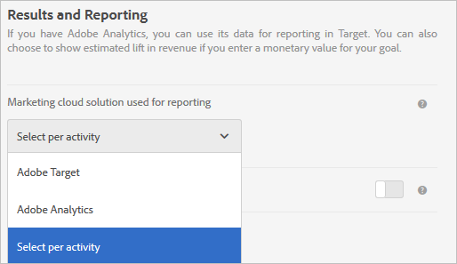

# Activiteitsinstellingen - Veelgestelde vragen voor A4T

Dit onderwerp bevat antwoorden op vragen die vaak over activiteitenopstelling en het gebruiken worden gevraagd [!DNL Analytics] als bron van rapportage voor [!DNL Target] (A4T).

## Welke activiteitstypes steunen Analytics als rapporteringsbron (A4T)? {#section_5E4F58CD25A5424E869E6FE0803968EF}

Voor een volledige lijst, zie &quot;Ondersteunde Types van Activiteit&quot;in [Adobe Analytics als rapportagebron voor Adobe Target (A4T)](/help/main/c-integrating-target-with-mac/a4t/a4t.md#concept_7540C8C04259434AB6EE33B09F47A1DE).

## Waarom heb ik tijdens het configureren van mijn Goal Metrics geen toegang tot Geavanceerde instellingen?

Voor activiteiten die [!DNL Analytics] als rapporteringsbron (A4T), het doel metrisch gebruikt &quot;[!UICONTROL Increment Count & Keep User in Activity]&quot; en &quot;[!UICONTROL On Every Impression]&quot;. Deze instellingen zijn *niet* configureerbaar.

Voor meer informatie, zie &quot;terwijl het vormen van mijn doelmetriek, waarom kan ik niet tot de Geavanceerde opties van Montages toegang hebben?&quot; in [Metrische definities - Veelgestelde vragen A4T](/help/main/c-integrating-target-with-mac/a4t/r-a4t-faq/a4t-faq-metric-definition.md).

## Ik heb net een activiteit gecreëerd. Waarom zie ik geen gegevens binnenkomen? {#section_9F8092BE4225442896F926540292F221}

Wanneer een activiteit wordt gecreeerd, [!DNL Target] een classificatiebestand verzenden naar [!DNL Analytics]. Hoewel [!DNL Analytics] die de gegevens vastlegt en verwerkt, toont dit niet aan dat dit in de rapporten voorkomt totdat het classificatiebestand is bijgewerkt. Dit proces kan tot 24 uur duren. Indien u na 48 uur uw gegevens niet ziet, gelieve [Contact opnemen met de klantenservice](/help/main/cmp-resources-and-contact-information.md#reference_ACA3391A00EF467B87930A450050077C). Als u weet dat u een activiteit start, kunt u deze activiteit een paar dagen eerder maken en de classificaties worden verzonden wanneer de activiteit wordt opgeslagen. Op die manier worden gegevens weergegeven in de rapporten wanneer deze worden gestart. Houd er rekening mee dat het 45-90 minuten duurt voordat gegevens worden verwerkt in [!DNL Analytics].

## Waarom kan ik Analytics niet als mijn rapporteringsbron selecteren wanneer ik een activiteit creeer? {#section_9F4F69C3085F4C2480AF439127EB27CD}

U kunt uw [!UICONTROL Reporting Settings] opties in [!UICONTROL Administration].

1. In [!DNL Target], klikt u op **[!UICONTROL Administration]**.
1. In de **[!UICONTROL Experience Cloud solution used for reporting]** vervolgkeuzelijst, klikt u op **[!UICONTROL Select per Activity]**.

De **[!UICONTROL Reporting Source]** vervolgkeuzelijst is ingeschakeld in het dialoogvenster **[!UICONTROL Goal & Settings]** scherm voor het maken en bewerken van activiteiten.

Altijd gebruiken [!DNL Analytics] als de bron van de rapportage selecteert u **[!UICONTROL Adobe Analytics]** in de vervolgkeuzelijst in [!UICONTROL Administration].

## Kan een bezoeker schakelen tussen gerichte en gecontroleerde ervaringen in verschillende bezoeken in een auto-Doelactiviteit die A4T gebruikt?

Het volgende is waar veronderstellend bezoekerId verandert niet voor een bezoeker tussen bezoeken.

Als het percentage voor de verkeerstoewijzing halverwege de activiteit wordt aangepast, is het mogelijk dat een bezoeker kan schakelen tussen doelgerichte en controleervaringen.

Als de percentages niet worden aangepast halverwege de activiteit, wordt een bezoeker die aanvankelijk de controle ziet altijd verzonden naar controle. Een bezoeker die naar gerichte ervaringen wordt verzonden wordt altijd naar gerichte ervaringen verzonden.

* Nadat de bezoeker zich in de beoogde &quot;emmer&quot; van het verkeer bevindt, kan hij naar een andere ervaring worden gestuurd dan een bezoek om te bezoeken als de modellen voor machinaal leren bepalen dat een andere ervaring relevant is voor het nieuwe bezoek.
* Nadat hij aan de controle &quot;emmer&quot;van verkeer wordt toegewezen, zal een bezoeker altijd de zelfde ervaring zien omdat de ervaringstaak op een deterministische pseudo-willekeurige hash van bezoekers bezoekerId gebaseerd is.

## Mag ik een binomiale [!DNL Analytics] metrisch met een segment dat als optimaliserend doel in wordt toegepast [!UICONTROL Auto-Allocate] activiteit? {#binomial}

U kunt geen [!DNL Analytics] metrisch met een segment dat als optimaliserend doel in wordt toegepast [!UICONTROL Auto-Allocate] activiteit. Als tussenoplossing kunt u een gebeurtenis van de Douane bepalen die het zelfde doel bereikt en gebruikt dat zoals optimaliserend doel metrisch.