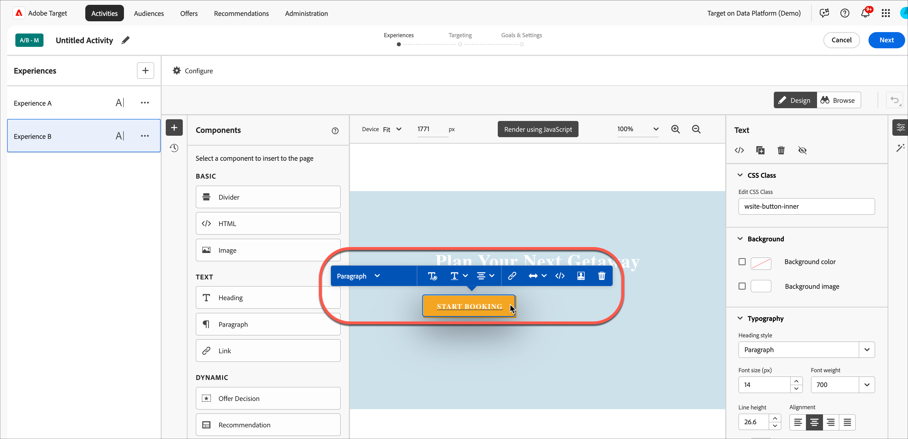

# Besluiten over aanbiedingen gebruiken

Gebruik [!DNL Adobe Target] met [!DNL Adobe Journey Optimizer] om de volgende beste aanbieding voor uw bezoekers op het web en mobiel te bepalen en te leveren.

Voeg via [!DNL Adobe Journey Optimizer] gemaakte aanbiedingsbeslissingen toe aan [!DNL Target] -activiteiten (handmatig [!UICONTROL A/B Test] of [!UICONTROL Experience Targeting] ) met behulp van [!UICONTROL Visual Experience Composer] (VEC) of [!UICONTROL Form-Based Composer] persoonlijke aanbiedingen te testen en te leveren aan uw bezoekers op de binnenkomende kanalen die worden aangedreven door [!DNL Target] .

Raadpleeg de volgende onderwerpen in de [!DNL Adobe Journey Optimizer] -documentatie voor meer informatie over *[!DNL Journey Optimizer]* en de opties die u kunt kiezen:

* [&#x200B; krijgen Begonnen met Journey Optimizer &#x200B;](https://experienceleague.adobe.com/docs/journey-optimizer/using/get-started/get-started.html?lang=nl-NL)

* [&#x200B; Ongeveer Beslissingsbeheer &#x200B;](https://experienceleague.adobe.com/docs/journey-optimizer/using/offer-decisioning/get-started-decision/starting-offer-decisioning.html?lang=nl-NL)

## Vereisten

Als u de aanbiedingsbeslissingen in [!DNL Target] wilt gebruiken, hebt u het volgende nodig:

* [!DNL Adobe Target Standard] of [!DNL Adobe Target Premium] uitgevoerd gebruikend [&#x200B; SDK van het Web van Adobe Experience Platform &#x200B;](https://experienceleague.adobe.com/docs/target-dev/developer/client-side/aep-web-sdk.html){target=_blank}.

  De functie is niet beschikbaar wanneer u [!DNL Target] implementeert met at.js of andere [!DNL Target] SDK&#39;s.

* [!DNL Adobe Journey Optimizer Ultimate] (AJO + Offer Decisioning) of [!DNL Adobe Experience Platform] en de invoegtoepassing voor de toepassingsservice [!UICONTROL Offer Decisioning] .

## Gebruiksscenario&#39;s

In de volgende voorbeelden wordt beschreven hoe u de [!DNL Target] / [!DNL Adobe Journey Optimizer] -integratie kunt gebruiken om beslissingen te bieden in [!DNL Target] -activiteiten:

### Sport

Als markator voor een sportieve ligging wilt u de inhoud op uw homepage (zowel op de website voor bureaublad als op de website voor mobiele apparaten) aanpassen. U wilt inhoud aanpassen op basis van meerdere dimensies en een aanbieding doen aan winkelgerelateerde franchise-producten. U bent geïnteresseerd in:

* Het favoriete team van de bezoeker
* Recente activiteiten van atleten/spelers (bijvoorbeeld teambewegingen, contractupdates of verwondingen)

U wilt bijvoorbeeld een persoonlijke ervaring bieden voor elk van de volgende regio&#39;s: Dortmund, Frankfurt en Bochum en voor gebruikers die impliciete en expliciete fans van deze teams zijn. Als metriek, wilt u bezoeken bekijken en aan de plaats van koopwaar klikken.

U wilt een [!UICONTROL A/B Test] activiteit (50/50 splitsing) tussen de standaardervaring en de gepersonaliseerde ervaring (die een aanbiedingsbesluit met aanbiedingen voor elke regio en elk team omvat) ontwerpen. U wilt deze activiteit gebruiken om de omzetting en de lift voor de gepersonaliseerde ervaring tegenover controle te bepalen.

### Spelstreamingplatforms

Als marketeer voor een gamingorganisatie wilt u een gepersonaliseerde aanbieding leveren voor een gamestreamingplatform voor desktopgebruikers en mobiele gebruikers uit verschillende geografische regio&#39;s: Duitsland, Frankrijk, Mexico en Brazilië. Wanneer een bezoeker de website voor bureaublad of mobiele apparaten opent vanuit een van deze regio&#39;s, wilt u een aanbieding voor streaming van games aanbieden in de lokale taal en met een overeenkomstige prijs voor de lokale valuta.

In [!DNL Adobe Journey Optimizer] kunt u een gepersonaliseerde homepage-hoofdaanbieding maken voor elk van de beoogde geografische gebieden, plus een fallback-aanbod met een standaard homepage-held. Vervolgens kunt u een besluit over het voorstel maken waarin deze aanbiedingen en de bijbehorende voorwaarden zijn opgenomen. Vervolgens kunt u in [!DNL Target] een [!DNL Experience Targeting] (XT)-activiteit maken en die beslissing invoegen op uw bureaublad of mobiele website om bezoekers de persoonlijke ervaring te bieden.

## Maak een ervaring die gebruikmaakt van een beslissing over een aanbieding:

1. Terwijl het uitgeven van of het creëren van een handboek [!UICONTROL A/B Test] of [!UICONTROL Experience Targeting] (XT) activiteit in [!UICONTROL Visual Experience Composer] (VEC), klik een paginaelement om het [&#x200B; optiemenu &#x200B;](/help/main/c-experiences/c-visual-experience-composer/viztarget-options.md) te tonen.

   

   >[!NOTE]
   >
   >U kunt ook een ervaring maken die [!UICONTROL Offer Decisions] gebruikt in de [[!UICONTROL Form-Based Experience Composer]](/help/main/c-experiences/form-experience-composer.md) .

1. Klik op **[!UICONTROL Replace Content]** en vervolgens op **[!UICONTROL Offer Decision]** .

   De optie [!UICONTROL Offer Decision] is alleen beschikbaar bij het bewerken of maken van [&#x200B; handmatige [!UICONTROL A/B Test]](/help/main/c-activities/t-test-ab/test-ab.md#types) of [[!UICONTROL Experience Targeting]](/help/main/c-activities/t-experience-target/experience-target.md) (XT) activiteiten. Deze optie is niet beschikbaar voor andere typen activiteiten. Welke opties beschikbaar zijn in het menu, is afhankelijk van het geselecteerde element.

   

1. Selecteer in de **[!UICONTROL Add Offer Decision]** -rail rechts van de VEC de gewenste sandbox en klik vervolgens op Offerte Decision.placement selecteren.

   A [&#x200B; zandbak &#x200B;](https://experienceleague.adobe.com/docs/experience-platform/sandbox/ui/overview.html?lang=nl-NL){target=_blank} in [!DNL Adobe Experience Platform] laat u uw instantie in virtuele milieu&#39;s verdelen. U hebt bijvoorbeeld een productieomgeving en een testomgeving. A [&#x200B; plaatsing &#x200B;](https://experienceleague.adobe.com/docs/journey-optimizer/using/offer-decisioning/create-components/creating-placements.html?lang=nl-NL){target=_blank} in [!DNL Adobe Journey Optimizer] hulp zorgt ervoor dat de juiste vertoningen van de aanbiedingsinhoud in de juiste plaats.

   

1. Selecteer de gewenste plaatsing van de aanbieding en de keuze voor de aanbieding en klik op **[!UICONTROL Add]** .

   

   Uw website wordt weergegeven in de VEC waar u het nieuwe besluit over aanbiedingen kunt zien in de [!UICONTROL Modifications] rail. U kunt op een aanbieding onder [!UICONTROL Offer Preview] onder aan de [!UICONTROL Offer Decision] -rail klikken om het besluit over de aanbieding te bekijken.

   <!--You can examine the various offers contained in the offer by clicking the appropriate icon at the bottom of the [!UICONTROL Offer Preview] dialog box, including the fallback offer. A fallback offer is the default offer displayed when a visitor is not eligible for any of the personalized offers in the collection.-->

   

1. Voltooi het maken van de activiteit door de stappen [!UICONTROL Targeting] en [!UICONTROL Goals & Settings] van de driedelige geleide workflow te voltooien.

   >[!IMPORTANT]
   >
   >Om ervoor te zorgen dat de [!DNL Target] -activiteit wordt gepersonaliseerd, moet u ervoor zorgen dat de begin- en einddatum van de huidige activiteit gelijk zijn aan de begin- en einddatum van de biedingsbeslissing in [!DNL Adobe Journey Optimizer] . Als de begin- en einddatum van [!DNL Target] buiten het begin- en einddatumbereik van het besluit van het voorstel vallen, wordt de standaard [!DNL Target] -inhoud aan bezoekers weergegeven.

## Opmerkingen en beperkingen

Neem de volgende informatie in overweging wanneer u met de beslissingen over aanbiedingen werkt:

* De integratie van de aanbiedingsbeslissing werkt voor [!DNL Target] implementaties die op het [&#x200B; Web SDK van Adobe Experience Platform &#x200B;](https://experienceleague.adobe.com/docs/target-dev/developer/client-side/aep-web-sdk.html){target=_blank} worden gebaseerd. Deze functie is niet beschikbaar wanneer u [!DNL Target] implementeert met at.js of andere [!DNL Target] SDK&#39;s.

* De [!DNL Target]/ [!DNL Adobe Journey Optimizer] integratie steunt [&#x200B; handboek [!UICONTROL A/B Test]](/help/main/c-activities/t-test-ab/test-ab.md#types) en [[!UICONTROL Experience Targeting]](/help/main/c-activities/t-experience-target/experience-target.md) (XT) slechts activiteiten. Deze functie is niet beschikbaar voor andere typen activiteiten.

* U kunt [[!UICONTROL Analytics as the reporting source]](/help/main/c-integrating-target-with-mac/a4t/a4t.md) (A4T) niet gebruiken als u aanbiedingsbesluiten in een activiteit gebruikt. Kies [!DNL Target] als de rapportbron op de [!UICONTROL Goals and Settings] -pagina tijdens het instellen van de activiteit als u beslissingen aanbiedt in de activiteit.

* Aanbiedingen met het inhoudstype text/html bieden geen ondersteuning voor levering van inhoud via de URL. DeliveringURL wordt gesteund door [&#x200B; vorm-Gebaseerde Composer van de Ervaring &#x200B;](/help/main/c-experiences/form-experience-composer.md) slechts waar de cliënt voor uitdrukkelijk het halen en het samenstellen van de inhoud verantwoordelijk is.

* [!DNL Target] reporting biedt geen rapportage op aanbodbeslissingsniveau.

* Het visualiseren van [&#x200B; verbindingen QA &#x200B;](/help/main/c-activities/c-activity-qa/activity-qa.md) voor [!DNL Target] ervaringen die aanbiedingsbesluiten bevatten beïnvloedt frequentiecapping die in [!DNL Adobe Journey Optimizer] voor die aanbiedingsbesluiten wordt geplaatst.
