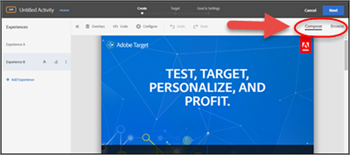

# Veelgestelde vragen over optimalisatie en personalisatie

Een lijst met veelgestelde vragen over het gebruik van de functies in Adobe Target, samen met informatie en koppelingen voor meer informatie.

## Algemene informatie {#section_CE5713B5AAC341C9A75586C107797FA3}

**Hoe kan ik zien hoe andere klanten Adobe Target hebben benut voor betere resultaten?**

Hier zijn slechts enkele van onze [succesverhalen van klanten](https://www.adobe.com/in/marketing-cloud/target/resources.html#x). Ontdek hoe klanten als u Doel leveraged om optimalisering en verpersoonlijking te verbeteren om bedrijfsdoelstellingen te bereiken.

Houd er rekening mee dat in sommige van deze casestudies mogelijkheden van Adobe Target Premium zijn benut.

**Waar kan ik meer weten over de nieuwste functies van Target?**

Zie onze [Opmerkingen bij de release](/help/main/r-release-notes/release-notes.md#reference_8FE40B43A5A34DDF8F26A53D55EE036A) voor meer informatie over de meest recente versie. Informatie over al onze [eerdere versies](/help/main/r-release-notes/release-notes-for-previous-releases.md) is ook online beschikbaar.

**Heeft Adobe een Gemeenschap/Forum waar ik antwoorden en meer informatie over Target kan vinden?**

Kijk uit de [Doelforum van de Gemeenschap](/help/main/cmp-resources-and-contact-information.md#concept_9C203A8AED054DFFA9A504811DB6BA42), waar we klanten helpen, maar belangrijker, we houden van Adobe Target-professionals zoals uzelf om elkaar te helpen. Het succes van een gemeenschap en forum hangt immers af van actieve deelname van haar leden. Word een lid van de gemeenschap en draag bij en zoek antwoorden op uw vragen.

**Welke browsers worden door het doel ondersteund?**

Lees onze [Ondersteunde browsers](/help/main/c-implementing-target/c-considerations-before-you-implement-target/supported-browsers.md#reference_01B4BF99E7D545A7998773202A2F6100) matrix voor meer details. Er zijn twee aspecten: de ondersteuning voor de Target Standard/Premium-Experience Cloud-interface en de ondersteuning voor de eindgebruikersbrowser op desktops/apparaten.

## Activiteiten {#section_CB95B3BF9934445DB98E8A7E22FC2CF6}

**Kan ik een statistisch rigoureuze activiteit uitvoeren om een het winnen en het verliezen ervaring te vinden terwijl het gebruiken van een controleervaring?**

Gebruiken [A/B-tests](/help/main/c-activities/t-test-ab/test-ab.md#task_05E33EB15C4D4459B5EAFF90A94A7977) (Optie Handmatig gericht) samen met de [Voorbeeldgroottecalculator](/help/main/c-activities/t-test-ab/sample-size-determination.md#section_286EB6E671184239BB1552F0387DAEB5) voor de beste resultaten.

**Hoe weet ik wanneer ik een activiteit stop?**

Voortijdig stoppen van activiteiten kan leiden tot verkeerde conclusies. Be aware of [common pitfalls and ensure practices to avoid them](/help/main/c-activities/t-test-ab/common-ab-testing-pitfalls.md#section_DF01A97275E44CA5859D825E0DE2F49F). See also, [How long should you run an A/B Test](/help/main/c-activities/t-test-ab/sample-size-determination.md)?

**How can I perform an activity if the time-window is small?**

**Can I optimize for my goal as I test?**

Gebruik onze [rapporten om de winnende ervaring te bepalen](/help/main/c-activities/automated-traffic-allocation/determine-winner.md#concept_5741A89ED7224E1285A3BC34B2CCD0F9).

**Kan ik een activiteit uitvoeren met een niveau van personalisatie als integraal deel van de activiteit?**

Uitchecken [Automatisch doel](/help/main/c-activities/auto-target/auto-target-to-optimize.md) optie.

**Hoe kan ik weten welk type activiteit het beste bij mijn behoeften past?**

Read the [Target Activities Guide](/help/main/c-activities/target-activities-guide.md#concept_D974B0918EB74B3B8CB07ACD32BF37A1) to understand the scenarios where each of the options provided by Adobe Target makes sense.

Zorg ervoor dat u ook rekening houdt met [Recommendations-activiteiten](/help/main/c-recommendations/recommendations.md#concept_7556C8A4543942F2A77B13A29339C0C0).

**Hoe kan ik ontdekken welke combinaties van elementen op mijn pagina bijdragen aan het succes ervan en in welke mate elk element helpt?**

Check out our [Full Factorial Multivariate (MVT) activities](/help/main/c-activities/c-multivariate-testing/multivariate-testing.md#concept_628695CDC71B449B8DCC2F5654C11499) with Element contribution analysis to see if it meets your needs.

Merk op dat de verkeersbehoefte met de activiteiten van MVT toeneemt.

**Kan ik een activiteit die veelvoudige pagina&#39;s overspannen waar de paginastructuur verschillend is?**

**Kan ik aanbiedingen op verschillende locaties toepassen (bijvoorbeeld de uitchecktrechter)?**

Probeer de [Multipage Activity, functie](/help/main/c-experiences/c-visual-experience-composer/multipage-activity.md#concept_277E096063E14813AC5D8EDFA1D2ED48) Hiermee kunt u meerdere pagina&#39;s gebruiken binnen ervaringen.

**Hoe kan ik ervoor zorgen dat een gebruiker, zodra een doel (Primair of Secundair) is bereikt, nooit opnieuw de activiteit ingaat en in plaats daarvan een verschillende activiteit ziet die verder gaat?**

Dit kunt u eenvoudig bereiken met de [Geavanceerde instellingen](/help/main/c-activities/t-test-ab/t-test-create-ab/ab-goals-and-settings.md#section_E2FE441AFB324E498793ABB025ED9974) optie beschikbaar bij elk doel. You have options to decide what should happen after user reaches the goal and how you want the counting to be incremented.

Zo, in dit geval, zou u &quot;de Telling van de Toename, Gebruiker &amp; Bar van de Versie van Terugkeer&quot;samen met &quot;Standaard/Andere Inhoud van de Activiteit&quot;kunnen kiezen om het doel te bereiken. Bekijk ook andere opties.

**Ik heb meerdere doelen in mijn activiteit gecreëerd. Kan ik een keten van doelen maken als trechter voor rapportage- en analysedoeleinden?**

**Bijvoorbeeld, wil ik Goal B overwegen wanneer de gebruiker Goal A heeft bereikt zodat ik aantallen voor een bepaalde trechter kan volgen.**

Het doel heeft een robuuste manier om dit te bereiken met onze functie voor afhankelijkheid van meeteenheden. Eenvoudig [Voeg gebiedsdelen op andere succesmetriek toe](/help/main/c-activities/r-success-metrics/success-metrics.md#section_7CE95A2FA8F5438E936C365A6D43BC5B). U hebt opties zoals &quot;Gehaald&quot; en &quot;Niet bereikt&quot;, en de mogelijkheid om metriek op meerdere manieren te combineren om elke gewenste combinatie te maken.

**Hoe kan ik duidelijk zijn hoe ik een activiteit kan opzetten om mijn doelstellingen te bereiken?**

Dit is waar [doelen](/help/main/c-activities/t-test-ab/t-test-create-ab/ab-goals-and-settings.md#reference_B25389FD6F3A4989801E740364B089CC) kom binnen.

U moet eerst weten waarop u wilt optimaliseren. Is het opbrengst, Omzetting, of Betrokkenheid? Elk van deze opties is beschikbaar in de doelsectie. En voor elk van deze handelingen kunt u nader bepalen welke actie een gebruiker op uw site zou uitvoeren om te kwalificeren dat het doel is bereikt.

Dit wordt mogelijk gemaakt door de instelling Primair doel in stap 3 van de workflow met instructies voor drie delen. U kunt ook extra doelstellingen toevoegen, die u voor betere rapportering kunnen helpen

**Kan ik een activiteit plannen om op een vast tijdstip te beginnen en te eindigen?**

Gebruik de [De functie voor het plannen van doelen en instellingen](/help/main/c-activities/t-test-ab/t-test-create-ab/ab-goals-and-settings.md#section_DCBDC354261F420EBD4B43EA34947BAC) stap van de driedelige workflow voor activiteit door de begin- en einddatum op te geven.

Vergeet niet de activiteit te activeren. Alleen live-activiteiten voldoen aan het opgegeven schema. Nadat de einddatum is bereikt, gaat de activiteit in het Eind staat.

**Kan ik alleen de stap Doelgericht wijzigen en niet de hele driestappenworkflow met instructies doorlopen om te bewerken?**

Dat kunt u eenvoudig doen door [rechtstreeks het ingaan van de gewenste stap van uw keus van de pagina van het Overzicht van de Activiteit](/help/main/c-activities/edit-activity.md#concept_BB064C0D4A194BD1A1AE7CCA1E6BB8F0) en sluit vervolgens uit die stap met de optie Opslaan en sluiten.

**Kan ik op een bepaalde stap blijven, de activiteit blijven wijzigen (aanbiedingstekst of aangepaste code, bijvoorbeeld), en dan QA in een ander lusje uitvoeren?**

Dat is ook mogelijk. Eenvoudig [Gebruik de optie Opslaan om incrementele wijzigingen aan te brengen zonder de stap te verlaten](/help/main/c-activities/edit-activity.md#concept_BB064C0D4A194BD1A1AE7CCA1E6BB8F0).

**Hoe kan ik een voorvertoning weergeven van een activiteit die ik zojuist heb gemaakt en een kwaliteitscontrole uitvoeren?**

Gebruik onze [krachtige functie QA-modus](/help/main/c-activities/c-activity-qa/activity-qa.md) om QA uit te voeren. U kunt verbindingen met uw team delen QA en ook de activiteit van begin tot eind, met inbegrip van het melden testen, om volledig zeker te zijn dat nadat de activiteit levend is, het zoals bedoeld en zoals getest werkt.

**Hoe kan ik de beslissingskracht van Target gebruiken om een ervaring/aanbieding te ontvangen die kan worden gebruikt in toepassingen van één pagina (SPA) of serverintegratie?**

Gebruik de kracht van [op formulieren gebaseerde activiteiten](/help/main/c-experiences/form-experience-composer.md#task_FAC842A6535045B68B4C1AD3E657E56E) with [JSON-aanbiedingen](/help/main/c-experiences/c-manage-content/create-json-offer.md#concept_63C7BEE1F0DB4A7596D997219B7C136D) om uw doel te bereiken.

**Ik heb twee activiteiten opgezet. Hoe weet ik welke bezoeker uiteindelijk zal zien?**

**Mag ik de prioritaire orde van een paar activiteiten bepalen?**

Gebruik de instelling voor prioriteit die beschikbaar is in stap 3 van de Geleide workflow voor drie delen van het doel (pagina met doelen en instellingen) voor [de prioriteit van de activiteiten bepalen](/help/main/c-activities/t-test-ab/t-test-create-ab/ab-goals-and-settings.md#section_DCBDC354261F420EBD4B43EA34947BAC).

Er zijn twee opties:

* Standaard, met drie niveaus (Laag / Normaal / Hoog)
* Aangepast, met een bereik van 0 tot en met 999. Schakel voor Aangepast de functie Prioriteiten met fijnkorrelige korrel in (Beheer > Visual Experience Composer).

## Soorten publiek {#section_FA6314777ABC46D8B198D6F388051460}

**Kan ik een publiekssegment in een activiteit creëren die voor de activiteit specifiek is? Ik ben van mening dat een dergelijk publiek niet in de Audience Library moet worden gecreëerd omdat er geen factor voor hergebruik is.**

Beginnen met onze [Functie Alleen-activiteit publiek](/help/main/c-target/creating-activity-only-audience.md#concept_A6BADCF530ED4AE1852E677FEBE68483) om een publiek te definiëren dat lokaal is voor de activiteit.

**Hoe kan ik gebruikers richten die op hun plaatsen worden gebaseerd?**

Uitproberen [Geopubliek](/help/main/c-target/c-audiences/c-target-rules/geo.md#concept_5B4D99DE685348FB877929EE0F942670). Lees meer over de nauwkeurigheidsniveaus van deze functie.

**Kan ik gebruikers richten die op sommige attributen op de pagina in de zitting worden gebaseerd?**

De beste manier zou zijn om dozen te gebruiken en [aangepast publiek](/help/main/c-target/c-audiences/c-target-rules/custom-parameters.md#concept_C4C6E00D7C5A4BE9B72D471DB2E3027B) om de juiste ervaring te bieden.

**Kan ik ervaringen aanbieden op basis van bezoekerskenmerken voor meerdere bezoeken?**

**Can I randomly split the traffic in two buckets?**

Try the [Profile Scripts feature](/help/main/c-target/c-visitor-profile/profile-parameters.md#concept_8C07AEAB0A144FECA8B4FEB091AED4D2). Het is een krachtige manier om ervaringen te personaliseren, hoewel het vereist dat u code schrijft.

**Kan ik een activiteit beginnen met een kleiner aantal bezoekers?**

Gebruik de besturingselementen voor procentuele toewijzing die beschikbaar zijn via [Stap 2 van de Geleide workflow met instructies voor het doel (Doelpagina)](/help/main/c-activities/t-test-ab/t-test-create-ab/ab-audience.md#concept_A268236C1224451DB7844BF67F41A087) om te bepalen hoe u over vestiging de activiteit wilt gaan.

**I also have Adobe Analytics and want to leverage it with Target. What key capabilities do I get by integrating the two solutions?**

Bekijk de volgende aspecten van het product:

* [Analytics for Target (A4T)](/help/main/c-integrating-target-with-mac/a4t/a4t.md#concept_7540C8C04259434AB6EE33B09F47A1DE)
* [Klantkenmerken](/help/main/c-target/c-visitor-profile/working-with-customer-attributes.md#concept_16C5C434D32D4EB1AD44A71821F3DEE8)
* [Soorten publiek](/help/main/c-integrating-target-with-mac/mmp.md)

## Experiences {#section_5959536B8D6A4BEA8FAA1273338F3451}

**Kan ik een activiteit op veelvoudige pagina&#39;s in werking stellen waar de paginastructuur gemeenschappelijk is?**

Uitchecken [Sjabloonregels](/help/main/c-experiences/c-visual-experience-composer/temtest.md#task_2539D51A18044F82B0D9895636546781) om veel vergelijkbare gestructureerde pagina&#39;s toe te voegen aan de activiteit en toch de ervaring te creëren op de enige opgegeven URL.

**Ik ben moe van het bericht &quot;uw browser toestaan om manuscripten&quot;te laden wanneer ik probeer om mijn pagina in Visual Experience Composer (VEC) te laden. Hoe kan ik dit voorkomen?**

De reden hiervoor is dat uw site gemengde inhoud bevat. Het is een site die zowel HTTP- als HTTPS-bronnen ophaalt. Vraag uw team van IT zich volledig naar HTTPS te bewegen.

Until this happens, follow the instructions in [Enabling Mixed Content in Your Browser](/help/main/c-experiences/c-visual-experience-composer/r-troubleshoot-composer/mixed-content.md#concept_46D022D50280468C9EF6D5DF6EFC911C) to allow your browser to load mixed content. Dit is een beveiligingsfunctie van de meeste moderne browsers.

**Kan ik Visual Experience Composer (VEC) op mijn plaats proberen alhoewel het Doel at.js bibliotheek nog niet is opgesteld?**

Probeer de pagina te laden met de [Enhanced Experience Composer](/help/main/c-experiences/experiences.md#section_34265986611B4AB8A0E4D6ACC25EF91D).

**Waarom laadt mijn plaats niet binnen Visual Experience Composer (VEC)?**

Probeer de [problemen oplossen](/help/main/c-experiences/c-visual-experience-composer/r-troubleshoot-composer/troubleshoot-composer.md#reference_77743144F10143A3A89D56E116D296E4) wordt beschreven in onze Help-pagina. Uitstrekken tot [Adobe-ondersteuning](/help/main/cmp-resources-and-contact-information.md#reference_ACA3391A00EF467B87930A450050077C) als geen van deze benaderingen werkt.

We hebben ook [formuliergebaseerde aanpak](/help/main/c-experiences/form-experience-composer.md#task_FAC842A6535045B68B4C1AD3E657E56E) die u kan ontgrendelen.

Lees ook wanneer en waarom [Enhanced Experience Composer](/help/main/c-experiences/experiences.md#section_34265986611B4AB8A0E4D6ACC25EF91D) kan nuttig zijn. Mogelijk moet u contact opnemen met uw IT-afdeling [lijst van gewenste personen Adobe proxyservers](/help/main/c-experiences/c-visual-experience-composer/experience-composer-best-practices.md#concept_E284B3F704C04406B174D9050A2528A6) ook.

**Ik heb een responsieve site. Hoe kan ik er tijdens het maken van een activiteit zeker van zijn dat ik denk aan belangrijke apparaten?**

Probeer de [Mobiele Viewports](/help/main/c-experiences/c-visual-experience-composer/mobile-viewports.md#concept_8E45527C4ABC41D59AA3553BEDC76FA5) gebruiken. Het werkt alleen als de Enhanced Experience Composer is ingeschakeld.

**Ik heb meerdere domeinen. Voor een van de domeinen moet de Enhanced Experience Composer ingeschakeld zijn, terwijl voor andere domeinen de functie moet worden uitgeschakeld. Hoe kan ik dit doen?**

U kunt altijd [De verbeterde optie van de Composer van de Ervaring op activiteitenniveau](/help/main/c-experiences/experiences.md#section_34265986611B4AB8A0E4D6ACC25EF91D) om het gebrek met voeten te treden dat (Beleid > de Composer van de Visuele Ervaring) plaatst.

**Waarom zie ik geen optie om beelden om te wisselen?**

Uitgaan naar Adobe tot [ervoor zorgen dat je account is ingesteld voor Scene7](/help/main/administrating-target/scene7-settings.md#task_37AD0768EFBA4E588955FE3D5DD670A5). Nadat u de provisioning hebt uitgevoerd, kunt u een afbeelding eenvoudig omwisselen met een andere afbeelding.

**Ik wil testen tussen twee verschillende ervaringen, bijvoorbeeld Platte korting versus Procentuele korting, maar ik wil de ervaringen correct richten (verschillende landschapstekst of verschillende valuta tonen voor mensen die uit verschillende landen komen). Hoe kan ik dit doen?**

Dit kunt u eenvoudig bereiken met onze [De functie Meerdere ervaringsversies](/help/main/c-activities/t-test-ab/t-test-create-ab/target-experience-to-multiple-audiences.md#task_0138112E283A4A5B9F8AB9AAF2FBC2FF). Noteer de nuances over de levering in dergelijke tests

**Hoe kan ik zien welke wijzigingen ik in Visual Experience Composer (VEC) heb aangebracht?**

We tonen altijd uw wijzigingen in het dialoogvenster [Code-editor](/help/main/c-experiences/c-visual-experience-composer/c-vec-code-editor/vec-code-editor.md#concept_B3A6E9EE3A60406DB640E205EA1745B5). Op het tabblad Wijzigingen ziet u de CSS-kiezer of het selectievakje dat u op uw aanbieding hebt toegepast.

De CSS-kiezer is een formaatkiezer. Met deze sectie kunt u kleine wijzigingen aanbrengen of snel bepaalde voorstellen verwijderen.

**Ik wil JavaScript leveren als onderdeel van het experiment of de activiteit om of wijzigingen voor sommige dynamische elementen te maken of eenvoudig een vraag naar een derdeoplossing te verzenden. Hoe kan ik dit doen?**

Een van de manieren is om de [Aangepaste code-editor](/help/main/c-experiences/c-visual-experience-composer/c-vec-code-editor/vec-code-editor.md#concept_B3A6E9EE3A60406DB640E205EA1745B5). Plaats uw JavaScript in de sectie en deze wordt geleverd. U hebt de optie om het in het hoofd of boven aan het lichaam te leveren, afhankelijk van uw behoeften.

**Waarom kan ik niet voorbij de login pagina binnen Visuele Composer van de Ervaring (VEC) of aan een pagina gaan diep binnen worden begraven waarvoor ik geen specifieke URL heb?**

Met de functies Samenstellen en Bladeren kunt u naar de gewenste pagina navigeren en uw ervaring maken.

**Hoe kan ik naar de ervaring van mijn keus van Stap 2 van het Beoogde driedelige Geleide werkschema van het Doel gaan (het richten van pagina)?**

Klik op de miniatuur vóór de naam van de ervaring in Stap 2 en u gaat aan de slag op de ervaring van uw keuze.

**Ik ben een voormalige gebruiker van Target Classic. Kan ik mijn dozen voor bepaalde gebruiksgevallen gebruiken?**

Gebruiken [formuliergebaseerde aanpak](/help/main/c-experiences/form-experience-composer.md#task_FAC842A6535045B68B4C1AD3E657E56E) om activiteiten te creëren.

**Waarom zie ik niet het gewenste aanbod/de gewenste ervaring en zie ik in plaats daarvan een andere activiteit?**

Gebruik onze [foutopsporing](/help/main/c-activities/c-troubleshooting-activities/content-trouble.md#concept_D2548B486C984B1E97ED7A72075B8EEA) en controleren op [activiteitenbotsingen](/help/main/c-experiences/c-visual-experience-composer/activity-collisions.md#concept_0BC6B929592744DFA7DA01FF4F91052E).

## Aanbiedingen {#section_A547B1EAD0B34FD38D3B87AAF62E3963}

**Ik wil niet proberen kleine wijzigingen aan te brengen, maar een geheel nieuwe pagina testen.**

**Ik wil gebruikers naar een bestemmingspagina leiden, bijvoorbeeld, een nieuwe lancering.**

**Hoe kan ik dit doen?**

We hebben [De functie URL omleiden](/help/main/c-experiences/c-manage-content/offer-redirect.md#task_33C80CD722564303B687948261484F94) Hiermee kunt u gebruikers omleiden naar de gekozen pagina (met of zonder de huidige queryparameters).

**Waarom gebeurt de levering van inhoud niet in mijn QA-proces?**

Het is mogelijk dat uw site dynamische id&#39;s, dubbele id&#39;s of dynamische klassen voor elementen bevat. Mogelijk moet u de sitevoorkeursopties op accountniveau evalueren (of op activiteitsniveau als de uitgave specifiek is voor een domein of pagina). Zie [CSS-kiezers](/help/main/administrating-target/visual-experience-composer-set-up.md#css).

**Waarom zie ik niet het gewenste aanbod/de gewenste ervaring en zie ik in plaats daarvan een andere activiteit?**

Gebruik onze [foutopsporing](/help/main/c-activities/c-troubleshooting-activities/content-trouble.md#concept_D2548B486C984B1E97ED7A72075B8EEA) en controleren op [activiteitenbotsingen](/help/main/c-experiences/c-visual-experience-composer/activity-collisions.md#concept_0BC6B929592744DFA7DA01FF4F91052E).

**Can I use Target&#39;s decisioning power to receive an experience/offer that can be used in Single Page Applications (SPAs) or server-side integrations?**

Use the power of [form-based activities](/help/main/c-experiences/form-experience-composer.md#task_FAC842A6535045B68B4C1AD3E657E56E) with [JSON offers](/help/main/c-experiences/c-manage-content/create-json-offer.md#concept_63C7BEE1F0DB4A7596D997219B7C136D) to meet your goal.

## Rapporten (met inbegrip van Analytics voor doel-A4T) {#section_8AECC69BEEB7422E894E7EC44A50BA0A}

**I also have Adobe Analytics and want to leverage it with Target. Welke belangrijke mogelijkheden krijg ik door de twee oplossingen te integreren?**

Bekijk de volgende aspecten van het product:

* [Analyses voor doel (A4T)](/help/main/c-integrating-target-with-mac/a4t/a4t.md#concept_7540C8C04259434AB6EE33B09F47A1DE)

* [Klantkenmerken](/help/main/c-target/c-visitor-profile/working-with-customer-attributes.md#concept_16C5C434D32D4EB1AD44A71821F3DEE8)

* [Soorten publiek](/help/main/c-integrating-target-with-mac/mmp.md)

**Kan ik het melden op veelvoudige gebruikerssegmenten segmenteren en verduisteren?**

Dit is waar de [Soorten publiek voor rapportagefunctie](/help/main/c-activities/t-test-ab/t-test-create-ab/ab-goals-and-settings.md#section_13119392051044FBA6387D9B3B1C43CF) beschikbaar op de pagina Doelstellingen en instellingen in Stap 3 van de driedelige workflow voor geleide activiteit.

U hebt de optie om 50 dergelijke segmenten en ook het toepassingspunt (Ingang van de Activiteit of specifiek metrisch) toe te voegen om een krachtige manier te hebben om te segmenteren en te dobbelen.

Merk op dat Doel de gegevens in dit verband van de tijd verzamelt u deze publiek toevoegt, zodat als u toevoegend segmenten alvorens de test in werking te stellen mist, bent u uit geluk.

**Ik kan geen publiek bepalen alvorens de activiteit in werking te stellen. Ik vind dit aspect van de verslaggeving van doelgroepen restrictief.**

**Wat kan ik doen om dit proces makkelijker te maken?**

Dit is waar [Analyses voor doel (A4T)](/help/main/c-integrating-target-with-mac/a4t/a4t.md#concept_7540C8C04259434AB6EE33B09F47A1DE) is handig. Als u Adobe Analytics hebt, kiest u gewoon de bron als Analytics, waardoor deze beperking wordt opgeheven. Nu kunt u analyse op om het even welk publiek op om het even welk punt uitvoeren en u te hoeven niet om het rapporteringspubliek op voorgrond te bepalen.

**Kan ik offline rapporteringsberekeningen uitvoeren?**

Gebruik de [Rapporten exporteren naar CSV en Bestelgegevens downloaden naar CSV-opties](/help/main/c-reports/downloading-data-in-csv-file.md#concept_3F276FF2BBB2499388F97451D6DE2E75) op de pagina Rapporten om de gewenste rapportgegevens te downloaden.

**Kan ik de controleervaring voor het evalueren van rapporten veranderen of de telmethode wijzigen van Bezoekers naar Bezoekers?**

Breng deze wijzigingen aan met de [Instellingen op de pagina Rapporten](/help/main/c-reports/c-report-settings/report-settings.md#concept_4BB6A7FDAB6F4806A632F9CD989B8BFA). Lees meer over deze instellingen om te begrijpen hoe de berekeningen variëren.

**Hoe moet ik rapporten interpreteren?**

We hebben geprobeerd zo intuïtief mogelijke rapporten te maken met functies als [betrouwbaarheidsintervalbalken, liftgrenzen, significantie/betrouwbaarheid en meerdere metrische selecties, tabel- en grafiekweergaven, loopgemiddelden en meer](/help/main/c-reports/c-report-settings/report-settings.md#concept_4BB6A7FDAB6F4806A632F9CD989B8BFA) om krachtige , maar gemakkelijke , rapportanalyse mogelijk te maken . Het is duidelijk dat u in Analytics kunt kijken als u gebruikt [Analyses voor doel (A4T)](/help/main/c-integrating-target-with-mac/a4t/a4t.md#concept_7540C8C04259434AB6EE33B09F47A1DE) activiteiten voor verdere analyse van het publiek.

## Reactiepunten {#section_C2A7118B4B62482A9D630C2212112A3D}

**Kan ik een integratie met een derdepartijsysteem, zoals Google Analytics of ClickTale uitvoeren, om de activiteiteninformatie over te gaan die aan een eindgebruiker voor analyse wordt geleverd?**

Ook daar hebben we een oplossing voor met onze [Functie voor reactietokens](/help/main/administrating-target/response-tokens.md#concept_2B21B222F6A344D68CA5929817E836C4).

## Problemen oplossen {#section_6B8B4DC62AE34066A8C55915E9EC6C19}

**Hoe kan ik de beschikbaarheidsstatus van Adobe Target kennen?**

Gebruik de [Adobe System Status pagina](/help/main/r-release-notes/system-status-updates.md#concept_5CBDF506BEFA40E483CC7DE0DA915EAD) om de status van Adobe- en Experience Cloud-oplossingen, inclusief Target, te bekijken. Deze pagina helpt u bepalen of de problemen u zouden kunnen ontmoeten toe te schrijven aan systeemupdates of routineonderhoud.

**Hebt u een gids voor het oplossen van problemen?**

Het spijt ons dat u problemen ondervindt. Uitchecken [Probleemoplossing](/help/main/r-troubleshooting-target/troubleshooting-target.md#reference_A9DB82675D044BD8861F6752A4EE6839) voor verbindingen aan vele het oplossen van problemenonderwerpen.

## Doeltoepassingen voor mobiele apparaten {#section_07BA89F2C38747158ECD5B153274AEAF}

**We hebben een mobiele SKU. Kan ik mobiele activiteiten creëren?**

Voor optimalisatie en personalisatie op mobiele apparaten moet u [op formulieren gebaseerde activiteiten](/help/main/c-experiences/form-experience-composer.md#task_FAC842A6535045B68B4C1AD3E657E56E) samen met de [Adobe SDK](/help/main/c-target-mobile-app/mobile-enable-target-in-sdk.md#task_FCA99AD0785A44E995468776AE76FE91). Meer informatie over [Doel voor mobiele apps](/help/main/c-target-mobile-app/target-mobile-app.md#concept_80126FF457724DE788CE37264A047559).

## Doel-API&#39;s {#section_714E85EFF6E3400389EF2E40D538E1DA}

**Waar kan ik meer leren over doel-API&#39;s?**

We hebben uitgebreide documentatie over API&#39;s. Zie [Leverings-API&#39;s, NodeJS SDK en Recommendations API&#39;s-documentatie](/help/main/c-implementing-target/c-api-and-sdk-overview/api-and-sdk-overview.md).
