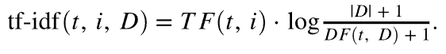

# De wetenschap achter de aanbevelingen van Target algoritmen

Een diepgaande beschrijving van de algoritmen die in [!DNL Adobe Target Recommendations] worden gebruikt, met inbegrip van de logica en de wiskundige details van modelopleiding en het proces van model het dienen.

Modeltraining is het proces waarbij aanbevelingen worden gegenereerd door de leeralgoritmen van [!DNL Adobe Target] . De functie Model serving geeft aan hoe [!DNL Target] aanbevelingen doet aan uw sitebezoekers (ook wel levering van inhoud genoemd).

[!DNL Target] bevat de volgende brede typen algoritmen in [!DNL Recommendations] :

* **op punt-Gebaseerde algoritmen**: Omvat algoritmen die de logica &quot;Mensen volgen die dit punt bekeken/kochten ook bekeken/verkochten deze punten.&quot; Deze algoritmen worden gegroepeerd onder de paraplu term punt-punt samenwerkende het filtreren, evenals [!UICONTROL Items with Similar Attributes] algoritmen.

* **gebruiker-Gebaseerde algoritmen**: Omvat [!UICONTROL Recently Viewed] en [!UICONTROL Recommended for You] algoritmen.

* **op populariteit-Gebaseerde algoritmen**: Omvat algoritmen die de top-viewde of top-Buy punten over de website terugkeren, of top-viewings of top-purchase door categorie of puntattribuut.

* **op kunst-Gebaseerde algoritmen**: Omvat multi-punt gebaseerde aanbevelingen met de logica &quot;mensen die deze punten bekeken/kochten, ook bekeken/gekocht die punten.&quot;

* **Criteria van de Douane**: Omvat aanbevelingen die op douanedossiers worden gebaseerd aan [!DNL Target] worden geupload.

>[!NOTE]
>
>Voor meer algemene informatie over elk algoritmetype en de individuele algoritmen, zie [&#x200B; Baseer de aanbeveling op een aanbeveling sleutel &#x200B;](/help/main/c-recommendations/c-algorithms/base-the-recommendation-on-a-recommendation-key.md).

Veel van de bovenstaande algoritmen zijn gebaseerd op de aanwezigheid van een of meerdere toetsen. Deze sleutels worden gebruikt om gelijkaardige punten bij de tijd van de inhoudslevering terug te winnen (wanneer aanbevelingen worden gedaan). Door de klant opgegeven sleutels kunnen het huidige object bevatten dat iemand bekijkt, het laatst bekeken of aangekochte object, het meest bekeken object, de huidige categorie of de favoriete categorie voor die bezoeker. Andere algoritmen, zoals op kar-gebaseerde of op gebruiker-gebaseerde aanbevelingen, gebruiken impliciete sleutels (die niet door de klant kunnen worden gevormd). Voor meer informatie, zie *sleutels van de Aanbeveling*, in [&#x200B; Baseer de aanbeveling op een aanbeveling sleutel &#x200B;](/help/main/c-recommendations/c-algorithms/base-the-recommendation-on-a-recommendation-key.md#keys). Deze toetsen zijn echter alleen relevant op het moment dat het model wordt gebruikt (levering van inhoud). Deze toetsen zijn niet van invloed op de logica van de ‘offline’ of de modeltrainingstijd.

De volgende secties groeperen algoritmen op een iets andere manier dan de hierboven beschreven algoritmenypes. De volgende groepering is gebaseerd op de gelijkenis van model opleidingslogica.

## Gezamenlijk filteren van item-item

Algoritmen zijn onder meer:

* [!UICONTROL People Who Viewed This, Viewed That]
* [!UICONTROL People Who Viewed This, Bought That]
* [!UICONTROL People Who Bought This, Bought That]

De punt-punt samenwerkings het filtreren aanbevelingen algoritmen zijn gebaseerd op het idee dat u de gedragspatronen van vele gebruikers (vandaar samenwerkingsverband) zou moeten gebruiken om nuttige aanbevelingen voor een bepaald punt (bijvoorbeeld, filter de catalogus van mogelijke punten om aan te bevelen) te verstrekken. Hoewel er vele verschillende algoritmen zijn die onder de algemene paraplu van [&#x200B; samenwerkings het filtreren &#x200B;](https://en.wikipedia.org/wiki/Collaborative_filtering) vallen, gebruiken deze algoritmen universeel gedragsgegevensbronnen als input. In [!DNL Target Recommendations] zijn deze invoer de unieke weergaven en aankopen van objecten door gebruikers.

Voor het algoritme &quot;Personen die dit item hebben bekeken/aangeschaft, hebben deze items ook bekeken/aangeschaft&quot;, is het doel een overeenkomst (A,B) tussen alle paren items te berekenen. Voor een bepaald punt A worden de hoogste aanbevelingen vervolgens geordend op basis van hun gelijkenis s(A,B).

Een voorbeeld van zo&#39;n gelijkenis is het samenvallen tussen items: een eenvoudige telling van het aantal gebruikers dat beide items heeft aangeschaft. Hoewel intuïtief, is zo&#39;n metrische waarde naïef in die zin dat het in de richting gaat van het aanbevelen van populaire objecten. Als de meeste mensen bijvoorbeeld op een kruidenierswinkel in retailer brood kopen, zal brood een grote co-existentie hebben met alle producten, maar het is niet per se een goede aanbeveling. [!DNL Target] gebruikt in plaats daarvan een meer geavanceerde, op gelijkenis gebaseerde metrische waarde die de log likely ratio (LLR) wordt genoemd. Deze hoeveelheid is groot wanneer de kans dat twee items, A en B, samen voorkomen, zeer verschillend is van de waarschijnlijkheid dat ze zich niet samen voordoen. Voor concretisering, overweeg een geval van het [!UICONTROL People Who Viewed This, Bought That] algoritme. De gelijkenis LLR is groot wanneer de waarschijnlijkheid dat B werd gekocht *niet* onafhankelijk van is of iemand A bekeken.

Als

dan zou het punt B niet met punt A moeten worden geadviseerd. De volledige details van deze berekening van de logboekwaarschijnlijkheidsverhouding worden verstrekt [&#x200B; in dit PDF &#x200B;](/help/main/c-recommendations/c-algorithms/assets/log-likelihood-ratios-recommendation-algorithms.pdf).

De logische stroom van de daadwerkelijke algoritmeimplementatie wordt getoond in het volgende schematische diagram:

Deze stappen zijn als volgt:

* **gegevens van de Input**: De gegevens van het gedrag, in de vorm van meningen en aankopen van bezoekers die worden verzameld wanneer u [&#x200B; Doel &#x200B;](https://experienceleague.adobe.com/docs/target-dev/developer/recommendations.html?lang=nl-NL){target=_blank} of van [&#x200B; Adobe Analytics &#x200B;](/help/main/c-recommendations/c-algorithms/use-adobe-analytics-with-recommendations.md){target=_blank} uitvoert.

* **Model opleiding**:

   * **het zuiveren van Gegevens en het bemonsteren**: Voor algoritmen met een N-day raadpleging, worden de gedragsgegevens eerst gefiltreerd om slechts die dagen van N van gegevens te omvatten. De regels van de inzameling en globale uitsluitingen worden dan toegepast om het even welke punten te verwijderen die niet zouden moeten worden geadviseerd. Tot slot hebben bezoekers die met meer dan 1.000 punten interactie hadden hun gebruiksgegevens bemonsterd aan slechts 1.000 punten.
   * **de vergelijkingsberekening van het Punt**: Dit is de kern computerstap: het berekenen van de de verhoudingsgelijkenis van de logboekwaarschijnlijkheid tussen alle kandidaat puntparen, en het rangschikken paren punten door deze gelijkenisscore.
   * **Off-line filtreren**: Tot slot worden om het even welke verdere toepasselijke dynamische filters toegepast (bijvoorbeeld, dynamische categorieconclusies). Na deze stap worden vooraf berekende aanbevelingen globaal in cache geplaatst om beschikbaar te zijn voor het dienen.

* **Model het dienen**: De inhoud van aanbevelingen wordt geleverd van [!DNL Target] [&#x200B; het globale &quot;Edge&quot;netwerk &#x200B;](/help/main/c-intro/how-target-works.md#concept_0AE2ED8E9DE64288A8B30FCBF1040934). Wanneer mbox de verzoeken aan [!DNL Target] worden gemaakt en het wordt bepaald dat de aanbevelingen inhoud aan de pagina zouden moeten worden geleverd, wordt het verzoek om de aangewezen [&#x200B; puntsleutel &#x200B;](/help/main/c-recommendations/c-algorithms/base-the-recommendation-on-a-recommendation-key.md#keys) voor het aanbevelingen algoritme of ontleed van het verzoek of opgezocht van het gebruikersprofiel, en dan gebruikt om de aanbevelingen terug te winnen die in de vorige stappen worden gegevens verwerkt. Verdere dynamische filters worden toegepast op dit ogenblik, alvorens het aangewezen [&#x200B; ontwerp &#x200B;](/help/main/c-recommendations/c-design-overview/create-design.md) wordt teruggegeven.

## Overeenkomende inhoud

Algoritme inbegrepen:

* [!UICONTROL Items with Similar Attributes]

In dit type algoritme worden twee items beschouwd als gerelateerd als de naam en de beschrijving ervan semantisch vergelijkbaar zijn. In tegenstelling tot de meeste aanbevelingen in algoritmen waarin gedragsgegevensbronnen moeten worden gebruikt, gebruiken algoritmen voor gelijkenis met inhoud metagegevens uit productcatalogi om de gelijkenis tussen items af te leiden. [!DNL Target] kan daarom aanbevelingen doen in zogenaamde &#39;cold-start&#39; scenario&#39;s, waar geen gedragsgegevens zijn verzameld (bijvoorbeeld aan het begin van een [!DNL Target] -activiteit).

Hoewel het model dat dienst doet en de tevreden leveringsaspecten van de de inhoudgelijkenisalgoritmen van [!DNL Target] aan andere op punt-gebaseerde algoritmen identiek zijn, zijn de modeltrainingsstappen drastisch verschillend en impliceren een reeks natuurlijke taalverwerking en voorverwerkingsstappen zoals die in het volgende diagram worden getoond. De kern van de gelijkheidsberekening is het gebruik van de cosinusgelijkenis van gewijzigde tf-idf vectoren die elk punt in de catalogus vertegenwoordigen.

Deze stappen zijn als volgt:

* **gegevens van de Input**: Zoals eerder beschreven, is dit algoritme puur gebaseerd op catalogusgegevens (die aan [!DNL Target] via het Diervoeder van de Catalogus van de a [&#x200B; worden opgenomen, de Entiteiten API, of van op pagina updates &#x200B;](https://experienceleague.adobe.com/docs/target-dev/developer/recommendations.html?lang=nl-NL){target=_blank}.

* **Model opleiding**:

   * **de extractie van Attributen**: Na de toepassing van regelmatige statische filters, catalogusregels en globale uitsluitingen, haalt dit algoritme relevante tekstuele gebieden uit het entiteitschema. [!DNL Target] gebruikt automatisch de naam, het bericht, en de categorievelden van de entiteitattributen en pogingen om het even welke koordgebieden uit douane [&#x200B; entiteitattributen &#x200B;](/help/main/c-recommendations/c-products/entity-attributes.md) te halen. Dit proces wordt gedaan door ervoor te zorgen dat de meerderheid van waarden voor dat gebied niet parseerbaar als aantal, datum, of booleaanse waarde is.
   * **het Afstammen en het einde-woord verwijdering**: Voor nauwkeurigere overeenkomende tekstgelijkenis, is het bedachtzaam om zeer gemeenschappelijke &quot;stop&quot;woorden te verwijderen die niet beduidend de betekenis van een punt (bijvoorbeeld, &quot;was,&quot;is &quot;en,&quot;en, etc.) veranderen. Op dezelfde manier verwijst stammen naar het proces om woorden met verschillende achtervoegsels aan hun wortelwoord te verminderen, dat een identieke betekenis heeft (bijvoorbeeld &quot;verbinden,&quot;verbinden,&quot;en &quot;verbinding&quot;allen hebben het zelfde wortelwoord: &quot;verbinden&quot;). [!DNL Target] gebruikt de Snowball-stemmer. [!DNL Target] voert eerst automatische taaldetectie uit en kan de verwijdering van woorden voor maximaal 50 talen en stammen voor 18 talen wel stoppen.
   * **n-gram verwezenlijking**: Na de vorige stappen, wordt elk woord behandeld als teken. Het proces waarbij opeenvolgende reeksen tokens worden gecombineerd tot één token, wordt n-gram maken genoemd. De algoritmen van [!DNL Target] hebben een waarde van maximaal 2 gram.
   * **tf-idf berekening**: De volgende stap impliceert de verwezenlijking van tf-idf vectoren om op het relatieve belang van tokens in de puntbeschrijving te wijzen. Voor elke token/term t in een item i, in een catalogus D met |D| De term frequentie TF(t, i) wordt als eerste berekend (het aantal keren dat de term voorkomt in item i), en de documentfrequentie DF(t, D). In wezen het aantal items waar het token bestaat. De tf-idf-maatregel is dan

     

     [!DNL Target] gebruikt *tf-idf* van de Vonk van Apache featurization implementatie, die onder de kap elk teken aan een ruimte van 218 tokens hashes. In deze stap, wordt het klant-gespecificeerde attribuut het opvoeren en het begraven ook toegepast door de termijnfrequenties in elke vector aan te passen die op montages wordt gebaseerd die in de [&#x200B; criteria &#x200B;](/help/main/c-recommendations/c-algorithms/create-new-algorithm.md#similarity) worden gespecificeerd.

   * **de gelijksoortigheidsberekening van het Punt**: De definitieve berekening van de puntgelijkenis wordt gedaan gebruikend een benaderende cosingelijkenis. Voor twee punten, *A* en *B*, met vectoren tA en tB, wordt de cosinegelijkenis bepaald als:

     

     Om significante ingewikkeldheid in gegevensverwerkingsgelijkenissen tussen alle n x N punten te vermijden, wordt de *tf-idf* vector beknot om slechts zijn grootste 500 ingangen te bevatten, en dan cosinegelijkenissen tussen punten te berekenen die deze afgekapte vectorvertegenwoordiging gebruiken. Deze aanpak blijkt robuuster te zijn voor dunne berekeningen van de vectorgelijkenis, in vergelijking met andere benaderende dichtstbijzijnde (ANN) technieken, zoals localiteitsgevoelige hashing.

   * **Model het dienen**: Dit proces is identiek aan punt-punt samenwerkende het filtreren technieken die in de vorige sectie worden beschreven.

## Aanbevelingen voor meerdere sleutels

Algoritmen zijn onder meer:

* Aanbevelingen voor winkelwagentjes
* [!UICONTROL Recommended For You]

De meest recente toevoegingen aan de [!DNL Target] reeks van aanbevelingen algoritmen zijn [!UICONTROL Recommended For You] en een reeks op kunst-Gebaseerde aanbevelingen algoritmen. Beide types van algoritmen gebruiken samenwerkings het filtreren technieken om individuele op punt-gebaseerde aanbevelingen te vormen. Vervolgens worden tijdens de runtime meerdere items in de browsergeschiedenis van de gebruiker (voor [!UICONTROL Recommended For You] ) of de huidige winkelwagentje van de gebruiker (voor op winkelwagentjes gebaseerde aanbevelingen) gebruikt om deze op items gebaseerde aanbevelingen op te halen. Deze worden vervolgens samengevoegd tot de uiteindelijke lijst met aanbevelingen. Merk op dat vele vloeren van gepersonaliseerde aanbevelingen algoritmen bestaan. De keuze van een algoritme met meerdere sleutels houdt in dat de aanbevelingen direct beschikbaar zijn nadat een bezoeker een browsergeschiedenis heeft en dat aanbevelingen kunnen worden bijgewerkt om te reageren op het meest recente gedrag van de bezoeker.

Deze algoritmen bouwen op de fundamentele samenwerkings het filtreren technieken voort die in op punt-gebaseerde aanbevelingen sectie worden beschreven, maar omvatten ook hyperparameterhet stemmen om optimale gelijkenis tussen punten te bepalen. Het algoritme voert een chronologische scheiding van gedragsgegevens voor elke gebruiker uit, en treinraadmodellen op de vroegere gegevens terwijl het proberen om de punten te voorspellen die een gebruiker of aankopen later bekijkt. De gelijkenis metrisch die de optimale [ Gemiddelde Precisie ] produceert (https://en.wikipedia.org/wiki/Evaluation_measures_(information_retrieval) wordt dan gekozen.

De logica van modelopleiding en het scoren stappen worden getoond in het volgende diagram:

 tonen

Deze stappen zijn als volgt:

* **gegevens van de Input**: Dit is identiek aan punt-punt samenwerkings het filtreren (CF) methodes. [!UICONTROL Both Recommended For You] en op kunst-Gebaseerde algoritmen gebruiken gedragsgegevens, in de vorm van meningen en aankopen van verzamelde gebruikers wanneer u [&#x200B; Doel &#x200B;](https://experienceleague.adobe.com/docs/target-dev/developer/recommendations.html?lang=nl-NL){target=_blank} of van [&#x200B; Adobe Analytics &#x200B;](/help/main/c-recommendations/c-algorithms/use-adobe-analytics-with-recommendations.md){target=_blank} uitvoert.

* **Model opleiding**:

   * **het zuiveren van Gegevens en het bemonsteren**: Dit is opnieuw het zelfde als voor samenwerkings het filtreren methodes, waar het raadplegingsvenster wordt toegepast op filtergedragsgegevens aan een aangewezen datumwaaier, die door toepassing van catalogusregels en globale uitsluitingen wordt gevolgd. Bezoekers die met meer dan 1000 objecten hebben gewerkt, hebben slechts hun meest recente 1000 gebruikers in overweging genomen.
   * **de testspleet van de Trein**: Voer een chronologische splitsing van de toepassingen voor elke gebruiker uit, die de eerste 80% van hun gebruik aan opleidingsgegevens toewijst, met de resterende 20% die aan de testgegevens wordt toegewezen.
   * **de modelopleiding van de gelijkenis van het Punt**: De vergelijkingsberekening van het kernpunt verschilt voor [!UICONTROL Recommended For You] en op kunst-Gebaseerde algoritmen in de manier dat de vector van het kandidaatpunt wordt geconstrueerd. Voor [!UICONTROL Recommended For You] hebben de itemvectoren dimensie-NUsers, waarbij elke vermelding de som van impliciete beoordelingen voor die gebruiker van het item vertegenwoordigt. Aankopen van een item krijgen een gewicht van 2x dat van weergaven van het item. Voor op kunst-Gebaseerde aanbevelingen, hebben de puntvectoren binaire ingangen; als het binnen-zittingsgedrag slechts moet worden overwogen, is er een nieuwe ingang voor elke zitting. Anders is er een item in dit item-vector voor elke bezoeker.

  De trainingsstap berekent verscheidene types van vectorgelijkenissen: gelijkenis LLR ([&#x200B; hier besproken &#x200B;](/help/main/c-recommendations/c-algorithms/assets/log-likelihood-ratios-recommendation-algorithms.pdf)), cosinegelijkenis (eerder bepaald), en een genormaliseerde L2 gelijkenis, die als wordt bepaald:

  

   * **de modelevaluatie van de gelijkenis van het Punt**: De modelevaluatie wordt gedaan door de aanbevelingen te nemen die in de vorige stap worden geproduceerd en voorspellingen te maken over de reeks van testgegevens. De online het scoren fase wordt nagebootst door chronologisch het puntengebruik van elke gebruiker in de testdataset te bepalen, dan het doen van 100 aanbevelingen voor geordende ondergroepen van punten in een poging om verdere meningen en aankopen te voorspellen. Een metrische informatie terugwinning, [ Gemiddelde Precisie ] (https://en.wikipedia.org/wiki/Evaluation_measures_(information_retrieval), wordt gebruikt om de kwaliteit van deze aanbevelingen te evalueren. Deze maatstaf houdt rekening met de volgorde van aanbevelingen, en geeft de voorkeur aan relevante punten hoger in de lijst van aanbevelingen, die een belangrijk bezit voor rangschikkingssystemen is.
   * **modelselectie**: Na off-line evaluatie, wordt het model dat de hoogste Gemiddelde Precisie heeft geselecteerd, en alle individuele punt-punt aanbevelingen die voor het worden verwerkt.
   * **Off-line filtreren**: Het definitieve stadium van modelopleiding is de toepassing van om het even welke toepasselijke dynamische filters. Na deze stap worden vooraf berekende aanbevelingen globaal in cache geplaatst om beschikbaar te zijn voor het dienen.

* **Model het dienen**: In tegenstelling tot vorige algoritmen waarin het dienen van aanbevelingen het specificeren van één enkele sleutel voor herwinning impliceert, die door toepassing van bedrijfsregels wordt gevolgd, gebruiken de [!UICONTROL Recommended for You] en op kunst-Gebaseerde algoritmen een complexer runtime proces.

   * **multi-key herwinning en het samenvoegen**: Voor op kunst-Gebaseerde aanbevelingen, tot tien punten die in het kart worden overgegaan worden beschouwd als sleutels voor herwinning en de aanbevelingen van elk zijn gelijk gewogen. Voor [!UICONTROL Recommended for You] worden maximaal de laatste vijf unieke weergegeven items en de laatste vijf unieke gekochte items beschouwd als sleutels voor het ophalen, waarbij aanbevelingen die voortkomen uit aangekochte items tweemaal zo zwaar worden gewogen als aanbevelingen die voortkomen uit weergegeven items. Als bij het samenvoegen van aanbevelingen een item in meerdere afzonderlijke lijsten met aanbevelingen wordt weergegeven, worden de gewogen resultaten voor de gelijkenis toegevoegd. De definitieve lijst met aanbevelingen uit deze fase is dan de samengevoegde lijst van opnieuw gewogen aanbevelingen, gerangschikt in aflopende volgorde.
   * **Filtrerend**: Volgende, filtrerende regels zoals verwijdering van eerder bekeken en/of gekochte punten, evenals andere dynamische bedrijfsregels worden toegepast.

Deze processen worden geïllustreerd in de volgende afbeelding, waarbij een bezoeker item A heeft bekeken en item B heeft aangeschaft. Individuele aanbevelingen worden opgehaald met de offline vergelijkbare scores onder elk itemlabel. Na terugwinning, worden de aanbevelingen samengevoegd met gewogen gelijkenisscores samengevat. Tot slot in een scenario waarin de klant heeft gespecificeerd dat eerder bekeken en gekochte punten uit moeten worden gefiltreerd, verwijdert de het filtreren stap punten A en B uit de lijst van aanbevelingen.

## Gebaseerd op populariteit

Algoritmen zijn onder meer:

* [!UICONTROL Most Viewed Across the Site]
* [!UICONTROL Most Viewed by Category]
* [!UICONTROL Most Viewed by Item Attribute]
* [!UICONTROL Top Sellers Across the Site]
* [!UICONTROL Top Sellers by Category]
* [!UICONTROL Top Sellers by Item Attribute]

[!DNL Target] biedt op populariteit gebaseerde algoritmen voor zowel de meest bekeken items als de meest verkochte items op een website of uitgesplitst naar een itemkenmerk of categorie. Op populariteit gebaseerde algoritmen rangschikken items op basis van het aantal sessies waarin dat item in een bepaald tijdkader is weergegeven of aangeschaft.

Al deze algoritmen combineren geaggregeerde gedragsgegevens waarbij het totale aantal sessies waarin items zijn bekeken en aangeschaft, wordt vastgelegd op zowel de uurresolutie als de dagelijkse resolutie. De individuele algoritmen vinden dan de het meest bekeken of meeste gekochte punten voor de klant gevormd raadplegingsvenster.

Afzonderlijke algoritme-nuances zijn als volgt:

* In [!UICONTROL Most Viewed Across the Site] en [!UICONTROL Top Sellers Across the Site] worden items gerangschikt op basis van het geaggregeerde aantal sessies waarin deze items respectievelijk zijn weergegeven of aangeschaft. De uitvoer bestaat uit één (zonder sleutel) lijst met aanbevolen items.
* De meeste weergaven/topverkopers op rubriek/kenmerk zijn aanbevelingen waarbij items worden geordend op basis van de totale aantallen sessies waarin deze items zijn weergegeven of aangeschaft, maar gegroepeerd op de objectcategorie of het specifieke kenmerk. De output is lijsten van geadviseerde punten, die door waarden van categorieën, of waarden van puntattributen worden gehouden.

## Onlangs bekeken

Het algoritme van de &quot;onlangs bekeken&quot;aanbevelingen staat voor in-zittingspersonalisering van aanbevelingen toe. Voor dit algoritme is geen offline &#39;modeltraining&#39; vereist. In plaats daarvan, [!DNL Target] gebruikt het unieke [&#x200B; Profiel van de Bezoeker &#x200B;](/help/main/c-target/c-visitor-profile/visitor-profile.md) om een lopende lijst van punten te handhaven die in een bepaalde zitting zijn bekeken en deze punten in aanbevelingen activiteiten kunnen behandelen. Dit staat voor updates in real time aan aanbevelingen en volgende-pagina verpersoonlijking toe.

## Aangepaste criteria

De criteria van de douane staan klanten toe om [&#x200B; hun eigen aanbevelingen aan  [!DNL Target]](/help/main/c-recommendations/c-algorithms/recommendations-csv.md) te uploaden, die belangrijke flexibiliteit geven en &quot;uw eigen model&quot;mogelijkheden toestaan. De criteria van de douane vervangen het &quot;off-line opleidings&quot;gedeelte van [!UICONTROL Item-Based] aanbevelingen, maar gedraagt zich zoals op punt-Gebaseerde aanbevelingen algoritmen tijdens de online fase van de inhoudslevering, in die zin dat één enkele sleutel voor terugwinning van aanbevelingen wordt gebruikt en bedrijfsregels/filters dan worden toegepast.
