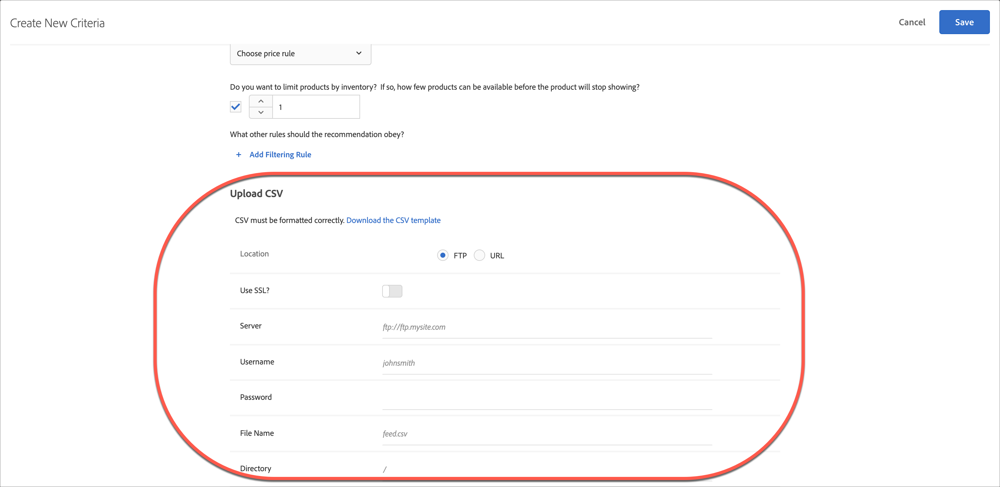

# Aangepaste criteria uploaden

Upload een CSV-bestand om uw aanbevelingen in [!DNL Adobe Target] aan te passen.

Er zijn meerdere manieren om het [!UICONTROL Create New Criteria] -scherm te bereiken. Sommige schermopties variëren afhankelijk van de manier waarop u het scherm bereikt.

* Klik in het scherm **[!UICONTROL Recommendations]** > **[!UICONTROL Criteria]** Bibliotheek op **[!UICONTROL Create Criteria]** > **[!UICONTROL Create Criteria]** . De criteria die u hier maakt, worden automatisch beschikbaar gesteld voor alle [!DNL Recommendations] -activiteiten.
* Wanneer u een [!DNL Recommendations] -activiteit maakt met behulp van [!UICONTROL Visual Experience Composer] (VEC), wordt u direct naar het [!UICONTROL Select Criteria] -scherm geleid nadat u een element op de pagina hebt geselecteerd en op [!UICONTROL Replace w/ Recommendations] , [!UICONTROL Insert Recommendations Before] of [!UICONTROL Insert Recommendations After] hebt geklikt. U kunt vervolgens een beschikbare criteria selecteren of op **[!UICONTROL Create Criteria]** klikken. Als u nieuwe criteria maakt, kunt u uw criteria opslaan voor gebruik met andere [!DNL Recommendations] -activiteiten. Voor meer informatie, zie [&#x200B; een activiteit van Aanbevelingen &#x200B;](/help/main/c-recommendations/t-create-recs-activity/create-recs-activity.md) creëren.
* Wanneer u een [!DNL Recommendations] -activiteit bewerkt, klikt u in een [!UICONTROL Recommendations Location] -vak op de pagina en selecteert u **[!UICONTROL Change Criteria]** . Klik op [!UICONTROL Select Criteria] in het **[!UICONTROL Create Criteria]** -scherm. U kunt uw nieuwe criteria opslaan voor gebruik met andere [!DNL Recommendations] activiteiten.

In de volgende stappen wordt ervan uitgegaan dat u het [!UICONTROL Create New Criteria] -scherm opent via de eerste methode: het **[!UICONTROL Recommendations]** > **[!UICONTROL Criteria]** -bibliotheekscherm.

1. Klik op **[!UICONTROL Recommendations]** > **[!UICONTROL Criteria]** .

1. Klik op **[!UICONTROL Create Criteria]**.

1. Vul de informatie in de [&#x200B; Basisinformatie &#x200B;](/help/main/c-recommendations/c-algorithms/create-new-algorithm.md#info) sectie in.

   1. Selecteer **[!UICONTROL Select Algorithm]** in de vervolgkeuzelijst **[!UICONTROL Custom Criteria]** Type.

   1. Selecteer in de vervolgkeuzelijst **[!UICONTROL Algorithm]** de optie **[!UICONTROL Custom Algorithm]**.

      >[!NOTE]
      >
      >De voorgaande stappen zorgen ervoor dat de sectie [!UICONTROL Upload CSV] onder in het dialoogvenster [!UICONTROL Create New Criteria] wordt weergegeven.

1. (Voorwaardelijk) Vul de informatie in de [&#x200B; ReserveInhoud &#x200B;](/help/main/c-recommendations/c-algorithms/create-new-algorithm.md#content) sectie in.

1. (Voorwaardelijk) Vul de informatie in de [&#x200B; sectie van de Regels van de Opname &#x200B;](/help/main/c-recommendations/c-algorithms/create-new-algorithm.md#inclusion) in.

1. Selecteer in de sectie **[!UICONTROL Upload CSV]** de **[!UICONTROL Location]** van het CSV-bestand.

   

   Het CSV-bestand moet correct zijn opgemaakt om te kunnen worden geüpload. Klik op **[!UICONTROL Download the CSV template]** om een CSV-bestand met de juiste indeling te verkrijgen.

   U hebt twee locatieopties:

   * **FTP:** om uw Csv- dossier van een server van FTP te uploaden, selecteer **[!UICONTROL FTP]**, dan ga de vereiste informatie in. U kunt SSL gebruiken, dat het protocol van FTPS gebruikt om uw Csv- dossier veilig over te brengen.
   * **URL:** om uw Csv- dossier van een URL te uploaden, selecteer **[!UICONTROL URL]**, dan ga een voer URL in.

1. Klik op **[!UICONTROL Save]**.

## Overwegingen

* Entiteiten met aangepaste criteria (rijen) kunnen maximaal 1000 aanbevolen items (kolommen) bevatten.

* Updates van aangepaste criteria zijn standaard &#39;cumulatief&#39;. Nieuwe sleutelwaardeparen die in het CSV-uploadbestand zijn opgegeven, overschrijven bestaande sleutelwaardeparen. Bestaande sleutel-waarde paren die geen sleutels hebben die in CSV worden gespecificeerd uploaden zijn nog beschikbaar voor levering en verlopen in 31 dagen vanaf de tijd zij als deel van het Csv- dossier het laatst worden geupload.

  De Zorg van de Cliënt van het contact om het plaatsen toe te laten om de bestaande resultaten te verwerpen die niet inbegrepen in volgende Csv uploaden zijn. Als deze instelling is ingeschakeld, zijn alleen de sleutels in het aangepaste CSV-voederbestand beschikbaar voor levering. Deze instelling is van toepassing op alle aangepaste criteria.

* Aangepaste criteria worden elke 24 uur bijgewerkt.

  U kunt de upload- en synchronisatiestatus zien van uw aangepaste criteria die u uploadt onder aan elke criteria op de pagina [!UICONTROL Recommendations] > [!UICONTROL Criteria] . U kunt de status ook in het dialoogvenster [!UICONTROL Edit] zien wanneer u aangepaste criteria bewerkt.

* De stroom voor een foutloze upload moet [!UICONTROL Scheduled] > [!UICONTROL Downloading Feed File] > [!UICONTROL Importing] > [!UICONTROL Successful] zijn.

* Hieronder volgen mogelijke foutberichten die u kunt ontvangen als [!DNL Target] een probleem tegenkomt met het uploaden:

  | Foutbericht | Details |
  |--- |--- |
  | Onbekende fout | Geeft een interne technische fout aan. |
  | Parseringsfout | Er is waarschijnlijk een probleem met de bestandsindeling feed. Corrigeer de bestandsindeling en sla het algoritme opnieuw op, waardoor het downloadproces van het bestand opnieuw wordt gestart. |
  | Server niet gevonden | Geef een IP- of hostnaam op die op internet zichtbaar is. |
  | Credentials-fout | Geef een geldige gebruiker en wachtwoord op voor een actieve account op de server. |
  | Map niet gevonden | Geef een map op die op de server aanwezig is. |
  | Bestand niet gevonden | Geef de naam op van een bestand dat op de server in de aangegeven directory staat. |

## De video van de opleiding: Creeer criteria in Aanbevelingen (12 :33) 

Deze video bevat de volgende informatie (details over het uploaden van douanecriteria beginnen bij 11 :43):

* Criteria maken
* Criteria-reeksen maken
* Aangepaste criteria uploaden

>[!VIDEO](https://video.tv.adobe.com/v/27694?quality=12)
