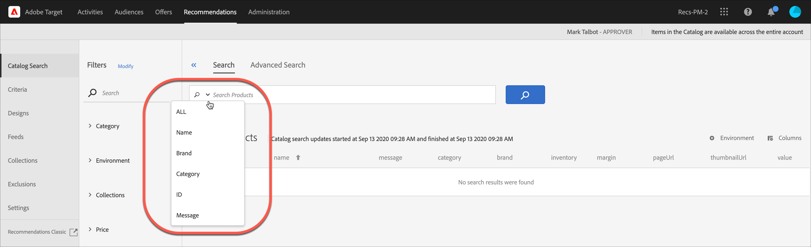

# Catalogus zoeken

Met de pagina [!UICONTROL Catalog Search] in [!DNL Adobe Recommendations] kunt u de producten of inhoud in uw catalogus vinden. De eenvoudigste taak die u op deze pagina kunt uitvoeren, is het zoeken naar een item. Daarnaast kunt u de omgeving wijzigen, zoekresultaten opslaan in verzamelingen of uitsluitingen, filterfacetten toevoegen en kolommen in de tabel wijzigen, nieuwe zoekfacetten toevoegen en nog veel meer.

De catalogi verwijzen naar uw volledige productreeks (entiteiten). Uw catalogus kan vele inzamelingen bevatten, een manier om uw producten in logische emmers te organiseren.

## Zoeken naar catalogus openen

Klik op [!UICONTROL Catalog Search] > **[!UICONTROL Recommendations]** om de pagina **[!UICONTROL Catalog Search]** te openen.

## Zoeken naar een object

U kunt een eenvoudige zoekopdracht of een geavanceerde zoekopdracht gebruiken om items in uw catalogus te zoeken.

### Een eenvoudige zoekopdracht uitvoeren

1. Typ een zoekterm in het veld **[!UICONTROL Search Products]** .

1. (Optioneel) U kunt uw zoekopdracht verfijnen door een zoekoptie te selecteren in het optiemenu dat wordt weergegeven wanneer u op de pijl omlaag klikt in het zoekveld.

   

   Zoekopties zijn onder andere:

   * ALL - Zoekt over alle andere onderzoekscriteria, gebruikend OF logica.
   * Naam
   * Merk
   * Categorie
   * ID
   * Bericht

1. U kunt nu door de items in de zoekresultaten bladeren om miniaturen en andere productinformatie weer te geven.

   In de volgende afbeelding ziet u de resultaten van de optie Alles voor &quot;fiets&quot;.

   

   Het aantal dat naast &quot;Producten&quot;toont is het aantal producten die de onderzoekstermijn aanpassen, van het totaal beschikbaar in het gespecificeerde milieu.

   U kunt de functie voor automatisch aanvullen zoeken gebruiken. In de volgende afbeelding retourneert het typen van &quot;bik&quot; alle producten die het woord &quot;cycle&quot; bevatten.

   

   >[!NOTE]
   >
   >Wanneer u een cataloguszoekopdracht uitvoert op een aangepast kenmerk met een numerieke waarde, wordt het aangepaste kenmerk in de resultaten behandeld als een tekenreeks in plaats van een numerieke waarde.
   >
   >Er is momenteel geen functionaliteit beschikbaar waarmee u het type van een kenmerk kunt wijzigen. Om een verandering aan te brengen, [&#x200B; open een klantenkwestie &#x200B;](/help/main/cmp-resources-and-contact-information.md#reference_ACA3391A00EF467B87930A450050077C) van verwijzingen voorzien van de attributen die het type vereisen dat van koord in numeriek wordt veranderd.

1. U kunt filters ook gebruiken om het gewenste product te vinden. In het volgende voorbeeld worden alle fietsgereedschappen in het catalogusscherm weergegeven door het facet [!UICONTROL Collections] uit te vouwen en &quot;Extra&#39;s maken&quot; te selecteren.

   

1. U kunt verder zoeken in de resultatenlijst door een zoekterm in te voeren, bijvoorbeeld &#39;keten&#39;.

   

### Een geavanceerde zoekopdracht uitvoeren {#advanced-search}

U kunt [!UICONTROL Advanced Search] gebruiken om uw onderzoeksresultaten verder te verfijnen of uw onderzoeksresultaten als a [&#x200B; inzameling &#x200B;](/help/main/c-recommendations/c-products/collections.md) of [&#x200B; uitsluiting &#x200B;](/help/main/c-recommendations/c-products/exclusions.md) te bewaren.

1. Klik op de koppeling **[!UICONTROL Advanced Search]** .

   

1. Gebruik de vervolgkeuzelijsten om de parameter, de operator en de waarden voor uw zoekopdracht op te geven.

1. (Optioneel) Klik op **[!UICONTROL Add Rule]** om een extra zoekregel toe te voegen.

   Elke extra onderzoeksregel wordt aangesloten bij de exploitant AND.

1. Klik op **[!UICONTROL Search]**.

1. (Optioneel) Klik op **[!UICONTROL Save As]** en vervolgens op **[!UICONTROL Collection]** of **[!UICONTROL Exclusion]** .

   

   Voor meer informatie, zie [&#x200B; een inzameling of een uitsluiting creëren die op Geavanceerd Onderzoek &#x200B;](#save-as) hieronder wordt gebaseerd.

## Details van een object bekijken

U kunt de details van een afzonderlijk item, zoals de id, de naam, het bericht, de categorie en meer, weergeven door de details ervan weer te geven.

1. Klik op een item in de zoekresultaten om de details weer te geven.

   

## Een item uit de catalogus verwijderen

1. Klik op een item in de zoekresultaten om de details weer te geven.

1. Klik op **[!UICONTROL Remove from Catalog]**.

1. Bevestig dat u het item wilt verwijderen.

Alle informatie over dat item wordt verwijderd uit de catalogusindex. Het item wordt alleen in de catalogus opgenomen als het opnieuw wordt toegevoegd aan een gegevensfeed. Een verwijderd item moet afzonderlijk van feeds worden verwijderd.

## De catalogus vernieuwen

De index van uw catalogus wordt automatisch gecreeerd wanneer u uw eerste voer uploadt, en volgens het [&#x200B; gespecificeerde programma &#x200B;](/help/main/c-recommendations/c-products/feeds.md#steps) verfrist.

De catalogus wordt automatisch vernieuwd wanneer updates worden ontvangen via feed-bestanden, API- of mbox-updates. Updates worden meestal binnen een uur voltooid. Als er updates worden uitgevoerd, wordt de tijd weergegeven waarop de meest recente update is gestart. Als er geen updates worden uitgevoerd, wordt de tijd weergegeven waarop de meest recente update is gestart en voltooid.

## Een verzameling of uitsluiting maken op basis van Geavanceerd zoeken {#save-as}

U kunt [&#x200B; inzamelingen &#x200B;](/help/main/c-recommendations/c-products/collections.md) of [&#x200B; uitsluitingen &#x200B;](/help/main/c-recommendations/c-products/exclusions.md) tot stand brengen gebruikend [!UICONTROL Advanced Search] op de [!UICONTROL Catalog Search] pagina ([!UICONTROL Recommendations] > [!UICONTROL Catalog Search] > [!UICONTROL Advanced Search]).

1. Voer een [&#x200B; geavanceerd onderzoek &#x200B;](#advanced-search) uit.

1. Klik op **[!UICONTROL Save As]** en vervolgens op **[!UICONTROL Collection]** of **[!UICONTROL Exclusion]** .

   

   >[!IMPORTANT]
   >
   >De functie [!UICONTROL Advanced Search] is niet hoofdlettergevoelig. Producten die op het moment van levering worden geretourneerd, zijn echter gebaseerd op hoofdlettergevoelige zoekopdrachten. Deze wanverhouding kan tot verwarring leiden. Zorg ervoor dat u rekening houdt met hoofdlettergevoeligheid wanneer u verzamelingen of uitsluitingen maakt op basis van resultaten met de functie [!UICONTROL Advanced Search] . Als u bijvoorbeeld zoekt naar &#39;Vakantie&#39;, worden in de eerste zoekopdracht resultaten weergegeven die &#39;Vakantie&#39; en &#39;Vakantie&#39; bevatten. Als u vervolgens een catalogus maakt met de intentie om producten met &quot;vakantie&quot; te retourneren, worden alleen producten met &quot;vakantie&quot; geretourneerd. Producten met &quot;Vakantie&quot; worden niet geretourneerd. Uitsluitingen worden op vergelijkbare wijze behandeld.

## De omgeving wijzigen

[&#x200B; Milieu&#39;s &#x200B;](/help/main/administrating-target/environments.md) laten u uw plaatsen en pre-productiemilieu&#39;s voor gemakkelijk beheer en gescheiden rapportering organiseren.

1. Klik op de koppeling Omgeving.

   

1. Selecteer de gewenste omgeving.

## De pagina Catalogus zoeken (filters en kolommen) wijzigen

U kunt tijdelijk de beschikbare filters en kolommen op de [!UICONTROL Catalog Search] pagina voor de huidige zitting wijzigen.

### Filters wijzigen

U kunt extra filterfacetten aan de [!UICONTROL Catalog Search] pagina toevoegen.

1. Klik in het deelvenster **[!UICONTROL Filters]** op **[!UICONTROL Modify]** .

   

1. Selecteer de gewenste zoekfacetten (ID, naam, bericht, enz.) en klik op **[!UICONTROL Save]** .

    toe

Houd er rekening mee dat de extra filterfacetten alleen beschikbaar zijn in de huidige sessie.

### Kolommen wijzigen

U kunt de actieve kolommen op de pagina [!UICONTROL Catalog Search] tijdelijk wijzigen.

1. Klik op de koppeling **[!UICONTROL Columns]** .

   

1. (Voorwaardelijk) Als u de volgorde van actieve kolommen wilt wijzigen, sleept u de kolommen in de sectie **[!UICONTROL Active Columns]** naar de gewenste volgorde.

1. (Voorwaardelijk) Sleep de items van de **[!UICONTROL Active Columns]** naar de **[!UICONTROL Inactive Columns]** (en omgekeerd), naar wens.

   U kunt ook op het verwijderpictogram ( x ) klikken naast de kolom die u van de actieve naar de niet-actieve sectie wilt verplaatsen.

Wijzigingen die u aanbrengt, gelden alleen voor de huidige sessie.
