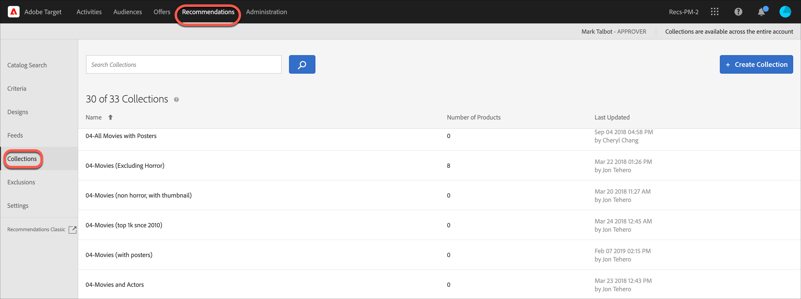

# Verzamelingen

Een verzameling is een reeks producten of items die in aanmerking komen voor een aanbeveling. Een verzameling wordt gedefinieerd door de voorwaarden op te geven waaraan items moeten voldoen om deel uit te maken van de verzameling.

Een verzameling is doorgaans een set van vergelijkbare of verwante items, zoals één productverzameling. U kunt echter de objecten groeperen in een categorie die voor uw bedrijf zinvol is, zoals producten in een bepaald prijsbereik of een bepaalde kleur, of objecten die in een bepaald geografisch gebied interessant kunnen zijn.

Gebruik verzamelingen om uw producten in logische emmers te ordenen. Als sommige items bijvoorbeeld beschikbaar zijn in een bepaalde regio, maar niet in een andere regio, kunt u een verzameling maken waarin items worden uitgesloten die niet beschikbaar zijn in de regio van de bezoeker. U kunt ook verzamelingen gebruiken om seizoensgebonden items te ordenen, of andere organisatorische parameters die van toepassing zijn op uw bedrijf.

De [&#x200B; reserveaanbevelingen &#x200B;](/help/main/c-recommendations/c-algorithms/backup-recs.md) die voor elke criteria binnen de aanbeveling worden geproduceerd gebruiken ook deze inzameling, zodat slechts de punten in de inzameling zijn inbegrepen in de reserveaanbeveling. Met inzamelingen, kunt u zeker zijn dat slechts de producten die steek houden om in een plaats te tonen worden getoond.

De inzamelingen worden herbouwd of bijgewerkt telkens als elke criteria loopt.

U kunt uw items groeperen in catalogi en vervolgens voor elke verzameling afzonderlijke aanbevelingen maken.

Met inclusiecriteria kunt u vergelijkbare dingen doen als een verzameling, maar deze moeten altijd worden ingesteld wanneer u een activiteit maakt. Met verzamelingen kunt u één keer een set items maken en deze gebruiken wanneer dat nodig is, zonder dat u de set opnieuw hoeft in te stellen.

Wanneer u een [!DNL Recommendations] -activiteit maakt of bewerkt, wordt de naam van de verzameling weergegeven naast het label [!UICONTROL Criteria] in het activiteitendiagram.

>[!NOTE]
>
>Verzamelingen worden niet toegepast wanneer u de [!UICONTROL Recently Viewed Items] aanbeveling-toets gebruikt.

## Een verzameling maken {#task_1256DFF6842141FCAADD9E1428EF7F08}

Maak een verzameling om de producten of inhoud te ordenen die u wilt weergeven in uw aanbevelingen.

1. Klik op **[!UICONTROL Recommendations]** > **[!UICONTROL Collections]** om de lijst met bestaande verzamelingen weer te geven.

   

   Op de pagina [!UICONTROL Collections] wordt een lijst met uw bestaande verzamelingen weergegeven. U maakt nieuwe verzamelingen door op de knop [!UICONTROL Create Collection] te klikken. U kunt ook bestaande verzamelingen bewerken, kopiëren en verwijderen door de muisaanwijzer boven de gewenste verzameling te plaatsen en op het gewenste pictogram te klikken.

   

   Het &quot;Aantal Punten&quot;voor elke inzameling op de [!UICONTROL Collections] lijstmening wordt gemeld is het aantal producten die de regels voor die inzameling aanpassen binnen de gevormde standaardgroep van Aanbevelingen [&#128279;](/help/main/administrating-target/hosts.md) (milieu). Zie [&#x200B; Montages &#x200B;](https://experienceleague.adobe.com/docs/target-dev/developer/recommendations.html?lang=nl-NL){target=_blank} om de standaardgastheergroep te veranderen.

1. Klik op **[!UICONTROL Create Collection]**.

1. (Voorwaardelijk) Kies een omgeving van het filter **[!UICONTROL Environment]** wanneer u een verzameling maakt (of bijwerkt) om een voorvertoning van de inhoud van de verzameling in die omgeving weer te geven. Standaard worden de resultaten van de standaardhostgroep weergegeven.

   

1. Typ een **[!UICONTROL Name]** voor de verzameling.

   U kunt ook een optionele **[!UICONTROL Description]** invoeren.

1. Plaats de regels die worden gebruikt om de inzameling te bouwen.

   Uw verzameling kan bijvoorbeeld rond een product-id of een categorie, marge of een andere parameter in de lijst worden gemaakt.

   U kunt regels toevoegen om meerdere parameters te gebruiken om een verzameling te definiëren. De veelvoudige regels worden aangesloten bij een exploitant AND. De verzameling kan alleen worden toegepast als alle opgegeven regels overeenkomen.

1. Klik op **[!UICONTROL Save]**.

## Een verzameling maken met Geavanceerd zoeken

U kunt inzamelingen tot stand brengen gebruikend Geavanceerd Onderzoek op de [&#x200B; pagina van het Onderzoek van de Catalogus &#x200B;](/help/main/c-recommendations/c-products/catalog-search.md#save-as) ([!UICONTROL Recommendations] > [!UICONTROL Catalog Search] > [!UICONTROL Advanced Search]).

Nadat u een zoekopdracht hebt gemaakt met &#39;id > contains&#39;, kunt u bijvoorbeeld op [!UICONTROL Save As] > [!UICONTROL Collection] klikken.

>[!IMPORTANT]
>
>De functie Geavanceerd zoeken is niet hoofdlettergevoelig. Producten die op het moment van levering worden geretourneerd, zijn echter gebaseerd op hoofdlettergevoelige zoekopdrachten. Deze wanverhouding kan tot verwarring leiden. Zorg ervoor dat u rekening houdt met hoofdlettergevoeligheid wanneer u verzamelingen maakt op basis van resultaten met de functie Geavanceerd zoeken. Als u bijvoorbeeld zoekt naar &#39;Vakantie&#39;, worden in de eerste zoekopdracht resultaten weergegeven die &#39;Vakantie&#39; en &#39;Vakantie&#39; bevatten. Als u vervolgens een catalogus maakt met de intentie om producten met &quot;vakantie&quot; te retourneren, worden alleen producten met &quot;vakantie&quot; geretourneerd. Producten met &quot;Vakantie&quot; worden niet geretourneerd.

## Een verzameling bewerken, kopiëren of verwijderen

Houd de muisaanwijzer boven de gewenste verzameling in de lijst en klik op het juiste pictogram: bewerken, kopiëren of verwijderen.

U kunt een bestaande verzameling kopiëren om een dubbele verzameling te maken die u vervolgens kunt wijzigen. Hierdoor kunt u een vergelijkbare uitsluiting maken met minder moeite.

Houd er rekening mee dat verzamelingen beschikbaar zijn voor de gehele account. Zorg ervoor dat u hiermee rekening houdt voordat u een verzameling verwijdert. Verwijderde verzamelingen kunnen niet worden hersteld.

## Een verzameling gebruiken in een activiteit met aanbevelingen

1. Maak een verzameling met een van de bovenstaande methoden.

1. Klik **[!UICONTROL Activities]** en [&#x200B; creeer een nieuwe activiteit van Aanbevelingen &#x200B;](/help/main/c-recommendations/t-create-recs-activity/create-recs-activity.md) of geef een bestaande activiteit uit.

1. Nadat u criteria en een ontwerp hebt geselecteerd, wordt de pagina [!UICONTROL Options] weergegeven op de locatie waar u de gewenste verzameling hebt geselecteerd.

   

1. (Voorwaardelijk) Als u een bestaande verzamelingsinstelling wilt wijzigen, klikt u op de pagina **[!UICONTROL Experiences]** (stap 2 van de geleide workflow met drie delen) op de locatie waar u de aanbevelingen hebt geplaatst, klikt u op **[!UICONTROL Change Collection]** en selecteert u vervolgens de gewenste verzameling.

   

## De video van de opleiding: Creeer inzamelingen en uitsluitingen in Aanbevelingen (7 :05) 

Deze video bevat de volgende informatie:

* Een verzameling maken
* Een uitsluiting maken

>[!VIDEO](https://video.tv.adobe.com/v/27689)
