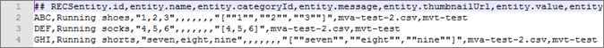

# Aangepaste entiteitskenmerken

Gebruik de kenmerken van een aangepaste entiteit met enkele en meerdere waarden in [!DNL Adobe Target Recommendations] om aanvullende informatie over items in uw catalogus te definiëren.

## Limieten {#limits}

U kunt maximaal 100 aangepaste entiteitskenmerken opnemen om aanvullende informatie over items in uw catalogus te definiëren. U kunt bijvoorbeeld een aangepast kenmerk met de naam `entity.genre` maken om een boek of film te definiëren. Of een verkoper van tickets kan kenmerken maken voor een plaats van de gebeurtenis, zodat een tweede uitvoerder, zoals een bezoekend team, kan deelnemen aan een sportevenement of een openingsactie bij een concert.

De maximale lengte van aangepaste kenmerken van entiteiten met een enkele waarde is 15.000 tekens (voor UTF-8-gecodeerde talen van één en twee bytes, zoals Engels en andere Latijnse alfabeten) of 10.000 tekens (voor UTF-8-gecodeerde talen van drie bytes, zoals Chinees, Japans en Koreaans).

Aangepaste kenmerken van entiteiten met meerdere waarden mogen niet meer dan 500 waarden bevatten. Elke individuele waarde is beperkt tot 100 tekens. Het totale aantal tekens voor alle waarden moet in overeenstemming zijn met de beperkingen voor de maximumlengte van aangepaste attributen voor entiteiten met één waarde (zie hierboven).

## Kenmerkwaarden van aangepaste entiteit {#section_313331A9F8194A89B5EDD89363018651}

Aangepaste entiteitskenmerken kunnen één waarde of meerdere waarden bevatten. Kenmerkwaarden voor entiteit worden weergegeven in de productweergave.


Een attribuut van de douaneentiteit met één enkele waarde wordt gevormd de zelfde manier zoals een enig-waarde vooraf bepaald entiteitsattribuut:

`entity.genre=genre1`

Een attribuut van een aangepaste entiteit met meerdere waarden moet worden verzonden als een geldige JSON-array:

`entity.genre=["genre1", "genre2"]`

Voorbeelden van geldige JSON-arrays die worden ondersteund door [!DNL Recommendations] :

* `["AB","BC"]` alle waarden zijn tekenreeksen
* `[1,2]` alle waarden zijn numeriek

>[!NOTE]
>
>[!DNL Recommendations] ondersteunt geen typen gemengde waarden in attributen van entiteiten met meerdere waarden. `["AB",1,true, [1,2,3]]` is bijvoorbeeld een geldige JSON-array, maar wordt niet ondersteund in [!DNL Recommendations] omdat deze typen gemengde waarden bevat (tekenreeks, numeriek, Boolean, object).

Nadat een aangepast kenmerk is verzonden als een geldige JSON-array, wordt het kenmerk behandeld als een kenmerk met meerdere waarden voor alle producten in de catalogus.

>[!NOTE]
>
>Als u een kenmerk wilt wijzigen van een meervoudige waarde in een enkele waarde, verwijdert u de catalogus en uploadt u de gecorrigeerde productgegevens. Als u uw catalogus verwijdert, worden de historische gegevens die aan uw product-id&#39;s zijn gekoppeld, niet verwijderd. Zie [&#x200B; het Schrappen van Alle Punten van het Systeem &#x200B;](/help/main/assets/adobe-recommendations-classic.pdf) in de *Klassieke* documentatie van Adobe Recommendations voor meer informatie.

**Beperkingen**:

* U kunt vooraf gedefinieerde namen van entiteitskenmerken niet gebruiken voor aangepaste entiteitskenmerken. (Zie [&#x200B; Attributen van de Entiteit &#x200B;](/help/main/c-recommendations/c-products/entity-attributes.md#reference_3BCC1383FB3F44F4A2120BB36270387F).)
* Het kenmerk `entity.environment` is gereserveerd door het systeem en kan niet worden gebruikt voor aangepaste entiteitskenmerken. Pogingen om `entity.environment` via `targetPageParams` , feeds of API&#39;s door te geven, worden genegeerd.
* Arrays moeten één waardetype bevatten. Arrays met gemengde waarden ( `["AB",1,true]` ) worden niet ondersteund.
* Een kenmerk met meerdere waarden dat een geneste JSON-array ( `[10,12,[1,2,3]]` ) bevat, wordt behandeld als een kenmerk met één waarde.

## Meerdere-waardekenmerken implementeren {#section_80FEFE49E8AF415D99B739AA3CBA2A14}

Aangepaste entiteitskenmerken met meerdere waarden worden ondersteund wanneer de feeds (CSV), `targetPageParams` en de Delivery-API worden gebruikt om producten te uploaden. Nieuwe waarden vervangen huidige waarden; ze worden niet toegevoegd. Lege arrays ( [] ) worden beschouwd als arrays zonder waarden.

Dubbele aanhalingstekens moeten worden vermeden. `"[""test"", ""value""]"` is bijvoorbeeld een geldige JSON-array die in CSV kan worden gebruikt.

U kunt maximaal 500 waarden opnemen in een kenmerk met meerdere waarden.

### targetPageParams gebruiken

In het volgende voorbeeld wordt getoond hoe u `targetPageParams` kunt gebruiken

```javascript
function targetPageParams() { 
  return { 
    'entity.id':                   '123', 
    'entity.categoryId':            '["A", "A:B", "A:B:C", "A:B:C:D"]',        
    'entity.MultiValueAttribute':   '["X", "Y", "Z"]', 
    'entity.event.detailsOnly':     'true', 
    'excludedIds":                  '[123, 3232, 2323, 4344]', 
    'orderId":                      '123456', 
    'orderTotal":                   '195.32', 
    'productPurchaseId":            '[001,002,003]' 
  }; 
}
```

### CSV gebruiken

U kunt uw CSV-bestanden in onbewerkte vorm beheren met een teksteditor of u kunt spreadsheetsoftware gebruiken.

De onbewerkte CSV ziet er als volgt uit:



Dezelfde catalogus ziet er zo uit in een spreadsheet:


Bij de conversie naar de CSV-indeling worden dubbele aanhalingstekens toegevoegd rondom de celinhoud om te voorkomen dat komma&#39;s binnen de cel fungeren als kolomscheidingstekens. Er worden ook dubbele aanhalingstekens toegevoegd rondom JSON-tekenreekswaarden die u opneemt in aangepaste multiwaardekenmerken. Hierdoor kan het werken met het Raw-bestand lastig zijn. Bijvoorbeeld:

* Werkblad: `["1","2","3"]`
* Onbewerkt: `"[""1"",""2"",""3""]"`

Wees voorzichtig wanneer u een CSV-bestand met een Raw-catalogus rechtstreeks bewerkt.

### API&#39;s gebruiken

U kunt kenmerken met meerdere waarden doorgeven met de API voor aflevering in een mabox-parameter als een tekenreekswaarde die een JSON-array met escape-teken bevat.

```javascript
"execute": {
    "mboxes": [
      {
        "index": 0,
        "name": "first-mbox",
        "parameters": {
          "entity.id": "32323",
          "entity.categoryId": "My Category",
          "entity.MultiValueAttribute": "[\"X\", \"Y\", \"Z\"]"
        }
      }
    ]
  }
```

Zie [&#x200B; Adobe Recommendations API documentatie &#x200B;](https://experienceleague.adobe.com/docs/target-dev/developer/recommendations.html?lang=nl-NL){target=_blank} voor informatie over het gebruiken van de Levering en sparen entiteiten APIs.

## Operatoren met kenmerken van meerdere waarden gebruiken {#section_83C2288A805242D9A02EBC4F07DEE945}

Wanneer u exploitanten op multi-getaxeerde douaneattributen in de regels van de algoritmerichting, catalogusregels, en uitsluitingsregels toepast, zal het resultaat *waar* zijn als minstens één waarde in de lijst de verrichting (boolean *of*) overgaat.

In het volgende voorbeeld is de regel `message contains abc` .

* Hoofdlettergebruik 1: `entity.genre = ["ab", "bc", "de"]`. Het resultaat is false omdat geen waarde `abc` bevat.
* Hoofdlettergebruik 2: `entity.genre = ["abcde","de","ef"]`. Het resultaat is waar omdat één waarde `abc` bevat.

Voor negatieve exploitanten, moeten alle attributenwaarden overgaan (boolean *en*). Bijvoorbeeld, als de exploitant `notEquals` is, zal het resultaat *vals* zijn als om het even welke waarde aanpast.

Raadpleeg de volgende secties voor het gedrag van de operator in regels voor het opnemen van algoritmen, catalogusregels en uitsluitingsregels.

### Gelijk

Als een kenmerkwaarde gelijk is aan de invoerwaarde, resulteert dit in true.

Voorbeeld: `genre equals abc`

* Hoofdlettergebruik 1: `entity.genre = ["ab", "bc", "de"]`. Het resultaat is false omdat geen waarde gelijk is aan `abc` .
* Hoofdlettergebruik 2: `entity.genre = ["abc", "de", "ef"]`. Het resultaat is waar omdat één waarde gelijk is aan `abc` .
* Zaak 3: `entity.genre = ["abcde", "de", "ef"]` . Het resultaat is onwaar omdat `abc` niet gelijk is aan een element in de lijst.

### Is niet gelijk aan

Als geen kenmerkwaarde gelijk is aan de invoerwaarde, resulteert dit in true.

Voorbeeld: `genre not equals abc`

* Hoofdlettergebruik 1: `entity.genre = ["ab", "bc", "de"]`. Het resultaat is waar omdat geen waarde gelijk is aan `abc` .
* Hoofdlettergebruik 2: `entity.genre = ["abc", "de", "ef"]`. Het resultaat is false omdat één waarde gelijk is aan `abc` .
* Zaak 3: `entity.genre = ["abcde", "de", "ef"]` . Het resultaat is waar omdat `abc` niet gelijk aan om het even welk element in de lijst is.

### Bevat

Als een waarde van een kenmerk de invoerwaarde bevat, resulteert dit in true.

Voorbeeld: `genre contains abc`

* Hoofdlettergebruik 1: `entity.genre = ["ab", "bc", "de"]`. Het resultaat is false omdat geen waarde `abc` bevat.
* Hoofdlettergebruik 2: `entity.genre = ["abcde", "de", "ef"]`. Het resultaat is waar omdat één waarde `abc` bevat.

### Bevat niet

Als geen waarde van kenmerk de invoerwaarde bevat, resulteert dit in true.

Voorbeeld: `genre does not contain abc`

* Hoofdlettergebruik 1: `entity.genre = ["ab", "bc", "de"]`. Het resultaat is waar omdat geen waarde `abc` bevat.
* Hoofdlettergebruik 2: `entity.genre = ["abcde", "de", "ef"]`. De regel zal in vals resulteren aangezien één waarde `abc` bevat.

### Begint met

Als een waarde van een kenmerk begint met de invoerwaarde, resulteert dit in true.

Voorbeeld: `genre starts with abc`

* Hoofdlettergebruik 1: `entity.genre = ["ab", "bc", "de"]`. Het resultaat is false omdat geen waarde begint met `abc` .
* Hoofdlettergebruik 2: `entity.genre = ["abcde", "de", "ef"]`. Het resultaat is waar omdat één waarde begint met `abc` .
* Zaak 3: `entity.genre = ["ab", "de", "abc"]` . Het resultaat is waar omdat één waarde begint met `abc` (niet noodzakelijkerwijs het eerste element in de lijst).

### Eindigt met

Als een waarde van een kenmerk eindigt met de invoerwaarde, resulteert dit in true.

Voorbeeld: `genre ends with abc`

* Hoofdlettergebruik 1: `entity.genre = ["ab", "bc", "de"]`. Het resultaat is false omdat geen waarde eindigt met `abc`.
* Hoofdlettergebruik 2: `entity.genre = ["deabc", "de", "ef"]`. Het resultaat is waar omdat één waarde eindigt met `abc` .

### Groter dan of gelijk aan (alleen numerieke waarden)

Kenmerkwaarde wordt omgezet in dubbel. Kenmerken die niet kunnen worden omgezet, worden overgeslagen tijdens het uitvoeren van de regel.

Na verwerking resulteert een kenmerkwaarde die groter is dan of gelijk is aan de invoerwaarde in true.

Voorbeeld: `price greater than or equal to 100`

* Hoofdlettergebruik 1: `entity.price = ["10", "20", "45"]`. Het resultaat is false omdat geen waarde groter dan of gelijk is aan 100. De waarde `de` wordt overgeslagen omdat deze niet kan worden omgezet in dubbel.
* Hoofdlettergebruik 2: `entity.price = ["100", "101", "90", "80"]`. Het resultaat is waar omdat twee waarden groter of gelijk zijn aan 100.

### Kleiner dan of gelijk aan (alleen numerieke waarden)

Kenmerkwaarde wordt omgezet in dubbel. Kenmerken die niet kunnen worden omgezet, worden overgeslagen tijdens het uitvoeren van de regel.

Na verwerking resulteert een kenmerkwaarde die kleiner is dan of gelijk is aan de invoerwaarde in true.

Voorbeeld: `price less than or equal to 100`

* Hoofdlettergebruik 1: `entity.price = ["101", "200", "141"]`. Het resultaat is false omdat geen waarde kleiner dan of gelijk is aan 100. De waarde `de` wordt overgeslagen omdat deze niet kan worden omgezet in dubbel.
* Hoofdlettergebruik 2: `entity.price = ["100", "101", "90", "80"]`. Het resultaat is waar omdat twee waarden kleiner dan of gelijk aan 100 zijn.

### Dynamisch overeenkomt (alleen beschikbaar in op items gebaseerde algoritmen)

Als een kenmerkwaarde overeenkomt met de invoerwaarde, resulteert dit in true.

Voorbeeld: `genre matches abc`

* Hoofdlettergebruik 1: `entity.genre = ["ab", "bc", "de"]`. Het resultaat is false omdat geen waarde overeenkomt met `abc` .
* Hoofdlettergebruik 2: `entity.genre = ["abc", "de", "ef"]`. Het resultaat is waar omdat één waarde overeenkomt met `abc` .

### Komt dynamisch niet overeen (alleen beschikbaar in op items gebaseerde algoritmen)

Als een kenmerkwaarde overeenkomt met de invoerwaarde, resulteert dit in false.

Voorbeeld: `genre does not match abc`

* Hoofdlettergebruik 1: `entity.genre = ["ab", "bc", "de"]`. Het resultaat is waar omdat geen waarde overeenkomt met `abc` .
* Hoofdlettergebruik 2: `entity.genre = ["abc", "de", "ef"]`. De regel resulteert in false aangezien één waarde overeenkomt met `abc` .

### Dynamisch bereik (alleen beschikbaar in op items gebaseerde algoritmen, alleen numerieke waarden)

Als een numerieke kenmerkwaarde binnen het opgegeven bereik ligt, resulteert dit in true.

Voorbeeld: `price dynamically ranges in 80% to 120% of 100`

* Hoofdlettergebruik 1: `entity.price = ["101", "200", "125"]`. Het resultaat is waar omdat `101` zich in het bereik van 80% tot 120% van 100 bevindt. De waarde `de` wordt overgeslagen omdat deze niet kan worden omgezet in dubbel.
* Hoofdlettergebruik 2: `entity.price = ["130", "191", "60", "75"]`. Het resultaat is onwaar omdat geen waarde tussen 80% en 120% van 100 ligt.

>[!NOTE]
>
>*dubbel* is een gegevenstype van Java. Voor operatoren die numerieke waarden nodig hebben, worden bij het omzetten in dubbele waarden geen niet-numerieke waarden in aanmerking genomen in de resultaten.

## Kenmerken met meerdere waarden in ontwerpen {#section_F672E4F6E1D44B3196B7ADE89334ED4A}

Kenmerken met meerdere waarden worden weergegeven als een lijst met door komma&#39;s gescheiden waarden wanneer hiernaar wordt verwezen in een ontwerp.

Voorbeeld:

Wanneer in een ontwerp naar `entity.genre=["genre1","genre2"]` wordt verwezen als `$entity<N>.genre` , is het resultaat `genre1, genre2` .

## Verwante onderwerpen:

* [Entiteitskenmerken](/help/main/c-recommendations/c-products/entity-attributes.md#reference_3BCC1383FB3F44F4A2120BB36270387F)
